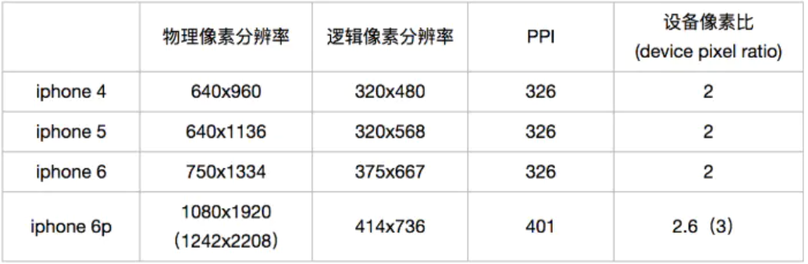
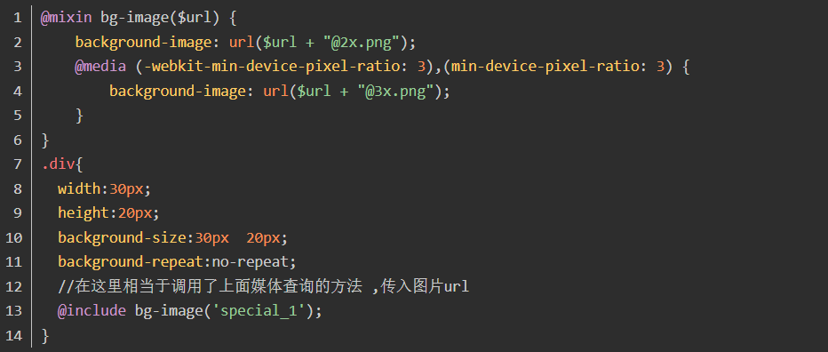
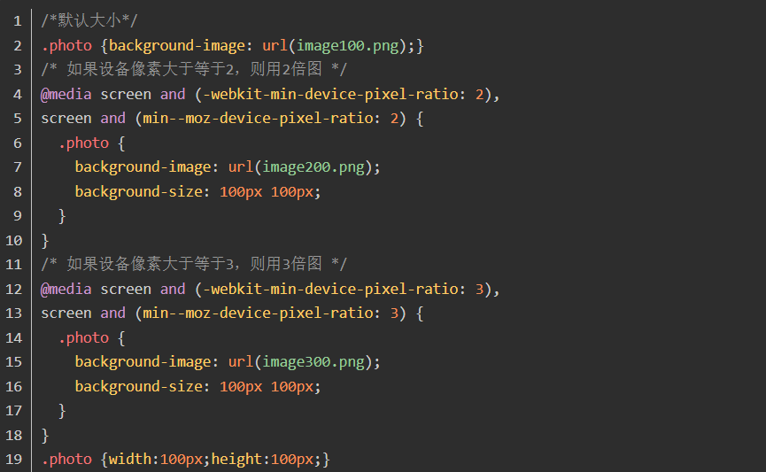

# Html&CSS

## 1、 rem em vw vw 百分比区别

- 相同点：

  - rem，em，vw，vh，vw属于前端开发除了px单位之外的另外几种单位取值；但是具体含义存在区别

- 不同点：

  - px：是像素单位，属于绝对单位，是一个具体的大小

  - rem：相对于根元素进行设置

  - em：如果自身有字体大小的设置，那么就相对于自身字体大小设置，如果自身没有字体大小设置，那么就相当于父元素进行设置。

  - vw：1vw相当于浏览器窗口宽度的百分之一

  - vh：1vh相当于浏览器窗口高度的百分之一

  - 百分比：相对于父元素宽度或者高度的百分之几

  - 注意：vw和vh是视口可以观看的区域的大小；如果没有滚动条的话，则宽度设置成100vw和100%的时候实现的效果一直；如果有滚动的话，则100vw中不是包括滚动条的，100%是包括滚动条的距离的

  - ```html
    <!--注意里面的代码解释说明--> 
    <style>
         *{margin:0;padding:0}
         html,body{
             height: 100%;
         }
         .box1{
             width: 100%;
             height:500px;
             background-color: red;
         }
         .box2{
             width: 100vw;
             height:500px;
             background-color: green;
         }
    </style>
    <div class="box1"></div>
    <div class="box2"></div>750的设计图，20px为多少rem
    ```

## 2、750的设计图，20px为多少rem

```
首先设计图是UI设计提供给前端开发工程师的设计稿，750的设计图出自于手机屏幕为375px*667px的iphone678手机屏幕的设计稿，这里也可以称之为2倍图。20px的字体大小涉及到了单位的转换，页面中默认的字体大小为16px，那么此时的1rem = 16px; 
那么20px通过计算得出公式 1rem = 16px; ?rem = 20px; 得出结果为:1.25rem
```

```
扩展1：
因为他的设备像素比（dpr=物理像素/CSS像素）是2；dpr是一个固定的比值；不同的手机型号比值不应：
物理像素：可以理解成你ps里面测量的距离的大小
CSS像素：你编写开发代码的时候CSS里面给定的像素值；
dpr固定值如下如：
```



## 3、app怎么做适配的

- 基于手机系统开发的app(原生Android/IOS)

- 另外一种是webapp

  - 设置以下标签：
    <meta content="width=device-width, initial-scale=1.0, maximum-scale=1.0, user-scalable=0;" name="viewport" />
    具体的含义为：app完成的页面的宽度等于设备的宽度，页面的缩放比例为1.0，不允许最大缩放；

- 使用媒体查询和响应式做适配
  - 使用媒体查询检测设备屏幕的大小改变布局样式，但是成本耗费比较大，不易操作
- 使用单位自己单位中经常使用的封装好的flexble.js文件做适配
  - 封装好的flexble.js文件文件可以做到适配，并且原理是已经封装好的视口和设备像素比基于webapp开发

## 4、bfc是什么，清楚浮动的原理

- BFC含义：
  - 块格式化上下文（Block Formatting Context，BFC） 是Web页面的可视CSS渲染的一部分，是块盒子的布局过程发生的区域，也是浮动元素与其他元素交互的区域
- BFC触发条件：
  - 根元素
  - float属性不为none（脱离文档流）
  - position为absolute或fixed
  - display为inline-block,table-cell,table-caption,flex,inine-flex
  - overflow不为visible
- BFC布局规则：
  - 内部的Box会在垂直方向，一个接一个地放置。
  - Box垂直方向的距离由margin决定。属于同一个BFC的两个相邻Box的margin会发生重叠（按照最大margin值设置）
  - 每个元素的margin box的左边， 与包含块border box的左边相接触
  - BFC的区域不会与float box重叠。
  - BFC就是页面上的一个隔离的独立容器，容器里面的子元素不会影响到外面的元素。
  - 计算BFC的高度时，浮动元素也参与计算

## 5、简单的一个盒子移动到另一个盒子，你用什么方式实现动画效果

- 方法一：使用HTML+CSS里面的transition过渡动画结合2d的位移translate设置

  ```html
  <div class="box1"></div>
  <div class="box2"></div>
  <style>
      *{margin:0;padding:0}
      div{
          float: left;
      }
      .box1{
          width: 200px;
          height:200px;
          background-color: red;
      }
      .box2{
          width: 100px;
          height:100px;
          background-color: green;
          transition: all linear 1s;
      }
      .box1:hover+.box2{
          transform: translateX(-100px);
      }
  </style>
  ```

- 方法二：使用HTML5+CSS3中的animation动画属性结合2d里面的位移translate进行实现

  ```HTML
  <div class="box1"></div>
  <div class="box2"></div>
  <style>
       *{margin:0;padding:0}
       div{
           float: left;
       }
       .box1{
           width: 200px;
           height:200px;
           background-color: red;
       }
       .box2{
           width: 100px;
           height:100px;
           background-color: green;
           animation: mover linear 1s;
       }
       @keyframes mover{
           0%{
               transform: translateX(0px);
           }
           100%{
               transform: translateX(-100px);
           }
       }
  </style>
  ```

- 方法三：复杂方法，可以使用js封装一个动画函数，直接使用鼠标移动移入事件或者点击事件触发移动

  ```html
  <script>
   //获取元素
      //设置x和y的值
      //绑定鼠标移入事件==缓慢移动  x的位置进行移动  自减
      //绑定鼠标移出事件==缓慢移动  x的位置进行移动  自增
  </script>
  <style>
      *{margin:0;padding:0}
      div{float:left}
      .box1{width:300px;height:300px;background-color:red}
      .box2{width:100px;height:100px;background-color:green}
  </style>
  <div class="box1"></div>
  <div class="box2"></div>
  ```

## 6、boder实现0.5像素

实现方法：CSS3有缩放的属性，我们可以利用这个属性，缩小50%的1px的边框，来实现这个功能代码如下：

```html
<div class="border3">
    <div class="content">伪类设置的边框</div>
</div>  
<style>
*{
     margin:0;padding:0
}
.border3{
     position: relative;         
}
.border3:before{
    content: '';
    position: absolute;
    width: 200%;
    height: 200%;
    border: 1px solid red;
    transform-origin: 0 0;
    transform: scale(0.5, 0.5);
    box-sizing: border-box;
 }
</style>
```

## 7、场景题（两个盒子，左边固定宽，右边自适应，你能想到几种方法）

- 公共HTML代码部分

```html
<div class="content">
 <div class="left"></div>
 <div class="right"></div>
</div>
```

- 方法一：float来和BFC实现

```html
<style>
.content {
    border: 1px solid #000;
    height: 800px;
    padding: 20px;
}
.left {
    width: 200px;
    height: 100%;
    background: red;
    float: left;
}
.right {
    height: 100%;
    background: pink;
    overflow: hidden;
}
</style>
```

- 方法二：absolute定位和margin值实现

```html
<style>
 .content {
     border: 1px solid #000;
     height: 800px;
     padding: 20px;
    }
    .left {
        width: 200px;
        height: 100%;
        background: red;
        position: absolute;
    }
    .right {
        height: 100%;
        background: pink;
        margin-left: 200px;
    }
</style>
```

- 方法三：calc(100% - 固定内容的宽度) 用calc函数动态计算数值

```html
<style>
 .content {
     border: 1px solid #000;
     height: 800px;
     padding: 20px;
    }
    .left {
        width: 200px;
        height: 100%;
        background: red;
        float: left;
    }
    .right {
        height: 100%;
        background: pink;
        float: left;
        width: calc(100% - 200px);
    }
</style>
```

- 方法四：flex布局轻松搞定

```html
<style>
    .content {
        border: 1px solid #000;
        height: 800px;
        padding: 20px;
        display: flex;
    }
    .left {
        width: 200px;
        height: 100%;
        background: red;
    }
    .right {
        height: 100%;
        background: pink;
        flex: 1;
    }
</style>
```

- 方法五：使用table和table-cell实现

```html
 <style>
     .content {
         border: 1px solid #000;
         width: 100%;
         height: 800px;
         display: table;
     }
     .left {
         width: 200px;
         height: 100%;
         background: red;
         display: table-cell;
     }
     .right {
         height: 100%;
         background: pink;
         display: table-cell;
     }
</style>
```

- 方法六：使用inline-block携手calc函数设置宽度

```html
<style>
    .content {
        border: 1px solid #000;
        width: 100%;
        height: 800px;
        font-size: 0;
    }
    .left {
        width: 200px;
        height: 100%;
        background: red;
        display: inline-block;
        vertical-align: top;
    }
    .right {
        height: 100%;
        background: pink;
        display: inline-block;
        vertical-align: top;
        width: calc(100% - 200px);
        font-size: 16px;
    }
</style>
```

## 8、css 选择器有哪些，权重是什么样的

```
选择器含义：选择器是查找页面元素的一种方式方法，选择器的种类有很多种。
常用的选择器有以下内容：
1、ID　　#id
2、class　　.class
3、标签　　p
4、通用　　*
5、属性　　type="text"
6、伪类　　:link  :visited  :hover  :active
7、伪元素　　::first-line  :first-letter
8、子选择器  div>p
9、后代选择器  div p
10、相邻兄弟  div+p
11、通用兄弟  div~p
12、结构伪类  :nth-child  :first-child  :last-child

权重计算规则：
1、第一等：代表内联样式，如: style=””，权值为1000。
2、第二等：代表ID选择器，如：#content，权值为0100。
3、第三等：代表类，伪类和属性选择器，如.content，权值为0010。
4、第四等：代表类型选择器和伪元素选择器，如div p，权值为0001。
5、通配符、*权值为0000。
6、继承的样式没有权重值。

important > 内联 > ID > 类| 伪类 | 属性选择|伪对象 > 标签  >  继承 > 通配符 
```

## 9、css布局，左侧宽度最小150px，最大25 %，右侧自适应。怎么实现

- 方法一：1.float+BFC【BFC区域不会和设置浮动的区域重合】

```html
<!--左侧设置最小宽度150px，最大宽度25%，并设置浮动；右侧不设置宽度，加overdlow：hidden触发BFC-->
<style>
    .left{
        min-width: 150px;
        max-width: 25%;
        height: 300px;
        background-color: red;
        float: left;
    }
    .right{
        height: 300px;
        background-color: yellow;
        overflow: hidden;
    }    
</style>
<body>
    <div class="left">
        内容
    </div>
    <div class="right"></div>
</body>
```

- 方法二：弹性盒子

```html
<!--给父元素设置弹性盒子，然后给左侧设置最小宽度150px，最大宽度25%;右侧不设置宽度，加属性flex:1,让右侧自适应剩下的宽度-->
<style>
    *{
        padding: 0;
        margin: 0;
    }
    body{
        display: flex;
    }
    .left{
        min-width: 150px;
        max-width: 25%;
        height: 300px;
        background: green;
    }
    .right{
        flex: 1;
        height: 300px;
        background: red;
    }
</style>
<body>
    <div class="left"></div>
    <div class="right"></div>
</body>
```

## 10、CSS的基本语句构成是？

- CSS被称之为：层叠样式表（Cascading Style Sheets）是对页面结构的一种修饰；
- CSS的基本语法是：选择器{属性:属性值;属性:属性值;属性:属性值}
- CSS基本语法构成两个部分组成：选择器和{}样式规则（样式声明）组成；样式规则（样式声明）由两个部分组成的分别是属性和属性值；
- 使用CSS语法注意事项是
  - 属性和属性值使用（：）链接
  - 属性和属性值结束之后需要使用（；）结束
  - 如果属性和属性值是最后一组的话可以不用分号结束；但是建议添加上为了防止后面继续添加属性

## 11、css复用

- CSS复用代表的是CSS的重复使用，主要是为了做到网站开发的优化，可以简化多重CSS
- CSS复习：目的是为了创建一套可以不依赖内容的可重复使用的类名及公共的样式, 沿着复用这条思路走下去,久而久之基本可以构建一套全新的 UI 组件库而无需编写过多新的 CSS。
- 例如：我们在单位中实际开发的时候经常使用的公共样式表，重置样式表是一样的道理

## 12、CSS选择符有哪些？哪些属性可以继承？优先级算法如何计算？

- CSS选择符（就是选择器）

  - 基础选择器

  ```
  通配符选择器     *{}
  标签选择器标签名  p{}
  class类选择器    .class属性值{}
  多类名选择器      .类名n{}  标签中class属性为  class="类名1 类名2 ... 类名n"
  id选择器         #id属性值{}
  群组选择器        选择器1,选择器2,...{}
  ```

  - 结构选择器

  ```
  子元素选择器E>F{}  F必须是E的子元素
  后代选择器E F{}   F必须是E的后代
  相邻兄弟选择器E+F{}  F是紧挨这E后面的兄弟元素
  通用选择器E~F{}  F是E后面所有的兄弟元素
  ```

  - 属性选择器

  ```
  [Eattr]     元素E中存在attr属性
  [Eattr="value"]  元素E中存在attr属性,并且attr的属性值为value
  [Eattr~="value"] 元素E中存在attr属性,并且attr的属性值为value或者"value value1 ..."的形式
  [Eattr^="value"] 元素E中存在attr属性,并且attr的属性值以value开始
  [Eattr$="value"] 元素E中存在attr属性,并且attr的属性值以value结尾
  [Eattr*="value"] 元素E中存在attr属性,并且attr的属性值存在value
  [Eattr|="value"] 元素E中存在attr属性,并且attr的属性值为value或者value-的形式
  ```

  - 结构伪类选择器

  ```
  X:first-child 匹配子集的第一个元素
  X:last-child匹配父元素中最后一个X元素
  X:nth-child(n)用于匹配索引值为n的子元素。索引值从1开始
  X:only-child这个伪类一般用的比较少，比如上述代码匹配的是div下的有且仅有一个的p，也就是说，如果div内有多个p，将不匹配。
  X:root匹配文档的根元素。在HTML（标准通用标记语言下的一个应用）中，根元素永远是HTML
  X:empty匹配没有任何子元素（包括包含文本）的元素
  ```

  - 目标伪类

  ```
  E:target 选择匹配E的所有元素，且匹配元素被相关URL指向
  ```

  - UI状态伪类

  ```
  E:enabled 匹配所有用户界面（form表单）中处于可用状态的E元素
  E:disabled 匹配所有用户界面（form表单）中处于不可用状态的E元素
  E:checked 匹配所有用户界面（form表单）中处于选中状态的元素E
  E:selection 匹配E元素中被用户选中或处于高亮状态的部分
  ```

  - 否定伪类

  ```
   E:not(s) （IE6-8浏览器不支持:not()选择器。）匹配所有不匹配简单选择符s的元素E
  ```

  - 动态伪类

  ```
   E:link     链接伪类选择器 选择匹配的E元素，而且匹配元素被定义了超链接并未被访问过。常用于链接描点上
   E:visited  链接伪类选择器 选择匹配的E元素，而且匹配元素被定义了超链接并已被访问过。常用于链接描点上
   E:active   用户行为选择器 选择匹配的E元素，且匹配元素被激活。常用于链接描点和按钮上
   E:hover    用户行为选择器  选择匹配的E元素，且用户鼠标停留在元素E上。IE6及以下浏览器仅支持a:hover
   E:focus    用户行为选择器  选择匹配的E元素，而且匹配元素获取焦点
  ```

- 属性继承

  - 继承：html元素可以从父元素那里继承一部分css属性，即使当前元素没有定义该属性。

  ```
   1.字体系列属性 font，font-family，font-weight，font-size，font-style
   2.文本系列属性 text-indent，text-align，line-height，word-spacing，letter-spacing，text-transform，color
   3.元素可见性 visibility
   4.表格布局属性 caption-side，border-collapse，border-spacing，empty-cells，table-layout
   5.列表布局属性 list-style-type，list-style-image，list-style-position，list-style
  ```

- 选择器优先级的算法

  - 优先级就近原则，同权重情况下样式定义最近者为准;
  - 载入样式以最后载入的定位为准;
  - 优先级为：同权重: 内联样式表（标签内部）> 嵌入样式表（当前文件中）> 外部样式表（外部文件中）。
  - !important >  id > class > tag             important 比 内联优先级高

## 13、css引入的方式有哪些，link和@import的区别是什么

- 区别1：link属于XHTML标签，而@import完全是CSS提供的一种方式。
- 区别2：当一个页面被加载的时候（就是被浏览者浏览的时候），link引用的CSS会同时被加载，而@import引用的CSS会等到页面全部被下载完再被加载。所以有时候浏览@import加载CSS的页面时开始会没有样式（就是闪烁），网速慢的时候还挺明显。
- 区别3：@import是CSS2.1提出的，所以老的浏览器不支持，@import只有在IE5以上的才能识别，而link标签无此问题。
- 区别4：使用dom(document object model文档对象模型 )控制样式时的差别：当使用javascript控制dom去改变样式的时候，只能使用link标签，因为@import不是dom可以控制的.

## 14、css：一个容器（页面），里面有两个div左右摆放并且高度和容器高度一致，左div不会随着页面左右伸缩而变化，右div随页面左右伸缩宽度自适应（手写）

```html
<div class="container">
    <div class="left"></div>
    <div class="right">北京千锋互联科技有限公司（下面简称“千锋教育”），成立于2011年1月，立足于职业教育培训领域，公司现有教育培训、高校服务、企业服务三大业务板块。教育培训业务分为大学生技能培训和职后技能培训；高校服务业务主要提供校企合作全解决方案与定制服务；企...</div>
</div>
<style>
    *{
        margin: 0;
        padding: 0;
    }
    .container{
        max-width: 1000px;
        height: 500px;
        background-color: yellow;
        margin: 20px auto;
        display: flex;
    }
    .container .left{
        width: 300px;
        background-color: orange;
    }
    .container .right{
        flex: 1;
        background-color: red;
    }
</style>
```

## 15、CSS3动画知道吗，怎么实现的

- 知道的，CSS3动画主要是通过animation这个属性来进行实现，使用动画的时候需要先进行声明动画然后再去调用，哪里需要产生动画效果哪里就使用animation进行调用

- 基本语法

  ```HTML
  <style>
      *{margin:0;padding:0}
      div{
          width:200px;
          height:200px;
          background-color:red;
          /*调用动画*/
          animation:movers 20s linear infinite alternate
      }
      
      /*声明动画*/
      @keyframes movers{
          form{
              width:200px;
              height:200px;
              background-color:red;
          }
          to{
              width:400px;
              height:400px;
              background-color:green;
              border-radius:50%;
          }
   }
  </style>
  <div></div>
  ```

- 语法注意事项

  ```
  animation:复合属性
  animation-name 规定需要绑定到选择器的 keyframe 名称。。
  animation-duration 规定完成动画所花费的时间，以秒或毫秒计。
  animation-timing-function 规定动画的速度曲线。
  animation-delay 规定在动画开始之前的延迟。
  animation-iteration-count 规定动画应该播放的次数。
  animation-direction 规定是否应该轮流反向播放动画。
  
  form  初始状态
  to   结束装填
  可以替换成
  0%    初始状态
  100%  结束状态
  后面的百分比可以称之为关键帧动画
  ```

## 16、CSS3新增了哪些东西

- CSS3里面的新增主要有：CSS选择器，盒子中的修饰，背景，文本效果，字体，2D/3D，过渡动画，多列布局等等

- CSS选择器

  ```
  1、p:first-of-type   选择属于其父元素的首个 <p> 元素的每个 <p> 元素。
  2、p:last-of-type   选择属于其父元素的最后 <p> 元素的每个 <p> 元素。
  3、p:only-of-type   选择属于其父元素唯一的 <p> 元素的每个 <p> 元素。
  4、p:only-child   选择属于其父元素的唯一子元素的每个 <p> 元素。
  5、p:nth-child(2)   选择属于其父元素的第二个子元素的每个 <p> 元素。
  ```

- 盒子修饰

  ```
  新增了边框属性：
  1、border-radius
   支持浏览器：IE9+、Firefox、Chrome、Safari 、Opera
  2、box-shadow  向方框添加一个或多个阴影
   支持浏览器：IE9+、Firefox、Chrome、Safari 、Opera
  3、border-image
   支持浏览器：Firefox（旧版本需要前缀-moz-）、Chrome（旧版本需要前缀-webkit-）、Safari（Safari 5 以及更老的版本需要前缀 -webkit-） 、Opera（ 需要前缀 -o-）
  ```

- CSS新增背景模块

  ```
  1、background-size   规定背景图片的尺寸
   支持浏览器：IE9+、Firefox（旧版本需要前缀-moz-）、Chrome、Safari、Opera
  2、background-origin    规定背景图片的定位区域，背景图片可以放置于 content-box、padding-box 或 border-box 区域。
   支持浏览器：IE9+、Firefox、Chrome、Safari、Opera
  3、background-clip   规定背景的绘制区域
   支持浏览器：IE9+、Firefox、Chrome、Safari、Opera
  ```

- CSS文本效果模块

  ```
  1、text-shadow   可向文本应用阴影
   支持浏览器：IE10、Firefox、Chrome、Safari、Opera
  2、word-wrap   允许文本强制文本进行换行 - 即使这意味着会对单词进行拆分
   支持浏览器：所有主流浏览器
  ```

- CSS引入字体模块

  ```
  @font-face
  ```

- 2D/3D

  ```
  1、transform    向元素应用 2D 或 3D 转换
   支持浏览器：
       IE10：2D、3D都支持（2D IE9 需要前缀 -ms-）；
    Firefox：2D、3D都支持；
    Chrome：2D、3D都支持（2D、3D需要前缀 -webkit-）；
    Safari：2D、3D都支持（2D、3D需要前缀 -webkit-）；
    Opera：只支持2D
  ```

- 过渡动画

  ```
  1、transition  过渡属性 
   支持浏览器：IE 10、Firefox、Chrome（Chrome 25 以及更早的版本，需要前缀 -webkit-）、Opera、Safari（ 需要前缀 -webkit-）
  2、@keyframes   用于创建动画。
   在 @keyframes 中规定某项 CSS 样式，就能创建由当前样式逐渐改为新样式的动画效果。
   支持浏览器：IE 10、Firefox、Chrome（Chrome 25 以及更早的版本，需要前缀 -webkit-）、Opera、Safari（ 需要前缀 -webkit-）
  3、animation  动画调用属性
   支持浏览器：IE 10、Firefox、Chrome（Chrome 25 以及更早的版本，需要前缀 -webkit-）、Opera、Safari（ 需要前缀 -webkit-）
  ```

- 多列布局

  ```
  1、column-count=======划分列数
  2、column-gap=========属性规定列之间的间隔大小
  3、column-rule========设置或检索对象的列与列之间的边框
  4、column-fill========设置或检索对象所有列的高度是否统一
  5、column-span========设置或检索对象元素是否横跨所有列。
  6、column-width=======设置或检索对象每列的宽度
  ```

## 17、当margin-top、padding-top 的值是百分比时,分别是如何计算的?

- 可以对元素的margin设置百分数，百分数是相对于父元素的width计算，不管是margin-top/margin-bottom还是margin-left/margin-right。（padding同理）

- 如果没有为元素声明width，在这种情况下，元素框的总宽度包括外边距取决于父元素的width，这样可能得到“流式”页面，即元素的外边距会扩大或缩小以适应父元素的实际大小。如果对这个文档设置样式，使其元素使用百分数外边距，当用户修改浏览窗口的宽度时，外边距会随之扩大或缩小。

- 为什么margin-top/margin-bottom的百分数也是相对于width而不是height呢？

- 我们认为，正常流中的大多数元素都会足够高于包含其后代元素（包括外边距），如果一个元素的上下外边距是父元素的height的百分数，就可能导致一个无限循环，父元素的height会增加，以适应后代元素上下外边距的增加，而相应的，上下外边距因为父元素height的增加也会增加，如此循环。

  ```html
  <style>
      .fu {
          width: 400px;
          height: 300px;
          background: blue;
          overflow: hidden;
      }
      .zi {
          width: 20px;
          height: 20px;
          background: red;
          margin-top: 50%;
      }
  </style>
  <div class="fu">
      <div class="zi"></div>
  </div>
  ```

## 18、定位知道吗，说下，几种不同的定位分别有什么特点，详细说明

- 定位的含义是将元素放在指定的位置上，在css中特指position属性，他一共有5种属性值。
- 分别是
  - static静态定位，是元素自带的默认的定位方式。
  - relative是相对定位，他是基于元素本身的位置进行定位的，不会脱离文档流。
  - fixed是固定定位是基于浏览器窗口进行定位的，会脱离文档流。
  - absolute是绝对定位，是基于最近的被设置了非静态定位的上级元素进行定位的，他会脱离文档流，常用的场景是子绝父相。
  - sticky是粘性定位，是css新增的属性值；可以说是相对定位relative和固定定位fixed的结合；它主要用在对scroll事件的监听上，简单说在滑动过程中，某个元素距离其父元素的距离达到 sticky 粘性定位 要求时；position:sticky 这时的效果就相对于 fixed 定位，固定到适当的位置。
- 使用定位的时候如果需要元素进行位置的调整需要配合偏移属性进行实现对应的效果。偏移属性有四个：top；right；bottom；left；定位的属性决定了定位的偏移参照物
- 参照物问题
  - 静态定位不会发生位置的调整所以不存在参照物的问题
  - 相对定位添加偏移属性后，相对于自己原来的位置进行位置调整
  - 绝对定位：如果父元素及外侧没有任何已经定位的元素，则参照浏览器屏幕左上角（body左上角）进行位置的调整；如果父元素或者是就近的父级元素有定位则相对于就进行元素的左上角进行位置的调整；绝对定位的参照物就是所谓的包含块的意思
  - 固定定位：参照物是浏览器可视窗口位置的左上角进行位置调整，不会受到滚动条的滚动而影响
  - 粘性定位：粘性定位参照物在实现固定吸顶效果的时候参照物与固定定位一样

## 19、display有哪几种属性值？分别代表什么？Img属于什么元素？

- #### display属性的含义：display控制元素的显示类型

- #### display属性的属性值可以分成两大类

- ##### 常用的属性值

    ```
    none代表为不显示：控制元素的隐藏
    block代表显示为块级元素：还可以让元素控制元素显示
     块级元素的特点：默认站宽一整行，能设置宽度高度，纵向排列
     块级元素有:div,p,h1,h6,ol,ul,ol,li,dl,dt,dd,form,fieldset,legend,
     table,header,footer,section,main,nav,article,aside等等
    inline代表行内元素；
     行内元素的特点：不能设置宽度高度，并且能横向显示
     行内元素有:a,b,strong,u,i,em,s,del,sup,sub,span,font,mark,var
    inline-block代表行内块元素
     行内块元素的特点：能设置宽度高度并且横向显示
     行内块元素有:input,textarea,select,
    flex代表的是触发弹性盒子
    grid代表的是触发网格布局
    ```

- ##### 不常用的属性值

    ```
    list-item   此元素会作为列表显示。
    run-in    此元素会根据上下文作为块级元素或内联元素显示。
    compact    CSS 中有值 compact，不过由于缺乏广泛支持，已经从 CSS2.1 中删除。
    marker    CSS 中有值 marker，不过由于缺乏广泛支持，已经从 CSS2.1 中删除。
    table    此元素会作为块级表格来显示（类似 <table>），表格前后带有换行符。
    inline-table  此元素会作为内联表格来显示（类似 <table>），表格前后没有换行符。
    table-row-group  此元素会作为一个或多个行的分组来显示（类似 <tbody>）。
    table-header-group 此元素会作为一个或多个行的分组来显示（类似 <thead>）。
    table-footer-group 此元素会作为一个或多个行的分组来显示（类似 <tfoot>）。
    table-row   此元素会作为一个表格行显示（类似 <tr>）。
    table-column-group 此元素会作为一个或多个列的分组来显示（类似 <colgroup>）。
    table-column  此元素会作为一个单元格列显示（类似 <col>）
    table-cell   此元素会作为一个表格单元格显示（类似 <td> 和 <th>）
    table-caption  此元素会作为一个表格标题显示（类似 <caption>）
    inherit    规定应该从父元素继承 display 属性的值。
    ```

- **img属于什么元素**：浏览器中的computed计算属性中的图片的display的取值为inline，虽然为inline但是实际开发的时候图片是作为行内块元素进行使用的，因为遵循能设置宽度高度，并且还能横向显示；所以属于行内块元素，但是有些程序员也会把图片认为是行内元素也是可以，从另一个角度讲img也称作是置换元素；

## 20、display：inline-block后为什么有间距

- display:inline-block是让元素在一行显示，但是这些元素在html里面是上下行排列的，所以中间有换行符，于是并排显示就有了换行符带来的空隙。
- 解决这种问题的方式有：
  - 将html标签要display:inline-block 的元素写在一行。缺点：代码可读性差。
  - 给父元素设置font-size:0,给子元素设置需要的font-size值。缺点:是子元素如果里面有文字，文字会消失不见，所以又要给子元素设置font-size,增加了代码量。
  - 给元素设置float:left,缺点需要清除浮动。
  - 设置子元素的margin-left为负值，但是元素之间的间隙大小是根据上下文的字体大小确定的，而每个浏览器的换行空隙大小不同，所以这个方法不通用。
  - 设置父元素 display:table;word-spacing:-1em;目前这个方法可以完美解决，且兼容其他浏览器。

## 21、Doctype的作用? 严格模式和混杂模式的区分，以及如何触发这2种模式?

- #### Doctype的作用

  - 1.<！DOCTYPE>声明叫做文档类型DTD，它的作用就是用来标识浏览器使用哪种文档类型，让浏览器知道以何种方式解析文档。
  - 2.必须位于HTML文档的第一行，处于<html/>标签之前，但是不属于HTML文档标签。
  - 3.声明文档的解析类型（document.compatMode），是为了避免浏览器的怪异模式。

- #### 严格模式和混杂模式的区别，以及如何触发两种模式

  - **1.严格模式：**浏览器按照W3C的标准解析代码，又称为标准模式。

  - **2.混杂模式：**浏览器按照自己的方式来解析代码，以一种向后兼容的方式呈现。

  - **3.Doctype可声明的三种DTD类型：**严格版本，过渡版本，基于框架的HTML版本。

  - **4.区别：**浏览器使用严格模式和混杂模式，与文档中的DTD直接相关

    - （1）如果用文档中包含严格的DOCTYPE，则以严格模式呈现（严格DTD--严格模式）
    - （2）包含过渡DTD和URL的DOCTYPE，以严格模式呈现；包含过渡的DTD而没有URL，以混杂模式呈现；（过渡DTD+URL--严格，过渡DTD（无URL）-- 混杂模式））
    - （3）HTML5中没有DTD，没有严格和混杂模式的区分，HTML5中有相对宽松的语法，尽可能实现向后兼容
    - （4）DOCTYPE不存在或者格式不正确，以混杂模式呈现（DTD不存在或格式不正确--混杂模式）

  - **5.严格模式和混杂模式解析语句的不同点**

    - （1）可以设置行内元素的宽高，在严格模式下给内联元素设置宽高都不起作用，在混杂模式下生效
    - （2）可设置百分比高度在严格模式下，如果没有给父元素设置高度，而子元素的高度以百分比呈现，这时是不生效的
    - （3）盒模型的宽高包含padding和border在W3C的标准下，给一个元素设置宽高，则呈现的是内容的宽高。在IE5.5以下及其他浏览器的混杂模式下，盒子的宽度还包括padding和border。
    - （4）使用margin：0 auto在IE下会失效使用margin：0 auto在严格模式下会水平居中，而在混杂模式下会失效，但可以设置text-align：center来水平居中。
    - （5）混杂模式下的图片padding会失效，Table中的字体属性将无法继承父元素的设置，white-space：pre会失效。

  - - （1）如果用文档中包含严格的DOCTYPE，则以严格模式呈现（严格DTD--严格模式）

    - （2）包含过渡DTD和URL的DOCTYPE，以严格模式呈现；包含过渡的DTD而没有URL，以混杂模式呈现；（过渡DTD+URL--严格，过渡DTD（无URL）-- 混杂模式））

    - （3）HTML5中没有DTD，没有严格和混杂模式的区分，HTML5中有相对宽松的语法，尽可能实现向后兼容

    - （4）DOCTYPE不存在或者格式不正确，以混杂模式呈现（DTD不存在或格式不正确--混杂模式）

## 22、对WEB标准以及w3c的理解与认识？

- **web标准可以分为结构、表现和行为。**
  - 结构主要是有HTML标签组成。或许通俗点说，在页面body里面我们写入的标签都是为了页面的结构。
  - 表现即指css样式表，通过css可以是页面的结构标签更具美感。
  - 行为是指页面和用户具有一定的交互，同时页面结构或者表现发生变化，主要是有js组成。

- web标准一般是将该三部分独立分开，使其更具有模块化。但一般产生行为时，就会有结构或者表现的变化，也使这三者的界限并不那么清晰。W3C对web标准提出了规范化的要求，也就是在实际编程中的一些代码规范：**包含如下几点**
  - 1.对于结构要求：（标签规范可以提高搜索引擎对页面的抓取效率，对SEO很有帮助
    - 1）标签字母要小写
    - 2）标签要闭合
    - 3）标签不允许随意嵌套
  - 2.对于css和js来说
    - 1）尽量使用外链css样式表和js脚本。是结构、表现和行为分为三块，符合规范。同时提高页面渲染速度，提高用户的体验。
    - 2）样式尽量少用行间样式表，使结构与表现分离，标签的id和class等属性命名要做到见文知义，标签越少，加载越快，用户体验提高，代码维护简单，便于改版
    - 3）不需要变动页面内容，便可提供打印版本而不需要复制内容，提高网站易用性。

## 23、FireFox中标签的居中问题的解决办法

```html
<div id="a" style="width:200px;border:1px solid red;text-align:center;">
    <div id="b" style="background-color:blue;width:30px;margin:0 auto">&nbsp;</div>
</div>
<!--以上面结构为例，在a中设置text-align属性为center之后，还需要设置b的横向margin为auto。设置添加b的CSS样式为：margin: 0 auto;-->
```

## 24、Flex的横向平铺填充

让父元素触发弹性和也就是display:flex;然后让所有的子元素均分使用flex:1;代码如下

```html
<div style="width: 1000px;height: 500px;display: flex;">
    <span style="flex:1;">1</span>
    <span style="flex:1;">2</span>
    <span style="flex:1;">3</span>
    <span style="flex:1;">4</span>
    <span style="flex:1;">5</span>
</div>
```

## 25、flex用法场景

- 场景一：移动端和PC端布局中；能够高效解决间距调整的问题（移动端布局和PC端布局）
- 场景二：能快速高效实现元素水平垂直居中（点击删除的弹窗）
- 场景三：能够实现快速元素均分，避免了百分比设置的不确定性
- 场景四：快速实现多列布局，能高效实现瀑布流布局
- 场景五：后台管理系统的两栏和三栏布局

## 26、flex:0 1  100px什么意思？flex两个参数,三个参数什么意思？表示三个参数，flex-grow、flex-shrink、flex-basis分别是啥意思

- **flex属性是弹性布局添加给项目（子元素）的属性，**
  - **flex**属性是flex-grow（放大）、flex-shrink（缩小）、flex-basis（宽度）的简写属性。
  - **flex-grow**默认值为0，当值大于0时，当父元素有剩余空间时当前元素放大，父元素没有剩余空间时，该元素不放大。
  - **flex-shrnk**默认值为1，父元素有剩余空间时，该元素不缩小，父元素没有剩余空间时，该元素缩小。
  - **flex-basis**相当于width属性。
- **flex:0 1 100px；**表示父元素有剩余空间当前元素不放大，父元没有剩余空间当前元素会缩小。flex有很多中赋值方式，可以写一个值，两个值或者三个值。
  - **举例：**1.flex：1  解析为  flex：1 1 0%。2.flex：auto解析为 flex：1  1 auto。3.flex：none解析为flex：0  0auto。4.flex：解析为flex：0 0 auto。4.flex：0 auto解析为flex：0 1 auto。

## 27、父元素visibility：hidden；子元素设置visibility：visible，子元素显示吗

- 这时候子元素是显示的，原理如下：
- 当只是给父元素添加visibility：hidden，子元素会继承父元素的visibility：hidden的值，也会跟着父元素隐藏。
- 如果给父元素添加visibility：hidden；同时在给子元素添加visibility：visible，子元素是显示的。**原因：**添加给子元素visibility：visible是大于父元素添加的visibility：hidden的。所以优先执行子元素的visibility：visible属性。

## 28、知道渐变嘛，说下你的了解

- **CSS3 渐变**（gradients）可以让你在两个或多个指定的颜色之间显示平稳的过渡。

- 以前，你必须使用图像来实现这些效果。但，通过使用 CSS3 渐变（gradients），你可以减少下载的时间和宽带的使用。此外，渐变效果的元素在放大时看起来效果更好，**因为渐变（gradient）是由浏览器生成的**。

- CSS3 定义了两种类型的渐变（gradients）：使用都是background属性

  - **一、线性渐变**（Linear Gradients）- 向下/向上/向左/向右/对角方向

    - 基本语法:background-image: linear-gradient(direction, color-stop1, color-stop2, ...);

  - **二、径向渐变**（Radial Gradients）- 由它们的中心定义

    - 基本语法:background-image: radial-gradient(shape size at position, start-color, ..., last-color);
    - 为了创建一个径向渐变，你也必须至少定义两种颜色节点。
    - 颜色节点即你想要呈现平稳过渡的颜色。
    - 同时，你也可以指定渐变的中心、形状（圆形或椭圆形）、大小。默认情况下，渐变的中心是 center（表示在中心点），渐变的形状是 ellipse（表示椭圆形），渐变的大小是 farthest-corner（表示到最远的角落）
    - size的取值  closest-side，farthest-side，closest-corner，farthest-corner

  - **三、重复渐变**

    - repeating-linear-gradient() 函数用于重复线性渐变：

      ```css
      #grad {
        /* 标准的语法 */
        background-image: repeating-linear-gradient(red, yellow 10%, green 20%);
      }
      ```

    - repeating-radial-gradient() 函数用于重复径向渐变：

      ```css
      #grad {
        background-image: repeating-radial-gradient(red, yellow 10%, green 15%);
      }
      ```

## 29、一条0.5px的线，几种方法

- 方法一：采用meta viewport的方式

  ```html
  <meta name="viewport" content="width=device-width, initial-scale=0.5, minimum-scale=0.5, maximum-scale=0.5"/>
  <!--
  这样子就能缩放到原来的0.5倍，如果是1px那么就会变成0.5px
  要记得viewport只针对于移动端，只在移动端上才能看到效果
  -->
  ```

- **方法二：采用transform: scale()的方式**

  - transform: scale(0.5,0.5);

- **方法三：直接利用边框**

  - border: 0.5px solid red;//ios8以上支持，以下显示为0

- **方法四：渐变模拟：设置 1px 通过 css 实现的背景图片，50%有颜色，50%透明。**

- ```CSS
  .border {
      background-image:linear-gradient(180deg, red, red 50%, transparent 50%), linear-gradient(270deg, red, red 50%, transparent 50%), linear-gradient(0deg, red, red 50%, transparent 50%), linear-gradient(90deg, red, red 50%, transparent 50%);
      background-size: 100% 1px, 1px 100%, 100% 1px, 1px 100%;
      background-repeat: no-repeat;
      background-position: top, right top, bottom, left top;
      padding: 10px;
  }
  /*
  优点：兼容性较好，单边框、多边框可实现，大小、颜色可配置。
  缺点：代码量多、无法实现圆角、同时占用了背景样式
  */
  ```

- **方法五：利用阴影**

  ```CSS
  -webkit-box-shadow: 0 1px 1px -1px rgba(0, 0, 0, 0.5);
  /*
  利用 css 对阴影处理的方式模拟。 
  优点：兼容性较好，单边框、多边框、圆角可实现，大小、颜色、可配置。 
  缺点：模拟效果强差人意，颜色不好配置。
  */
  ```

- **方法六：边框图片:**

  ```CSS
  border-image: url() 2 0 stretch; border-width: 0 0 1px; 
  /*缺点：图片边缘模糊，大小、颜色更改不灵活。*/
  ```

## 30、行内元素有那些。块级元素有那些。空元素有哪些

- 行内元素：不能实现宽度高度，横向显示
  - a,span,i,em,var,b,strong,sup,sub,s,del,label,font,mark
- 块级元素：能设置宽度高度，纵向显示，并且默认站宽一整行
  - h1~h6,p,div,ul,ol,li,dl,dt,dd,table,form,hr,fieldset,legend,marquee,iframe,header,nav,footer,section,main,figure,figcaption,hgroup,aside,article
- 行内块元素：能设置宽度高度，并且横向显示
  - input,img,select,textarea
- 空元素：就是单标签
  - input,img,br,meta,link,hr
- 置换元素：因为默认自带宽度告诉浏览器能进行根据类型路径加载对应的内容
  - input,img,select,textarea

## 31、Html和xhtml有什么区别?

- **含义不同：**HTML是一种基本的WEB网页设计语言，XHTML是一个基于XMl的置标语言

- **最主要的不同**

  - XHTML元素必须被正确地嵌套。

  - XHTML元素必须被关闭

  - XHTML标签名必须用小写字母

  - XHTMl文档必须拥有根元素在XHTML中，<html/>、<head/>、<body/>都是必需的标签。

  - XHTML必须设置<html/>标签的xmlns属性，且其值为“<http://www.w3.org/1999/xhtml”。>

  - XHTML任何属性值要么用单引号引起来，要么用双引号引起来。如class=page就是不合法的，而

    class='page'和class="page"均是合法的。所有属性必须有值。有些属性，比如<input/>标签的checked属性，在HTML中可以使用简写形式，即<input type="checkbox" name="rel"  checked>数据，然后在XHTML中，必须这样编写：<input type="checkbox" name="rel"  checked="checked"/>数据

## 32、html页面渲染方式和流程

- **用户输入url地址，浏览器根据域名寻找IP地址**
  - 浏览器向服务器发送http请求，如果服务器段返回以301之类的重定向，浏览器根据相应头中的location再次发送请求
  - 服务器端接受请求，处理请求生成html代码，返回给浏览器，这时的html页面代码可能是经过压缩的
    浏览器接收服务器响应结果，如果有压缩则首先进行解压处理，紧接着就是页面解析渲染
- **解析渲染该过程主要分为以下步骤**：
  - 解析HTML----构建DOM树----DOM树与CSS样式进行附着构造呈现树------布局、绘制
- **详细过程如下**：
  - 1)用户输入网址（假设是个html页面，并且是第一次访问），浏览器向服务器发出请求，服务器返回html文件。
  - 2)浏览器开始载入html代码，发现<head/>标签内有一个<link/>标签引用外部CSS文件。
  - 3)浏览器又发出CSS文件的请求，服务器返回这个CSS文件。
  - 4)浏览器继续载入html中<body/>部分的代码，并且CSS文件已经拿到手了，可以开始渲染页面了。
  - 5)浏览器在代码中发现一个标签引用了一张图片，向服务器发出请求。此时浏览器不会等到图片下载完，而是继续渲染后面的代码。
  - 6)服务器返回图片文件，由于图片占用了一定面积，影响了后面段落的排布，因此浏览器需要回过头来重新渲染这部分代码。
  - 7)浏览器发现了一个包含一行Javascript代码的script标签，赶快运行它。
  - 8)Javascript脚本执行了这条语句，它命令浏览器隐藏掉代码中的某个style（style.display=”none”）。突然少了这么一个元素，浏览器不得不重新渲染这部分代码。
  - 9)终于等到了<html/>的到来，浏览器长舒一口气
  - 10)等等，还没完，用户点了一下界面中的“换肤”按钮，Javascript让浏览器换了一下＜link＞标签的CSS路径。
  - 11)浏览器召集了在座的各位<div/><span/><ul/><li/>们，重新来过…，浏览器向服务器请求了新的CSS文件，重新渲染页面。

## 33、html5有哪些新特性、移除了那些元素

- H5新增的新的特性

  ```
  - 新的语义元素，比如 <header>, <footer>, <article>, and <section>。
  - 新的表单控件，比如数字、日期、时间、日历和滑块。
  - 强大的图像支持（借由 <canvas> 和 <svg>）
  - 强大的多媒体支持（借由 <video> 和 <audio>）
  - 强大的新 API，比如用本地存储取代 cookie。
  ```

- H5删除了哪些内容：以下 HTML 4.01 元素已从 HTML5 中删除：

  ```
  - <acronym>
  - <applet>
  - <basefont>
  - <big>
  - <center>
  - <dir>
  - <font>
  - <frame>
  - <frameset>
  - <noframes>
  - <strike>
  - <tt>
  ```

## 34、Html5中datalist是什么

```html
<!--
含义和概念：
<datalist> 标签规定了 <input> 元素可能的选项列表。是HTML5新增的一个标签
<datalist> 标签被用来在为 <input> 元素提供"自动完成"的特性。用户能看到一个下拉列表，里边的选项是预先定义好的，将作为用户的输入数据。
请使用 <input> 元素的 list 属性来绑定 <datalist> 元素。
案例如下：
-->
<input list="browsers">
<datalist id="browsers">
  <option value="Internet Explorer">
  <option value="Firefox">
  <option value="Chrome">
  <option value="Opera">
  <option value="Safari">
</datalist>
```

## 35、HTTP全名叫什么

- http的英文全称是：HyperText Transfer Protocol。中文译为超文本传输协议。http是一个简单的请求-响应协议，它通常运行在TCP之上。

- **HTTP**是基于客户/服务器模式，且面向连接的。典型的HTTP事务处理有如下的过程：

  - （1）客户与服务器建立连接；
  - （2）客户向服务器提出请求；
  - （3）服务器接受请求，并根据请求返回相应的文件作为应答；
  - （4）客户与服务器关闭连接。

- **HTTPS** （全称：Hyper Text Transfer Protocol over SecureSocket Layer），HTTPS 主要由两部分组成：HTTP + SSL / TLS，也就是在 HTTP 上又加了一层处理加密信息的模块。服务端和客户端的信息传输都会通过 TLS 进行加密，所以传输的数据都是加密后的数据。

  - ssl：SSL = Secure Sockets Layer 安全套接字协议
  - tls：TLS = Transport Layer Security，TLS 传输层安全

- **HTTPS与HTTP原理区别**

  - **HTTP 原理**

    ① 客户端的浏览器首先要通过网络与服务器建立连接，该连接是通过TCP 来完成的，一般 TCP 连接的端口号是80。 建立连接后，客户机发送一个请求给服务器，请求方式的格式为：统一资源标识符（URL）、协议版本号，后边是 MIME 信息包括请求修饰符、客户机信息和许可内容 。

    ② 服务器接到请求后，给予相应的响应信息，其格式为一个状态行，包括信息的协议版本号、一个成功或错误的代码，后边是 MIME 信息包括服务器信息、实体信息和可能的内容 。

  - **HTTPS 原理**

    ① 客户端将它所支持的算法列表和一个用作产生密钥的随机数发送给服务器 ；

    ② 服务器从算法列表中选择一种加密算法，并将它和一份包含服务器公用密钥的证书发送给客户端；该证书还包含了用于认证目的的服务器标识，服务器同时还提供了一个用作产生密钥的随机数 ；

    ③ 客户端对服务器的证书进行验证（有关验证证书，可以参考数字签名），并抽取服务器的公用密钥；然后，再产生一个称作 pre_master_secret 的随机密码串，并使用服务器的公用密钥对其进行加密（参考非对称加 / 解密），并将加密后的信息发送给服务器 ；

    ④ 客户端与服务器端根据 pre_master_secret 以及客户端与服务器的随机数值独立计算出加密和 MAC密钥（参考 DH密钥交换算法） ；

    ⑤ 客户端将所有握手消息的 MAC 值发送给服务器 ；

    ⑥ 服务器将所有握手消息的 MAC 值发送给客户端 。

- **HTTPS的优缺点**

  - **优点**
    1. 使用 HTTPS 协议可认证用户和服务器，确保数据发送到正确的客户机和服务器 ；
    2. HTTPS 协议是由 SSL+HTTP构建的可进行加密传输、身份认证的网络协议，要比 HTTP安全，可防止数据在传输过程中被窃取、改变，确保数据的完整性 。
    3. HTTPS 是现行架构下最安全的解决方案，虽然不是绝对安全，但它大幅增加了中间人攻击的成本 [2]
  - **缺点**
    1. 相同网络环境下，HTTPS 协议会使页面的加载时间延长近 50%，增加 10%到 20%的耗电。此外，HTTPS 协议还会影响缓存，增加数据开销和功耗 。
    2. HTTPS 协议的安全是有范围的，在黑客攻击、拒绝服务攻击和服务器劫持等方面几乎起不到什么作用。
    3. 最关键的是，SSL 证书的信用链体系并不安全。特别是在某些国家可以控制CA根证书的情况下，中间人攻击一样可行。
    4. 成本增加。部署 HTTPS 后，因为 HTTPS 协议的工作要增加额外的计算资源消耗，例如 SSL 协议加密算法和 SSL 交互次数将占用一定的计算资源和服务器成本。在大规模用户访问应用的场景下，服务器需要频繁地做加密和解密操作，几乎每一个字节都需要做加解密，这就产生了服务器成本。随着云计算技术的发展，数据中心部署的服务器使用成本在规模增加后逐步下降，相对于用户访问的安全提升，其投入成本已经下降到可接受程度。

## 36、IE浏览器中的兼容

- **1)图片有边框BUG**
  - 当图片加<a href="#"></a>在IE上会出现边框
  - Hack:给图片加border:0;或者border:0    none;
- **2)图片间隙**
  - div中的图片间隙BUG
  - 描述：在div中插入图片时，图片会将div下方撑大大约三像素。
  - hack1:将<div/>与写在一行上；
  - hack2:将转为块状元素，给添加声明：display:block;
- **3)  双倍浮向（双倍边距）（只有IE6出现）**
  - 描述：当Ie6及更低版本浏览器在解析浮动元素时，会错误地把浮向边边界（margin）加倍显示。
  - hack:给浮动元素添加声明：display:inline;
- **4)默认高度（IE6、IE7）**
  - 描述：在IE6及以下版本中，部分块元素拥有默认高度（在16px左右；）
  - hack1:给元素添加声明：font-size:0;
  - hack2：给元素添加声明：overflow:hidden;
- **5)表单元素对齐不一致**
  - 描述：表单元素行高对齐方式不一致
  - hack:给表单元素添加声明：float:left;
- **6)按钮元素默认大小不一**
  - 描述：各浏览器中按钮元素大小不一致
  - hack1： 统一大小/（用a标记模拟）
  - hack2:input外边套一个标签，在这个标签里写按钮的样式，把input的边框去掉。
  - hack3:如果这个按钮是一个图片，直接把图片作为按钮的背景图即可。
- **7)鼠标指针bug**
  - 描述：cursor属性的hand属性值只有IE9以下浏览器识别，其它浏览器不识别该声明，cursor属性的pointer属性值IE6.0以上版本及其它内核浏览器都识别该声明。
  - hack:    如统一某元素鼠标指针形状为手型，应添加声明：cursor:pointer
- **8)透明属性**
  - 兼容其他浏览器写法：opacity:value;(value的取值范围0-1;
    例：opacity:0.5;)
  - IE浏览器写法：filter:alpha(opacity=value);取值范围 1-100(整数)

## 37、iframe缺点

- iframe类似于框架，可以在一个页面中嵌入别的页面。
- 缺点：
  - 1.在一个页面中如果利用iframe嵌入了多个别的页面，不利于我们的管理
  - 2.在一些小型设备比如手机上可能无法完全显示框架，兼容性不好
  - 3.iframe是会阻塞页面的加载的，会影响到网页的加载速度。比如window的onload事件会在页面或者图像加载完成后立即执行，但是如果当前页面当中用了iframe了，那还需要把所有的iframe当中的元素加载完毕才会执行，这样就会让用户感觉网页加载速度特别慢，影响体验感。
  - 4.代码复杂，不利于seo，现在的搜索引擎还不能很好的处理iframe当中的内容。
  - 5.iframe框架会增加http的请求次数

## 38、假设div里面设置overflow:hidden，里面有select框，被遮住怎么办？

- 如果select框用的是原生的一般不会被遮住的。
- 如果用的是插件或者自己写的，那么可能会被遮住，他被遮住的原因就是因为父级元素div里面写了overflow:hidden，导致一旦超出这个盒子就会被隐藏掉，要想解决这个问题，那么我们可以改变这个下拉框的参照物，利用定位给他调整到指定的位置，利用z-index将层级提高，这样就不会受到父元素的限制了。

## 39、简述css中的不同盒模型的特性，以及应用，介绍box-sizing属性

- **1.在css中盒模型分为2种：**
  - **1）w3c标准盒子盒模型：**
         默认情况下我们使用的都是标准盒子模型，他的计算规则：
         元素的实际宽度=width+左右padding+左右border
         元素的实际高度=height+上下padding+上下border
         width和height指的是内容区的宽度和高度，所以设置了内间距padding和边框线border之后盒子是会被撑大的。
  - **2）ie怪异盒子模型**
         在ie盒模型中width和height就是元素的实际宽度和高度
         计算规则：
              元素内容区的宽度=width-左右padding-左右border
              元素内容区的高度=height-上下padding-上下border
              设置padding和border会使内容区变小。
- **2.我们可以通过box-sizing属性来更改盒子模型**
  - 如果box-sizing:content-box;这种模式是w3c标准盒模型
  - 如果box-sizing:border-box;这种模式是ie怪异盒模型

## 40、简述jpg，gif，png-8，png-24的区别，及其各自的使用场景

- **jpg：**
- 1.不支持动画
- 2.有损耗
- 3.可以表达的颜色比价多，高达1600w之多，所以如果图片色彩丰富，适合用jpg
- 4.使用场景：色彩、细节丰富的图片、渐变图
- **gif：**
  - 1.有透明性，可以是全透，也可以全不透，没有半透明，
  - 2.支持动画格式。
  - 3.无损耗，做任何操作都不会使图像质量产生损耗。
  - 4.最多能表达256种颜色，如果色彩丰富、细节丰富的图片不建议保存成gif，
  - 5.使用场景：色彩简单的log、icon、线框图、动图
- **png：**
  - 1.有透明性，支持透明、不透明、半透明
  - 2.不支持动画
  - 3.无损耗
- **png-8：**是256色的png，可以代替gif，同等质量下，尺寸也更小，但是不支持动画，所以没有办法完全替代gif，如果没有动画需求那可以采用png-8
- **png-24：**是全色的png，和jpg一样能表达出丰富的色彩和细节，但不能替代jpg，因为存储下来png-24比jpg要大很多，但因为是无损耗的，所以比较适合源文件或者需要二次编辑图片

## 41、精灵图和base64如何选择

**精灵图**，是网页处图图片的一种方式，它是把多张小图整合到一张，利用background-position属性定位某个图片的位置，来达到在大图片中引用某个小图片的效果，当页面访问时，可以减少向服务器的yg有求次数，提高页面的加载速度。

**base64**，是网络上最常见的用于传输8Bit字节代码的编码方式之一，将原本二进制形式转成以64个字符基本单位，所组成的一串字符串。base64的图片会随着html或者css一起下载到浏览器,减少了请求，避免跨域问题，但是低版本的IE浏览器不兼容，体积比原来的图片大，不利于css的加载，所以如果是图比较大，就用精灵图合并为一张大图，使用base64直接把图片编码成字符串写入CSS文件

## 42、了解过音频、视频吗？知道视频新增了哪些属性吗？

- 音频 – audio
- 视频 – video 标签使用基本一致，在一个网页中插入视频或者是音频，多媒体标签在不同浏览器下情况不同，存在兼容性问题
- 谷歌浏览器把音频和视频标签的自动播放都禁止了，如果相自动播放，需要添加muted属性，
- 视频新增了
  - controls 控件
  - autoplay 自动播放，必须要和muted一起用
  - muted 静音
  - loop 循环
  - poster 视频的封面等属性

## 43、两栏布局

实现两栏布局方法比较多，接下来说四种经常使用的方法

**方法一：浮动法加overflow:hidden**

```html
<div class="side-left"></div>
<div class="side-right"></div>                                                           <style>                                                                                   .side-left{
    width: 200px; height:100%;
    float: left;
}
.side-right{
    overflow: hidden;
}  
</>
```

**方法二：定位法**

```HTML
<div class="side-left"></div>
<div class="side-right"></div>                                                       <style>
.side-left{
   width: 200px; height:100%;
   position:absolute; left:0; top:0;
}
.side-right{
   margin-left:200px;
} 
</style>
```

**方法三：弹性盒子属性**

```html
<div class="wrap" style="display:flex"> 
    <div class="side-left"></div>
    <div class="side-right"></div>            
</div>                                                                                   <style>                                                                                   .side-left{
   width: 200px; height:100%;
}
.side-right{
   flex:1;
}  
</style>
```

**方法四：浮动+calc()**

```html
<div class="side-left"></div>
<div class="side-right"></div>                                                           <style>
.side-left{
    width: 200px; height:100%; float:left;
}
.side-right{
    width:calc(100% - 200px);float:left;
}
</style>
```

## 44、列举5种IE  haslayout的属性及其值

**haslayout** ：是Windows Internet Explorer渲染引擎的一个内部组成部分。在Internet Explorer中，一个元素要么自己对自身的内容进行计算大小和组织，要么依赖于父元素来计算尺寸和组织内容。为了调节这两个不同的概念，渲染引擎采用 了 hasLayout 的属性，属性值可以为true或false。当一个元素的 hasLayout 属性值为true时，我们说这个元素有一个布局（layout）

```
display:inline-block
position:absoult
zoom:任何值除了normal
min-height:任意值
min-width:任意值

ie7的
* min一height: (任意值)
* max一height: (除 none 外任意值)
* min一width: (任意值)
* max一width: (除 none 外任意值)
* overflow: (除 visible 外任意值)
* overflow一x: (除 visible 外任意值)
* overflow一y: (除 visible 外任意值)
* position: fixed
```

## 45、浏览器标准模式和怪异模式之间的区别是什么？

- **标准模式：**是浏览器按照W3C标准解析执行代码，这样用规定的语法去渲染，就可以兼容各个浏览器，保证以正确的形式展示网页。
- **怪异模式：**是使用浏览器自己的方式解析执行代码，因为不同浏览器解析执行的方式不一样，所以我们称之为怪异模式。
- **标准模式和怪异模式常见的区别：**
  - **标准模式：**总宽度=width+margin(左右)+padding(左右)+border(左右)
  - **怪异模式：**总宽度=width+margin(左右)（width直接包括了padding(左右)+border(左右) ）

## 46、浏览器怎么解析html文件

- 渲染引擎的基本工作流程
  - 解析HTML构建DOM树
  - 渲染树构建
  - 渲染树布局
  - 绘制渲染树
- 渲染引擎会解析HTML文档并把标签转换成内容树中的DOM节点。它会解析style元素和外部文件中的样式数据。样式数据和HTML中的显示控制将共同用来创建另一棵树——渲染树。渲染引擎会尝试尽快的把内容显示出来。它不会等到所有HTML都被解析完才创建并布局渲染树。它会在处理后续内容的同时把处理过的局部内容先展示出来。

## 47、流式布局rem vm/vh px em的区别

- **rem**
  - rem是相对于根元素 html，这样就意味着，我们只需要在根元素确定一个font-size字号，则可以来算出元素的宽高
- **px**
  - px意为像素 , 是设备或者图片最小的一个点，比如常常听到的电脑像素是1920x1080的，表示的是水平方向是1920个像素点，垂直方向是1080个像素点。是我们网页设计常用的单位，也是基本单位。通过px可以设置固定的布局或者元素大小，缺点是没有弹性。
- **em**
  - 参考物是父元素的font-size，具有继承的特点。如果自身定义了font-size按自身的font-size来计算（浏览器默认字体是16px），整个页面内1em不是一个固定的值。
    特点是1. em的值并不是固定的； 2. em会继承父级元素的字体大小。
- **vw/vh**
  - vw   view width的简写，是指可视窗口的宽度。假如可视区域宽度是1920px的话。那1vw = 1920px/100 = 19.2px
  - vh   view height的简写，是指可视窗口的高度。假如可视区域宽度是1080px的话。那1vh = 1080px/100 = 10.8px
- **vm**
  - 相对于视口的宽度或高度中较小的那个。最小的那个被均分为100单位的 vm
  - 例如： 浏览器高度900px，宽度1200px，取最小的浏览器高度，1vm = 900px / 100 = 9px。

## 48、媒体查询是什么

**媒体查询**：是可以让我们根据设备显示器的特性（如视口宽度、屏幕比例、设备方向：横向或纵向）为其设定CSS样式，媒体查询中可用于检测的媒体特性有 width 、 height 和 color （等）。使用媒体查询，可以在不改变页面内容的情况下，为特定的一些输出设备定制显示效果。

**媒体查询的基本语法如下：**

```
@media 媒体设备 and (min-width:300px){
    选择器{
        属性：值；
    }
}
@media 表示媒体查询
screen 表示查询设备；媒体设备是个变量，在什么设备下就使用什么值  
 speech 阅读设备 all所有设备 screen 电脑手机平板
and 链接符号；并列条件
（屏幕条件）
max-width：230px 在230px以下的尺寸中。使用媒体样式。
min-width：230px 表示在大于230px尺寸中使用媒体样式。
```

## 49、能够设置文本加粗的样式属性是什么

加粗属性为   font-weight:属性值;   效果为加粗的值有 bold  bolder 600  700  800 900

## 50、你做的页面在哪些流览器测试过?这些浏览器的内核分别是什么?经常遇到的兼容性有哪些，原因，解决方法是什么？

- #### 主要测试的浏览器有

  - IE,Mozilla,Opera ,Safari ,谷歌

- #### 浏览器的内核

  - Trident内核：IE搜狗浏览器等
  - Gecko内核：Mozilla等
  - Presto内核：Opera7及以上。 [Opera内核原为：Presto，现为：Blink;]
  - Webkit内核：Safari,谷歌(旧版)等。
  - Blink : 谷歌(28及以后版本) opera

- #### 兼容新及解决方法

  - **1)图片有边框BUG**
    - 当图片加<a href="#"></a>在IE上会出现边框
    - Hack:给图片加border:0;或者border:0    none;
  - **2)图片间隙**
    - div中的图片间隙BUG
    - 描述：在div中插入图片时，图片会将div下方撑大大约三像素。
    - hack1:将<div/>与写在一行上；
    - hack2:将转为块状元素，给添加声明：display:block;
  - **3)  双倍浮向（双倍边距）（只有IE6出现）**
    - 描述：当Ie6及更低版本浏览器在解析浮动元素时，会错误地把浮向边边界（margin）加倍显示。
    - hack:给浮动元素添加声明：display:inline;
  - **4)默认高度（IE6、IE7）**
    - 描述：在IE6及以下版本中，部分块元素拥有默认高度（在16px左右；）
    - hack1:给元素添加声明：font-size:0;
    - hack2：给元素添加声明：overflow:hidden;
  - **5)表单元素对齐不一致**
    - 描述：表单元素行高对齐方式不一致
    - hack:给表单元素添加声明：float:left;
  - **6)按钮元素默认大小不一**
    - 描述：各浏览器中按钮元素大小不一致
    - hack1： 统一大小/（用a标记模拟）
    - hack2:input外边套一个标签，在这个标签里写按钮的样式，把input的边框去掉。
    - hack3:如果这个按钮是一个图片，直接把图片作为按钮的背景图即可。
  - **7)鼠标指针bug**
    - 描述：cursor属性的hand属性值只有IE9以下浏览器识别，其它浏览器不识别该声明，cursor属性的pointer属性值IE6.0以上版本及其它内核浏览器都识别该声明。
    - hack:    如统一某元素鼠标指针形状为手型，应添加声明：cursor:pointer
  - **8)透明属性**
    - 兼容其他浏览器写法：opacity:value;(value的取值范围0-1;
      例：opacity:0.5;)
    - IE浏览器写法：filter:alpha(opacity=value);取值范围 1-100(整数)

## 51、padding-top: 50%的效果，margin-top: 50%的效果

- padding-top:50%;的效果是 基于父元素宽度的一半

- margin-top:50%;的效果:在没有出现垂直外边距重合与溢出的情况下分为两种情况:
  - 情况一: 当是两个并列元素中添加margin-top:50%;是距离是浏览器宽度的一半
  - 情况二:当是嵌套元素中子元素添加了margin-top:50%; 是子元素距离父元素高度的一半

## 52、前端页面由哪三层构成，分别是什么，作用是什么

- **HTML (结构)** : 超文本标记语言, 由 HTML 或 xhtml之类的标记语言负责创建。标签，也就是那些出现在尖括号里的单词，对网页内容的语义含义做出了描述，但这些标签不包含任何关于如何显示有关内容的信息。
- **CSS (表现)** : 层叠样式表 , 由css负责创建。css对“如何显示有关内容”的问题做出了回答。
- **JS (行为)** : 客户端脚本语言 , 内容应该如何对事件做出反应

## 53、请按照如下布局在pc端实现html和css样式

```
要求如下:
a)A区域是header部分，高度100像素，宽度根据屏幕自适应，居顶部展示
b)B区域固定宽度200像素，居左侧展示
d)D区域固定宽度200像素，居右侧展示。
e)E区域高度80像素，宽度自适应，当整体内容不够满屏展示，E居屏幕底部展示。
f)当整体内容超出屏幕高度，出现垂直滚动
```

```html
<!--结构：-->
<div class="outer">
    <header>a</header>
    <main>
        <div class="left">b</div>
        <div class="right">d</div>
    </main>
    <footer>e</footer>
</div>
<!--样式部分：-->
<style>
    *{
        margin: 0;
        padding: 0;
    }
    header{
        width: 100%;
        height: 200px;
        background-color: skyblue;
    }
    .left{
        width: 200px;
        background-color: slateblue;
    }
    .right{
        width: 200px;
        background-color: springgreen;
    }
    footer{
        height: 80px;
        background-color: tomato;
    }
    .outer{
        width: 100vw;
        min-height: 100vh;
        display: flex;
        flex-direction: column;

    }
    main{
        flex: 1;
        display: flex;
        justify-content: space-between;
    }
</style>
```

## 54、清除浮动

浮动带来的影响：浮动之后，后面的元素会上去补位置；导致父元素的高度降低，这种情况被称为：高度塌陷解决高度塌陷方法如下：

```
前情描述:父元素不设置高度,子元素有自己的高度,当给前面的子元素添加浮动之后,后面的子元素会上去补位置,补位完成之后,父元素的的高度会降低。这种情况被称之为高度塌陷
```

```
情况1：父元素添加高度
```

```
情况2：给后面的子元素添加清楚浮动，不上去补位置，clear：both
```

```
情况3：如果只有一个子元素，添加浮动之后，父元素高度就会降低为0
 如何解决高度塌陷：
  给父元素添加oveflow:hidden
  给浮动子元素后面悄悄的补一个元素,然后给这个补位元素,清除浮动,
  记住:补位元素必须是一个块级元素,行内元素清楚不了浮动
```

```CSS
/*情况4:万能清除法*/
 .box:after{
  content:"铁牛最帅";
  display:block;
  clear:both;
  /*如果上面的content没有文本的话则下面的代码可以省略*/
  width:0px;
  height:0px;
  overflow:hidden;
  visibility:hidden;
  font-size:0px;
 }
```

## 55、请戳出ie6/7下特有的cssbug

- li边距“无故” 增加 设置ul的显示形式为display:inline一block;即可，前面加是只 针对IE6/IE7有效
- IE6 不支持min-height属性，但它却认为height就是最小高度 使用ie6不支持但其余浏览器支持的属性!important。
- Overflow: 在IE6/7中，overflow无法正确的隐藏有相对定位position:relative;的子元素。解决方法就是给外包容器.wrap加上position:relative;。
- border：none 在IE6不起作用： 写成border：0 就可以了 五:100%高度 在IE6下，如果要给元素定义100%高度，必须要明确定义它的父级元素的高度，如果你需要给元素定义满屏的高度，就得先给html和body定义 height:100%;。
- 双边距 Bug 当元素浮动时，IE6会错误的的把浮动方式的margin值双倍计算，给float的元素添加一个display：inline
- 躲猫猫bug 定义了:hover的链接，当鼠标移到那些链接上时，在IE6下就会触发躲猫猫。 1.在（那个未浮动的）内容之后添加一个<span style=”clear: both;”> 2.触发包含了这些链接的容器的hasLayout，一个简单的方法就是给其定义height:1%;
- IE6 绝对定位的元素1px 间距bug 当绝对定位的父元素或宽度为奇数时，bottom和right会多出现1px， 解决方案，针对IE6进行hack处理

## 56、请写出XHTML和css如何注释

```
HTML注释：<!--    -->   快捷键  ctrl+/
CSS注释：/*   */    快捷键  ctrl+/
```

## 57、请写出至少20个HTML5标签

```
header——标记头部区域的内容（用于整个页面或页面中的一块区域）
footer——标记脚部区域的内容（用于整个页面或页面中的一块区域）
section——Web页面中的一块区域
article——独立的文章内容
aside——相关内容或者引文
nav——导航类辅助内容
main----主要内容区域
figure----独立的文档流区域
figcaption---独立文档流区域标题
time------时间标签
mark-----着重标记,默认高亮背景变黄
audio-----音频
video-----视频
canvas----绘图
datalist---模拟虚拟搜索列表  
output---- 输出框
var------倾斜标签
meter----标签来显示该给定范围内的数据
progress--标签显示某个任务完成的进度的指示器
time------标签用来表示HTML网页中出现的日期和时间
```

## 58、rem布局字体太大怎么处理？

可以紧接着在body标签内设置一个字体大小为该应用的基本字体大小,例如给body设置{font-size:0.5rem;},文本大小属性可以继承,这样的话就可以让页面中所有的文本变小

## 59、rem的原理，如何做一个能自动根据手机大小不同，自动配置rem的功能

- rem的原理，如何做一个能自动根据手机大小不同，自动配置rem的功能
rem是root em 的简写 ,是根据根元素的字号大小进行的,它是CSS3中新增加的一个尺寸（度量）单位，根节点（html）的font-size决定了rem的尺寸，也就是说它是一个相对单位，相对于(html),浏览器的默认的font-size是16px，1rem默认就等于16px。
因为不同手机型号的屏幕大小都不同，所以这时候我们就不能用px来做单位，rem是适配不同手机屏幕的一种方案,设置根元素的font-size来改变rem尺寸
假如 html{font-size:20px;} .box{width:1rem;height:1rem;background:red;}将根元素html的font-size设置为20px，此时box的宽高都为20px，也就是1rem = 20px
如果用1rem=20px去写页面，那么即使所有的单位换成了rem，依旧还是最终相对于px，没有意义,还是px,不会根据手机大小进行适配,想要做一个能自动根据手机大小不同，自动配置rem的功能
- 方法1:利用js动态获取实现
首先用js根据不同的视窗宽度动态的改变根元素的font-size ``` //获取视窗宽度（兼容性写法） let rootWidth = document.documentElement.clientWidth || document.body.clientWidth;

//获取html元素
let rootDom = document.querySelector('html');

//动态设置html的font-size（除以10是让浏览器的font-size达到比较合适目的）
rootDom.style.fontSize = rootWidth / 10 + 'px';

- 方法2:根元素的font-size:某某vw;
前面说了如果用1rem=20px去写页面，那么即使所有的单位换成了rem，依旧还是最终相对于px，没有意义,还是px,不会根据手机大小进行适配,想要做一个能自动根据手机大小不同，自动配置rem的功能，所以此时就需要把html{font-size：？px；}这里的单位px换成一个其他的相对单位，如果想要书写QQ音乐或者网易新闻这样的页面，他们是会随着窗口变化而变化的，所以需要换的这个单位得是一个相对于窗口变化的单位，此时就需要引入一个新单位vw    v是viewport   w是width   vw就是一个相对于视口宽度的单位  满屏的时候是100vW，固html设置font-size的时候，单位就可采用vw，但是现在就面临一个问题  font-size：？vw；多少合适回到页面书写的时候，UI设计师给的数据单位是px，而我们页面书写想用rem，但是rem是相对于根元素html，html需要设置的font-size的单位是vw？此时就需要知道px  rem  vw这3个单位之间的换算px  rem  vw这3个单位之间的换算已知：1rem=16px  满屏是100vw  假如当前设备是iPhone6，那么此时100vw=375pxtodo 1rem=16px  100vw=375px  ---》  1rem=16px  1vw=3.75px  1rem=16px=4.26667vw依次类推，可以假设1rem=100px  假设当前设备是iPhone6，那么此时100vw=375pxtodo 1rem=100px  100vw=375px  ---》  1rem=100px  1vw=3.75px  1rem=100px=26.6667vw依次类推，可以假设1rem=120px  假设当前设备是iPhone6，那么此时100vw=375pxtodo 1rem=120px  100vw=375px  ---》  1rem=120px  1vw=3.75px  1rem=120px=32vw依次类推，可以假设1rem=100px  假设当前设备是iPhone6plus，那么此时100vw=414pxtodo 1rem=100px  100vw=414px  ---》  1rem=100px  1vw=4.14px  1rem=100px=24.15vw 以上只要比例换算是相等的都可以，但是前面2个的换算都是除不尽四舍五入来的，想要保证数据的准确度，建议采用1rem=120px=32vw这个比例假如现在在750的设计图上，ps测量上的文字大小是90px，因为dpr是2，所以此时书写px就是45px，把45px转换成rem，根据1rem=120px这个比例，最终代码书写font-size:0.375rem（45px/120px）;  其实就相对于是90/2/120  90/240  这样口算很麻烦，可以在vscode上安装插件  px to rem 插件 设置一下转换比例即可  转换的快捷键是 alt+Z ，设置转换比例为240最终代码书写的时候，需要给html{font-size：32vw;}  假如测量文字大小是90px，代码书写font-size：90px按一下alt+Z，结果就是font-size: 0.38rem;假设现在的设计图是750的，想要用1rem=100px=26.6667vw比例换算，假如ps测量的高度是100px，请问此时书写height：？rem；
过程：因为设计图是750的，所以此时dpr是2  如果写px，那么100px此时写成50px但是最终想要用rem写  已知1rem=100px  所以 此时的50px 写成rem就是  0.5rem 。假设现在的设计图是1242的，想要用1rem=100px=24.15vw比例换算，假如ps测量的高度是90px，请问此时书写height：？rem；，过程：因为设计图是1242的，所以此时dpr是3  如果写px，那么90px此时写成30px，但是最终想要用rem写  已知1rem=100px  所以 此时的30px 写成rem就是   0.3rem

## 60、语义化的理解？有哪些语义化标签，有什么作用

```
语义化:顾名思义,见名知意,通过明智知道意思;
在HTML5里面为了方便我们的开发,W3C为我们提供了大量的语义化标签,
通过这些语义化标签能够清楚的了解区块的功能,也能让页面的结构更加的简化避免起类名和id名字
HTML5新增的语义化标签有
header——标记头部区域的内容（用于整个页面或页面中的一块区域）
footer——标记脚部区域的内容（用于整个页面或页面中的一块区域）
section——Web页面中的一块区域
article——独立的文章内容
aside——相关内容或者引文
nav——导航类辅助内容
main----主要内容区域
figure----独立的文档流区域
figcaption---独立文档流区域标题
time------时间标签
mark-----着重标记,默认高亮背景变黄
audio-----音频
video-----视频
canvas----绘图
datalist---模拟虚拟搜索列表
```

## 61、怎么实现多重边框

- **方法1:**利用描边(outline)属性==实现双重

  ```CSS
  /**案例:**/
  .borders {
        border: solid 6px #fff;
        outline: solid 6px #888;  
  }
  ```

- **方法2:**使用边框样式为double

  ```CSS
  /*案例:*/
  .box{
        border:10px dashed gray;
  }
  ```

- **方法3:**利用额外的DIV外层多嵌套几层div

- **方法4:**利用伪元素（:before）的方式实现双重边框,但是属于CSS中的hack问题,不推荐使用

  ```html
  <div class="borders base">利用伪元素实现双重边框</div>
  <style>
   .borders {
       border: solid 6px #fff;
       position: relative;
  }
   .borders:before {
       content: "";
       position: absolute;
       top: -12px;
       left: -12px;
       right: -12px;
       bottom: -12px;
       border: solid 6px #888;
  }
   .base {
       background: #222;
       padding: 4rem 2rem;
       color:#fff;
       font-weight: bold;
       text-align: center;
       margin: 1rem;
  }
  </style>
  ```

- **方法5:**使用box-shadow阴影实现对应的多边框效果
- **方法6:**使用多背景属性:background:url1() no-repeat,url2() no-repeat,url3() no-repeat

## 62、怎么实现三角形

```HTML
<div></div>
<style>
    div{
        /*为啥使用行内块元素,因为这样能与前面文本横向排列,避免浮动*/
        display:inline-block;
        width:0px;
        height:0px;
        border:10px solid transparent;
        border-top:10px solid red
    }
</style>
```

## 64、css选择器提取a标签中的href

CSS 当中可以通过 attr() 来获取，比如显示所有链接的 href：

```css
a:after {
  content: " (" attr(href) ")";
}
```

## 64、rem怎么做适配，em是根据什么来决定的？

- **rem**是root 和 em的结合，root是指根元素HTML，em是指父元素字号的倍数，所以rem就是指根元素字号的倍数，如果我们把页面中的元素单位都转换成rem，那么他们的大小就会随着根子号变化而变化，如果根子号的大小可以随着视口大小变化而变化，那么我们页面中的元素尺寸就可以实现适配效果了，如果想实现根字号随着视口变化，那就需要用到一个单位vw，vw是视口宽的1%，根据当前设计稿可以换算出1vw是多少个px，然后再利用他们之间的比例关系，把根字号的px单位转换成vw，那么根字号就可以随着视口变化而变化了，页面中的元素也就会随着视口变化而变化了。
- **em**这个单位具体要看你用在什么属性上，如果是用在字号上面，那么他参照的就是父元素字号的倍数，如果用在其他属性上，比如width,height,text-indent那么它参照的就是当前元素字号的倍数

## 65、如何居中一个浮动元素

单纯的浮动元素其实不是很好居中的，除非你再给他嵌套一个盒子，那这也就不是给浮动盒子居中了；要么就是加相对定位进行辅助，具体代码如下：

- 方法一：嵌套一个父盒子

  ```CSS
  .container{width:200px;margin:0 auto;}  /*设置父盒子的宽度和子盒子一样就可以了*/
  .container .inner{width:200px; float:left}
  ```

- 方法二：利用相对定位

  ```CSS
  .box{width:200px;float:left; position:relative;left:50%; margin-left:-100px}
  ```

## 66、如何实现一个自适应div，宽高比始终为4:3

- 如果想实现一个元素的宽高比例固定，那么就需要让他们参照同一个参照物，宽高本身是两个方向的，各自参照自己的父元素，所以不太好实现，那么就需要转换思维了，大家都知道我们的padding margin 如果设置了百分数，他们不论是哪个方向参照的都是父盒子的width，所以我们可以这样来做：
- 父盒子{position:relative;width:100%;padding-top:75%;height:0;}
  子盒子{position:absolute;top:0;bottom:0; left:0;right:0}
- 用padding来模拟父元素的高度，子元素设置绝对定位，四个方向都设置为0，就会把宽高拉伸开，那么他的宽高就会一直保持比例为4:3了

## 67、设置元素显示隐藏的几种方式，与区别？

常见隐藏元素的方法有opacity:0;  visibility:hidden;  display:none; transform:scale(0);height:0px;
他们之间的区别是：

opacity：0;  是把透明度设置为0，但是这个元素还是真实存在的，只是看不见了而已，他在页面中依然占位，所有的点击事件也都是可以触发的；

visibility:hidden; 他在页面中的效果和opacity：0；有一点相似，他也是看不见的，并且在页面中依然占位，但是不同的是它不能够触发点击事件；

display：none；和他们就不一样了，它属于是完全删除的状态，相当于不存在于页面当中了，因此它不占位，也不能触发点击事件。

transform:scale(0);使用缩放,按照x和y的中心位置进行缩小占位置

height:0px;的时候不占页面空间如果元素中有文本的话需要给元素添加oveflow:hidden;font-size:0px

## 68、实现垂直居中的几种方法，不知道宽高的情况下如何实现元素水平垂直居中？

- **实现垂直居中的几种方式**：
  - 1.单行文本垂直居中：当此标签高度和行高的值相等时；
  - 2.定位： 父元素{position:relative;} 子元素{position:absolute;top:50%;margin-top:-高度的一半；}
  - 3.定位： 父元素{position:relative;} 子元素{position:absolute;top:0;bottom:0;margin:auto;}
  - 4.定位： 父元素{position:relative;} 子元素{position:absolute;top:50%;transform:translateY(-50%);}
  - 5.弹性盒：父元素{display:flex;align-items:center;}

- ​    **不知道宽高的情况下如何实现元素水平垂直居中**:

  - 1.定位： 父元素{position:relative;}

    ​    子元素{position:absolute;top:0;bottom:0;left:0;right:0;margin:auto;}

  - 2.定位： 父元素{position:relative;}

    ​    子元素{position:absolute;top:50%;left:50%;transform:translate(-50%,-50%);}

  - 3.弹性盒： 父元素{display:flex;} 子元素{margin:auto;}

  - 4.弹性盒： 父元素{display:flex;justify-content:center;align-items:center;}

## 69、双飞翼布局跟圣杯布局

- 圣杯布局和双飞翼布局解决的问题是一样的，就是两边定宽，中间自适应的三栏布局，中间栏要在放在文档流前面以优先渲染。
- 圣杯布局和双飞翼布局解决问题的方案在前一半是相同的，也就是三栏全部float浮动，但左右两栏加上负margin让其跟中间栏div并排，以形成三栏布局。不同在于解决”中间栏div内容不被遮挡“问题的思路不一样：
- 圣杯布局，为了中间div内容不被遮挡，将中间div设置了左右padding-left和padding-right后，将左右两个div用相对布局position: relative并分别配合right和left属性，以便左右两栏div移动后不遮挡中间div。
- 双飞翼布局，为了中间div内容不被遮挡，直接在中间div内部创建子div用于放置内容，在该子div里用margin-left和margin-right为左右两栏div留出位置。多了1个div，少用大致4个css属性（圣杯布局中间divpadding-left和padding-right这2个属性，加上左右两个div用相对布局position: relative及对应的right和left共4个属性，一共6个；
- 而双飞翼布局子div里用margin-left和margin-right共2个属性，6-2 =4），个人感觉比圣杯布局思路更直接和简洁一点。简单说起来就是”双飞翼布局比圣杯布局多创建了一个div，但不用相对布局了“，而不是你题目中说的”去掉relative"就是双飞翼布局“
- 注意：实际开发的时候双飞翼圣杯布局实际就是两栏或者是三栏布局,为了提高开发效率可以选择直接使用弹性盒子直接实现也是非常高效的

## 70、说说移动端Web分辨率

- 分辨率有两种，分别是屏幕分辨率和图像分辨率。
  - **屏幕分辨率**：是指一个屏幕上可以显示多少信息，通常以像素为单位来衡量。例如，分辨率1920 ×1080表示水平方向含有1920个像素，垂直方向含有1080个像素，两者相乘可知，屏幕上总共有2 073 600个像素点。在屏幕的大小相同的情况下，如果屏幕的分辨率低（如640 ×480），则屏幕上显示的像素少，单个像素尺寸比较大，看起来会有种颗粒感；如果屏幕的分辨率高（如1920 ×1080），则屏幕上显示的像素多，单个像素尺寸比较小，看起来会比较清晰。
  - **图像分辨率**，在同一台设备上，图片的像素点和屏幕的像素点通常是一一对应的。图片的分辨率越高，图片越清晰；图片的分辨率越低，图片越模糊。例如，一张图片分辨率是500 ×200，这就表示这张图片在屏幕上按1:1显示时，水平方向有500个像素点（色块），垂直方向有200个像素点（色块）。

## 71、table了解多少

在网页发展的初期，会用表格来实现网页布局，但这种布局方式会让网页出现很多问题，逐渐不再用于网页布局结构中，现在表格标签一般用于数据展示。而且在公司项目开发中，很多都不是直接使用table，而是使用ui组件库中封装了的表格，比如el-table。table表格中常用的标签有tr/td/th/caption等等。table布局作为基础的内容就类似于生活整的基础设施一样虽然使用频率低，但是不会被淘汰

## 72、谈谈flex布局，你知道flex:110吗

- **flex布局**：弹性盒布局（形成弹性盒后可以控制子元素在父级元素中排列位置）

- **flex：**1 1 0 是由 flex-grow:1 flex-shrink:1 flex-basis:0复合而成 也可以简写为flex：1

  表示占据主轴上剩下的空间 当子级内容超出的时候会将当前区域撑大

- **flex-grow**默认值为0，当值大于0时，当父元素有剩余空间时当前元素放大，父元素没有剩余空间时，该元素不放大。
- **flex-shrnk**默认值为1，父元素有剩余空间时，该元素不缩小，父元素没有剩余空间时，该元素缩小。
- **flex-basis**相当于width属性。

## 73、弹性盒有哪些属性是在父元素身上?那些在子元素身上?你知道flex-grow吗

- 添加在父级元素上的属性：
  - 1.flex-direction 设置弹性盒的主轴方向
  - 2.justify-content 设置主轴上的对齐方式
  - 3.align-items:设置侧轴上的对齐方式
  - 4.flex-wrap:设置弹性盒中默认换行
  - 5.justify-content:换行之间行与行之间的间距设置

- 添加在子级元素上的属性
  - 1.align-self：设置单个元素在侧轴上的对齐方式
  - 2.order:设置元素的排序优先级
  - 3.flex:1 占据主轴上剩下空间

## 74、谈一下怎么实现一个椭圆,使用css

- 使用border-radius属性 属性值可以设置一个/两个/三个/四个/八个 以下是两种方法实现椭圆
  - 第一种:  width: 250px; height: 150px;background: #FFD900;border-radius: 50%
  - 第二种:  width: 250px; height: 150px;background: #FFD900;border-radius: 50% / 100% 100% 0 0;

## 75、脱离布局流有几种方法？

- 常见的有浮动和定位
  - 第一种:浮动布局（float）浮动一般用于让块级元素排成一行在同一行显示任何元素都可浮动，如一个元素设置为浮动元素，浮动元素无论最初是什么都会变成一个行块级元素，拥有disolay：inline-block属性
  - 第二种:定位布局(position) 定位中的absolute绝对定位可以让元素脱离文档流的 如果父级有定位属性就相对于父级定位 如果父级没有就会一直往上级查找直至浏览器
- 脱离文档流布局的缺点初始位置不存在就会破坏网页布局

## 76、伪类伪元素区别

- **相同点：**都是属于选择器中的一种，能实现对于页面元素的修饰
- **不同点：**
  - **1、概念不同：**伪类：用于已有元素处于某种状态时为其添加对应的样式，这个状态是根据用户行为而动态变化的；例如鼠标的悬停效果；伪元素：用于创建一些不在DOM树中的元素，并为其添加样式；例如：先前向后插入元素内容等等
  - **2、使用方法不同：**css3规范中要求使用双冒号（::）表示伪元素，以此来区分伪类和伪元素，比如::before和::after等伪元素使用双冒号（::），:hover和:active伪类使用单冒号（:）目前来看有一部分浏览器为了达到一个更好的兼容性的问题，我们的双冒号也可以写成单冒号；但是在一些低版本浏览器里面有些时候还是需要使用双冒号的

## 77、为什么无法定义1px左右高度的容器

高版本浏览器里面是能够定义1px的高度的容器的
但是由于浏览器的版本和浏览器的内核不一样导致低版本浏览器中的兼容性不一样
在低版本 IE6浏览器下面,容易出现这个问题,产生问题的原因是因为默认的行高造成的,
解决的方法也有很多,例如:overflow:hidden | zoom:0.08 | line-height:1px

## 78、现在想调节—下父元素的透明度，但是又不影响子元素的透明度，怎么破？

- **原因分析：**
  - 使用css的opcity属性改变某个元素的透明度，但是其元素下的子元素的透明度也会被改变，即便重定义也没有用，不过有个方法可以实现，大家可以看看。
    可以使用一张透明的图片做背景可以达成效果，但是有没有更简单的方法呢？使用 RGBA。
- **例如：**
  - 设置父元素opacity：0.5，子元素不设置opacity，子元素会受到父元素opacity的影响，也会有0.5的透明度。
    即使设置子元素opacity：1，子元素的opacity：1也是在父元素的opacity：0.5的基础上设置的，因此子元素的opacity还是0.5。
- **解决方法：**
  - 为父元素设置background: rgba(0,0,0,0.5)。

## 79、有没有了解过box-sizing，除了border-box还用过哪些，有没有用过其他的box-sizing的属性值属性

- box-sizing从本质角度触发，他控制盒子大小的尺寸，在这里里面他有两个取值经常被使用
  - 1、box-sizing:content-box;content-box可以理解成计算盒子大小的时候从内容区域开始进行计算,也就是计算的时候按照标准盒子模型进行计算;遵循W3C官方盒子模型的计算方法
    如果是不携带box-sizing这个属性的话,盒子模型的大小计算仍然按照标准盒子模型进行计算因为content-box是box-sizing属性的默认值
  - 2、box-sizing:border-box;border-box可以理解成计算盒子大小的时候从边框区域进行计算,也就是按照怪异盒子模型的标准进行计算,遵循的是ie怪异盒子的标准,通过box-sizing:border-box能够改变盒子模型的计算方法

## 80、语义化的理解？有哪些语义化标签，有什么作用

```
语义化:顾名思义,见名知意,通过名字知道意思;
在HTML5里面为了方便我们的开发,W3C为我们提供了大量的语义化标签,
通过这些语义化标签能够清楚的了解区块的功能,也能让页面的结构更加的简化避免起类名和id名字
HTML5新增的语义化标签有
header——标记头部区域的内容（用于整个页面或页面中的一块区域）
footer——标记脚部区域的内容（用于整个页面或页面中的一块区域）
section——Web页面中的一块区域
article——独立的文章内容
aside——相关内容或者引文
nav——导航类辅助内容
main----主要内容区域
figure----独立的文档流区域
figcaption---独立文档流区域标题
time------时间标签
mark-----着重标记,默认高亮背景变黄
audio-----音频
video-----视频
canvas----绘图
datalist---模拟虚拟搜索列表
```

## 81、怎么实现多重边框

- **方法1:**利用描边(outline)属性==实现双重

  ```CSS
  /**案例:**/
  .borders {
        border: solid 6px #fff;
        outline: solid 6px #888;  
  }
  ```

- **方法2:**使用边框样式为double

  ```CSS
  /*案例:*/
  .box{
        border:10px dashed gray;
  }
  ```

- **方法3:**利用额外的DIV外层多嵌套几层div

- **方法4:**利用伪元素（:before）的方式实现双重边框,但是属于CSS中的hack问题,不推荐使用

  ```html
  <div class="borders base">利用伪元素实现双重边框</div>
  <style>
   .borders {
       border: solid 6px #fff;
       position: relative;
  }
   .borders:before {
       content: "";
       position: absolute;
       top: -12px;
       left: -12px;
       right: -12px;
       bottom: -12px;
       border: solid 6px #888;
  }
   .base {
       background: #222;
       padding: 4rem 2rem;
       color:#fff;
       font-weight: bold;
       text-align: center;
       margin: 1rem;
  }
  </style>
  ```

- **方法5:**使用box-shadow阴影实现对应的多边框效果
- **方法6:**使用多背景属性:background:url1() no-repeat,url2() no-repeat,url3() no-repeat

## 82、响应式布局

- **响应式布局的含义：**就是一个网站能够兼容多个终端——而不是为每个终端做一个特定的版本
- **响应式布局的优缺点**
  - **优点：**
    - 面对不同分辨率设备灵活性强
    - 能够快捷解决多设备显示适应问题
  - **缺点：**
    - 兼容各种设备工作量大，效率低下
    - 代码累赘，会出现隐藏无用的元素，加载时间加长
    - 其实这是一种折中性质的设计解决方案，多方面因素影响而达不到最佳效果
    - 一定程度上改变了网站原有的布局结构，会出现用户混淆的情况
- **响应式布局实现方法:**
  - 响应式为了兼容不同的终端,需要我们去检测不同设备的大小,根据设备的大小不同来实现不同的布局效果
    在这里要想实现响应式就需要使用媒体查询技术来实现:
  - 在这里需要使用 @media 查询，你可以针对不同的媒体类型定义不同的样式。@media 可以针对不同的屏幕尺寸设置不同的样式
- **基本语法**
  - @media screen and (max-width: 300px) {样式}
  - @media=====媒体查询的关键词
  - screen=====检测设备的类型
  - and========满足设备类型的关键词
  - ()=========查询检测设备的条件  如果条件满足的话这实现{}里面的样式;不满足的话不执行

## 83、写一个1px的边框移动端是怎么处理的（根据什么转成rem）

- **方法一：用伪元素结合transform实现元素的1px边框设置 ,比如设置某元素的右边框**

```CSS
.box{position:relative} 
.box::after{
    content:"";
    height:100%;
    width:1px;
    background:red;
    position:absolute;
    right:0;
    top:0;
    transform:scaleX(0.5)
}
/*样式使用的时候，也要结合 js 代码，判断是否 Retina 屏*/
```

- **方法二：使用border-image实现**

```css
.box{
    border-right:1px solid;
    border-image: url(border.gif)   2 repeat;
}
```

- **方法三：使用box-shadow模拟边框实现**

```css
.box {   
 box-shadow: 1px 0 0px 0px chartreuse;
}
```

## 84、选择器（有几种选择器，如何获取所有li标签如何获取一个ul下子li标签如何获取一个ul下的所有li标签)

```
(1)  li{ }-使用元素选择符，可以获得所有li标签
(2)  ul > li{ } - 使用子选择符，可以获得ul下子li标签
(3)  ul  li{ } - 使用后代选择符，可以获取ul下所有的li标签
```

## 85、样式link引入，style引入，哪个层级高

 style标签设置的样式为内部样式，link标签设置的样式为外部样式，html文件的执行是从上而下的顺序执行，所以style设置的样式和link设置样式的优先级，根据书写顺序而定，后书写的会把先书写的覆盖掉(选择符权重相同的情况下)，所以后书写的层级高。

## 86、移动端经常出现的兼容问题，谈谈移动端应用或者wap站的—些优化技巧和心得

- **移动端上下拉动滚动条时卡顿、慢**
  - **解决**：设置弹性滚动条
    body {
      一webkit一overflow一scrolling: touch;
      overflow一scrolling: touch;
    }
- **长时间按住页面出现闪退**
  - **解决**：禁止触摸并出现提示
    element {
      -webkit-touch-callout: none;
    }
- **圆角bug**
  - 某些Android手机圆角失效   background-clip: padding-box;
- **iphone及ipad下输入框默认内阴影**
  - 将webkit浏览器中的元素默认样式去除
    element{
      -webkit-appearance: none;
    }

## 87、重绘和重排

- 当影响DOM元素可见性的属性发生变化 (如 color) 时, 浏览器会重新描绘相应的元素, 此过程被称之为 **重绘**（Repaint)，
- 当涉及到DOM节点(页面的结构)的布局属性发生变化时，就会重新计算该属性，浏览器会重新描绘相应的元素，此过程叫**重排**（Reflow），
- 任何会改变元素的位置和尺寸大小的操作，都会触发重排，比如添加、删除可见的dom、元素的位置改变、元素的尺寸改变、浏览器窗口尺寸改变、内容变化(在input框中输入文字)等都会引起重排；
- 重绘不一定需要重排，重排必然会导致重绘，重排成本比重绘成本高得多，因为一个节点的重排可能导致子节点、兄弟节点或祖先节点的重排，所以我们要尽可能减少重排次数、重排范围。

## 88、怎么实现网页优化

- **页面优化的作用**：让网站被搜索引擎搜索到,提高搜索排名
- **页面头部优化**

```html
页面头部指的是代码部分，具体一点就是指的“Description（描述）”和“Keywords（关键字）”两部分：
1、“描述”部分应该用近乎描述的语言写下一段介绍你网站的文字，在这其中，你应该适当的对你网站的特色内容加以重复以求突出；
2、“关键字”部分应该列出你认为合适的，能突出网站内容的关键字就可以了，关键字不要设置太多，可设置10---8个，搜索引擎只会浏览靠前的几个关键字。
<meta name="keywords"   content="" />向搜索引擎说明你的网页的关键词；
<meta name="description"    content=""/>告诉搜索引擎你的站点的主要内容；
```

- **超链接优化**

```
搜索引擎为何可以能够索引全世界的网站，是因为各个搜索引擎程序中都有一个会自动“爬行”于互联网上的智能机器人程序，这个机器人就是顺着网站之间的链接游览世界的，那么我们就应该为它创造一个良好的爬行通道——合理的设置链接。 怎样的链接才是合理的呢？
1、采用纯文本链接，少用，最好是别用Flash动画设置链接，因为搜索引擎无法识别Flash上的文字.
2、按规范书写超链接，这个title属性，它既可以起到提示访客的作用，也可以让搜索引擎知道它要去哪里.
3、最好别使用图片热点链接，理由和第一点差不多。
```

- **图片优化**

```

图片优化并不是修改图片的大小、颜色，而是你应该为每个标签加上alt属性。
alt属性的作用是当图片无法显示时以文字作为替代显示出来，而对于SEO来说，它可以令搜索引擎有机会索引你网站上的图片，对于一些确实没什么意义的图片，最好也不要省略alt，而应该留空，即 alt=""。
```

- **结构优化**

```
1、压缩页面所在的内存大小，尽量控制在100kb左右，因为搜索引擎搜索的时候容易爬取
2、充分做到结构样式行为的分离，尽量不要结构样式行为混用。
```

- **css的优化**

```
A：合理的整合css文件
B: 后代选择符的层级不易过多，一般保持到4层以内
C：正确的使用精灵图，减少图片的请求加载次数
D：注意样式的冗余，比如设置了display:inline,但还给元素设置width height等属性，这样的设置造成属性无效但是不影响显示效果，造成样式的冗余，文件繁琐过大的问题
```

## 89、一个div设置了margin-bottom:10px 另一个div 设置了margin-top 10px 两者之间产生了重合空间如何取消重合空间？

- 产生这个问题的原因是:外边距重叠是指两个垂直相邻的块级元素，当上下两个边距相遇时，起外边距会产生重叠现象，且重叠后的外边距，等于其中较大者。考虑两种情况，兄弟关系和父子关系
- **相邻垂直的兄弟盒子**：
  - 只设置一个盒子的外边距
- **父子盒子外边距重叠**：
  - 将父盒子或子盒子设计为BFC容器（overflow只能设置在父盒子上）
    - float 除 none 以外的值
    - position (absolute、fixed)
    - display 为 inline-block、table-cells、flex
    - overflow 除了 visible 以外的值 (hidden、auto、scroll)
  - 将父子盒子的margin值隔离
    - 给父盒子设置padding、border：1px

## 90、有几种方式？让元素竖直方向居中

**实现垂直居中的几种方式**：

- 1.单行文本垂直居中：当此标签高度和行高的值相等时；
- 2.定位： 父元素{position:relative;} 子元素{position:absolute;top:50%;margin-top:-高度的一半；}
- 3.定位： 父元素{position:relative;} 子元素{position:absolute;top:0;bottom:0;margin:auto;}
- 4.定位： 父元素{position:relative;} 子元素{position:absolute;top:50%;transform:translateY(-50%);}
- 5.弹性盒：父元素{display:flex;align-items:center;}

## 91、有两个div，上下关系，给上div设置margin-bottom:10px,给下div设置margin-top:20px）问他们之间的距离多大，（涉及盒子塌陷问题）

垂直排列的两个盒子给上面盒子添加下外边距，给下面盒子添加上外边距，两个盒子之间的距离为较大值20px；这里是涉及到了margin的外边距重合的问题；

如何取消间距重合：兄弟关系只设置一个间距；可以给一个盒子后面的盒子添加一个父元素，ran父元素触发BFC能解决该问题

## 92、有没有了解过box-sizing，除了border-box还用过哪些，有没有用过其他的box-sizing属性

- box-sizing从本质角度触发，他控制盒子大小的尺寸，在这里里面他有两个取值经常被使用
  - 1、box-sizing:content-box;content-box可以理解成计算盒子大小的时候从内容区域开始进行计算,也就是计算的时候按照标准盒子模型进行计算;遵循W3C官方盒子模型的计算方法
    如果是不携带box-sizing这个属性的话,盒子模型的大小计算仍然按照标准盒子模型进行计算因为content-box是box-sizing属性的默认值
  - 2、box-sizing:border-box;border-box可以理解成计算盒子大小的时候从边框区域进行计算,也就是按照怪异盒子模型的标准进行计算,遵循的是ie怪异盒子的标准,通过box-sizing:border-box能够改变盒子模型的计算方法





---
