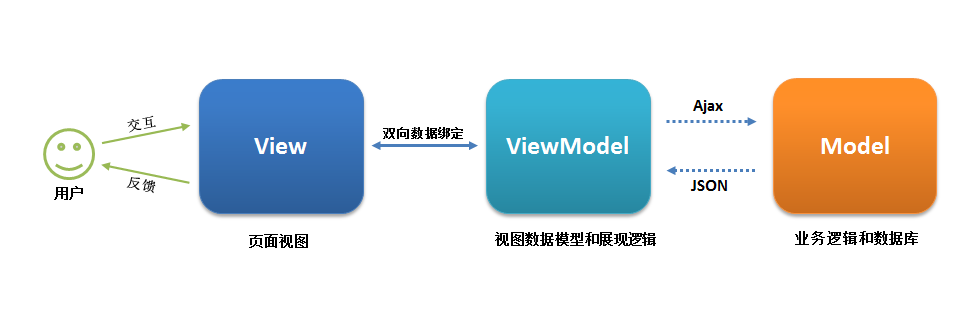

# Vue&React

### 说说vue动态权限绑定渲染列表（权限列表渲染）

1. 首先请求服务器,获取当前用户的权限数据,比如请求 this.$http.get("rights/list");

2. 获取到权限数据之后,在列表中使用v-if v-if-else的组合来展示不同的内容

   ```vue
   <template>
     <div>
       <!-- 面包屑导航区 -->
       <el-breadcrumb separator-class="el-icon-arrow-right">
         <el-breadcrumb-item :to="{ path: '/home' }">首页</el-breadcrumb-item>
         <el-breadcrumb-item>权限管理</el-breadcrumb-item>
         <el-breadcrumb-item>权限列表</el-breadcrumb-item>
       </el-breadcrumb>
       <!-- 卡片视图 -->
       <el-card>
         <el-table :data="rightsList" border stripe>
           <el-table-column type="index" label="#"></el-table-column>
           <el-table-column label="权限名称" prop="authName"></el-table-column>
           <el-table-column label="路径" prop="path"></el-table-column>
           <el-table-column label="权限等级" prop="level">
             <template slot-scope="scope">
               <el-tag v-if="scope.row.level === '0'">一级</el-tag>
               <el-tag type="success" v-else-if="scope.row.level === '1'">二级</el-tag>
               <el-tag type="danger" v-else>三级</el-tag>
             </template>
           </el-table-column>
         </el-table>
       </el-card>
     </div>
   </template>
   
   <script>
   export default {
     data() {
       return {
         // 权限列表
         rightsList: []
       };
     },
     created() {
       this.getRightsList();
     },
     methods: {
       async getRightsList() {
         //获取权限列表数据
         const { data: res } = await this.$http.get("rights/list");
         if (res.meta.status !== 200) {
           return this.$message.error("获取权限列表失败！");
         }
         this.rightsList = res.data;
       }
     }
   };
   </script>
   
   <style lang='less' scoped>
   </style>
   
   ```

### Vue用的哪种设计模式

​	属于发布订阅模式,在vue中使用observer和definereactive两个方法的结合对数据进行递归劫持,然后通过watch这个类来对属性进行订阅,Dep类用于解耦合,当数据变更的时候先触发数据的set方法,然后调用Dep.notiify通知视图更新

### 说说vue操作真实dom性能瓶颈

vue性能瓶颈的几种情况

1. 一次渲染大量的数据的时候,存在大量数据并且都是复杂类型的时候,会导致vue对数据的劫持时间和渲染时间变长, js 连续执行时间过长，会导致页面长时间无法交互，而且渲染时间太慢，用户一次交互反馈的时间过长。

   > 优化方案:可以使用`requestAnimation`这个方法,将数据进行分割,分批次渲染,减少了 js 的连续运行时间，并且加快了渲染时间，利用加长总运行时间换取了渲染时间，用户既能快速得到反馈，而且不会因为过长时间的 js 运行而无法与页面交互。

2. 当页面中存在大量数据,只是修改了一小部分导致页面也会导致页面卡顿,因为vue的更新以组件为粒度进行更新的，只要修改了当前组件中所使用的数据，组件就会整个去进行更新,造成大量的时间浪费

   > 优化方案:将不同的模块划分成不同的组件,这样有效降低虚拟dom的diff运算时间过长的问题,比如将大量数据的模块单独放一个组件,其它放一个组件,由于vue是以组件为粒度更新,修改其它组件的情况下不会导致table的重新diff,提升页面响应速度高达几百倍

3. 动态插槽作用域或者静态插槽的更新

   > 使用插槽作用域来替换这两种操作方式,一样能提升性能,因为使用`插槽作用域`之后,插槽内容会被封装到一个函数中,被子组件渲染,而不是在父组件

### Vue中如何获取dom、操作dom、更新dom

 如何获取dom？在Vue中提供了一种特别的方式来获取dom，即给dom加上个ref属性，那么就可以通过this.$refs.名字来获取到该dom元素。

 如何操作dom、更新dom？通过refs.名字就可以拿到对应的真实dom，然后就可以用原生JS进行操作和更新。当然vue框架本身就是不需要dom操作的，通过修改相应的数据并再配合指令、模板语法就可以轻松的操作和更新dom。

### Vue 的双向数据绑定原理是什么

在Vue2.x中，双向数据绑定是通过 数据劫持 结合 发布订阅模式的方式来实现的，也就是说数据和视图同步，数据发生变化，视图跟着变化，视图变化，数据也随之发生改变。核心：关于VUE双向数据绑定，其核心是 Object.defineProperty()方法。

Vue3.x则是用ES6的语法Proxy对象来实现的。

Object.defineProperty()的缺点：

1. 只能监听对象(Object)，不能监听数组的变化，无法触发push, pop, shift, unshift,splice, sort, reverse。
2. 必须遍历对象的每个属性
3. 只能劫持当前对象属性，如果想深度劫持，必须深层遍历嵌套的对象。

  Proxy的优点：

1. Proxy 可以直接监听对象而非属性。
2. Proxy 可以直接监听数组的变化。
3. Proxy 有多达 13 种拦截方法,不限于 apply、ownKeys、deleteProperty、has 等等是 Object.defineProperty 不具备的。
4. Proxy 返回的是一个新对象,我们可以只操作新的对象达到目的,而 Object.defineProperty 只能遍历对象属性直接修改。
5. Proxy 作为新标准将受到浏览器厂商重点持续的性能优化，也就是传说中的新标准的性能红利。

```javascript
  let arr = [];
  let proxy = new Proxy(arr, {
    get: function(obj, prop){
      return obj[prop];
    },
    set: function(obj, prop, value){
      obj[prop] = value;   //可以被监听到变化
      return true;
    }
  });
  setTimeout(()=>{
    proxy.push(1);
  }, 2000)
```

### mvvm框架是什么

MVVM是Model-View-ViewModel的简写。它本质上就是MVC（Model-View-Controller）的改进版。在开发过程中，由于需求的变更或添加，项目的复杂度越来越高，代码量越来越大，此时我们会发现MVC维护起来有些吃力，尤其Controller控制层非常的厚重，非常的庞大，难以维护。

所以有人想到把Controller的数据和逻辑处理部分从中抽离出来，用一个专门的对象去管理，这个对象就是ViewModel。ViewModel 是由前端开发人员组织生成和维护的视图数据层。在这一层，前端开发者对从后端获取的 Model 数据进行转换处理，做二次封装，以生成符合 View 层使用预期的视图数据模型。

由于实现了双向绑定，ViewModel 的内容会实时展现在 View 层，这是激动人心的，因为前端开发者再也不必低效又麻烦地通过操纵 DOM 去更新视图，MVVM 框架已经把最脏最累的一块做好了，我们开发者只需要处理和维护 ViewModel，更新数据视图就会自动得到相应更新，真正实现数据驱动开发。



### 谈谈Vue的token存储

在前后端完全分离的情况下，Vue项目中实现token验证大致思路如下：

1、第一次登录的时候，前端调后端的登陆接口，发送用户名和密码

2、后端收到请求，验证用户名和密码，验证成功，就给前端返回一个token

3、前端拿到token，将token存储到localStorage和vuex中，并跳转路由页面

4、前端每次跳转路由，就判断 localStroage 中有无 token ，没有就跳转到登录页面，有则跳转到对应路由页面

5、每次调后端接口，都要在请求头中加token

6、后端判断请求头中有无token，有token，就拿到token并验证token，验证成功就返回数据，验证失败（例如：token过期）就返回401，请求头中没有token也返回401

7、如果前端拿到状态码为401，就清除token信息并跳转到登录页面

### 知道nextTick的作用吗，谈谈对它的理解，是什么，怎么用

当你设置 vm.message = 'new message'，该组件不会立即重新渲染。当刷新队列时，组件会在下一个事件循环“tick”中更新。多数情况我们不需要关心这个过程，但是如果你想基于更新后的 DOM 状态来做点什么，这就可能会有些棘手。虽然 Vue.js 通常鼓励开发人员使用“数据驱动”的方式思考，避免直接接触 DOM，但是有时我们必须要这么做。为了在数据变化之后等待 Vue 完成更新 DOM，可以在数据变化之后立即使用 Vue.nextTick(callback)。这样回调函数将在 DOM 更新完成后被调用。例如：

```html
<div id="example">{{message}}</div>
```

```javascript
var vm = new Vue({
  el: '#example',
  data: {
    message: 'old message'
  }
})
vm.message = 'new message' // 更改数据
vm.$el.textContent  // 'old message'
Vue.nextTick(function () {
  vm.$el.textContent  // 'new message' 
})
```

### nextTick和setTimeout区别

  首先Vue 在更新 DOM 时是异步执行的，也就是说数据变了，DOM不会立即改变，那么我们是如何知道DOM什么时候会改变呢？也就是说如何知道异步后的触发时机呢？

  可以通过nextTick方法，这个方法在源码内，先监听是否具备Promise.then，利用promise来监听，如果当前环境不支持promise，那么就降级采用MutationObserver，如果MutationObserver不支持的话，那么就降级采用setImmediate，如果setImmediate不支持的话，那么就使用setTimeout(fn, 0)。

  所以说nextTick和setTimeout区别总结就是：nextTick会先尝试使用promise、MutationObserver、setImmediate这些技术去监听，如果都不支持才会采用setTimeout

### vue中为什么用虚拟dom而不操作真实dom

起初我们在使用JS/JQuery时，不可避免的会大量操作DOM，而DOM的变化又会引发回流或重绘，从而降低页面渲染性能。那么怎样来减少对DOM的操作呢？此时虚拟DOM应用而生，所以虚拟DOM出现的主要目的就是为了减少频繁操作DOM而引起回流重绘所引发的性能问题的！

虚拟DOM(Virtual Dom)，起始本质上就是一个JS对象，当数据发生变化时，我们不直接操作真实DOM，因为很昂贵，我们去操作这个JS对象，就不会触发大量回流重绘操作，再加上diff算法，可以找到两次虚拟DOM之间改变的部分，从而最小量的去一次性更新真实DOM，而不是频繁操作DOM，性能得到了大大的提升。


虚拟DOM还有一个好处，可以渲染到 DOM 以外的平台，实现 SSR、同构渲染这些高级特性，Weex 等框架应用的就是这一特性。

### Vue如何进行组件传值

父向子组件传值，可以利用prop方式。

子向父组件传值，可以利用自定义事件$emit方式。


多层级组件传值，可以使用provide/inject


无关系的组件传值，利用vuex状态管理


### 说说vue里面的父子通信

父 -> 子: 通过 Prop 向子组件传递数据，子组件通过props属性来接收。

```html
<blog-post title="My journey with Vue"></blog-post>
```

```javascript
Vue.component('blog-post', {
  props: ['title'],
  template: '<h3>{{ title }}</h3>'  //获取父组件的值
})
```

子 -> 父: 父组件自定义事件，子组件利用$emit来完成。

```html
<!--拿到子组件传递的数据$event即0.1-->
<blog-post v-on:enlarge-text="postFontSize += $event"></blog-post>
```

```html
Vue.component('blog-post', {
  props: ['title'],
  template: '<h3 v-on:click="$emit('enlarge-text', 0.1)">{{ title }}</h3>' 
})
```


### 谈谈如何实现vue组件通信和传值方式 （两个问题为同一个答案问法不一样）

```
这类问题 首先分类 表明了解的比较多   具体就没说完 或者漏了  面试官也不会计较很多
  组件通信的四大类   父与子    子与父    子与子     跨层级   
  在细说各种方式 加入自己的理解
1、props和$emit
父组件向子组件传递数据是通过prop传递的，子组件传递数据给父组件是通过$emit触发事件

2、$attrs和$listeners

3、中央事件总线 bus

上面两种方式处理的都是父子组件之间的数据传递，而如果两个组件不是父子关系呢？这种情况下可以使用中央事件总线的方式。新建一个Vue事件bus对象，然后通过bus.$emit触发事件，bus.$on监听触发的事件。

4、provide和inject

父组件中通过provider来提供变量，然后在子组件中通过inject来注入变量。不论子组件有多深，只要调用了inject那么就可以注入provider中的数据。而不是局限于只能从当前父组件的prop属性来获取数据，只要在父组件的生命周期内，子组件都可以调用。

5、v-model

父组件通过v-model传递值给子组件时，会自动传递一个value的prop属性，在子组件中通过this.$emit(‘input’,val)自动修改v-model绑定的值

6、$parent和$children

7、boradcast和dispatch

8、vuex处理组件之间的数据交互 如果业务逻辑复杂，很多组件之间需要同时处理一些公共的数据，这个时候才有上面这一些方法可能不利于项目的维护，vuex的做法就是将这一些公共的数据抽离出来，然后其他组件就可以对这个公共数据进行读写操作，这样达到了解耦的目的。
```

### 说说vue中Key值的作用

```
关于这个可以的key的作用 首先表明 key 不是一定要有的  不写可以代码也可以跑  但是建议加上
          然后指出可以用的地方  key在v-for循环可以用用   在表单元素中也可以用key 减少缓存
          一般说key  只要说配合v-for的使用
          
key是为Vue中的vnode标记的唯一id,通过这个key,我们的diff操作可以更准确、更快速
diff算法的过程中,先会进行新旧节点的首尾交叉对比,当无法匹配的时候会用新节点的key与旧节点进行比对,然后超出差异能讲清楚diff算法就继续讲
diff程可以概括为：oldCh和newCh各有两个头尾的变量StartIdx和EndIdx，它们的2个变量相互比较，一共有4种比较方式。如果4种比较都没匹配，如果设置了key，就会用key进行比较，在比较的过程中，变量会往中间靠，一旦StartIdx>EndIdx表明oldCh和newCh至少有一个已经遍历完了，就会结束比较,这四种比较方式就是首、尾、旧尾新头、旧头新尾.

准确: 如果不加key,那么vue会选择复用节点(Vue的就地更新策略),导致之前节点的状态被保留下来,会产生一系列的bug. 快速: key的唯一性可以被Map数据结构充分利用,相比于遍历查找的时间复杂度O(n),Map的时间复杂度仅仅为O(1)
讲完以后 还要补充一点自己的看法
建议使用主键比如id  

          
          
```

### 说说vue中的虚拟dom和diff算法

```
Virtual DOM 其实就是一棵以 JavaScript 对象( VNode 节点)作为基础的树，用对象属性来描述节点，实际上它只是一层对真实 DOM 的抽象。最终可以通过一系列操作使这棵树映射到真实的DOM上

下面就是一个真实DOM映射到虚拟DOM的例子：
 <ul id='list'>
          <li class='item'>Item 1</li>
          <li class='item'>Item 2</li>
          <li class='item'>Item 3</li>
        </ul>
        
 var element = {
        tagName: 'ul', // 节点标签名
        props: { // DOM的属性，用一个对象存储键值对
            id: 'list'
        },
        children: [ // 该节点的子节点
          {tagName: 'li', props: {class: 'item'}, children: ["Item 1"]},
          {tagName: 'li', props: {class: 'item'}, children: ["Item 2"]},
          {tagName: 'li', props: {class: 'item'}, children: ["Item 3"]},
        ]
    }
    
  在补充点虚拟DOM的好处
具备跨平台的优势
由于 Virtual DOM 是以 JavaScript 对象为基础而不依赖真实平台环境，所以使它具有了跨平台的能力，比如说浏览器平台、Weex、Node 等。

操作原生DOM慢，js运行效率高。我们可以将DOM对比操作放在JS层，提高效率。
因为DOM操作的执行速度远不如Javascript的运算速度快，因此，把大量的DOM操作搬运到Javascript中，运用patching算法来计算出真正需要更新的节点，最大限度地减少DOM操作，从而显著提高性能。

Virtual DOM 本质上就是在 JS 和 DOM 之间做了一个缓存。可以类比 CPU 和硬盘，既然硬盘这么慢，我们就在它们之间加个缓存：既然 DOM 这么慢，我们就在它们 JS 和 DOM 之间加个缓存。CPU（JS）只操作内存（Virtual DOM），最后的时候再把变更写入硬盘（DOM）

提升渲染性能
Virtual DOM的优势不在于单次的操作，而是在大量、频繁的数据更新下，能够对视图进行合理、高效的更新。

diff算法
vdom因为是纯粹的JS对象，所以操作它会很高效，但是vdom的变更最终会转换成DOM操作，为了实现高效的DOM操作，一套高效的虚拟DOM diff算法显得很有必要

diff算法包括一下几个步骤：

用 JavaScript 对象结构表示 DOM 树的结构；然后用这个树构建一个真正的 DOM 树，插到文
档当中

当状态变更的时候，重新构造一棵新的对象树。然后用新的树和旧的树进行比较(diff)，记录两棵树差异
把2所记录的差异应用到步骤1所构建的真正的DOM树上(patch)，视图就更新了
diff算法是通过同层的树节点进行比较而非对树进行逐层搜索遍历的方式，所以时间复杂度只有O(n)，是一种相当高效的算法
```

[实现虚拟DOM的过程](https://segmentfault.com/a/1190000020663531?utm_source=tag-newest)

### vue3.0有了解过吗，你觉得vue3.0好吗，好在哪

这种问题 是开放的   多说就是都是对的    可以讲差异  也可以讲新增 的知识点  

比如说 常用的api特别好用

1. ref、toRefs、toRef、isRef

- ref 用于定义响应式变量、快捷DOM访问。
- 基本语法：`const a = ref(1) // {value:1}`
- 基础使用： 一般用于定义 String、Number、Boolean 这种基于数据类型，外在表现统一使用 .value 访问。
- 补充：ref 还可以访问 DOM对象或者组件实例对象，可做DOM操作。
- toRef、toRefs 用于把一个object的变量，变成响应式的变量。
- 基本语法：`const msg = toRef(obj, key) `// 把obj[key]变成响应式的
- 基本语法：`const { msg } = toRefs(obj)` // 把整个obj都变成响应式的
- unref 返回一个变量的值
- 基本语法：`const x = unref(x)` // 如果x是ref变量则返回x.value，如果x不是ref变量则直接返回x。
- isRef 用于判断一个变量是不是ref响应式变量
- 基本语法：`const bol = isRef(x)`

```js
function useUpdBoxStyle() {
  const el = ref(null)
  const updateStyle = color => {
    el.value.style.color = color
  }
  return [el, updateStyle]
}
```

1. shallowRef、triggerRef

- shallowRef 用于性能优化，只对对象的第一层进行proxy
- 基本语法：`const obj = shallowRef({a:1,b:{c:{d:{e:2}}}})`
- triggerRef 用于手动触发那些shallowRef的变量进行更新视图
- 基本语法：`triggerRef(obj)` // 当obj.value.b.c.d发生变化，triggerRef(obj) 强制更新视图。
- customRef 自定义ref，把ref变量拆成get/set的写法
- 基本语法：`customRef((track, trigger) =>({get,set})`

```js
function useObj() {
  const obj = { a: 1, b: { c: { d: 2 }}}
  const obj1 = ref(obj)
  const obj2 = shallowRef(obj)
  // console.log('obj1', obj1)
  // console.log('obj2', obj2)
  const changeObj = (obj, newD) => {
    // obj1.value.b.c.d = 100
    obj.value.b.c.d = newD
    triggerRef(obj)
  }
  return [[obj1, obj2], changeObj]
}
```

1. reactive、readonly

- reactive 用于定义响应式变量（引用数据类型）
- 基本语法：`const arr = reactive([]) // {value: []}`
- ref和reactive是什么关系呢？ref背后是使用reactive来实现的。
- shallowReactive 用于性能优化，只对对象的第一层进行proxy
- 基本语法：`const c = shallowReactive({a:{b:{c:100}}})` // 只对这个对象的第一层进行proxy
- readonly 把响应式变量变成“只读的”，如果修改就报警告。
- 基本语法：`const user = readonly({name:1,age:2})`
- isReadonly 用于判断一个变量是否是readonly的，返回布尔值
- 基本语法：`const bol = isReadonly(x)`
- isProxy 用于判断一个变量是否是响应式的，返回布尔值
- 基本语法：`const bol = isProxy(x)`
- isReactive 用于判断一个变量是否是reactive响应式变量，返回布尔值
- 基本语法：`const bol = isReactive(x)`

```js
function useUser() {
  const user = readonly(reactive({name:'list',age:30}))
  console.log('user', user)
  // setTimeout(()=>user.age=40, 2000)
  const x = 1
  const y = readonly({a:1,b:{c:3}})
  console.log('是否被proxy拦截过', isProxy(user), isProxy(x), isProxy(y.b))
  return user
}
```

1. toRaw、markRaw

- toRaw 用于返回一个响应式变量的原始值
- 基本语法：`const a3 = toRow(reactive(a1)) `// a1===a3是true
- markRaw 用于把一个普通变量标记成“不可proxy”的
- 基本语法：`const b2 = markRaw(b1) `// b2是无法被reactive的

```js
function useRaw() {
  const a1 = { title: 100 }
  const a2 = reactive(a1)
  const a3 = toRaw(a2)
  console.log('toRow(a2)===a1', a3===a1)
  console.log('a2===a1', a2===a1)
  return [a1,a2,a3]
}
```

1. computed、watch、watchEffect

- computed 用于对响应式变量进行二次计算，当它依赖的响应式变量发生变化时会重新计算
- 基本语法：`const c = computed(()=>c1.value*c2.value) `// 只读
- 基本语法：`const c = computed({get:()=>c1.value*c2.value,set:(newVal)=>c1.value=newVal})` // 可写可读
- watch 用于监听响应式变量的变化，组件初始化它不执行
- 基本语法：`const stop = watch(x, (new,old)=>{})` // 调用stop()可以停止监听
- 基本语法：`const stop = watch([x,y], ([newX,newY],[oldX,oldY])=>{})`
- watchEffect 用于监听响应式变量的变化，组件初始化会执行
- 基本语法：`const stop = watchEffect(()=>ajax({cate,page,size}))`

```
export default function useWatchComputed() {
  const c1 = ref(10)
  const c2 = ref(20)
  const c3 = computed(()=>c1.value*c2.value)  // 只读
  // 可读也可写
  const c4 = computed({
    get: ()=>c1.value*c2.value,
    set: (newVal)=>{
      c1.value = parseInt(newVal) / c2.value
    }
  })
  const stop1 = watch(c4, (newC4, oldC4)=>console.log('c4变了', newC4, oldC4))
  const stop2 = watch([c1,c2], ([newC1,newC2],[oldC1,oldC2])=>{
    console.log('[c1,c2] 新值：', [newC1, newC2])
    console.log('[c1,c2] 旧值：', [oldC1, oldC2])
  })
  const stop3 = watchEffect(()=>{console.log('watch effect', c1.value, c2.value)})
  const update = (c,v) => c.value = v
  return [[c1,c2,c3,c4],[stop1,stop2,stop3,update]]
}
```

2：也可以说亮点

1. 性能比vue2.x快1.2~2倍
2. 支持tree-shaking，按需编译，体积比vue2.x更小
3. 支持组合API
4. 更好的支持TS
5. 更先进的组

3.更可以说性能

1.diff算法更快

vue2.0是需要全局去比较每个节点的，若发现有节点发生变化后，就去更新该节点

vue3.0是在创建虚拟dom中，会根据DOM的的内容会不会发生内容变化，添加静态标记， 谁有flag！比较谁。

2、静态提升

vue2中无论元素是否参与更新，每次都会重新创建，然后再渲染 vue3中对于不参与更新的元素，会做静态提升，只被创建一次，在渲染时直接复用即可

3、事件侦听缓存

默认情况下，onclick为动态绑定，所以每次都会追踪它的变化，但是因为是同一函数，没有必要追踪变化，直接缓存复用即可

在之前会添加静态标记8 会把点击事件当做动态属性 会进行diff算法比较， 但是在事件监听缓存之后就没有静态标记了，就会进行缓存复用

### v-model有了解过吗，原理是什么

这种原理性问题  不要直接说不清楚 不了解   

先讲下使用

v-model本质上是一个语法糖，可以看成是value + input 方法的语法糖。可以通过model的prop属性和event事件来进行自定义。

2、v-model是vue的双向绑定的指令，能将页面上控件输入的值同步更新到相关绑定的data属性， 也会在更新`data`绑定属性时候，更新页面上输入控件的值。

然后再来讲细节

vue的双向绑定是由数据劫持结合发布者－订阅者模式实现的，那么什么是数据劫持？vue是如何进行数据劫持的？说白了就是通过Object.defineProperty()来劫持对象属性的setter和getter操作，在数据变动时做你想要做的事情

我们已经知道实现数据的双向绑定，首先要对数据进行劫持监听，所以我们需要设置一个监听器Observer，用来监听所有属性。如果属性发生变化了，就需要告诉订阅者Watcher看是否需要更新。因为订阅者是有很多个，所以我们需要有一个消息订阅器Dep来专门收集这些订阅者，然后在监听器Observer和订阅者Watcher之间进行统一管理的。接着，我们还需要有一个指令解析器Compile，对每个节点元素进行扫描和解析，将相关指令（如v-model，v-on）对应初始化成一个订阅者Watcher，并替换模板数据或者绑定相应的函数，此时当订阅者Watcher接收到相应属性的变化，就会执行对应的更新函数，从而更新视图。因此接下去我们执行以下3个步骤，实现数据的双向绑定：

1.实现一个监听器Observer，用来劫持并监听所有属性，如果有变动的，就通知订阅者。

2.实现一个订阅者Watcher，每一个Watcher都绑定一个更新函数，watcher可以收到属性的变化通知并执行相应的函数，从而更新视图。

3.实现一个解析器Compile，可以扫描和解析每个节点的相关指令（v-model，v-on等指令），如果节点存在v-model，v-on等指令，则解析器Compile初始化这类节点的模板数据，使之可以显示在视图上，然后初始化相应的订阅者（Watcher）

3：最后补一下 vue2.0里面用Object.defineProperty  3.0里面用new  Proxy     一个监听每个属性 一个监听整个对象

### VUE组件如何与iframe通信问题

像这种问题其实问的不是特别详情  面试者可能不懂题目的意思   但是我们要学会揣摩 面试官的问题

如果不知道 你就直说vue的组件通信 在讲iframe的页面获取v

vue组件内嵌一个iframe，现在想要在iframe内获取父组件内信息，采用的是H5新特性PostMessage来解决跨域问题

采用postMessage内涵两个API:

onMessage：消息监听

postMessage：消息发送

代码和例子

```
 <div class="mapbox">
      <iframe name="map" src="http://localhost:8083/setposition.html?add='add'"></iframe>
 </div>
clearMap(){
      let map = document.getElementsByName("map")[0].contentWindow
      map.postMessage("clearMap","*")
    }
iframe内：

window.addEventListener('message', function (evt) {
  
    if (evt.data == 'clearMap'){
        clearMap()
    }
    //event.data获取传过来的数据
});
```

### 用过VUE 的自定义指令吗？自定义指令的方法有哪些

这种问题一样的  先回答经常用的一些指定 比如 v-for  v-if  v-model   v-show等等之类的  指令分为全局和局部的

然后在回答自定义指令

```js
通过directive来自定义指令，自定义指令分为全局指令和局部指令，自定义指令也有几个的钩子函数，常用的有bind和update，当 bind 和 update 时触发相同行为，而不关心其它的钩子时可以简写。一个表达式可以使用多个过滤器。过滤器之间需要用管道符“|”隔开。其执行顺序从左往右。  
```

### 当修改data时Vue的组件重渲染是异步还是同步

这个问题很有意思  因为平时我们一般问题异步和同步指的是 数据请求 同步和异步问题

这里加上了组件  还有修改data     这里给大家写个例子

```
<body>
    <div id="app">
        <div id="main">{{num}}</div>
        <button @click="add">更新</button>
    </div>
</body>
<script>
    new  Vue({
        el:"#app",
        data:{
            num:10
        },
        methods:{
            add(){
                this.num++;
                console.log(this.num)//11
                console.log(document.getElementById("main").innerHTML);//10
          
            }
        }
    })
</script>
```

 以此可以说明  

数据更新是同步的  但是视图更新是异步的

解决这个问题需要使用 $nextTick 解决视图异步更新的问题

### .sync修饰器的作用是

首先看到 .sync  我们需要知道这是个修饰器   类似修饰器还有  .stop  .prevent  之类

其实这个修饰符就是vue封装了 子组件要修改父组件传过来的动态值的语法糖，省去了父组件需要写的方法，但是子组件emit时要加上update

在有些情况下，我们可能需要对一个 prop 进行“双向绑定”。不幸的是，真正的双向绑定会带来维护上的问题，因为子组件可以修改父组件，且在父组件和子组件都没有明显的改动来源

代码解释

```
// 这里父组件，要给子组件传一个title的值
<template>
    <div>  
        <t-title :title.sync="fatherTitle"></t-title>
    </div>
</template>
<script>
import tTitle from './blocks/list';
export default {
    name: 'test1',
    components: {  tTitle },
    data() {
        return {
            fatherTitle: '父组件给的标题'
        };
    },
}
</script>
```

```
// 子组件
<template>
    <div>
        <h3>{{ title }}</h3>
        <button @click="changeTitle">改变</button>
    </div>
</template>
<script>
export default {
    props:{
        title: {type: String, default: '默认值11'}
    },
    methods: {
        changeTitle() {
            this.$emit("update:title", "子组件要改自己的标题");
        }
    }
};
</script>
```

这里关键就是emit里的参数要写成'update'+ ':' +'要修改的props'

以前是用的this.$emit("自定义方法")

### vue多组件嵌套通信方式

这个问题其实也是属于组件通信   常见的组件通信有 父传子  子传父  子传子  以及跨层级

这个多组件嵌套通信其实就是跨层级的另一种问法

多组件通信

方法一：props  一层 一层的传递

方法二：依赖注入  provide 声明  inject接收

方法三：利用公共的bus = new  Vue()   bus.$on  声明  bus.$emit()   调用

方法四：使用vuex 全局的状态管理

### vue如何让css只在当前组件生效

```
当前组件<style>写成<style  scoped>   加上scoped就可以了

这个style中一般还有lang   lang可以是less  scss  stylus 等等
不加scoped就是全局的样式
```

### Vue 的 keep-live 用过吗？作用是什么？

1. 没有用过
2. 用过，它的作用是可以在组件切换时，保存其包裹的组件的状态，使其不被销毁，防止多次渲染。

### keepalive,添加这个会比平常多生命周期吗? keepalive 已经缓存了,但是想跳回去的时候添加新的属性在哪个生命周期里实现

  会比平常的组件多两个生命周期钩子函数，分别是：activated 和 deactivated。使用`keep-alive`包裹的组件在切换时不会被销毁，而是缓存到内存中并执行 deactivated 钩子函数，再次渲染后会执行 activated 钩子函数。如果再一次跳回显示组件的时候可以在 activated 中做处理

### 说一下 keep-alive 的关联生命周期

  会比平常的组件多两个生命周期钩子函数，分别是：activated 和 deactivated。使用`keep-alive`包裹的组件在切换时不会被销毁，而是缓存到内存中并执行 deactivated 钩子函数，再次渲染后会执行 activated 钩子函数。

### Vue 创建项目的指令是什么

1. 使用的官方 cli 脚手架，如果是低于 3.0 的版本，使用`npm init`
2. cli 的版本大于 3.0 的使用`vue create`
3. 可以使用 vite 直接搭建项目，命令为`npm init vite@latest`，根据提示，一步一步操作就好

  参考链接

  [Getting Started | Vite](https://vitejs.dev/guide/#scaffolding-your-first-vite-project)

  [Vue CLI](https://cli.vuejs.org/zh/)

### vue 中如何使用 ref 绑定

  通过为组件或者标签添加 ref 属性，可以在 js 代码中使用全局 api`$refs`获取 dom 元素或者组件，其上的方法或者属性可以直接进行操作。

### vue 导航守卫与 jq 导航拦截器的介绍

  vue 的导航守卫一般指的是路由导航守卫，作用是在页面跳转的时候可以执行一个钩子函数。

  导航守卫使用最多的是全局守卫 router.beforeEach 主要是用来验证用户的登陆状态。它接收三个参数 to, from, next

- to: 即将要进入的路由对象
- from: 当前导航要离开的路由
- next: 一个回调函数， 一定要调用这个方法，不然路由不会继续往下

  jq 导航拦截器没有听过，一般在 jQuery 的作用就是对 dom 元素做操作，jQuery 的核心功能是元素选择器。至于提到的导航器可能是一类第三方 jQuery 插件？或者网络请求拦截，如果是网络请求拦截，那么 jQuery 发起请求的话，可以封装一个全局 ajax 请求插件，通过设置 ajaxSetup 实现

```js
  // 参考这个 https://www.runoob.com/jquery/ajax-ajaxsetup.html
  $.ajaxSetup({
    // url: 'demo_ajax_load.txt',
    beforeSend() {
      // 发起请求之前执行
    },
    complete() {
      // 所有的请求成功之后执行
    },
  });
```

### vue 常用哪些命令

1. v-model 指令，用于表单输入。
2. v-on 指令，用于事件绑定。
3. v-bind 指令，用于动态绑定一个值和传入变量。
4. v-once 指令，事件只能用一次，无论点击几次，执行一次之后都不会再执行。
5. v-html 指令，会将 span 的内容替换成 rawHtml 的属性值，直接作为 HTML 代码解析。
6. v-for 指令，与 HTML 标签结合使用，用于数据的遍历摆放。
7. v-if 指令，用来进行条件判断的，直接操作 dom。
8. v-else 指令，用来进行条件判断的，与 v-if 指令连用，意义为条件不成立时执行。
9. v-show 指令，根据真假切换元素的显示状态。

### vue 中插槽共有几种，及插槽的作用

  三种：默认插槽、具名插槽、作用域插槽

- 默认插槽

  默认插槽就是指<slot/>，<slot/>的作用类似于占符。

  ```js
  //定义一个全局子组件
  Vue.component('child', {
    template: '<div><slot></slot></div>',
  });
  
  var vm = new Vue({
    el: '#root',
  });
  ```

  ```html
  <!--引用child组件-->
  <div id="root">
    <child>
      <span>我是占位符</span>
    </child>
  </div>
  ```

  上述的子组件 child 里定义的 slot 被 span 标签给代替了，如果子组件里没有定义 slot，则 span 标签会被直接忽略，且一个子组件里只能定义一个单个插槽。

- 具名插槽

  可以通过设置 name 属性，指定显示的位置

  定义一个base-layout组件：

  ```html
  <div class="container">
    <header>
      <slot name="header"></slot>
    </header>
    <main>
      <slot></slot>
    </main>
    <footer>
      <slot name="footer"></slot>
    </footer>
  </div>
  ```

  ```html
  <base-layout>
    <template v-slot:header>
      <h1>Here might be a page title</h1>
    </template>
  
    <p>A paragraph for the main content.</p>
    <p>And another one.</p>
  
    <template v-slot:footer>
      <p>Here's some contact info</p>
    </template>
  </base-layout>
  ```

- 作用域插槽

  父组件替换插槽标签，但是内容由子组件来提供

  ```html
  <body>
    <div id="root">
      <child>
        <!--定义一个插槽，该插槽必须放在template标签内-->
        <template slot-scope="props">
          <li>{{props.value}}</li>
        </template>
      </child>
      <!--!--定义不同的渲染方式-->
      <child>
        <!--slot-scope="props"作用是使props指向子组件中定义的<slot>-->
        <template slot-scope="props">
          <h1>{{props.value}}</h1>
        </template>
      </child>
    </div>
  </body>
  <script>
    //定义一个全局子组件
    Vue.component('child', {
      data: function () {
        return {
          list: [1, 2, 3, 4],
        };
      },
      template:
        '<div><ul><slot v-for="value in list" :value=value></slot></ul></div>',
    });
  
    var vm = new Vue({
      el: '#root',
    });
  </script>
  ```

### vue 如何使用插件

  直接安装，引入就能使用。vue 还是 js，只要是 js 那么所有的插件使用都是相同的方式，引入绑定到对应的节点或者操作对应的节点就好。

### Vue 组件懒加载，图片懒加载

#### 组件懒加载

1. 结合路由插件使用的时候使用 import 方式实现

~~~js
// 第一步注释import导入的文件
// import  About from '../components/About.vue';
// 第二步将引入组件的方式以箭头函数的方式异步引入
const routes = [
  {
    path: '/about'，
    component: () => import( /* webpackChunkName: 'about' */ '../components/About.vue' )
  }
]
````
2. 引入组件的时候使用回调函数的方式引入，比如

```js
// 组件懒加载
const IconList = () => import('components/base/icon-list');

export default {
  components: {
    IconList,
  },
};
````
~~~

#### 图片懒加载

```
就是在加载页面的时候，如果页面中的图片过多，可以使用占位符的方式替换没有在可是区域内的图片，只加载当前需要现实的图片。监听滚动条的位置，当图片标签出现在可视区域的时候，重置图片的路径为真是路径，然后展示图片地址。一般在实际开发的时候都直接使用图片懒加载插件实现。还有一种解决方案就是使用页面骨架屏效果，也是类似占位显示，当数据加载完成之后替换掉占位显示的内容
```

### 使用Vue封装过组件吗?有哪些?讲一下他们是怎么实现的

比如做后台管理中，很多模块经常会复用，比如侧边导航组件、项目中常用的 echarts图表的封装（比如折线图、柱状图等）

封装组件需要考虑复用性：

- 预留插槽slot, 多次调用如果 子组件视图结构不一样那么就要 在 子组件template预留好 插槽（单个插槽、具名插槽，作用域插槽）
- 考虑到数据传递，定义props 组件接收父组件传递的数据，同时需要注意单向数据流，props不能直接修改，$emit自定义事件，父组件修改
- 业务逻辑不要在子组件中处理，子组件在不同父组件中调用时，业务处理代码不同，切记不要直接在子组件中处理业务，应该子组件 $emit自定义事件，将数据传递给父组件，父组件处理业务。

### 说说vuex的管理操作或理解

vuex是 vue的一个状态管理插件，采用集中式管理方式，来管理项目中多个组件的公共状态。

vuex有一个仓库概念，将组件公共的state存储在仓库的state属性中，state是只读的，组件只能使用，不能直接修改，修改需要通过 仓库中的mutations模块来修改，这样的好处是 当数据修改便于溯源，且不会因为 多个组件 直接修改数据，导致 组件间数据的互相影响， 同时 当我们仓库中有一个state 数据需要请求 数据接口才能获取时，vuex 设计了一个action模块，在action模块中发送异步请求，得到数据后，提交mutation来修改state。当state发生改变后组件自动刷新，在组件中可以commit mutation或者dispatch action来修改state。

具体工作流程如下图


### 说说Vuex的工作流程

vuex的仓库有5个模块，分别是 state，mutations, actions, getters, modules

我们将组件的公共状态定义在 vuex仓库的state中,state是只读的，无法直接修改，必须调动仓库中的某个mutation才能修改状态，getters可以理解为vuex中的计算属性，当我们在某个组件中使用vuex中的某个state时，不是直接使用原值，而是需要派生出一个新的值，就可以定义getters，可以在组件中获取。当依赖的state发生改变，此时getters会重新计算得到新值，同时 action中可以发送异步请求，得到数据后，commit mutation来给state赋值

具体代码如下：

仓库代码

```js
const store = new Vuex.Store({
    state: {
        items: [] // 定义一个公共的购物车数据
    },
    getters: {
        // 可以基于已有的state 派生新的状态
        selectedItems (state) {
            // 过滤购物车中未选中的商品
            return state.items.filter(item => item.selected)
        }
    },
    mutations: {
        // 定义mutation来修改state
        INIT_ITEMS(state, items){
            state.items = items
        }
    },
    actions: {
        // action可以发送异步请求，得到数据后commit mutation将请求结果传入
        FETCH_ITEMS({commit}, params = {}){
            // 调用封装好的 接口函数
            fetchItem(params).then(res => {
                if(res.data.code === 200) {
                    commit('INIT_ITEMS', res.data.data)
                }
            })
        }
    }
})
```

组件中使用 使用vuex

```js
// 获取state
this.$store.state.items // 直接获取
{
    computed: {
    ...mapState(['items']) // 助手函数获取
    }
}
// 获取getters
this.$store.getters.selectedItems // 直接获取
{
    computed: {
        ...mapGetters(['selectedItems']) // 助手函数获取
    }
}
// 组件中提交action
this.$store.dispatch('FETCH_ITEMS', {token: 'xxx'})
{
    methods: {
        ...mapActions(['FETCH_ITEMS']) // 助手函数 直接调用this.FETCH_ITEMS(params)触发
    }
}
// 组件中也可以直接commit  mutation
this.$store.commit('INIT_ITEMS'[,参数])
{
    methods:{
        ...mapMutations(['INIT_ITEMS']) // 助手函数 直接调用this.INIT_ITEMS(参数)
    }
}
```

### vuex项目中怎么使用？工作原理是什么？

原则: 

​	中小型项目中，如果组件的公共状态不多的情况下，不建议使用vuex，反而会增加代码复杂度，想要组件通信，直接通过event bus即可，中大型项目中，多个组件公共状态较多情况下，建议使用vuex

vuex的具体工作流程如下:

​	在仓库state中定义公共状态，action中发送异步请求，得到数据后调用mutation 赋值给state,组件中使用state,也可以在组件中 dispatch action和触发mutation来修改state,视图刷新

具体代码如下：

仓库代码

```js
const store = new Vuex.Store({
    state: {
        items: [] // 定义一个公共的购物车数据
    },
    getters: {
        // 可以基于已有的state 派生新的状态
        selectedItems (state) {
            // 过滤购物车中未选中的商品
            return state.items.filter(item => item.selected)
        }
    },
    mutations: {
        // 定义mutation来修改state
        INIT_ITEMS(state, items){
            state.items = items
        }
    },
    actions: {
        // action可以发送异步请求，得到数据后commit mutation将请求结果传入
        FETCH_ITEMS({commit}, params = {}){
            // 调用封装好的 接口函数
            fetchItem(params).then(res => {
                if(res.data.code === 200) {
                    commit('INIT_ITEMS', res.data.data)
                }
            })
        }
    }
})
```

组件中使用 使用vuex

```js
// 获取state
this.$store.state.items // 直接获取
{
    computed: {
    ...mapState(['items']) // 助手函数获取
    }
}
// 获取getters
this.$store.getters.selectedItems // 直接获取
{
    computed: {
        ...mapGetters(['selectedItems']) // 助手函数获取
    }
}
// 组件中提交action
this.$store.dispatch('FETCH_ITEMS', {token: 'xxx'})
{
    methods: {
        ...mapActions(['FETCH_ITEMS']) // 助手函数 直接调用this.FETCH_ITEMS(params)触发
    }
}
// 组件中也可以直接commit  mutation
this.$store.commit('INIT_ITEMS'[,参数])
{
    methods:{
        ...mapMutations(['INIT_ITEMS']) // 助手函数 直接调用this.INIT_ITEMS(参数)
    }
}
```

### Vuex中处理异步需要在什么地方写

异步处理需要在 仓库的actions中定义

Action 类似于 mutation，不同在于：

- Action 提交的是 mutation，而不是直接变更状态。
- Action 可以包含任意异步操作。

我们可以在action中发送异步请求，成功后触发mutation 将结果传入，在mutation赋值给state

```js
const store = new Vuex.Store({
    state: {
        items: [] // 定义一个公共的购物车数据
    },
    mutations: {
        // 定义mutation来修改state
        INIT_ITEMS(state, items){
            state.items = items
        }
    },
    actions: {
        // action可以发送异步请求，得到数据后commit mutation将请求结果传入
        FETCH_ITEMS({commit}, params = {}){
            // 调用封装好的 接口函数
            fetchItem(params).then(res => {
                if(res.data.code === 200) {
                    commit('INIT_ITEMS', res.data.data)
                }
            })
        }
    }
})
```

### 请你谈谈你对vuex的理解

vuex是专为vue设计的状态管理工具,可用于父子组件和非父子组件的全局组件通信。应用的状态集中放在store中，改变状态必须要经过commit，同步改变状态是提交mutations，异步是先通过actions再通过mutations。

一共有5大模块
**- state**
存放状态
**- getters**
就像计算属性一样，getter 的返回值会根据它的依赖被缓存起来，且只有当它的依赖值发生了改变才会被重新计算。
可以对state中的数据做一些处理
**- mutations**
更改 Vuex 的 store 中的状态的唯一方法是提交 mutation，通过store.commit提交到mutations模块
**- actions**
actions是异步的改变state中状态的方法，通过store.dispatch来提交到mutations模块，再通过提交commit来更改state中的状态
**- modules**
Vuex 允许我们将 store 分割成模块（module）。每个模块拥有自己的 state、mutation、action、getter、甚至是嵌套子模块——从上至下进行同样方式的分割

### vuex—个模块中改变state中数据,其他模块如何获取

由于使用单一状态树，应用的所有状态会集中到一个比较大的对象。当应用变得非常复杂时，store 对象就有可能变得相当臃肿。

为了解决以上问题，Vuex 允许我们将 store 分割成**模块（module）**。每个模块拥有自己的 state、mutation、action、getter、甚至是嵌套子模块——从上至下进行同样方式的分割：

vuex模块化后，需要另一个模块的state变化，可以在这个模块中定义getters 获取，具体代码如下

```js
// 模块a
const modulea = {
    namespaced: true,
    state: {
        num: 10
    },
    mutations: {
        ADD_NUM(state, n) {
            state.num += n
        }
    }
}
// 模块b
const moduleb = {
    namespaced: true,
    state: {
        num: 10
    },
    getters: {
        // 在这里拿到 模块a numstate
      moduleaNum (state, getters, rootState, rootGetters) {
          // 模块下的getter有四个参数分别是当前模块的state，当前模块的getters，以及根state个根getters可以通过rootState获取其他模块的state
          return rootState.modulea.num
          
      }  
    },
    mutations: {
        ADD_NUM(state, n) {
            state.num += n
        }
    }
}
```

### vuex的状态是怎样的，怎么改变状态

vuex的状态储存在仓库的state属性中，state是只读的，无法直接修改必须调用mutation才能修改

```js
const store = new Vuex.Store({
    state: {
        num: 10
    },
    mutations: {
        ADD_NUM (state, n) {
            state.num += n
        }
    }
})
// 在组件中直接出发mutaion
this.$store.commit('ADD_NUM', 10)
// 或者助手函数 提交 mutation
{
    methods: {
        ...mapMutations(['ADD_NUM'])
    }
}
// 直接调用即可
this.ADD_NUM(10)
```

### 你在项目中哪里使用vuex，vuex的应用场景

原则: 

​	中小型项目中，如果组件的公共状态不多的情况下，不建议使用vuex，反而会增加代码复杂度，想要组件通信，直接通过event bus即可，中大型项目中，多个组件公共状态较多情况下，建议使用vuex

在项目中，多个组件的公共状态可以存储的vuex中，比如电商网站的购物车数据，可以存储在vuex中。后台管理角色鉴权中的 不同角色的侧边栏数据，以及 不同角色可以访问的路由数据可以存储的vuex中，拿到数据储存。

### vuex的数据丢失知道吗  怎么解决

原理：可以利用缓存，将vuex中的state，在缓存中备份一下，当状态发生改变时，同步缓存的的备份。同时当刷新时，去缓存中的备份，给state赋值

实际开发中我们一般利用vuex一个插件来实现 vuex-persistedstate

具体代码如下

安装

```sh
npm i vuex-persistedstate -S
```

使用

```js
import Vuex from "vuex";
import createPersistedState from "vuex-persistedstate";

const store = new Vuex.Store({
  // ...
  plugins: [createPersistedState()],
});
```

### vuex怎么拿数据

- **获取vuex state中的count数据方法有**：

  方法1： `this.$store.state.count` 直接使用；

  ```
    方法2：`import { mapState } from vuex `
  
    然后把`...mapState('count')放入computed中`,然后直接使用count变量。
  ```

- **获取vuex getters中getCount数据的方法**：

  方法1： `this.$store.getters.getCount`直接使用。

  ```
    方法2：`import { mapGetters } from vuex `
  
    然后把`...mapGetters ('getCount')放入computed中`，然后直接使用getCount变量。
  ```

### 说说Vuex原理

       vuex 是一个专门为 vue 构建的状态管理工具，主要是为了解决 多组间之间状态共享问题。强调的是集中式管理，（组件与组件之间的关系变成了组件与仓库之间的关系）
　　vuex 的核心包括：state（存放状态）、mutations（同步的更改状态）、actions（发送异步请求，拿到数据）、getters（根据之前的状态派发新的状态）、modules（模块划分）
　　state 发布一条新的数据，在 getters 里面根据状态派发新的状态，actions 发送异步请求获取数据，然后在 mutations 里面同步的更改数据
　　应用场合：购物车的数据共享、登入注册

### vuex仓库数据很多，怎么管理

使用moduls模块划分和文件拆分来管理数据很多的问题。
例如：我们可以在modules中进行模块划分，比如用户相关模块放入user中，
文章信息相关模块放入article中。

 代码如下：

```
modules:{
         user:{ //跟用户相关的数据放这
            state:{

            },
            geeters:{

            },
            mutations:{

            },
            actions:{

            },
        },
         article:{ //跟文章相关的保存在这里
            state:{

            },
            geeters:{

            },
            mutations:{

            },
            actions:{

            },
        }   
}        
```


### vuex做数据集中管理，mutations和actions分别是做什么的，为什么不能用mutations处理异步数据

?        mutations和actions分别是做什么的?

  mutations和action都是用来改变Vuex store的状态的；mutations提供的回调函数是同步的；而actions提供的方法是异步的，此外，actions的方法最终还是通过调用mutations的方法来实现修改vuex的状态的。

?	 	为什么不能用mutations处理异步数据?

> 官方文档说明：“在 mutation 中混合异步调用会导致你的程序很难调试。例如，当你能调用了两个包含异步回调的 mutation 来改变状态，你怎么知道什么时候回调和哪个先回调呢？这就是为什么我们要区分这两个概念。在 Vuex 中，我们将全部的改变都用同步方式实现。我们将全部的异步操作都放在Actions中。”

actions 和 mutations 并不是为了解决竞态问题，而是为了能用 devtools 追踪状态变化。事实上在 vuex 里面 actions 只是一个架构性的概念，并不是必须的，说到底只是一个函数，你在里面想干嘛都可以，只要最后触发 mutation 就行。异步竞态怎么处理那是用户自己的事情。vuex 真正限制你的只有 mutation 必须是同步的这一点（在 redux 里面就好像 reducer 必须同步返回下一个状态一样）。同步的意义在于这样每一个 mutation 执行完成后都可以对应到一个新的状态（和 reducer 一样），这样 devtools 就可以打个 snapshot 存下来，然后就可以随便 time-travel 了。如果你开着 devtool 调用一个异步的 action，你可以清楚地看到它所调用的 mutation 是何时被记录下来的，并且可以立刻查看它们对应的状态。其实我有个点子一直没时间做，那就是把记录下来的 mutations 做成类似 rx-marble 那样的时间线图，对于理解应用的异步状态变化很有帮助。

### vuex中actions与mutations的区别

    Mutation 更改 Vuex 的 store 中的状态的唯一方法是提交 mutation。Vuex 中的 mutation 非常类似于事件：每个 mutation 都有一个字符串的 事件类型 (type) 和 一个 回调函数 (handler)。这个回调函数就是我们实际进行状态更改的地方，并且它会接受 state 作为第一个参数；
Action Action 类似于 mutation，不同在于：
Action 提交的是 mutation，而不是直接变更状态。
Action 可以包含任意异步操作。
总体来说：
actions
  1、用于通过提交mutation改变数据
  2、会默认将自身封装为一个Promise
  3、可以包含任意的异步操作
mutations
  1、通过提交commit改变数据
  2、只是一个单纯的函数
  3、不要使用异步操作，异步操作会导致变量不能追踪

### 说说vue如何进行路由配置

一、安装

本地环境安装路由插件vue-router：    cnpm install vue-router --save-dev  

二、配置
两种配置方法：在main.js中 || 在src/router文件夹下的index.js中
这里只说在src/router/index.js中的

     ```javaScript
      1.引入 import Vue from 'vue'
      `import Router from 'vue-router'`
      注意这个Router是自定义的名字，这里叫这个名字后，下边都要用到的
     ```

1. 使用/注册：

  ``` javascript
   Vue.use(Router)
  ```

2. 配置
   配置路由：

   ```
   export default new Router({
     routes: [
   {
        path : ‘/’,  //到时候地址栏会显示的路径
        name : ‘Home’,
        component :  Home   // Home是组件的名字，这个路由对应跳转到的组件。。注意component没有加“s”.
    },
    {
        path : ‘/content’,
        name : ‘Content’,
        component :  Content
    }
   ],
    mode: "history"
   })
   ```

3. 引入路由对应的组件地址：
   import Home from '@/components/Home'
   import Home from '@/components/Content’

4. 在main.js中调用index.js的配置：
   import router from './router'

5. App.vue页面使用（展示）路由：<!-- 展示router -->

   把这个标签放到对应位置：  `<router-view></router-view>`

6. 路由切换（原来的<a href="XXX.html"/>等地方）：把切换标签和链接改成：
   `<router-link  to="/">切换到Home组件</router-link><router-link  to="/content">切换到Content组件</router-link>`
   //这里，to里边的参数和配置时，path的路径一样即可

### 谈谈Vue路由守卫

  1、路由守卫 是什么

简单来说，导航守卫就是路由跳转前、中、后过程中的一些钩子函数，这个函数能让你操作一些其他的事儿，这就是导航守卫。
官方解释，vue-router提供的导航守卫主要用来通过跳转或取消的方式守卫导航。

2、路由守卫分类
导航守卫分为：全局的、组件内的、单个路由独享三种
  2.1 全局的
指路由实例上直接操作的钩子函数，他的特点是所有配置路由的组件都会触发
const router = new VueRouter({ ... })
router.beforeEach((to, from, next) => {
// ...
})
全局路由的钩子函数包括
beforeEach
在路由跳转前触发，参数包括to,from,next（参数会单独介绍）三个，这个钩子作用主要是用于登录验证
beforeResolve（2.5+）
这个钩子和beforeEach类似，也是路由跳转前触发，参数也是to,from,next三个，与beforeEach的区别参考官网。
afterEach
是在路由跳转完成后触发，参数包括to,from，它发生在beforeEach和beforeResolve之后，beforeRouteEnter（组件内守卫）之前。
  2.2 路由独享的
指在单个路由配置的时候也可以设置的钩子函数
const router = new VueRouter({
  routes: [
    {
      path: '/foo',
      component: Foo,
      beforeEnter: (to, from, next) => {
        // ...
      }
    }
  ]
})
路由独享的钩子函数包括
beforeEnter
与全局的beforeEach完全相同，如果都设置则在beforeEach之后紧随执行，参数to、from、next
  2.3 组件内的
指在组件内执行的钩子函数，类似于组件内的生命周期

<template>
  ...
</template>
export default{
  data(){
    //...
  },
  beforeRouteEnter (to, from, next) {
    // 在渲染该组件的对应路由被 confirm 前调用
    // 不！能！获取组件实例 `this`
    // 因为当守卫执行前，组件实例还没被创建
  },
  beforeRouteUpdate (to, from, next) {
    // 在当前路由改变，但是该组件被复用时调用
    // 举例来说，对于一个带有动态参数的路径 /foo/:id，在 /foo/1 和 /foo/2 之间跳转的时候，
    // 由于会渲染同样的 Foo 组件，因此组件实例会被复用。而这个钩子就会在这个情况下被调用。
    // 可以访问组件实例 `this`
  },
  beforeRouteLeave (to, from, next) {
    // 导航离开该组件的对应路由时调用
    // 可以访问组件实例 `this`
  }
｝ 
组件内的路由钩子函数包括
beforeRouteEnter
路由进入组件之前调用，参数包括to，from，next。该钩子在全局守卫beforeEach和独享守卫beforeEnter之后，全局beforeResolve和全局afterEach之前调用，要注意的是该守卫内访问不到组件的实例，也就是this为undefined，也就是他在beforeCreate生命周期前触发。

beforeRouteUpdate
在当前路由改变时，并且该组件被复用时调用，可以通过this访问实例。参数包括to，from，next。

beforeRouteLeave
导航离开该组件的对应路由时调用，可以访问组件实例this，参数包括to，from，next。
3、路由守卫回调参数
to：目标路由对象；
from：即将要离开的路由对象；
next：他是最重要的一个参数，他相当于佛珠的线，把一个一个珠子逐个串起来。


### 路由守卫中页面跳转运用了哪些钩子函数

**应用场景1：可进行一些页面跳转前处理，例如判断需要登录的页面进行拦截，做登录跳转！！**

```
router.beforeEach((to, from, next) => {
    if (to.meta.requireAuth) {
        //判断该路由是否需要登录权限
        if (cookies('token')) {
            //通过封装好的cookies读取token，如果存在，name接下一步如果不存在，那跳转回登录页
            next()//不要在next里面加"path:/",会陷入死循环
        }
        else {
            next({
                path: '/login',
                query: {redirect: to.fullPath}//将跳转的路由path作为参数，登录成功后跳转到该路由
            })
        }
    }
    else {
        next()
    }
})
```

**应用场景2，进入页面登录判断、管理员权限判断、浏览器判断**

```
//使用钩子函数对路由进行权限跳转
router.beforeEach((to, from, next) => {
    const role = localStorage.getItem('ms_username');
    if(!role && to.path !== '/login'){
        next('/login');
    }else if(to.meta.permission){
        // 如果是管理员权限则可进入，这里只是简单的模拟管理员权限而已
        role === 'admin' ? next() : next('/403');
    }else{
        // 简单的判断IE10及以下不进入富文本编辑器，该组件不兼容
        if(navigator.userAgent.indexOf('MSIE') > -1 && to.path === '/editor'){
            Vue.prototype.$alert('vue-quill-editor组件不兼容IE10及以下浏览器，请使用更高版本的浏览器查看', '浏览器不兼容通知', {
                confirmButtonText: '确定'
            });
        }else{
            next();
        }
    }
})
```

**应用场景3：当页面中有未关闭的窗口, 或未保存的内容时, 阻止页面跳转**

```
beforeRouteLeave (to, from, next) {
 //判断是否弹出框的状态和保存信息与否
 if (this.dialogVisibility === true) {
    this.dialogVisibility = false //关闭弹出框
    next(false) //回到当前页面, 阻止页面跳转
  }else if(this.saveMessage === false) {
    alert('请保存信息后退出!') //弹出警告
    next(false) //回到当前页面, 阻止页面跳转
  }else {
    next() //否则允许跳转
  }
```


### 谈谈Vue路由模式，路由有哪些模式

在vue-router路由对象中，路由有两种模式：hash和history，而默认的是hash模式.
前端路由目前主要有两种方法：
1、利用url的hash,就是常用的锚点（#）操作，类似页面中点击某小图标，返回页面顶部，JS通过hashChange事件来监听url的改变，IE7及以下需要轮询进行实现。一般常用框架的路由机制都是用的这种方法，例如Angualrjs自带的ngRoute和二次开发模块ui-router，react的react-route,vue-route…
2、利用HTML5的History模式，使url看起来类似普通网站，以”/”分割，没有”#”，但页面并没有跳转，不过使用这种模式需要服务器端的支持，服务器在接收到所有的请求后，都指向同一个html文件，通过historyAPI，监听popState事件，用pushState和replaceState来实现。

### 路由守卫的作用，全局和局部使用的差异是什么

全局路由守卫：就是在整个网页中，只要发生了路由的变化，都会触发。全局导航守卫主要包括两个函数，分别为：beforeEach、afterEach。
局部路由守卫:（组件内的守卫）只有当前路由使用。
路由加载之前触发：beforeRouteEnter (to, from, next)
更新路由之前触发：beforeRouteUpdate (to, from, next)
离开当前路由之前触发：beforeRouteLeave (to, from, next)


### 写出路由传参的具体实现

方式一：params 传参（显示参数）
    params 传参（显示参数）又可分为 声明式 和 编程式 两种方式
1、声明式 router-link
    该方式是通过 router-link 组件的 to 属性实现，该方法的参数可以是一个字符串路径，或者一个描述地址的对象。使用该方式传值的时候，需要子路由提前配置好参数，例如：


```javaScript
//子路由配置
{
 path: '/child/:id',
 component: Child
}

```

```javaScript
//父路由组件
<router-link to="/child/123">进入Child路由</router-link>

```
2、编程式 this.$router.push
    使用该方式传值的时候，同样需要子路由提前配置好参数，例如：
//子路由配置
{
 path: '/child/:id',
 component: Child
}
//父路由编程式传参(一般通过事件触发)
this.$router.push({
  path:'/child/${id}',
})
在子路由中可以通过下面代码来获取传递的参数值
this.$route.params.id
方式二：params 传参（不显示参数）
  params 传参（不显示参数）也可分为 声明式 和 编程式 两种方式，与方式一不同的是，这里是通过路由的别名 name 进行传值的

1、声明式 router-link
该方式也是通过 router-link 组件的 to 属性实现，例如：

```javaScript
<router-link :to="{name:'Child',params:{id:123}}">进入Child路由</router-link>
```

2、编程式 this.$router.push
使用该方式传值的时候，同样需要子路由提前配置好参数，不过不能再使用 :/id 来传递参数了，因为父路由中，已经使用 params 来携带参数了，例如：
//子路由配置
{
 path: '/child,
 name: 'Child',
 component: Child
}
//父路由编程式传参(一般通过事件触发)
this.$router.push({
  name:'Child',
  params:{
   id:123
  }
})
在子路由中可以通过下面代码来获取传递的参数值
this.$route.params.id
注意：上述这种利用 params 不显示 url 传参的方式会导致在刷新页面的时候，传递的值会丢失
方式三：query 传参（显示参数）
query 传参（显示参数）也可分为 声明式 和 编程式 两种方式
1、声明式 router-link
该方式也是通过 router-link 组件的 to 属性实现，不过使用该方式传值的时候，需要子路由提前配置好路由别名（name 属性），例如：

```javaScript

//子路由配置
{
 path: '/child,
 name: 'Child',
 component: Child
}
//父路由组件
<router-link :to="{name:'Child',query:{id:123}}">进入Child路由</router-link>

```

2、编程式 this.$router.push
使用该方式传值的时候，同样需要子路由提前配置好路由别名（name 属性），例如：
//子路由配置
{
 path: '/child,
 name: 'Child',
 component: Child
}
//父路由编程式传参(一般通过事件触发)
this.$router.push({
  name:'Child',
  params:{
   id:123
  }
})
在子路由中可以通过下面代码来获取传递的参数值
this.$route.query.id


### vue路由有哪几种

this.$router.push(obj) 跳转到指定url路径，并想history栈中添加一个记录，点击后退会返回到上一个页面
this.$router.replace(obj)  跳转到指定url路径，但是history栈中不会有记录
this.$router.go(n)  向前或者向后跳转n个页面，n可为正整数或负整数

### 说一下vue路由跳转方式

1、router-link 【实现跳转最简单的方法】
`<router-link to='需要跳转到的页面的路径>`
浏览器在解析时，将它解析成一个类似于`<a>`的标签。
**div和css样式略**

```html
 <li >
 <router-link to="keyframes">点击验证动画效果 </router-link>  
 </li>
```

2、`this.$router.push({ path:’/user’})`
3、`this.$router.replace{path：‘/’ }`类似，不再赘述　　

### vue路由的数据传参，params，query的区别。使用params什么时候会生效，什么时候不会生效，params有时会失效，为什么

query和params区别
query类似 get, 跳转之后页面 url后面会拼接参数,类似?id=1, 非重要性的可以这样传,刷新页面id还在
 params类似 post, 跳转之后页面 url后面不会拼接参数 , 但是刷新页面id 会消失
 注意：如果提供了path，params会被忽略而导致失效。
 通过官网我们知道路由中的name是不能重复的，而path是可以的。所以在函数式编程中，我们可以用变量来控制路径。


### 路由守卫路由拦截如何配置

通常在项目里，我们需要用户进行登录，才能让用户查看项目。在后台管理系统中，会根据不同的用户权限展示不同的内容。
在用户访问页面之前，我们通过全局前置守卫对路由进行拦截，看看你是不是可以通过。通过的标准是否登录，如果登录就通过放行，没有通过就打回。

```
// 不需要路由验证页面 
const whiteList = ['login', 'index']

router.beforeEach((to, from, next) => {
    // 确定用户是否已登录  
    const hasToken = false  // 这里就是路由是否通过标准，一般都是通过token来验证
if (hasToken) {   // 登录
  if (to.path === '/login') {  
    // 如果已登录，请重定向到主页
    next({ path: '/index' })
    return
  } 
  next()
} else {
  if (whiteList.indexOf(to.name) !== -1) {
    // 在免费登录白名单中，直接进入
    next()
  } else {
    // 没有访问权限的其他页将重定向到登录页。
    next(`/login`)
  }
}
})
```

需要注意的一点是，用户没有登录，是需要跳转到登录页面，如果在白名单里面没有登录页或者没有next()，页面一直跳转直到内存溢出。

每个项目的验证是否拥有权限不一样，权限判断那一块可以根据自己的实项目需求来进行操作。

### 写公用组件的时候，怎么提高可配置性

1. 带着开放封闭原则的视角思考

   开放原则，是说我们需要将有可能变动的属性，通过props接口的方式暴露给组件的调用者。

   封闭原则，意思是我们需要将该组件的通用能力及逻辑封装再组件内部，让调用者使用更加方便

2. 组件的可配置性需要结合实际的业务需求具体分析

   > 假设我们要封装一个Tab选项卡组件，实际功能交互可参考[组件 | Element](https://element.eleme.cn/#/zh-CN/component/tabs)

3. 组件的开放原则实践

   | 参数            | 说明                                                         | 类型                                | 可选值                | 默认值              |
   | :-------------- | :----------------------------------------------------------- | :---------------------------------- | :-------------------- | :------------------ |
   | value / v-model | 绑定值，选中选项卡的 name                                    | string                              | —                     | 第一个选项卡的 name |
   | type            | 风格类型                                                     | string                              | card/border-card      | —                   |
   | closable        | 标签是否可关闭                                               | boolean                             | —                     | false               |
   | addable         | 标签是否可增加                                               | boolean                             | —                     | false               |
   | editable        | 标签是否同时可增加和关闭                                     | boolean                             | —                     | false               |
   | tab-position    | 选项卡所在位置                                               | string                              | top/right/bottom/left | top                 |
   | stretch         | 标签的宽度是否自撑开                                         | boolean                             | -                     | false               |
   | before-leave    | 切换标签之前的钩子，若返回 false 或者返回 Promise 且被 reject，则阻止切换。 | Function(activeName, oldActiveName) | —                     | —                   |

上面的表格为Tab组件提供的props配置接口，它们需要遵循如下特点，可以极大提高可配置性:

- 配置项要尽可能多的，覆盖到业务中可能出现的每一种情况。
- 保证组件在每一项配置缺省状态下都能够正常表现
- 每一项配置都应该具备合理的默认值。

1. 组件的封闭原则实践

   | 事件名称   | 说明                                    | 回调参数              |
   | :--------- | :-------------------------------------- | :-------------------- |
   | tab-click  | tab 被选中时触发                        | 被选中的标签 tab 实例 |
   | tab-remove | 点击 tab 移除按钮后触发                 | 被删除的标签的 name   |
   | tab-add    | 点击 tabs 的新增按钮后触发              | —                     |
   | edit       | 点击 tabs 的新增按钮或 tab 被关闭后触发 | (targetName, action)  |

上面的表格为Tab组件所提供的自定义事件，但是事件相关的逻辑实现，已经完全在组件内部封装好了，组件使用者，只需要按需绑定事件即可对组件的行为做出监听，这些事件也需要遵循如下特点，才能保证该组件的可配置性：

- 事件函数相关逻辑，必须在组件内部封装完善

- 自定义事件函数在触发时，必须能够返回相关的参数

  > 例如 @tab-click 事件会给函数返回，被点击菜单的index下标等信息

- 事件函数本身也需要能够在缺省状态下，保持组件的正常运行。

### vue-router怎么生成动态地址

1. ###### 动态路由配置的应用场景

   一般我们在使用vue-router进行路由管理的时候，是通过如下方式配置`路由`与`组件`之间的`映射关系`:

   ```
   // router/index.js配置文件
   const router = new VueRouter({
       routes:[
           {
               path:'/login',
               component:()=>import ('../views/Login') //登录路由
           },
           {
               path:'/reg',
               component:()=>import ('../views/Reg') //注册路由
           },
           {
               path:'/admin',
               component:()=>import ('../views/Admin') //这是一个管理员才能访问的路由
           },
           {
               path:'/vip',
               component:()=>import ('../views/Vip') //假设，这是要给vip用户才能访问的路由
           },
       ]
   })
   ```

   但是在后台管理平台这种类型的项目中，我们需要让拥有不同`角色权限`的用户，访问不同的`菜单`及`路由`，如上述代码所示，部分路由只有管理员才能访问，而另外一部分路由只能vip用户才能访问，所以需要用到vue-router提供的`addRoute`方法来动态管理这一部分路由配置。

2. ###### 本地只配置通用路由

   我们为了实现路由的动态配置，需要将上述路由配置进行拆分，本地配置文件中，只保留通用的路由映射。

   ```
   const router = new VueRouter({
       routes:[
           {
               path:'/login',
               component:()=>import ('../views/Login') //登录路由
           },
           {
               path:'/reg',
               component:()=>import ('../views/Reg') //注册路由
           }
       ]
   })
   ```

3. ###### 后端为每个用户分配一个角色，随登录接口下发给前端

   ```
   app.get('/login',(req,res)=>{
    //此处需要实现登录相关逻辑
    res.send({
      username:'张三丰',
      role:'admin',  //标志当前用户角色
      routerList:[  //此处的路由配置，也可以通过独立接口向前端提供
        {
                   path:'/admin',
                   component:()=>import ('../views/Admin') //这是一个管理员才能访问的路由
               },
               ...此处可能会有很多其他路由，这些路由数据应该由专门的数据表来存储
      ]
    })
   })
   ```

4. ###### 前端登录并动态获取路由配置

   前端登录成功后，会得到后端动态下发的，跟自己账号角色相匹配的路由数据，此时可以通过addRoute方法，将这些动态获取的路由配置数据包，设置给router对象

   ```
   // views/Login.vue 登录面板
   
   axios.get('/login',(result)=>{
    let {routerList} = result
    routerList.forEach((item) => {
           this.$router.addRoute(item)
       })
   })
   ```

   

### vue-router有哪些方法

1. ###### router.beforeEach 路由守卫

   我们可以使用这个方法，按需拦截用户访问某些敏感路由，例如:

   ```
   router.beforeEach((to,from,next)=>{ //路由的全局前置守卫
       if(to.path.indexOf('/account')==-1){ //判断用户访问的是不是个人中心
           next()  //不是个人中心，直接放行
       }else{
           if(store.state.my.userInfo){ //判断登录状态
               next() //如果已经登录，直接放行
           }else{
               next('/login')  //如果没有登录，则跳至登录页
           }
       }
   })
   ```

2. ###### router.push 编程式导航

   通过编程式导航，我们可以通过事件的方式触发路由跳转

   ```
   // 字符串
   router.push('home')
    
   // 对象
   router.push({ path: 'home' })
    
   // 命名的路由
   router.push({ name: 'user', params: { userId: 123 }})
    
   // 带查询参数，变成 /register?plan=private
   router.push({ path: 'register', query: { plan: 'private' }})
   ```

3. ###### router.go、router.back、router.forward 路由的进入与返回

   > router.go 作用等同于`window.history.go`

   ```
   // 在浏览器记录中前进一步，等同于 history.forward()
   router.go(1)
    
   // 后退一步记录，等同于 history.back()
   router.go(-1)
    
   // 前进 3 步记录
   router.go(3)
   
   ```

4. ###### router.addRoute 动态设置路由映射

   添加一条新路由规则。如果该路由规则有 `name`，并且已经存在一个与之相同的名字，则会覆盖它。

   ```
   axios.get('/login',(result)=>{  //通过异步接口获取对应用户的特有路由配置
    let {routerList} = result
    routerList.forEach((item) => {
           this.$router.addRoute(item)  //通过addRoute方法依次将路由配置设置给router对象           
       })
   })
   ```

   

### 谈谈对MVVM的理解

1. ###### 什么是MVVM

   不管是MVC，MVP，或者MVVM，都是常见的软件架构设计模式（Architectural Pattern），它通过分离关注点来改进代码的组织方式。不同于设计模式（Design Pattern），只是为了解决一类问题而总结出的抽象方法，一种架构模式往往使用了多种设计模式。MVVM，可以拆分为**Model-View-ViewModel**来理解：

   - **Model** -  数据模型，可以对应到真实开发过程中的`数据包`
   - **View** -   视图层，布局和外观，可以对应到真实开发中的`DOM结构`
   - **ViewModel** - 扮演“View”和“Model”之间的使者，帮忙处理 **View** 视图层的全部业务逻辑

2. ###### 为什么使用MVVM框架

   要回答这个问题，我们需要对比一下，在使用MVVM框架之前，我们是如何完成前端交互的。

   - 使用前

   > 为了修改某个视图节点中的内容信息，我们需要频繁人为操作DOM，效率低下

   ```javascript
   var dom = document.querySelector('div');
   dom.innerHTML = '张三丰';
   dom.style.color = 'red';
   ```

   - 使用后

   > 当name数据发生变化的时候，视图区域的name自定触发更新，极大提高开发效率

   ```
   <div>{{name}}</div>
   
   data:{
    name:'张三丰'
   }
   ```

3. ###### 通过上述案例进一步理解MVVM

   - name数据包可以认为就是那个Model
   - div  节点可以认为就是那个View
   - 而Vue提供的语法环境所支持的数据驱动能力，就可以认为是那个ViewModel

   

### vue-router有什么组件

1. ###### router-link 组件

   `<router-link>` 组件支持用户在具有路由功能的应用中 (点击) 导航。 通过 `to` 属性指定目标地址，默认渲染成带有正确链接的 `<a>` 标签，可以通过配置 `tag` 属性生成别的标签.。另外，当目标路由成功激活时，链接元素自动设置一个表示激活的 CSS 类名。

   `<router-link>` 比起写死的 `<a href="...">` 会好一些，理由如下：

   - 无论是 HTML5 history 模式还是 hash 模式，它的表现行为一致，所以，当你要切换路由模式，或者在 IE9 降级使用 hash 模式，无须作任何变动。
   - 在 HTML5 history 模式下，`router-link` 会守卫点击事件，让浏览器不再重新加载页面。
   - 当你在 HTML5 history 模式下使用 `base` 选项之后，所有的 `to` 属性都不需要写 (基路径) 了。

2. router-view组件

   `<router-view>` 组件是一个 functional 组件，渲染路径匹配到的视图组件。`<router-view>` 渲染的组件还可以内嵌自己的 `<router-view>`，根据嵌套路径，渲染嵌套组件。

   其他属性 (非 router-view 使用的属性) 都直接传给渲染的组件， 很多时候，每个路由的数据都是包含在路由参数中。

   因为它也是个组件，所以可以配合 `<transition>` 和 `<keep-alive>` 使用。如果两个结合一起用，要确保在内层使用 `<keep-alive>`：

   ```html
   <transition>
     <keep-alive>
       <router-view></router-view>
     </keep-alive>
   </transition>
   ```

   ## vue-router和location.href的用法区别

3. vue-router使用pushState进行路由更新，静态跳转，页面不会重新加载；

4. location.href会触发浏览器，页面重新加载一次

5. vue-router使用diff算法，实现按需加载，减少dom操作

6. vue-router是路由跳转或同一个页面跳转；location.href是不同页面间跳转；

7. vue-router是异步加载this.$nextTick(()=>{获取url})；location.href是同步加载

### vue-cli怎么自定义组件

1. #### 组件封装

```vue
// HelloWorld.vue组件
<template>
  <div>
    自定义组件
  </div>
</template>

<script>
export default {
  data() {
    return {
      key: 'value'
    }
  },
  // 组件交互
}
</script>

<style scoped lang="less">
// 组件样式
</style>

```

1. #### 局部注册调用组件

```
// Test.vue
<template>
    <div>
        <HelloWorld/>
    </div>
</template>

<script>
    import HelloWorld from './HelloWorld.vue'
    export default {
        components:{
            HelloWorld
        }
    }
</script>

<style lang="less" scoped>
</style>
```

1. #### 全局注册使用

- 先在main.js中全局注册该组件

```javascript
import Vue from 'vue'
import App from './App.vue'

//全局注册
import HelloWorld from './components/HelloWorld.vue'
Vue.component('hello-world',HelloWorld)

new Vue({
  render: h => h(App),
}).$mount('#app')

```

- 然后在需要使用公共组件的业务组件中，调用该组件

```
// Test.vue
<template>
    <div>
        <hello-world></hello-world>
    </div>
</template>

<script>
    export default {
        
    }
</script>

<style lang="less" scoped>
</style>
```


### 谈谈对vue-loader的理解，实现原理是什么

##### 一. vue-loader的作用是什么

1. 首先我们需要达成共识的是，目前浏览器，只能识别普通的html、css、javascript。

2. 但是为了能够方便使用vue的组件化开发，需要我们将代码写在.vue单文件组件中。

3. .vue文件，以及其内部的template、style、script区域代码，不能直接交给浏览器去解析，因为它解析不了。

4. 所以我们需要一个vue-loader进行.vue单文件组件代码的转换，也就是

   > .vue方便开发  ------>  vue-laoder协助翻译  ----->  浏览器才能展示

##### 二. vue-loader 工作原理

**vue-loader** 的工作流程， 简单来说，分为以下几个步骤:

1. 将一个 **.vue 文件** 切割成 **template**、**script**、**styles** 三个部分。
2. **template 部分** 通过 **compile** 生成 **render**、 **staticRenderFns**。
3. 获取 **script 部分** 返回的配置项对象 **scriptExports**。
4. **styles 部分**，会通过 **css-loader**、**vue-style-loader**， 添加到 **head** 中， 或者通过 **css-loader**、**MiniCssExtractPlugin** 提取到一个 **公共的css文件** 中。
5. 使用 **vue-loader** 提供的 **normalizeComponent** 方法， **合并 scriptExports、render、staticRenderFns**， 返回 **构建vue组件需要的配置项对象 - options**， 即 **{data, props, methods, render, staticRenderFns...}**。

### vue实例中的data，在生命周期哪里能找到

如果想要了解哪个生命周期中可以找到vue实例的data，那我们必须了解，vue实例初始化的基本流程。

##### 一、vue实例的初始化过程

###### 1. new Vue

从 `new Vue(options)` 开始作为入口，`Vue` 只是一个简单的构造函数，内部是这样的：

```
function Vue (options) {
  this._init(options)
}
复制代码
```

进入了 `_init` 函数之后，先初始化了一些属性。

1. `initLifecycle`：初始化一些属性如`$parent`，`$children`。根实例没有 `$parent`，`$children` 开始是空数组，直到它的 `子组件` 实例进入到 `initLifecycle` 时，才会往父组件的 `$children` 里把自身放进去。所以 `$children` 里的一定是组件的实例。
2. `initEvents`：初始化事件相关的属性，如 `_events` 等。
3. `initRender`：初始化渲染相关如 `$createElement`，并且定义了 `$attrs` 和 `$listeners` 为`浅层`响应式属性。具体可以查看`细节`章节。并且还定义了`$slots`、`$scopedSlots`，其中 `$slots` 是立刻赋值的，但是 `$scopedSlots` 初始化的时候是一个 `emptyObject`，直到组件的 `vm._render` 过程中才会通过 `normalizeScopedSlots` 去把真正的 `$scopedSlots` 整合后挂到 `vm` 上。

然后开始第一个生命周期：

```
callHook(vm, 'beforeCreate')
复制代码
```

###### 2. beforeCreate被调用完成

`beforeCreate` 之后

1. 初始化 `inject`

2. 初始化 

   ```
   state
   ```

   - 初始化 `props`
   - 初始化 `methods`
   - 初始化 `data`
   - 初始化 `computed`
   - 初始化 `watch`

3. 初始化 `provide`

所以在 `data` 中可以使用 `props` 上的值，反过来则不行。

然后进入 `created` 阶段：

```
callHook(vm, 'created')
复制代码
```

###### 3. created被调用完成

调用 `$mount` 方法，开始挂载组件到 `dom` 上。

如果使用了 `runtime-with-compile` 版本，则会把你传入的 `template` 选项，或者 `html` 文本，通过一系列的编译生成 `render` 函数。

- 编译这个 `template`，生成 `ast` 抽象语法树。
- 优化这个 `ast`，标记静态节点。（渲染过程中不会变的那些节点，优化性能）。
- 根据 `ast`，生成 `render` 函数。

对应具体的代码就是：

```
const ast = parse(template.trim(), options)
if (options.optimize !== false) {
  optimize(ast, options)
}
const code = generate(ast, options)
复制代码
```

如果是脚手架搭建的项目的话，这一步 `vue-cli` 已经帮你做好了，所以就直接进入 `mountComponent` 函数。

那么，确保有了 `render` 函数后，我们就可以往`渲染`的步骤继续进行了

##### 二、结论

通过上面的vue实例化的前面几步我们可以知道，在created生命周期中，我们就可以对data做操作，因为此时根实例相关的属性都已准备完毕。那在created后面执行的生命周期，自然也都可以获取并操作data，所以能够操作data的常用生命周期就有如下几个:

- created
- beforeMount
- mounted
- beforeUpdate
- updated


### vue的路由有哪些钩子函数，可以用来做什么

#### 一、全局守卫

顾名思义，是要定义在全局的，也就是我们 `index.js` 中的 `router` 对象。

##### 1. beforeEach

全局前置守卫，在路由跳转前触发，它在 **每次导航** 时都会触发。

通过 `router.beforeEach` 注册一个全局前置守卫。

```js
router.beforeEach((to, from, next) => {
  console.log('??~ to:', to);
  console.log('??~ from:', from);
  next();
})
复制代码
```

**参数**

`beforeEach` 全局前置守卫接收三个参数

- **to: Route**: 即将要进入的目标路由对象
- **from: Route**: 当前导航正要离开的路由对象
- **next: Function**: 一定要调用该方法不然会阻塞路由。

**注意：** `next` 参数可以不添加，但是一旦添加，则必须调用一次，否则路由跳转等会停止。

`next（）`方法的几种情况

- **next():** 进行管道中的下一个钩子。
- **next(false):** 中断当前的导航。回到 `from` 路由对应的地址。
- **next('/') 或者 next({ path: '/' }):** 跳转到一个不同的地址，可传递的参数与 `router.push` 中选项一致。
- **next(error):** 导航终止，且该错误会被传递给 `router.onError()` 注册过的回调。、

##### 2. beforeResolve

全局解析守卫，在路由跳转前，所有 **组件内守卫** 和 **异步路由组件** 被解析之后触发，它同样在 **每次导航** 时都会触发。

通过 `router.beforeResolve` 注册一个全局解析守卫。

```js
router.beforeResolve((to, from, next) => {
  next();
})
复制代码
```

回调参数，返回值和 `beforeEach` 一样。也可以定义多个全局解析守卫。

##### 3. afterEach

全局后置钩子，它发生在路由跳转完成后，`beforeEach` 和 `beforeResolve` 之后，`beforeRouteEnter`（组件内守卫）之前。它同样在 **每次导航** 时都会触发。

通过 `router.afterEach` 注册一个全局后置钩子。

```js
router.afterEach((to, from) => {
  console.log('??~ afterEach:');
})
复制代码
```

这个钩子的两个参数和 `beforeEach` 中的 `to` 和 `from` 一样。然而和其它全局钩子不同的是，这些钩子不会接受 `next` 函数，也不会改变导航本身。

#### 二、路由守卫

顾名思义，就是跟路由相关的钩子，我们的路由守卫只有一个，就是 `beforeEnter`。

##### 1. beforeEnter

需要在路由配置上定义 `beforeEnter` 守卫，此守卫只在进入路由时触发，在 `beforeEach` 之后紧随执行，不会在 `params`、`query` 或 `hash` 改变时触发。

```js
//index.js
{
  path: '/a',
  component: () => import('../components/A.vue'),
  beforeEnter: (to, from) => {
   console.log('??~ beforeEnter ');
  },
},
复制代码
```

`beforeEnter` 路由守卫的参数是 `to`、`from`、`next` ，同 `beforeEach` 一样。

#### 三、组件守卫

顾名思义，是定义在路由组件内部的守卫。

##### 1. beforeRouteEnter

```js
  //A.vue
  beforeRouteEnter(to, from，next) {
    console.log('??~ beforeRouteEnter');
  },
复制代码
```

路由进入组件之前调用，该钩子在全局守卫 `beforeEach` 和路由守卫 `beforeEnter` 之后，全局 `beforeResolve` 和全局 `afterEach` 之前调用。

参数包括 `to`，`from`，`next`。

该守卫内访问不到组件的实例，也就是 `this` 为 `undefined`，也就是他在 `beforeCreate` 生命周期前触发。

##### 2. beforeRouteUpdate

```js
  //A.vue
  beforeRouteUpdate(to, from) {
    console.log('??~ beforeRouteUpdate');
  },
复制代码
```

对于 `beforeRouteUpdate` 来说，`this` 已经可用了，所以给 `next` 传递回调就没有必要了。

##### 3. beforeRouteLeave

```js
  //A.vue
  beforeRouteLeave(to, from) {
    console.log('??~ beforeRouteLeave');
  },
复制代码
```

对于 `beforeRouteLeave` 来说，`this` 已经可用了，所以给 `next` 传递回调就没有必要了。

#### 四、总结

**完整的导航解析流程**

> 1. 导航被触发。
> 2. 在失活的组件里调用 `beforeRouteLeave` 守卫。
> 3. 调用全局的 `beforeEach` 守卫。
> 4. 在重用的组件里调用 `beforeRouteUpdate` 守卫。
> 5. 在路由配置里调用 `beforeEnter`。
> 6. 解析异步路由组件。
> 7. 在被激活的组件里调用 `beforeRouteEnter`。
> 8. 调用全局的 `beforeResolve` 守卫。
> 9. 导航被确认。
> 10. 调用全局的 `afterEach` 钩子。
> 11. 触发 `DOM` 更新。
> 12. 调用 `beforeRouteEnter` 守卫中传给 `next` 的回调函数，创建好的组件实例会作为回调函数的参数传入。


### 计算属性通常用来干什么

#### 一、理解计算属性的概念

计算属性的英文是computed，其实很多时候，一些概念从英文对照为中文后，会导致其中一些含义发生错位与丢失，我们要想更好的理解computed计算属性，可以将这个概念分为两部分来看：

- 计算    

  > 这里的计算，是有种宏观的概念，指的是对于数据包的一种操作，比如:筛选、过滤、新增、删除等。
  >
  > 说明computed本身是具有处理数据的能力。

- 属性

  > 属性的意思是，一种可以读取、渲染的数据，性质跟data的作用相似
  >
  > 说明computed最终会给出一个数据供页面渲染使用。

由此，我们可以得出一个结论:

> computed计算属性，负责将一些数据在其内部按照指定逻辑处理后，最终给出处理后的结果数据，给到组件、页面进行渲染使用，可以让开发者更加便捷的处理一些动态变化的数据需求。

#### 二、computed计算属性的特点

1. computed内部对data做出处理，其处理结果可以像data一样，可以直接在页面中渲染。
2. computed内部逻辑会`自动`识别到data的变化，从而做出新的操作，得出新的数据，从而自动更新视图。
3. computed处理的数据具有`缓存`的能力，如果data不变，则页面中调用的都是computed第一次执行时的运算结果，提高渲染性能。

#### 三、computed应用场景

> 当某个前端已经指定的data数据包，如果我们渲染前，对其有过滤、筛选等操作需求，就可以使用computed

1. 字符串翻转的官方案例，就是将一个普通字符串翻转后再渲染到视图。

```
new Vue({
        el:'#app',   //占地盘
        data:{
            'msg':'Hello Vue'  //自定义数据包
        },
        computed:{
            reMsg(){ //专门用于反转msg的计算属性
                return this.msg.split('').reverse().join('')
            }
        }
    })
```


1. 如果一个班级中有很多学生，每个学生通过一个对象来表达，现在我们需要根据学员成绩来进行动态切换显示：`全部学员`、`及格学员`、`不及格学员`，这种在本地进行筛选的需求可以快速通过computed实现，代码逻辑大致如下:

```javascript
new Vue({
        el:'#app',   //占地盘
        data:{
            stu:[
                {name:'张三丰',score:100},
                {name:'DDK',score:50},
                {name:'张翠山',score:60},
                {name:'张无忌',score:90},
                {name:'PDD',score:45}
            ],
            status:0  //0全部 1及格  2不及格
        },
        computed:{
            filterStu(){
                let {stu,status} = this
                // let stu = this.stu
                // let status = this.status
                switch (status) {
                    case 1:  //及格
                        return stu.filter(item=>{
                            return item.score>=60
                        })
                    case 2: //不及格
                        let arr = stu.filter(item=>{
                            return item.score<60
                        })
                        return arr
                    default:  //全部
                        return stu
                }

            }
        }
    })

```

### computed和watch的区别

上一个问题我们已经详细探讨了computed的相关特征，在这里我们可以逐一对比一下:

1. 两者都跟data有关，区别在于
   - computed   在处理完data后，会提供一个新的数据包以供使用
   - watch   只会监听某个指定data的变化，执行相关的逻辑，不会提供新的数据
2. 两者的使用倾向不同
   - computed   内部虽然有逻辑，但是使用时更加多的关心其提供的`新数据包`
   - watch     更加关注data数据变化所引发的`行为逻辑`

### 状态管理器的数据走向是什么

#### 一、什么是状态管理？

> 状态管理就是，**把组件之间需要共享的状态抽取出来，遵循特定的约定，统一来管理，让状态的变化可以预测**。

#### 二、为什么需要状态管理？

#### 状态共享

组件之间通常会有一些共享的状态，在 Vue 或者 React 中我们一般会将这部分状态提升至公共父组件的 `props` 中，由父组件来统一管理共享的状态，状态的改变也是由父组件执行并向下传递。这样会导致两个问题:

- 需要将共享的状态提升至公共的父组件，若无公共的父组件，往往需要自行构造
- 状态由父组件自上而下逐层传递，若组件层级过多，数据传递会变得很冗杂

#### 变化跟踪

在应用调试过程中，可能会有跟踪状态变化过程的需求，方便对某些应用场景的复现和回溯。这时候就需要统一对状态进行管理，并遵循特定的约定去变更状态，从而让状态的变化可预测。

#### 三、单项数据流

因为在真实项目开发过程中，Store状态管理器中的数据会在很多组件中用到，如果不设定一个统一的规范去管理数据，最终将会导致数据混乱、使得项目变得难以维护。所以vuex状态管理器设计了如下几个核心api，与视图之间进行交互配合:

- state    

  vuex提供的，用以集中存储共享的数据。

- mutations

  vuex提供的，专门用以触发state数据变化的方法集，并且要求mutations的方法执行结果必须时可预测的，在其内部不能出现异步请求等不可预测的逻辑。

- actions  

  vuex提供的，专门用于让vuex进行异步请求处理的方法集，可选择使用。

- view     

  视图层，整个项目组件的代称，我们在此处消费状态管理器提供的数据、方法。

数据走向必须遵循单向数据流的规范:

1. 当我们初始化使用状态机数据时的流程是

   > store---->state----> view

2. 当组件内部想要本地更新状态管理器的数据，其流程是

   > view触发---->mutations---->state---->store---->view更新

3. 当组件内部想要在异步请求后，再更新本地状态管理器的数据，其流程是

   > view触发---->actions---->mutations---->state---->store---->view更新


### vuex数据丢失怎么解决

vuex的 store 中的数据是保存在运行内存中的，当页面刷新时，页面会重新加载 vue 实例，vuex 里面的数据就会被重新赋值，这样就会出现页面刷新vuex中的数据丢失的问题。 如何解决浏览器刷新数据丢失问题呢？

##### 方法一：手动操作本地存储

全局监听，页面刷新的时候将 store 里 state 的值存到 sessionStorage 中，然后从sessionStorage 中获取，再赋值给 store ，并移除 sessionStorage 中的数据。在 app.vue 中添加以下代码：

```js
 created() {
    window.addEventListener('beforeunload',()=>{  
       sessionStorage.setItem('list', JSON.stringify(this.$store.state))
    })
    
    try{
      sessionStorage.getItem('list') && this.$store.replaceState(Object.assign({},this.$store.state,JSON.parse(sessionStorage.getItem('list'))))
    }catch(err) {
      console.log(err);
    }
  
    sessionStorage.removeItem("list");
  }
```

##### 方法二：安装 vuex-persistedstate 插件

```
1. npm install vuex-persistedstate -S //安装插件
2. 在 store/index.js 文件中添加以下代码：
import persistedState from 'vuex-persistedstate'
const store = new Vuex.Store({
 state:{},
 getters:{},
 ...
 plugins: [persistedState()] //添加插件
})

```

这时候就需要使用 sessionStorage 进行存储，修改 plugins 中的代码

```js
plugins: [
    persistedState({ storage: window.sessionStorage })
]
```

### 怎么理解v-for的key值
  key的值一般为string或则number的类型，它用于解决在进行虚拟dom更新时的更新对象快速定位，虚拟dom更新需要逐个对比虚拟dom对象绑定的数据，这个过程称为diff算法，所以key也是提升diff算法的一个标识符，因为数组可能会进行排序以及增删等动作，所以使用数组的下标来定义key是没有任何作用的

### 能不能自己实现v-model的功能
  可以的，自定义一个指令，给节点绑定上添加input的功能，数据使用value绑定，在用户输入数据的时候，采用oninput事件来进行数据获取，并实时更新value数据，即可实现v-model的功能

### Vue双向数据绑定，怎么知道数据变了
  在Vue2.x中采用ES5的对象属性定义方法(Object.defineProperty)来给每一个数据添加额外属性(getter和setter属性)进行数据拦截，在vue内部实现对拦截数据的setter方法数据更新消息发布机制来获取数据更新消息，对getter方法实现消息订阅机制来获取数据更新

### 退出登录头像还在是什么原因怎么办
  多方面的原因引起的：
    1、头像信息是否采用了应用缓存机制，如果有需要清除H5应用缓存
    2、头像缓存在webStorage中，退出没有清除，直接清除
    3、缓存在移动设备的数据，也需要清除
    4、缓存在vuex或redux中的数据，直接清除即可
    5、浏览器缓存，清除cookie或则强制清除浏览器缓存

### vue数据双向绑定如何实现，如果不用vue，用原生js代码怎么实现
  1、获取传递进来的数据，然后对所有数据添加getter和setter方法，并在setter方法中添加消息订阅回调方法，在getter方法中实现数据更新发布回调方法
  2、对作用域内的所有dom节点进行数据以来处理，根据不同指令来实现不同订阅或发布回调方法绑定：如v-model绑定的数据对象，在oninput事件中添加消息发布回调方法绑定，在v-text中添加value数据更新消息订阅回调方法绑定
  当在输入框输入值的时候，出发oninput事件，出发消息发布回调方法更新数据
  当数据发生变化，触发订阅方法，执行dom数据更新方法，把最新数据更新到视图上

### vue如何实现响应式，说一下原理，它有什么缺点？
  它使用ES5的Object.defineProperty方法把所有的属性全部改为setter和getter属性，在每一个组件中都有一个watcher对象，当数据被赋值或变更的时候会通知页面的render方法对数据进行重新渲染，达到数据和视图的响应更新
  因为js的固有特性，不能动态观察对象动态添加、删除属性和数组的长度添加，所以vue2.x不能够动态进行数据双向绑定，需要调用$set、$delete这些方法来实现动态添加双向绑定属性

### include，exclude的区别
  这个是webpack中常常用于指定加载，对哪些文件进行加载的排除或包含的一个属性，include配置的文件路径中的所有文件都将采用配置的loader进行文件加载处理，exclude是配置的路径都不要进行这个加载器的处理

### 你说你使用懒加载优化页面，用的哪个版本的vue,看过源码吗, vue2.0不能实现懒加载
  这个与vue没有太大关系，采用的是ES6的动态加载机制来实现页面的懒加载，主要使用的webpack语法库为：@babel/plugin-syntax-dynamic-import，在对页面引入的时候，需要把引入方式从：import MyComponent from 'path' 修改为：const MyComponent = () => import('path')

### 运用多个组件库,提取公共代码进行压缩,发现js代码过大，怎么处理
  对组件不要做全局引入，可以采用动态引入和页面局部引入机制，减少文件首次加载的文件大小和文件进行打包时把所有依赖进行一次性打包造成的文件过大问题

### vue中爷孙通信怎么实现
  可以采用：eventBus事件机制来进行数据传递；也可以采用逐层props和$emit事件传递来实现传值；vuex数据传递；使用v-model逐层数据传递等

### vue怎么配置多个代理
  在vue.config.js中使用devServer配置选项的proxy属性来进行多个代理配置
  devServer: {
    proxy: {
      '/apis': {
        target: 'http://www.baidu.com',
        pathRewrite: {'/apis': ''}
      },
      '/info': {
        target: 'http://www.sina.com',
        pathRewrite: {'/info': ''}
      }
    }
  }

### 为什么vue3.0双向数据绑定换成了proxy
  因为Object.defineProperty方法的历史原因，如果要实现数据的劫持，需要遍历所有属性，如果是深层数据需要递归来进行属性绑定；而proxy是直接代理此数据对象，不需要遍历绑定属性
  如果对象有数据属性添加或则属性更新，需要重新给定数据劫持方法绑定，而proxy直接代理对象，不需要对属性做另外的处理
  因此可以在进行数据监听和劫持上节省很多数据遍历性能

### 你封装一个组件会有哪些考虑，用户用你的组件要怎么用？如果用户在使用你组件的同时又想自己加一些按钮进去那么此时你的组件要怎么写？

**回答：**

**1、**封装组件会有哪些考虑，用户用你的组件要怎么用？

1）、封装组件和封装函数是同样的道理，需要考虑到组件的通用性。

2）、那么，组件的属性，组件事件，组件的内容都是需要考虑到的。

- 组件的属性：需要考虑到属性的类型限制，属性的默认值

- 组件的事件：组件事件对应的函数，需要考虑到函数的参数和返回值

- 组件的内容：要充分考虑到组件的通用性，灵活性。组件的内容给予使用者以更大的灵活空间。

  

**2、**如果用户在使用你组件的同时又想自己加一些按钮进去那么此时你的组件要怎么写？

1）、要么使用内容的方式（vue中是插槽）

2）、要么提供一个render函数，由用户提供需要渲染的内容（如：按钮）。同时，根据自定义组件的情况，可以考虑让用户把按钮渲染在指定的区域。即：render函数里有：渲染的区域和渲染的内容。

### vue图片懒加载：①不考虑兼容性做法（你认为最好处理最效率的）②考虑兼容性做法

**回答：**

   **1、场景：**

   一个网页如果包含了很多的图片，那么，服务器压力就会很大。不仅影响渲染速度还会浪费带宽。

   通俗的说：你不看的图片我先不加载，也许你不看呢（哈哈），我何苦要做无效的事情呢
                      你想看时，我再加载（哈哈）

   **2、原理：**

　     1）、先将img标签的src链接设为同一张图片(默认图片：可以是loading)，把图片的实际地址赋给一个自定义属性。这时候所有的图片只发送一次请求。

　     2）、然后，当js监听到某张图片进入可视窗口时（说明你想看了），再将实际地址赋给src属性。src属性的值发生变化时，浏览器才会发送请求加载当前图片。如果图片没有进入可视区域，就不会加载图片（说明你还没想看呢），这样就大大的提高了效率。

  **3、示例代码（兼容性在代码中有注释）：**

```js
<!DOCTYPE html>
<html lang="en">
<head>
    <meta charset="UTF-8">
    <meta name="viewport" content="width=device-width, initial-scale=1.0">
    <meta http-equiv="X-UA-Compatible" content="ie=edge">
    <title>Document</title>
    <style>
    *{
        margin: 0;
        padding: 0;
    }
    ul{
        list-style: none;
    }
    li{
        width: 100%;    
        height: 200px;
        text-align: center;
        line-height: 200px
    }
    img{
        display: block;
        height: 200px;
    }
    </style>
</head>
<body>
    <div id="box">
        
    </div>
</body>
</html>
<script>

let imgDoms = document.getElementsByTagName("img");
// 当前显示图片的最大下标：
let maxIndex =  -1;    

window.onload = function(){
    // 1、从后端获取到所有的图片地址，先赋值给图片标签的自定义属性（data-src),给图片的src赋值为loading
    getImgs();
    // 2、加载可视区域的图片
    loadingImg();
}

window.onscroll = function(){
    loadingImg();
}

// 从后端获取到所有的图片地址，先赋值给图片标签的自定义属性（data-src),给图片的src赋值为loading
function getImgs(){
    //这个数组中的图片，可以是从后端获取到的，也可以写死。
    let imgs = ["img/1.jpg","img/2.jpg","img/3.jpg","img/4.jpg","img/5.jpg","img/6.jpg","img/7.jpg","img/8.jpg","img/9.jpg","img/10.jpg","img/11.jpg","img/12.jpg","img/13.jpg","img/14.jpg","img/15.jpg","img/16.jpg","img/17.jpg","img/18.jpg","img/19.jpg","img/20.jpg","img/21.jpg","img/22.jpg","img/23.jpg","img/24.jpg","img/25.jpg","img/26.jpg","img/27.jpg","img/28.jpg","img/29.jpg","img/30.jpg","img/31.jpg","img/32.jpg","img/33.jpg"];
    let htmlStr = "";
    for(let i=0;i<imgs.length;i++){
        htmlStr+=``;
    }
    document.getElementById("box").innerHTML = htmlStr;
}

function loadingImg(){    
    // 1、计算当前滚动的高度+可视区域的高度（此处考虑的兼容性）
    let scrollTop = document.documentElement.scrollTop || document.body.scrollTop;
    let clientHeight = document.documentElement.clientHeight || document.body.clientHeight;
    let height = scrollTop+clientHeight;

    // 2、得到应该显示图片的序号(可视区域最下面的图片序号)；
    let index = Math.ceil(height/200)-1;
    
    // 3、如果应该显示的图片的下标大于最大的下标，那就应该做图片的加载了。
    if(index>maxIndex){
        for(let i=maxIndex+1;i<=index;i++){
            if(imgDoms[i].getAttribute("data-src")){
                imgDoms[i].src = imgDoms[i].getAttribute("data-src");
                imgDoms[i].removeAttribute("data-src");
            }
        }
    }
    maxIndex = index;
}
</script>
```

### vue组件中的data为什么必须是函数，为什么不可以是对象，数组这些

**回答：**

 **1、如果vue组件的data是一个对象**，那么在复用vue组件时，由于对象是个引用类型。那么，每个组件的data会指向同一块内存空间，组件之间的data就会互相影响。所以，组件中的data不能是对象。

**2、vue框架中把data定义成函数**，函数里返回真正的数据（引用类型）。每次复用组件时，vue框架都会调用该函数。当调用该函数时，函数返回新的对象（申请新的空间）。那么不同的组件的内存空间就是独立的，不会互相影响。      

### 说说vue生命周期，发送请求在生命周期的哪个阶段，为什么不可以是beforeMount，mounted中

**回答：**

  **1、vue的生命周期**

**1）、生命周期是什么？**
 Vue 实例有一个完整的生命周期，也就是从开始创建、初始化数据、编译模版、挂载 Dom -> 渲染、更新 -> 渲染、卸载等一系列过程，我们称这是 Vue 的生命周期。

**2）、各个生命周期阶段及其钩子函数**

vue的生命周期核心经历了四个阶段，在四个阶段的前后分别有两个钩子函数。

第一阶段：数据挂载阶段：把配置项data中的属性，赋给了vue对象本身，并做了数据劫持。

 该阶段前后的两个钩子函数：beforeCreate和created

第二阶段：模板渲染阶段：把vue对象的数据渲染到模板上。

 该阶段前后的两个钩子函数：beforeMount和mounted

第三阶段：组件更新阶段：当数据发送变化时，组件会进行重新渲染，所以，准确的说是，组件重新渲染阶段。

 该阶段前后的两个钩子函数：beforeUpdate和updated

第四阶段：组件销毁阶段：组件销毁。

 该阶段前后的两个钩子函数：beforeDestroy和destroyed

视情况可以补充：

当使用keep-alive包裹组件时，会有组件激活和停用之说，这两个钩子函数分别是：activited和deactivated

  **2、发送请求在生命周期的哪个阶段，为什么不可以是beforeMount，mounted中。**

（如果组件的初始数据来自后端）发送请求建议在钩子函数created里，这个钩子函数里是最快，也能有助于一致性。

   为什么？

   1）、为什么不能放在beforeCreate里？

   因为：

　一般来说，数据从后端返回回来后，都会赋给vue中的属性（data挂载的），在beforeCreate钩子函数里，data的数据还没有挂载到vue对象本身上，所以，不能在这个钩子函数里用。而created钩子函数里，数据已经挂载到vue对象了。

2）、为什么不可以是beforeMount，mounted中

 因为：

　   第一，在这两个钩子函数里，发送请求有点晚，会增加页面loading的时间；

　   第二，vue的SSR不支持beforeMount 、mounted 钩子函数，所以，放在 created 中有助于一致性

### 兄弟和父子组件，在不能使用vuex的情况下有多少种方案，请列举出来？

**回答：**

**1、父子之间传值：**

　 1）、父到子：props，子到父：$emit

　 2）、$ref、$parent

　 3）、事件总线(event-bus）

　 4）、集中管理（$root）


**2、兄弟之间传值：**

　 1）、事件总线(event-bus）

　 2）、集中管理（$root）

　3）、先 子到父（用事件），再 父到子（用props）

### v-if和v-for可以同时使用吗

**回答：**

　 可以使用，但是，在循环时，通过v-if只能拿到少部分数据时，建议不要使用。

　 **原因：** v-for比v-if优先级高，如果遍历的数组元素个数比较多，但是满足v-if条件比较少的情况下。会浪费性能。而且，每次刷新页面时，都会执行这样性能不高的代码。

　**解决：**可以在computed里循环数组，通过filter的方式，过滤出需要的数据。v-for直接循环计算属性的结果（不用v-if）。而computed是有缓存的，所以，在原始数据没有变化时，不会多次过滤数据，这样，就提高了效率。

### vue-cli怎么配置跨域

**回答：**

使用反向代理，vue-cli3+的项目里，新建（编辑）vue.config.js文件，（增加）配置代码如下：

```js
module.exports = {
    
  devServer:{
    //设置代理
    proxy: { //代理是从指定的target后面开始匹配的，不是任意位置；配置pathRewrite可以做替换
      '/api': { //这个是自定义的，当axios访问以/api开头的请求时，会代理到 target + /api
             target: 'http://localhost:3001', //最终要访问的服务器地址
           changeOrigin: true, //创建虚拟服务器 
             pathRewrite: {
                '^/api': ''    //重写接口，去掉/api， 在代理过程中是否替换掉/api/路径 
         }
        }
      }
   }    
}
```

### v-bind是用来干什么的

**回答：**

　     v-bind指令是把**标签的属性处理成动态**的。分别可以把**属性名**和**属性值**处理成vue里的属性，常间的是属性值处理成动态的。

**格式如下：**

1、**属性值**动态绑定：`v-bind:html属性="数据"`  简写   :html属性="数据"`  

示例：

```js
</div> 

new Vue({
    data:{
        imgstr:'./imgs/1.jpg'
    }
})
```

2、 **属性名**动态绑定： `v-bind:[属性名]="数据"`	

此时，属性值也是动态的

示例：

```js
<div v-bind:[attr]="idname"  >我是div</div>

  new Vue({
        el: "#app",
        data:{
            attr:"class",
            idname:"div01"  
        }
    })
```

### 说说对插槽的理解

**回答：**

**1、插槽的作用：**

　    插槽是用来处理组件的内容的。插槽决定了组件的内容放在组件模板的何处。插槽使用的是vue官方提供的组件`<slot>`来完成的。

**2、vue中的插槽分为：**

**1）、单个插槽**

　  在组件中只有一个插槽时，插槽不用起名字。默认的名字是：default

示例：

```js
//1、定义组件
let book = {
        template: `
            <div>     
               <p>我是上p</p>
           <!--这是插槽，该组件的内容将会渲染在此处 -->
               <slot></slot> 
               <p>我是下p</p>
            </div>
        `,
    }

//2、父组件的模板
<div id="box">        
    <book>
       <!--放在组件book标签的内容，最终会渲染在book标签的<slot>处。-->
       
    </book>
</div>
```

**2）、具名插槽**

　   但组件中的插槽多于一个时，就需要给组件起名字，用名字来区分不同的插槽。用官方组件slot的name属性给插槽起名字

格式：

```js
<slot name="插槽的名字"></slot>
```

示例：

```js
//1、组件：
    let book = {
        template: `
            <div>     
               <p>我是上p</p>
        <!--具名插槽，该插槽起名为s1-->
               <slot name="s1"></slot> 
               <p>我是中p</p> 
        <!--具名插槽，该插槽起名为s2-->
               <slot name="s2"></slot>
               <p>我是下p</p>
            </div>
        `,
    }

//2、父组件模板里：

<div id="box">
    <book>
      <!--以下内容插在name为s1的插槽处-->
        <template v-slot:s1>
            
        </template>
      <!--以下内容插在name为s2的插槽处-->
        <template v-slot:s2>
            <div>我是div</div>
        </template>
  </book>
</div>
```

### $nextTick理解 和定时器有什么区别 都是延时执行

**回答：**

**1、$nextTick理解：**

　    vue更新DOM时，使用的是异步更新队列。目的是提高性能，避免无效的重复的DOM更新。即：vue中更新数据后，并不会立即更新DOM，而是把数据引起的DOM更新放入到异步更新队列里。等待下次事件循环（tick），并在两个tick之间进行UI渲染。

　    按照这个思路，程序员就不能在更改数据后，立即获取更新后的DOM，也不知道什么时候DOM能够更新。基于此，vue提供了$nextTick函数。程序员只需要把  **”**操作更新后DOM的代码**“**  放入到$nextTick的回调函数里。由$nextTick内部，在更新完DOM后，调用回调函数。

示例：

```js

this.msg = "hello"

this.$nextTick(()=>{
    
     操作“this.msg影响的DOM”的代码。
     
})
```

**2、$nextTick理解和定时器有什么区别**

**相同：**都是延迟加载，都使用事件队列

**不同：**

1）、定时器是下一个队列的队首。

2）、`$nextTick()`是放在当前队列的最后一个。$nextTick()的回调函数执行要先于定时器。

### event-bus是怎么用？

**event-bus是事件总线**，是借助一个全局的vue对象，来完成事件的绑定和事件的触发。

**当：**我们需要把A组件的数据传给B组件时，在A、B两个组件里都引入全局的vue对象。然后，在B组件里绑定事件，在A组件里触发事件，就可以把A组件的数据传给B组件了。

示例：

```js
//1、全局的vue对象: bus.js
export default new Vue();//vue 对象具有 $on  和 $emit  方法

//2、B组件的代码
import bus from "./bus.js"

export default {
  ………………
    data(){
        return {
            bookmsg:""
        }
    },
    created(){
        // 绑定事件（用全局变量bus绑定一个事件）
        bus.$on("eclick",str=>{
           this.bookmsg = str;
        })
    }    
}

//3、A组件的代码

import bus from "./bus.js"

export default {
  ………………
    data(){
        return {
             msg:"要传给B组件的数据"
        }
    },
    methods:{
        chuan(){
            // 触发事件（用全部变量bus触发事件）
            bus.$emit("eclick",this.msg);
        }
    }     
}

```

### mounted与created的区别

**回答：**

mounted和created都是vue对象生命周期的钩子函数，执行时机不同。

**1、created** 是在 data配置项的**数据挂载**到vue对象本身**后**，会调用的钩子函数。

  此时，

　1）、用  this.  的方式可以拿到data里的数据。

　 2）、但是数据还没有渲染到模板上。所以，访问dom时，内容还是原始的模板内容。

**2、mounted**是在组件的**模板初次渲染完毕后**会调用的钩子函数。

  此时，

　   data里的数据已经渲染到模板上了。所以，访问dom时，已经和页面上看到的效果一样了。

### v-model   原理 是什么

**回答：**

**1、v-model指令的作用**

  vue中的v-model指令是完成**双向绑定**的，用在表单元素上。双向绑定就是 M会影响V。V也会影响M。即：能将页面上输入的值同步更新到相关绑定的data属性，也会在更新data绑定属性时候，更新页面上输入控件的值。

**2、v-model的原理**      

　 v-model指令是一个语法糖，是属性绑定和事件的语法糖。vue会根据不同的表单元素使用不同的属性和事件。

如下：

- text 和 textarea 元素使用 `value` property 和 `input` 事件；
- checkbox 和 radio 使用 `checked` property 和 `change` 事件；
- select 字段将 `value` 作为 prop 并将 `change` 作为事件。

以文本框为例剖析原理，以下是代码：

```js
 <!-- V -->
  <div id="app">
      <!--文本框使用value属性和input事件-->
      <input type="text" v-bind:value="msg" @input="changeMsg"  >
  </div>

 //M：

  let vm = new Vue({
        el: "#app",
        data: {
           msg:"hi"
        },
        methods: {
            changeMsg(e){
                this.msg = e.target.value; 
            }      
        }
  })
```

而，使用v-model来完成以上功能的代码如下：

```js
  <!-- V-->
  <div id="app">
    <!-- 此处不需要使用value属性和input事件，直接使用v-mdoel指令即可 -->
      <input type="text" v-model="msg"  >
  </div>

  // M:model

  let vm = new Vue({
      el: "#app",
      data: {
          msg:"hi"
      }      
  })
```

### vue 的组件中的 data 配置为什么必须是函数(每个组件都是 vue 的实例)

vue 为了保证每个实例上的 data 数据的独立性，规定了必须使用函数，而不是对象。 因为使用对象的话，每个实例（组件）上使用的 data 数据是相互影响的，这当然就不是我们想要的了。 对象是对于内存地址的引用，直接定义个对象的话组件之间都会使用这个对象，这样会造成组件之间数据相互影响。而函数具有内部作用域，可以解决这个问题。

### vue 中 computed 和 watch 的区别

1. watch 和 computed 都是以 Vue 的依赖追踪机制为基础的，当某一个依赖型数据（依赖型数据：简单理解即放在 data 等对象下的实例数据）发生变化的时候，所有依赖这个数据的相关数据会自动发生变化，即自动调用相关的函数，来实现数据的变动。
   当依赖的值变化时，在 watch 中，是可以做一些复杂的操作的，而 computed 中的依赖，仅仅是一个值依赖于另一个值，是值上的依赖。
2. 应用场景：
   computed：用于处理复杂的逻辑运算；一个数据受一个或多个数据影响；用来处理 watch 和 methods 无法处理的，或处理起来不方便的情况。例如处理模板中的复杂表达式、购物车里面的商品数量和总金额之间的变化关系等。
      　　 watch：用来处理当一个属性发生变化时，需要执行某些具体的业务逻辑操作，或要在数据变化时执行异步或开销较大的操作；一个数据改变影响多个数据。例如用来监控路由、inpurt 输入框值的特殊处理等。
3. 区别：

- computed
  - 初始化显示或者相关的 data、props 等属性数据发生变化的时候调用；
  - 计算属性不在 data 中，它是基于 data 或 props 中的数据通过计算得到的一个新值，这个新值根据已知值的变化而变化；
  - 在 computed 属性对象中定义计算属性的方法，和取 data 对象里的数据属性一样，以属性访问的形式调用；
  - 如果 computed 属性值是函数，那么默认会走 get 方法，必须要有一个返回值，函数的返回值就是属性的属性值；
  - computed 属性值默认会缓存计算结果，在重复的调用中，只要依赖数据不变，直接取缓存中的计算结果，只有依赖型数据发生改变，computed 才会重新计算；
  - 在 computed 中的，属性都有一个 get 和一个 set 方法，当数据变化时，调用 set 方法。
- watch
  - 主要用来监听某些特定数据的变化，从而进行某些具体的业务逻辑操作，可以看作是 computed 和 methods 的结合体；
  - 可以监听的数据来源：data，props，computed 内的数据；
  - watch 支持异步；
  - 不支持缓存，监听的数据改变，直接会触发相应的操作；
  - 监听函数有两个参数，第一个参数是最新的值，第二个参数是输入之前的值，顺序一定是新值，旧值。

### vue 的生命周期？网络请求为什么要挂载在 mounted 中？

1. vue2 的生命周期

- 初始化阶段：
  - beforeCreate
  - created
- 挂载阶段
  - beforeMount
  - mounted
- 更新阶段
  - beforeUpdate
  - updated
- 卸载阶段
  - beforeDestroy
  - destroyed
- 缓存组件相关
  - activated
  - deactivated
- 处理错误相关
  - errorCaptured

1. vue3 的生命周期
   在 vue2 的基础上新增了：

- renderTracked： 跟踪虚拟 DOM 重新渲染时调用。钩子接收 debugger event 作为参数。此事件告诉你哪个操作跟踪了组件以及该操作的目标对象和键。
- renderTriggered：当虚拟 DOM 重新渲染被触发时调用。和 renderTracked 类似，接收 debugger event 作为参数。此事件告诉你是什么操作触发了重新渲染，以及该操作的目标对象和键。
  一共 13 个

1. vue3 的组合 api 的生命周期
   移除了 beforeCreate 和 created，因为创建时的事件可以在 setup 里面直接调用。
   其他的 11 个生命周期前面全部加上 on
   比如：mounted -> onMounted, beforeDestroy -> onDeforeDestroy
2. 网络请求为什么要挂载在 mounted 中？
   在 Created 生命周期里 Data 才生成，而请求返回的数据需要挂载在 data 上，所以 Created 里是可以初始化请求的，但是 Created 的这时候 DOM 还没有初始化；Mounted 生命周期里 DOM 才初始化渲染完成。
   然而，请求是异步的，所以不会堵塞页面渲染的主线程。
   所以请求放在 created 和 mounted 里面都是可行的。
   如果我们的请求不需要获取/借助/依赖/改变 DOM，这时请求可以放在 Created。反之则可以放在 Mounted 里。这样做会更加的安全，也能保证页面不会闪烁。

### vue 的指令，在项目中封装了那些常用指令？

在 vue 中我们可以使用 Vue.directive()方法注册全局指令。也可以只用 directives 选项注册局部指令。

- 输入框防抖指令 v-debounce

```js
const debounce = {
  inserted: function (el, binding) {
    let timer;
    el.addEventListener("keyup", () => {
      if (timer) {
        clearTimeout(timer);
      }
      timer = setTimeout(() => {
        binding.value();
      }, 1000);
    });
  },
};

export default debounce;
```

- 复制粘贴指令 v-copy

```js
const copy = {
  bind(el, { value }) {
    el.$value = value;
    el.handler = () => {
      if (!el.$value) {
        // 值为空的时候，给出提示。可根据项目UI仔细设计
        console.log("无复制内容");
        return;
      }
      // 动态创建 textarea 标签
      const textarea = document.createElement("textarea");
      // 将该 textarea 设为 readonly 防止 iOS 下自动唤起键盘，同时将 textarea 移出可视区域
      textarea.readOnly = "readonly";
      textarea.style.position = "absolute";
      textarea.style.left = "-9999px";
      // 将要 copy 的值赋给 textarea 标签的 value 属性
      textarea.value = el.$value;
      // 将 textarea 插入到 body 中
      document.body.appendChild(textarea);
      // 选中值并复制
      textarea.select();
      const result = document.execCommand("Copy");
      if (result) {
        console.log("复制成功"); // 可根据项目UI仔细设计
      }
      document.body.removeChild(textarea);
    };
    // 绑定点击事件，就是所谓的一键 copy 啦
    el.addEventListener("click", el.handler);
  },
  // 当传进来的值更新的时候触发
  componentUpdated(el, { value }) {
    el.$value = value;
  },
  // 指令与元素解绑的时候，移除事件绑定
  unbind(el) {
    el.removeEventListener("click", el.handler);
  },
};

export default copy;
```

- 长按指令 v-longpress

```js
const longpress = {
  bind: function (el, binding, vNode) {
    if (typeof binding.value !== "function") {
      throw "callback must be a function";
    }
    // 定义变量
    let pressTimer = null;
    // 创建计时器（ 2秒后执行函数 ）
    let start = (e) => {
      if (e.type === "click" && e.button !== 0) {
        return;
      }
      if (pressTimer === null) {
        pressTimer = setTimeout(() => {
          handler();
        }, 2000);
      }
    };
    // 取消计时器
    let cancel = (e) => {
      if (pressTimer !== null) {
        clearTimeout(pressTimer);
        pressTimer = null;
      }
    };
    // 运行函数
    const handler = (e) => {
      binding.value(e);
    };
    // 添加事件监听器
    el.addEventListener("mousedown", start);
    el.addEventListener("touchstart", start);
    // 取消计时器
    el.addEventListener("click", cancel);
    el.addEventListener("mouseout", cancel);
    el.addEventListener("touchend", cancel);
    el.addEventListener("touchcancel", cancel);
  },
  // 当传进来的值更新的时候触发
  componentUpdated(el, { value }) {
    el.$value = value;
  },
  // 指令与元素解绑的时候，移除事件绑定
  unbind(el) {
    el.removeEventListener("click", el.handler);
  },
};

export default longpress;
```

- 禁止表情及特殊字符 v-emoji

```js
let findEle = (parent, type) => {
  return parent.tagName.toLowerCase() === type
    ? parent
    : parent.querySelector(type);
};

const trigger = (el, type) => {
  const e = document.createEvent("HTMLEvents");
  e.initEvent(type, true, true);
  el.dispatchEvent(e);
};

const emoji = {
  bind: function (el, binding, vnode) {
    // 正则规则可根据需求自定义
    var regRule = /[^u4E00-u9FA5|d|a-zA-Z|rns,.?!，。？！…—&$=()-+/*{}[]]|s/g;
    let $inp = findEle(el, "input");
    el.$inp = $inp;
    $inp.handle = function () {
      let val = $inp.value;
      $inp.value = val.replace(regRule, "");

      trigger($inp, "input");
    };
    $inp.addEventListener("keyup", $inp.handle);
  },
  unbind: function (el) {
    el.$inp.removeEventListener("keyup", el.$inp.handle);
  },
};

export default emoji;
```

- 图片懒加载 v-LazyLoad

```js
const LazyLoad = {
  // install方法
  install(Vue, options) {
    const defaultSrc = options.default;
    Vue.directive("lazy", {
      bind(el, binding) {
        LazyLoad.init(el, binding.value, defaultSrc);
      },
      inserted(el) {
        if (IntersectionObserver) {
          LazyLoad.observe(el);
        } else {
          LazyLoad.listenerScroll(el);
        }
      },
    });
  },
  // 初始化
  init(el, val, def) {
    el.setAttribute("data-src", val);
    el.setAttribute("src", def);
  },
  // 利用IntersectionObserver监听el
  observe(el) {
    var io = new IntersectionObserver((entries) => {
      const realSrc = el.dataset.src;
      if (entries[0].isIntersecting) {
        if (realSrc) {
          el.src = realSrc;
          el.removeAttribute("data-src");
        }
      }
    });
    io.observe(el);
  },
  // 监听scroll事件
  listenerScroll(el) {
    const handler = LazyLoad.throttle(LazyLoad.load, 300);
    LazyLoad.load(el);
    window.addEventListener("scroll", () => {
      handler(el);
    });
  },
  // 加载真实图片
  load(el) {
    const windowHeight = document.documentElement.clientHeight;
    const elTop = el.getBoundingClientRect().top;
    const elBtm = el.getBoundingClientRect().bottom;
    const realSrc = el.dataset.src;
    if (elTop - windowHeight < 0 && elBtm > 0) {
      if (realSrc) {
        el.src = realSrc;
        el.removeAttribute("data-src");
      }
    }
  },
  // 节流
  throttle(fn, delay) {
    let timer;
    let prevTime;
    return function (...args) {
      const currTime = Date.now();
      const context = this;
      if (!prevTime) prevTime = currTime;
      clearTimeout(timer);

      if (currTime - prevTime > delay) {
        prevTime = currTime;
        fn.apply(context, args);
        clearTimeout(timer);
        return;
      }

      timer = setTimeout(function () {
        prevTime = Date.now();
        timer = null;
        fn.apply(context, args);
      }, delay);
    };
  },
};

export default LazyLoad;
```

- 权限校验指令 v-premission

```js
function checkArray(key) {
  let arr = ["1", "2", "3", "4"];
  let index = arr.indexOf(key);
  if (index > -1) {
    return true; // 有权限
  } else {
    return false; // 无权限
  }
}

const permission = {
  inserted: function (el, binding) {
    let permission = binding.value; // 获取到 v-permission的值
    if (permission) {
      let hasPermission = checkArray(permission);
      if (!hasPermission) {
        // 没有权限 移除Dom元素
        el.parentNode && el.parentNode.removeChild(el);
      }
    }
  },
};

export default permission;
```

- 实现页面水印 v-waterMarker

```js
function addWaterMarker(str, parentNode, font, textColor) {
  // 水印文字，父元素，字体，文字颜色
  var can = document.createElement("canvas");
  parentNode.appendChild(can);
  can.width = 200;
  can.height = 150;
  can.style.display = "none";
  var cans = can.getContext("2d");
  cans.rotate((-20 * Math.PI) / 180);
  cans.font = font || "16px Microsoft JhengHei";
  cans.fillStyle = textColor || "rgba(180, 180, 180, 0.3)";
  cans.textAlign = "left";
  cans.textBaseline = "Middle";
  cans.fillText(str, can.width / 10, can.height / 2);
  parentNode.style.backgroundImage = "url(" + can.toDataURL("image/png") + ")";
}

const waterMarker = {
  bind: function (el, binding) {
    addWaterMarker(
      binding.value.text,
      el,
      binding.value.font,
      binding.value.textColor
    );
  },
};

export default waterMarker;
```

- 拖拽指令 v-draggable

```js
const draggable = {
  inserted: function (el) {
    el.style.cursor = "move";
    el.onmousedown = function (e) {
      let disx = e.pageX - el.offsetLeft;
      let disy = e.pageY - el.offsetTop;
      document.onmousemove = function (e) {
        let x = e.pageX - disx;
        let y = e.pageY - disy;
        let maxX =
          document.body.clientWidth -
          parseInt(window.getComputedStyle(el).width);
        let maxY =
          document.body.clientHeight -
          parseInt(window.getComputedStyle(el).height);
        if (x < 0) {
          x = 0;
        } else if (x > maxX) {
          x = maxX;
        }

        if (y < 0) {
          y = 0;
        } else if (y > maxY) {
          y = maxY;
        }

        el.style.left = x + "px";
        el.style.top = y + "px";
      };
      document.onmouseup = function () {
        document.onmousemove = document.onmouseup = null;
      };
    };
  },
};
export default draggable;
```

### vue 的移动端适配怎么做的，rem 怎么用的

vue 的移动端适配我们可以参考 vant-ui 组件库给我们提供的方案。
使用 amfe-flexible(用于自动定义跟字体大小)插件和 postcss-pxtorem(用于将 px 自动转成 rem)插件
在 main.ts 里面 import "amfe-flexible"
在根目录新建 .postcssrc.js 文件

```js
module.exports = {
  plugins: {
    "postcss-pxtorem": {
      rootValue: 37.5,
      propList: ["*"],
    },
  },
};
```

rem 是相对于跟字体的倍数，如果我们整个项目都是用 rem 作为单位，那么当我们做移动端的响应式的时候只需要去改变跟字体的大小就能做到适配。

### 后台管理系统用户验证权限

1. 登录
   用户填写完账号和密码后向服务端验证是否正确，登录成功后，服务端会返回一个 token（该 token 的是一个能唯一标示用户身份的一个 key），之后我们将 token 存储在本地 localstorage 之中，这样下次打开页面或者刷新页面的时候能记住用户的登录状态，不用再去登录页面重新登录了。
   为了保证安全性，后台所有 token 有效期(Expires/Max-Age)都是 Session，就是当浏览器关闭了就丢失了。重新打开浏览器都需要重新登录验证，后端也会在每周固定一个时间点重新刷新 token，让后台用户全部重新登录一次，确保后台用户不会因为电脑遗失或者其它原因被人随意使用账号。
2. 拦截路由进行判断
   页面会先从 localstorage 中查看是否存有 token，没有，就走一遍上一部分的流程重新登录，如果有 token,就会把这个 token 返给后端去拉取 user_info，保证用户信息是最新的。 当然如果是做了单点登录得的的话，用户信息存储在本地也是可以的。当你一台电脑登录时，另一台会被提下线，所以总会重新登录获取最新的内容。
3. 权限控制
   前端会有一份路由表，它表示了每一个路由可访问的权限。当用户登录之后，通过 token 获取用户的 role ，动态根据用户的 role 算出其对应有权限的路由，再通过 router.addRoutes 动态挂载路由。但这些控制都只是页面级的，说白了前端再怎么做权限控制都不是绝对安全的，后端的权限验证是逃不掉的。
   前端控制页面级的权限，不同权限的用户显示不同的侧边栏和限制其所能进入的页面(也做了少许按钮级别的权限控制)，后端则会验证每一个涉及请求的操作，验证其是否有该操作的权限，每一个后台的请求不管是 get 还是 post 都会让前端在请求 header 里面携带用户的 token，后端会根据该 token 来验证用户是否有权限执行该操作。若没有权限则抛出一个对应的状态码，前端检测到该状态码，做出相对应的操作。
4. 利用 vuex 管理路由表，根据 vuex 中可访问的路由渲染侧边栏组件。

- 创建 vue 实例的时候将 vue-router 挂载，但这个时候 vue-router 挂载一些登录或者不用权限的公用的页面。
- 当用户登录后，获取用 role，将 role 和路由表每个页面的需要的权限作比较，生成最终用户可访问的路由表。
- 调用 router.addRoutes(store.getters.addRouters)添加用户可访问的路由。
- 使用 vuex 管理路由表，根据 vuex 中可访问的路由渲染侧边栏组件。

### vuex 做数据请求刷新页面，数据可能会发生丢失这个问题怎么解决

因为 store 里的数据是保存在运行内存中的,当页面刷新时，页面会重新加载 vue 实例，store 里面的数据就会被重新赋值初始化。
所以我们可以在修改 store 的数据同时将数据再存一份到本地存储(localStorage 或者 sessionStorage),本地存储的内容是存在浏览器里面的，不会因为刷新而丢失。
我们也可以用过比如 vuex-persistedstate 这样的第三方包来帮助我们做 vuex 的持久化数据。

### vue2 和 vue3 两者的具体的区别有哪些，请一一例举出来

1. 源码使用 ts 重写
   现如今 typescript 异常火爆，它的崛起是有原因的，因为对于规模很大的项目，没有类型声明，后期维护和代码的阅读都是头疼的事情，所以广大码农迫切的需要 vue 能完美支持 ts。
   vue2 用的是 Facebook 的 Flow 做类型检查，但是因为某些情况下推断有问题，所以 vue3 使用 typescript 进行了源码的重写。一个是为了更好的类型检查，另一个是拥抱 ts。
2. 使用 proxy 代替 defineProperty
   我们知道 vue2.x 双向绑定的核心是 Object.defineProperty()，所以导致 vue 对数组对象的深层监听无法实现。
   所以 vue3 使用 proxy 对双向绑定进行了重写。Proxy 可以对整体进行监听，不需要关心里面有什么属性，而且 Proxy 的配置项有 13 种，可以做更细致的事情，这是之前的 defineProperty 无法达到的。
3. Diff 算法的提升
   vue3 在 vue2 的 diff 算法的基础上增加了静态标记，元素提升和事件缓存等优化。使得速度更快。
4. 打包体积变化
   vue2 官方说的运行时打包师 23k，但这只是没安装依赖的时候，随着依赖包和框架特性的增多，有时候不必要的，未使用的代码文件都被打包了进去，所以后期项目大了，打包文件会特别多还很大。
   在 Vue 3 中，我们通过将大多数全局 API 和内部帮助程序移动到 Javascript 的 module.exports 属性上实现这一点。这允许现代模式下的 module bundler 能够静态地分析模块依赖关系，并删除与未使用的 module.exports 属性相关的代码。模板编译器还生成了对树抖动友好的代码，只有在模板中实际使用某个特性时，该代码才导入该特性的帮助程序。
   尽管增加了许多新特性，但 Vue 3 被压缩后的基线大小约为 10 KB，不到 Vue 2 的一半。
5. 其他 Api 和功能的改动

- Global API
- 模板指令
- 组件
- 渲染函数
- vue-cli 从 v4.5.0 开始提供 Vue 3 预设
- Vue Router 4.0 提供了 Vue 3 支持，并有许多突破性的变化
- Vuex 4.0 提供了 Vue 3 支持，其 API 与 2.x 基本相同

1. 组件基本结构

在创建组件的时候我们不必在写唯一的根元素。移除了 vue2 中的 filters。

1. 生命周期的区别

新增了 renderTracked 和 renderTriggered 两个生命周期。

1. 增加了组合 api

我们可以使用 setup 函数来使用类似 react 的自定义 hooks 的功能，主要解决逻辑关注点分离的问题。

### vue 操作虚拟 DOM 有什么优异的地方？他不是还多做了一层虚拟 DOM，为什么比原生操作 DOM 还快

我们有必要先了解下模板转换成视图的过程整个过程：

- Vue.js 通过编译将 template 模板转换成渲染函数(render ) ，执行渲染函数就可以得到一个虚拟节点树。
- 在对 Model 进行操作的时候，会触发对应 Dep 中的 Watcher 对象。Watcher 对象会调用对应的 update 来修改视图。这个过程主要是将新旧虚拟节点进行差异对比，然后根据对比结果进行 DOM 操作来更新视图。

简单点讲，在 Vue 的底层实现上，Vue 将模板编译成虚拟 DOM 渲染函数。结合 Vue 自带的响应系统，在状态改变时，Vue 能够智能地计算出重新渲染组件的最小代价并应到 DOM 操作上。


那么 vue 操作虚拟 DOM 有什么优异的地方呢？

- 具备跨平台的优势
  由于 Virtual DOM 是以 JavaScript 对象为基础而不依赖真实平台环境，所以使它具有了跨平台的能力，比如说浏览器平台、Weex、Node 等。
- 操作 DOM 慢，js 运行效率高。我们可以将 DOM 对比操作放在 JS 层，提高效率。
  因为 DOM 操作的执行速度远不如 Javascript 的运算速度快，因此，把大量的 DOM 操作搬运到 Javascript 中，运用 patching 算法来计算出真正需要更新的节点，最大限度地减少 DOM 操作，从而显著提高性能。
  Virtual DOM 本质上就是在 JS 和 DOM 之间做了一个缓存。可以类比 CPU 和硬盘，既然硬盘这么慢，我们就在它们之间加个缓存：既然 DOM 这么慢，我们就在它们 JS 和 DOM 之间加个缓存。CPU（JS）只操作内存（Virtual DOM），最后的时候再把变更写入硬盘（DOM）
- 提升渲染性能
  Virtual DOM 的优势不在于单次的操作，而是在大量、频繁的数据更新下，能够对视图进行合理、高效的更新。
  为了实现高效的 DOM 操作，一套高效的虚拟 DOM diff 算法显得很有必要。我们通过 patch 的核心—-diff 算法，找出本次 DOM 需要更新的节点来更新，其他的不更新。比如修改某个 model 100 次，从 1 加到 100，那么有了 Virtual DOM 的缓存之后，只会把最后一次修改 patch 到 view 上。那 diff 算法的实现过程是怎样的？

那么为什么比原生操作 DOM 还快呢？
首先我们每次操作 dom 的时候，都会去执行浏览器的那 5 个步骤，尤其是当大量循环的时候，每次循环完都不知道后面还要不要修改，所以每次都要去重复这个过程，引发不必要的渲染。
但是在实际开发过程中，我们会发现虚拟 dom 并没有比真实 dom 更快。这个问题尤雨溪在知乎上面有过回答：
这是一个性能 vs. 可维护性的取舍。框架的意义在于为你掩盖底层的 DOM 操作，让你用更声明式的方式来描述你的目的，从而让你的代码更容易维护。没有任何框架可以比纯手动的优化 DOM 操作更快，因为框架的 DOM 操作层需要应对任何上层 API 可能产生的操作，它的实现必须是普适的。针对任何一个 benchmark，我都可以写出比任何框架更快的手动优化，但是那有什么意义呢？在构建一个实际应用的时候，你难道为每一个地方都去做手动优化吗？出于可维护性的考虑，这显然不可能。框架给你的保证是，你在不需要手动优化的情况下，我依然可以给你提供过得去的性能。

### token 过期你是如何来进行处理，有没有弄过 token 续期

在开发中，我们经常会遇到使用 token，token 的作用是要验证用户是否处于登录状态，所以要请求一些只有登录状态才能查看的资源的时候，我们需要携带 token。

一般的后端接口设置的 token 是有时效的，超时后就会失效，失效之后的处理策略一般会做两种处理:

- 一种是直接跳转到登录页面，重新登录。
- 另外一种如果返回 token 失效的信息，自动去刷新 token，然后继续完成未完成的请求操作。

### vue底层实现原理

- 使用 Object.defineProperty 劫持 data上的数据。
- Vue2.0通过设定对象属性的 setter/getter 方法来监听数据的变化，通过getter进行依赖收集，而每个setter方法就是一个观察者，在数据变更的时候通知订阅者更新视图。

### Vue的生命周期，created与mounted的区别

1、**created**

表示组件实例已经完全创建，data数据已经被 Object.defineProperty 劫持完成，属性也绑定成功，但真实dom还没有生成，$el还不可用。

2、**mounted**

el选项所对应的视图节点已经被新创建的 vm.$el 替换，并挂载到实例上去了。此时响应式数据都已经完成了渲染。

### 用vue写了商城，从列表页点进详情页，从详情页退出来的时候，怎么保持进入详情页之前的页面卷动值。

使用 <keep-alive/>对列表页面进行包裹，被包裹的列表页面就有了activated、deactivated这两个生命周期。
在离开列表页面时，在deactivated中记录页面的滚动条位置。
再次进入列表页面时，在activated中使用 this.$el.scrollTop 把页面滚动到离开时所记录的位置。

### 说说你对vue的理解

- vue是数据驱动的MVVM框架，相比传统的DOM库，vue有一层虚拟DOM。每当数据发生更新时，会触发虚拟DOM进行diff运算，找出最小的变化节点，大大地节省了DOM操作性能。
- vue是组件化的，在单页面应用程序中，每一个组件相当于是一块积木，搭建起庞大的应用系统。组件，可以理解成更大粒度的“HTML元素”，有利于快速开发、组件的高效复用。
- vue有一整套指令，大大地降低了开发者的开发难度，提升了开发效率。
- 虽然vue有诸多优点，但仍然有一些缺陷，比如复杂的业务页面通常过长，data、methods、computed、watch对应的数据和逻辑交织在一起，难以维护。

### 说说对虚拟DOM的理解

- 在vue中，虚拟DOM本质上就是一个固定格式的JSON数据，它用于描述真实的DOM结构，并使用各种不同flag标记出动态的DOM节点。
- 虚拟DOM数据保存在应用程序对应的内存结构中，拥有更快的数据交换速度。
- 每当有数据发生变化时，就会生成新的虚拟DOM，进一步发生diff运算，找出最小脏节点，减少不必要的DOM开销，这也是vue拥有更好的性能的根本原因。

### 说说provide的用法

- 在父级组件中，使用provide选项向vue组件树中“提供数据”，其语法是：provide:{a: 1}
- 在后代子级组件中，使用 inject选项从vue组件中“取出数据”，其语法是：inject: ['a']

### 说一下element ui遇到过的坑

1. 表单设置触发事件为blur，但是ctrl+A全选以后再删除时又触发了change事件，并提示一个原始报错

   - 解决方案：trigger设置成`trigger: ['blur', 'change']`

2. 使用el-dialog 遮罩层把显示内容遮住了

   - 原因： Dialog 的外层布局的 position 值为 fixed, absolute, relative 三者之一时，就会出现被蒙板遮住的情况。
   - 解决方法：`v-bind:modal-append-to-body="false"`

3. 使用el-select 不能继承父元素的宽度 

   - 原因：el-select 本身是  inline-block
   - 解决办法：手动设置el-select的宽度

   ```js
       <el-select style="width:100%"></el-select>
   ```

### 怎么修改element ui动态组件的样式

要修改elementUI组件的样式，可以采用以下两种方式

1. 全局样式

   > 通过选择权重覆盖elementUI组件的样式，如修改复选框为圆角：

   ```html
       <style>
           .edit-item .el-checkbox__inner {
           　　border-radius: 50%;
           }
       </style>
   ```

   但这种方式为全局样式，会影响页面中所有复选框，如果不希望影响其它页面的样式，可以采用第二中方式

2. 局部样式

   ```html
       <style scoped>
           .edit-item .el-checkbox__inner {
           　　border-radius: 50%;
           }
       </style>
   ```

   但如果仅仅是设置了scoped属性，样式无法生效，原因是以上样式会被编译成属性选择器，而elementUI组件内部的结构却无法添加该html属性，以上样式被编译成如下代码：

   ```css
       .edit-item[data-v-6558bc58] .el-checkbox__inner[data-v-6558bc58] {
           　　border-radius: 50%;
           }
   ```

   解决方案也很简单，只需在选择器中要添加`>>>`即可

   ```html
       <style scoped>
           .edit-item >>> .el-checkbox__inner {
           　　border-radius: 50%;
           }
       </style>
   ```

   如果是sass或less编写的样式，还可以使用`/deep/`

   ```html
       <style scoped lang="scss">
           .edit-item /deep/ .el-checkbox__inner {
           　　border-radius: 50%;
           }
       </style>
   ```

   以上写法样式都会编译成以下样式：

   ```css
       .edit-item[data-v-6558bc58] .el-checkbox__inner{} 
   ```

   所以elementUI中的样式就能成功覆盖

### vue和react中的key值主要用来干什么

key是虚拟DOM对象的标识，在更新显示时key起着极其重要的作用，vue和react都是采用diff算法来对比新旧虚拟节点，而key的作用是为了在执行 diff算法 的时候，更快更准确地找到对应的虚拟节点，从而提高diff速度。

### route和router区别
`route` 和 `router` 是vue-router中经常会操作的两个对象， `route`表示当前的路由信息对象，包含了当前 URL 解析得到的信息，包含当前的路径、参数、query对象等，一般用于获取跳转时传入的参数。 `router`对象是全局路由的实例，是router构造方法的实例，一般用户路由跳转，如`router.push()`、`router.replace()` 等方法

### vue和react相对于传统的有什么好处，性能优点
1. 组件化开发，开发效率更高
    > React与Vue都鼓励使用组件化开发。这本质上是建议你将你的应用分拆成一个个功能明确的模块，每个模块之间可以通过特定的方式进行关联。这样可以更好的管理功能模块与复用，在团队项目中也能更好的分工协作
2. VirtualDOM，性能更高
    > 对真实DOM的操作很慢，所以Vue和React都实现了虚拟DOM，用户对数据的修改首先反映到虚拟DOM上，而不是直接操作真实DOM，然后在虚拟DOM环节进行优化，比如只修改差异项，对虚拟 DOM 进行频繁修改时进行合并，然后一次性修改真实 DOM 中需要改的部分，最后在真实 DOM 中进行排版与重绘，减少过多DOM节点排版与重绘损耗等
3. 数据和结构的分离
4. 双向数据绑定
    > Vue可以通过v-model指令实现，react可通过单向绑定+事件来实现
5. 强大的周边生态
    > Vue和React都有着强大的生态，比如路由、状态管理、脚手架等，用户可以根据需求自行选择，不需要重复造轮子

### 虚拟DOM实现原理
我们先来看看浏览器渲染一个页面的过和，大概需要以下5个步骤

1. 解析HTML元素，构建**DOM树**
2. 解析CSS，生成页面**CSS规则树**（Style Rules）
3. 将DOM树和CSS规则树进行关联，生成**render树**
4. 布局（layout/reflow）：浏览器设定Render树中的每个节点在屏幕上的位置与尺寸
5. 绘制Render树：绘制页面像素信息到屏幕上

众所周知，一个页面在浏览器中最大的开销就是DOM节点操作，页面的性能问题大多数是DOM操作引起的，当我们用原生js 或jquery这样的库去操作DOM时，浏览器会从构建DOM树开始执行完以上整个流程，所以频繁操作DOM会引起不需要的计算、重排与重绘，从而导致页面卡顿，影响用户体验

所以减少DOM的操作能达到性能优化的目的，事实上，**虚拟DOM**就是这么做的,虚拟DOM（VirtualDOM） 的实现原理主要包括以下 3 部分：

1. 用 JavaScript 对象模拟真实 DOM 树，对真实 DOM 进行抽象
2. diff 算法 — 比较新旧两个虚拟DOM，得到**差异对象**
3. pach 算法 — 将**差异对象**应用到真实 DOM 树


Virtual DOM 本质上就是一个javascript对象，数据的修改会生成一个新的虚拟DOM（一个新的javascript对象），然后与旧的虚拟DOM进行对比，得到两个对象的差异项，最后只更新差异对象中的内容到真实DOM，这样能做到最少限度地修改真实DOM，从而实现性能优化

### 如何实现角色权限分配
在开发中后台应用过程中或多或少都会涉及到一个问题：**权限**，简单地说就是让不同的用户在系统中拥有不同的操作能力。

但在实际应用中我们一般不直接将权限赋予在用户身上，因为这样操作对有大量用户的系统来说过于繁琐，所以我们一般基于**RBAC（Role-Based Access Control）权限模型**，引入**角色**的概念，通过角色的媒介过渡，先将权限赋予在角色上，再关联相应的用户，对应的用户就继承了角色的权限

用户与角色，角色与权限都是多对多的关系

引入角色媒介的优点：

1. 实现了用户与权限的解耦
2. 提高了权限配置的效率
3. 降低了后期维护的成本

### 双向数据绑定和单向数据流的优缺点

所谓数据绑定，就是指`View`层和`Model`层之间的映射关系。

- **单向数据绑定：**`Model`的更新会触发`View`的更新，而`View`的更新不会触发`Model`的更新，它们的作用是单向的。

  > 优点：所有状态变化都可以被记录、跟踪，状态变化通过手动调用触发，源头易追溯。
  >
  > 缺点：会有很多类似的样板代码，代码量会相应的上升。


- **双向数据绑定：**`Model`的更新会触发`View`的更新，`View`的更新也会触发`Model`的更新，它们的作用是相互的。

  > 优点：在操作表单时使用`v-model`方便简单，可以省略繁琐或重复的`onChange`事件去处理每个表单数据的变化（减少代码量）。
  >
  > 缺点：属于暗箱操作，无法很好的追踪双向绑定的数据的变化。

### Vue是如何实现双向绑定的?

**Vue的双向数据绑定是通过数据劫持结合发布者订阅者模式来实现的 要实现这种双向数据绑定，必要的条件有：**

1. 实现一个数据监听器Observer，能够对数据对象的所有属性进行监听，如有变动可拿到最新值并通知订阅者
2. 实现一个指令解析器Compile，对每个元素节点的指令进行扫描和解析，根据指令模板替换数据，以及绑定相应的更新函数
3. 实现一个Watcher，作为连接Observer和Compile的桥梁，能够订阅并收到每个属性变动的通知，执行指令绑定的相应回调函数，从而更新视图
4. MVVM入口函数，整合以上三者

补充回答

在new Vue的时候，在 Observer 中通过 `Object.defineProperty()` 达到数据劫持，代理所有数据的 getter 和 setter 属性，在每次触发 setter 的时候，都会通过 Dep 来通知 Watcher，Watcher 作为`Observer`数据监听器与`Compile`模板解析器之间的桥梁，当 Observer 监听到数据发生改变的时候，通过 Updater 来通知 Compile 更新视图，而 Compile 通过 Watcher 订阅对应数据，绑定更新函数，通过 Dep 来添加订阅者，达到双向绑定。

### Proxy与Object.defineProperty的优劣对比?

**Proxy的优势如下**

- Proxy可以直接监听整个对象而非属性。
- Proxy可以直接监听数组的变化。
- Proxy有13中拦截方法，如`ownKeys、deleteProperty、has` 等是 `Object.defineProperty` 不具备的。
- Proxy返回的是一个新对象，我们可以只操作新的对象达到目的，而`Object.defineProperty`只能遍历对象属性直接修改;
- Proxy做为新标准将受到浏览器产商重点持续的性能优化,也就是传说中的新标准的性能红利。

**Object.defineProperty 的优势如下**

- 兼容性好，支持 IE9，而 Proxy 的存在浏览器兼容性问题,而且无法用 polyfill 磨平。

**Object.defineProperty 不足在于**：

- `Object.defineProperty` 只能劫持对象的属性,因此我们需要对每个对象的每个属性进行遍历。
- `Object.defineProperty`不能监听数组。是通过重写数据的那7个可以改变数据的方法来对数组进行监听的。
- `Object.defineProperty` 也不能对 `es6` 新产生的 `Map`,`Set` 这些数据结构做出监听。
- `Object.defineProperty`也不能监听新增和删除操作，通过 `Vue.set()`和 `Vue.delete`来实现响应式的。

### 你是如何理解Vue的响应式系统的?

就是能够自动追踪数据的变化，而不必手动触发视图更新。Vue2.X通过Object.defineProperty()做数据劫持，而Vue3通过Proxy做数据代理，从而捕捉到对数据的get和set。

- 什么叫数据响应式？

简单说就是用户更改数据(Data)时，视图可以自动刷新，页面UI能够响应数据变化。

- 为什么要了解Vue数据响应式？

因为这是Vue的立身之本呀，连[尤雨溪](https://www.zhihu.com/search?q=尤雨溪&search_source=Entity&hybrid_search_source=Entity&hybrid_search_extra={"sourceType"%3A"answer"%2C"sourceId"%3A2259003949})都在给放文档上这样说，“Vue 最独特的特性之一，是其非侵入性的响应式系统。”

Vue就是通过getter 和setter来对数据进行操作，通过get()和set()函数可以生成一个虚拟属性，来直接调用函数操作数据。这一步是被封装起来的，我们是看不到的。

  此外，还需要一个重要的媒介API，那就是Object.defineProperty，因为对象被定义完成后，想要更改或添加属性（像是get和set这样的属性），只能通过这个Object.defineProperty来添加。接着需要实现对数据属性的读写进行监控。能够监控就意味着能让vm（一般生成的实例）能够知道数据有变化，从而触发render(data)函数，页面UI就会做出响应。

### 既然Vue通过数据劫持可以精准探测数据变化,为什么还需要虚拟DOM进行diff检测差异?

**1.减少对真实DOM的操作**

Diff 算法探讨的就是虚拟 DOM 树发生变化后，生成 DOM 树更新补丁的方式。对比新旧两株虚拟 DOM 树的变更差异，将更新补丁作用于真实 DOM，以最小成本完成视图更新。

具体流程：

1. 真实 DOM 与虚拟 DOM 之间存在一个映射关系。这个映射关系依靠初始化时的 JSX 建立完成；
2. 当虚拟 DOM 发生变化后，就会根据差距计算生成 patch，这个 patch 是一个结构化的数据，内容包含了增加、更新、移除等；
3. 最后再根据 patch 去更新真实的 DOM，反馈到用户的界面上。

这样一个生成补丁、更新差异的过程统称为 diff 算法。

这里涉及3个要点：

1. 更新时机：更新发生在setState、Hooks 调用等操作以后
2. 遍历算法：采用深度优先遍历，从根节点出发，沿着左子树方向进行纵向遍历，直到找到叶子节点为止。然后回溯到前一个节点，进行右子树节点的遍历，直到遍历完所有可达节点
3. 优化策略：树、组件及元素三个层面进行复杂度的优化
4. 1. 忽略节点跨层级操作场景，提升比对效率。
   2. 1. 这一策略需要进行树比对，即对树进行分层比较。树比对的处理手法是非常“暴力”的，即两棵树只对同一层次的节点进行比较，如果发现节点已经不存在了，则该节点及其子节点会被完全删除掉，不会用于进一步的比较，这就提升了比对效率
   3. 如果组件的 class 一致，则默认为相似的树结构，否则默认为不同的树结构
   4. 1. 在组件比对的过程中：如果组件是同一类型则进行树比对；如果不是则直接放入补丁中。只要父组件类型不同，就会被重新渲染。这也就是为什么shouldComponentUpdate、PureComponent 及 React.memo 可以提高性能的原因
   5. 同一层级的子节点，可以通过标记 key 的方式进行列表对比
   6. 1. 元素比对主要发生在同层级中，通过标记节点操作生成补丁。节点操作包含了插入、移动、删除等。其中节点重新排序同时涉及插入、移动、删除三个操作，所以效率消耗最大，此时策略三起到了至关重要的作用。通过标记 key 的方式，React 可以直接移动 DOM 节点，降低内耗

通过diff算法能准确的获取到具体的节点 进行针对操作！！！

### Vue为什么没有类似于React中shouldComponentUpdate的生命周期？

因为 Vue 的响应式系统已经在初次渲染时收集了渲染依赖的数据项，通过自动的方式就能够得到相当不错的性能。不过，在一些场景下，手动控制刷新检查还是能够进一步提升渲染性能的

vue 的机制，其实就是个依赖关系管理机制。不管是计算属性，watcher，以及 renderer，站在外部看，模型都是一样的，即初始化的时候通过一些方法分析出来这个模块依赖谁，等被依赖的数据更新了，这些模块就重新运算一遍产出物（实际上不尽然，比如计算属性有惰性机制）。

具体到 renderer，哪些数据的变更会引起 dom 变更，在模板编译的时候已经确定了，并且写死在生成的代码里了。

而 react 是没有这种自动机制的，它去执行 render 唯一的原因就是你主动让他 render。那你什么时候让它 render 呢？工程上一般是使用一个数据流工具，数据有变化的时候发出一个事件，一股脑把数据推过来，不区分哪个字段有变更（你区分了也没用，renderer 根本不认）。如果这个数据流模型是多个组件共用的，那必然是在 render 之前有个 hook 给我们个机会告诉组件“这次没你的事儿”，有利于性能优化。

那么，我们有没有可能不增加代码静态分析环节，搞清楚 react renderer 到底依赖哪些数据，继而把这个判断自动做掉呢？依我看不太可能，因为我们不能保证运行期跑一遍 render，它就会一次性访问它所有可能访问的数据。

### Vue中的key到底有什么用？

1、key的作用主要是为了搞笑的更新虚拟dom，其原理是vue在patch过程中通过key可以精准判断两个节点是否是同一个，从而避免频繁更新不同元素，使得整个patch过程更加高效，减少dom操作量，提高性能。
2、另外，若不设置key还可能在列表更新时候引发一些隐藏的bug。
3、vue中在使用相同标签名元素的过渡切换时，也会使用到key属性，其目的也是为了让vue可以区分它们，否则vue只会替换其内部属性而不会触发过渡效果。

### 不能用index做key

看了上面的介绍其实也很容易明白为什么不能用index作为key。

**1、影响性能：当用index作为key的时候，删除节点后面的所有节点都会导致重新渲染，因为index变化了，可以也就变化了**

有人说，当你的列表数据没有变化的时候可以用index作为key。也就是说列表不会触发更新元素，只有静态展示。这种说法你怎么看呢？
之所以说到这个问题，是在vue官方群里面一群人应为这个问题讨论半天。我弱弱回复一句，任何情况下都不要用index作为key。结果遭到炮轰，哎！（除非前端写死的list，且无操作不会引起key变化，只要是后端数据，前端怎么能保证数据不变呢）。
关于这个问题，我有这样三点想法：

**1、代码的规范性**
**2、类比typescript，为什么变量要加类型，除了规范，也方便定位错误**
**3、列表的顺序稳定其实是难以保证的**

### vue项目中用jsx语法

JSX就是Javascript和XML结合的一种格式。React发明了JSX，利用HTML语法来创建虚拟DOM。当遇到<，JSX就当HTML解析，遇到{就当JavaScript解析.

##### 我为什么要在vue中用JSX?

 是使用的的模板语法，Vue的模板实际上就是编译成了 render 函数，同样支持 JSX 语法。在 Vue 官网中，提供 createElement 函数中使用模板中的功能。

```
<script>
   export default {
       name: "item",
       props:{
         id:{
           type:Number,
           default:1
         }
       },
     render(){
         const hText=`
                       <h${this.id}>${this.$slots.default[0].text}</h${this.id}>
                     `
       return <div domPropsInnerHTML={hText}></div>
     }
   }
</script>
```

但是极少数的 VUE项目用JSX语法 JSX语法 根植在react上面  在vue上还是  template舒服！

### vue的$set是什么？

我们使用vue进行开发的过程中，可能会遇到一种情况：当生成vue实例后，当再次给数据赋值时，有时候并不会自动更新到视图上去；

当我们去看vue文档的时候，会发现有这么一句话：如果在实例创建之后添加新的属性到实例上，它不会触发视图更新。例如这个代码：

```
<div id="app">
    姓名：{{ name }}<br>
    年龄：{{age}}<br>
    性别：{{sex}}<br>
    说明：{{info.content}}
</div>
<script>
    var data = {
        name: "张三",
        age: '3',
        info: {
            content: 'my name is test'
        }
    }    
    var vm = new Vue({
        el:'#app',
        data: data
    });
    data.sex = '男'；
</script>
```

运行结果： 

```
姓名：张三
年龄：3
性别：
说明：my name is test
```

为什么会这样呢？当去查对应文档时，你会发现响应系统 ,把一个普通 Javascript 对象传给 Vue 实例来作为它的 data 选项，Vue 将遍历它的属性，用 Object.defineProperty 将它们转为 getter/setter,如上示例，将data在控制台打印出来会发现： 


在age及name都有get和set方法,但是在sex里面并没有这两个方法，因此，设置了sex值后vue并不会自动更新视图；

解决方法：

```
new Vue({
    el:'#app',
    data: data,
    created: function(){
        Vue.set(data,'sex', '男'); // 等同于this.$set(data,'sex','男')
    }
});
```

总结：

> 由于 Vue 会在初始化实例时进行双向数据绑定，使用Object.defineProperty()对属性遍历添加 getter/setter 方法，所以**属性必须在 data 对象上存在**时才能进行上述过程 ，这样才能让它是响应的。如果要给对象添加新的属性，此时新属性没有进行过上述过程，不是响应式的，所以会出现数据变化，页面不变的情况。此时需要用到$set。
>
> 语法： this.$set(Object, key, value)

###  vue里绑定了一个空对象,往空对象里面添加属性，在哪个函数周期里面可以实现

需要在created里面才可以，如下代码：

```
<div>{{user}}</div>
```

```
 data () {
    return {
      user: { },
    }
  },
 created () {
    this.user.a = 1  // 这样界面就会显示 {a:1}
  },
```

###  Vue的通信方式有什么

`vue`中8种常规的通信方案

1. 通过 props 传递
2. 通过 $emit 触发自定义事件
3. 使用 ref
4. EventBus
5. parent或root
6. attrs 与 listeners
7. Provide 与 Inject
8. Vuex

##### props传递数据

 

- 适用场景：父组件传递数据给子组件
- 子组件设置`props`属性，定义接收父组件传递过来的参数
- 父组件在使用子组件标签中通过字面量来传递值

Children.vue

```
props:{
    // 字符串形式
 name:String // 接收的类型参数
    // 对象形式
    age:{  
        type:Number, // 接收的类型为数值
        defaule:18,  // 默认值为18
       require:true // age属性必须传递
    }
}
```

Father.vue

```
<Children name:"jack" age=18 />
```

##### $emit 触发自定义事件

- 适用场景：子组件传递数据给父组件
- 子组件通过`$emit触发`自定义事件，`$emit`第二个参数为传递的数值
- 父组件绑定监听器获取到子组件传递过来的参数

Children.vue

```
this.$emit('add', good)
```

Father.vue

```
<Children @add="cartAdd($event)" />
```

##### ref

- 父组件在使用子组件的时候设置`ref`
- 父组件通过设置子组件`ref`来获取数据

父组件

```
<Children ref="foo" />

this.$refs.foo  // 获取子组件实例，通过子组件实例我们就能拿到对应的数据
```

##### EventBus

- 使用场景：兄弟组件传值
- 创建一个中央时间总线`EventBus`
- 兄弟组件通过`$emit`触发自定义事件，`$emit`第二个参数为传递的数值
- 另一个兄弟组件通过`$on`监听自定义事件

Bus.js

```
// 创建一个中央时间总线类
class Bus {
  constructor() {
    this.callbacks = {};   // 存放事件的名字
  }
  $on(name, fn) {
    this.callbacks[name] = this.callbacks[name] || [];
    this.callbacks[name].push(fn);
  }
  $emit(name, args) {
    if (this.callbacks[name]) {
      this.callbacks[name].forEach((cb) => cb(args));
    }
  }
}
```

```
// main.js
Vue.prototype.$bus = new Bus() // 将$bus挂载到vue实例的原型上
// 另一种方式
Vue.prototype.$bus = new Vue() // Vue已经实现了Bus的功能
```

Children1.vue

```
this.$bus.$emit('foo')
```

Children2.vue

```
this.$bus.$on('foo', this.handle)
```

##### Parent或 root

- 通过共同祖辈`$parent`或者`$root`搭建通信侨联

兄弟组件

```
this.$parent.on('add',this.add)
```

另一个兄弟组件

```
this.$parent.emit('add')
```

##### attrs与 listeners

- 适用场景：祖先传递数据给子孙
- 设置批量向下传属性`$attrs`和 `$listeners`
- 包含了父级作用域中不作为 `prop` 被识别 (且获取) 的特性绑定 ( class 和 style 除外)。
- 可以通过 `v-bind="$attrs"` 传⼊内部组件

```
// child：并未在props中声明foo
<p>{{$attrs.foo}}</p>

// parent
<HelloWorld foo="foo"/>
```

```
// 给Grandson隔代传值，communication/index.vue
<Child2 msg="lalala" @some-event="onSomeEvent"></Child2>

// Child2做展开
<Grandson v-bind="$attrs" v-on="$listeners"></Grandson>

// Grandson使⽤
<div @click="$emit('some-event', 'msg from grandson')">
{{msg}}
</div>
```

##### provide 与 inject

- 在祖先组件定义`provide`属性，返回传递的值
- 在后代组件通过`inject`接收组件传递过来的值

祖先组件

```
provide(){
    return {
        foo:'foo'
    }
}
```

后代组件

```
inject:['foo'] // 获取到祖先组件传递过来的值
```

##### vuex

- 适用场景: 复杂关系的组件数据传递
- `Vuex`作用相当于一个用来存储共享变量的容器

 

 

 

- `state`用来存放共享变量的地方
- `getter`，可以增加一个`getter`派生状态，(相当于`store`中的计算属性），用来获得共享变量的值
- `mutations`用来存放修改`state`的方法。
- `actions`也是用来存放修改state的方法，不过`action`是在`mutations`的基础上进行。常用来做一些异步操作

##### 小结

- 父子关系的组件数据传递选择 `props`  与 `$emit`进行传递，也可选择`ref`
- 兄弟关系的组件数据传递可选择`$bus`，其次可以选择`$parent`进行传递
- 祖先与后代组件数据传递可选择`attrs`与`listeners`或者 `Provide`与 `Inject`
- 复杂关系的组件数据传递可以通过`vuex`存放共享的变量

### Vue的生命周期里什么时候拿DOM结构比较好

Vue实例从创建到销毁的过程就是Vue的生命周期。

**也就是说：开始创建->初始化实例->编译模板->挂载dom->数据更新和重新渲染虚拟dom->最后销毁。这一系列的过程就是Vue的生命周期。**

beforeCreate：vue实例的挂载元素el和数据对象data还没有初始化，还是一个undefined的一个状态。

created：这个时候Vue实例的数据对象data已经有了，可以访问里面的数据和方法，el还没有，也没有挂载dom

beforeMount：在这里Vue实例的元素el和数据对象都有了，只不过在挂载之前还是虚拟的dom节点。

**mounted：Vue实例已经挂载在真实的dom节点上了，可以对dom进行操作来获取dom节点。**

beforeUpdate：响应式数据更新时调用，发生在虚拟dom打补丁之前，适合在更新之前访问现有的dom。

updated：虚拟dom重新渲染和打补丁之后调用，组成新的dom已经更新，避免在这个钩子函数种操作数据，防止死循环。

beforeDestory：Vue实例在销毁之前调用，在这里可以使用，通过this也能访问到实例，可以在这里对一些不用的定时器进行清除，解绑事件。

destoryed：vue销毁之后调用，调用之后所有的事件监听都会被移除，所有的实例都会被销毁。

###  beforeMount与mounted的区别

beforeMount：在这里Vue实例的元素el和数据对象都有了，只不过在挂载之前还是虚拟的dom节点。

挂载前 ：完成模板编译，虚拟Dom已经创建完成，即将开始渲染。在此时也可以对数据进行更改，不会触发updated。数据还没有更新到页面上去。当编译完成之后，只是在内存中已经有了编译好的页面，但并未渲染。

mounted：Vue实例已经挂载在真实的dom节点上了，可以对dom进行操作来获取dom节点。

挂载完成 ： 将编译好的模板挂载到页面 (虚拟DOM挂载) ，可以在这进行异步请求以及DOM节点的访问，在vue用$ref操作 

###  跳转下一个页面，在返回，怎么保持页面的状态不变

在vue项目中,难免会有列表页面或者搜索结果列表页面,点击某个结果之后,返回回来时,如果不对结果页面进行缓存,那么返回列表页面的时候会回到初始状态,但是我们想要的结果是返回时这个页面还是之前搜索的结果列表,这时候就需要用到vue的keep-alive技术了. 

**keep-alive 简介**

`keep-alive` 是 Vue 内置的一个组件，可以使被包含的组件保留状态，或避免重新渲染。
实际项目中,需要配合vue-router共同使用 

`router-view` 也是一个组件，如果直接被包在 `keep-alive` 里面，所有路径匹配到的视图组件都会被缓存： 

```
<keep-alive>
    <!-- 所有路径匹配到的视图组件都会被缓存！ -->
    <router-view>
    </router-view>
</keep-alive>
```

如果只想 `router-view` 里面某个组件被缓存，怎么办？

**增加 router.meta 属性**

```
// routes 配置
export default [
  {
    path: '/',
    name: 'home',
    component: Home,
    meta: {
      keepAlive: true // 需要被缓存
    }
  }, {
    path: '/:id',
    name: 'edit',
    component: Edit,
    meta: {
      keepAlive: false // 不需要被缓存
    }
  }
]
```

```
<!-- 这里是会被缓存的视图组件，比如 Home！ -->
<keep-alive>
    <router-view v-if="$route.meta.keepAlive"></router-view>
</keep-alive>

 <!-- 这里是不被缓存的视图组件，比如 Edit！ -->
<router-view v-if="!$route.meta.keepAlive"></router-view>
```

### Vue的性能优化有哪些方法

##### **1、路由懒加载**

##### **2、keep-alive缓存页面**

##### **3、使用v-show复用DOM**

##### **4、v-for遍历避免同时使用v-if** （使用computed属性过滤需要显示的数据项 ）

##### 5、长列表性能优化

(1)如果列表是纯粹的数据展示，不会有任何改变，就不需要做响应话, 使用object.freeze(data)
(2)如果是大数据长列表，可采用虚拟滚动，只渲染少部分区域的内容，参考vue-virtual-scroller、vue-virtual-scroll-list

##### **6、事件的销毁**

vue组件销毁时，会自动解绑它的全部指令及事件监听，但是仅限于组件本身的限制

##### **7、图片懒加载**

##### **8、第三方插件按需引入**

 像element-ui这样的第三方组件库可以按需引入避免体积太大。 

##### **9、无状态的组件标记为函数式组件**

```
<template functional>
    <div class='cell'>
    <div v-if="props.value" class="on"></div>
    <section v-else class="off"></section>
  </div>
</template>

<script>
  export defalut {
    props: ['value']
  }
</script>


```

##### **10、SSR**

### vue项目怎么进行seo的优化

Vue的单页面模式进行开发的项目，网站信息搜索引擎无法做索引,导入收录只有是首页！

搜索引擎无法进行索引的核心原因就是，其在爬取网站数据的时候，是不会执行其中包含的JS过程的；

而采用Vue的方式开发的应用，其数据都是来源于axios或者其它的ajax方法获取的数据！也就是说，想要友好的支持搜索引擎，就必须采用服务器端渲染的相关技术，比如JSP，就是一个典型的服务器端渲染技术，用户请求一个地址然后展示到浏览器中的数据都是服务器端处理好的，浏览器只管展示；又比如静态页面，所有页面都是预先编写或生成好的，浏览器将请求拿到的数据直接展现即可。
所以为了实现seo的优化，我们可以采用比较成熟的服务端SSR的框架Nuxt实现。

###  element-ui要改变默认样式有几种方法

当我们在vue中引入第三方组件库的时候，vue组件中样式的scoped就会成为我们修改样式的阻碍，有以下三种方法修改样式，并且不影响全局样式.

- 在样式外新增一个样式标签不添加scoped

  ```vue
  <style>
    .my{
      margin: 20px;
    }
    .my .el-input__inner{
      border-radius: 15px;/* 这个样式起效果 */
    }
  </style>
  <style scoped>
    .my .el-input__inner{
      border-radius: 30px; /* 这个样式不起效果 */
    }
  </style>
  ```

- 使用deep样式穿透

  ```vue
  <style scoped>
    .my .el-input__inner{
      border-radius: 30px;/* 这个不起作用 */
    }
    .my /deep/ .el-input__inner{
      border-radius: 30px;/* 这个起作用 */
    }
  </style>
  ```

- 使用>>>穿透

  ```vue
  <style scoped>
    .my .el-input__inner{
      border-radius: 30px;/* 这个不起作用 */
    }
    .my >>> .el-input__inner{
      border-radius: 30px;/* 这些起作用 */
      border: 1px solid #eceef2;
      outline: 0;
    }
  </style>
  ```

### 用vue开发项目和原生开发项目相比有什么好处

?	首先vue和原生js都可以用来开发web项目,但越来越多的项目在立项及技术选型时选择使用vue,主要是有以下优势.

1. 控件跟数据自动绑定，可以直接使用data里面的数据值来提交表单，而不需要再使用$("#myid").val()那一套方法来获取控件的值，对控件赋值也方便很多，只需要改变data的值，控件就会自动改变值。将复杂的界面操作，转化为对数据进行操作.

2. 页面参数传递和页面状态管理.

   页面传值对于vue来说，可供选择的方法非常多。比如使用子组件实现，通过对props属性传值；也可以使用页面url参数的方法传值；或使用vuex全局状态管理的方法页面传值等等。而原生开发的时候，在页面有多个参数的时候，页面传值和初始化，要复杂很多。而vue直接将参数保存在对象里面，直接给子组件的属性或vuex存储一个对象就行了，比如：
  ```javascript
  <User :userinfo="userinfo"></User>
  ```

  这样就可以将userinfo传到自定义组件。

3. 模块化开发、无刷新保留场景参数更新

   比如一个列表页面里面有添加功能，有修改功能，这时候我们可以通过引用子组件的形式，当子组件内容更新的时候，修改主组件的数据，比如修改了一条数据后，我们需要列表页同时刷新，但我们不希望改变原来列表页的页码和搜索条件。假如你用原生开发来实现这个，需要写很多业务逻辑保存上一个页面的搜索条件和页码这些参数，但假如你用vue开发，将变得非常简单.

4. 代码的可阅读性

   vue天生具有组件化开发的能力，因此不同的功能基本都是写在不同的模块里面，因此代码的可阅读性非常高。当一个新手接手一个旧项目的时候，基本上可以做到一天就能定位到要修改的代码，进行修改，快速接手项目.

5. 丰富的生态圈

   基于强大的nodejs，添加新的组件库，基本一句npm命令就能安装，比如当我需要使用axios组件的时候，直接npm install axios安装一下，就可以使用axios这个组件。

6. 开发单页面应用非常友好

   主路由、子路由、主页面、子组件的方式，可以让我们彻底抛弃iframe。写过前端页面的都知道，因为iframe的滚动条、和子页面跟其他页面的交互性这些原因、用户体验还是远远没有单页面架构友好。而且使用vue非常简单方便的实现系统菜单、导航等固定布局.

7. 各子组件样式不冲突

   各个组件之间，可以使用相同的样式名，但有不同的样式属性。比如组件A和组件B的button都绑定了class="btn", 但在两个组件里，我们可以实现两个不同的btn样式属性，互不影响

   

   当然，vue也有不足，不足的地方如下：

   1. vue是单页面页面，对于搜索引擎不友好，影响seo.因此不适合做公司官网。比如两个vue路由（页面），它的路径是这样的：index.html#aaa  和 index.html#bbb，但对于搜索引擎来说，都是同一个页面，就是index.html。这样搜索引擎就无法收录你的页面。

    

   1. vue门槛较高，使用vue，需要先学习和摸索vue大概3天左右的时候，建议使用vue的时候，不需要看node.js自动帮你生成的js文件。你只需要编写你自己页面的代码就行了。

### element-UI的table组件有哪些属性，为什么table组件要用key?

- **table表格组件的属性有**:

  - data , 显示的数据
  - size , 表格的尺寸, 可选的值有medium / small / mini
  - height , Table 的高度，默认为自动高度。如果 height 为 number 类型，单位 px.
  - empty-text , 空数据时显示的文本内容
  - stripe , 是否为斑马纹 table , boolean类型.
  - border ,  是否带有纵向边框 , boolean类型.
  - row-key , 行数据的 Key，用来优化 Table 的渲染；在使用 reserve-selection 功能与显示树形数据时，该属性是必填的.
  - ...

- **为什么table组件要用key?**

  row-key属性用来优化 Table 的渲染, 如果不添加row-key，当重新请求渲染表格数据，会默认触发@current-change等等方法，因为重新渲染列表，current-change发生了改变，原本选择的row，变成不再选择任何一行，导致问题很难排查.

  参考官网: [table组件](https://element.eleme.cn/#/zh-CN/component/table)


## 二、react

### 说说React中onClick绑定后的工作原理

1. 首先react有自己的事件系统,也是遵循w3c的,这个事件系统的名称叫做合成事件(SyntheticEvent),而其自定义事件系统的动机主要包含以下几个方面
   - **抹平不同浏览器之间的兼容性差异**。最主要的动机。
   - 件合成既可以处理兼容性问题
   - 提供一个抽象的跨平台事件机制
   - **可以做更多优化**
   - **可以干预事件的分发**
2. 当给组件(元素)绑定`onClick`事件之后
   1. react会对事件先进行注册,将事件统一注册到`document`上
   2. 根据组件`唯一的标识key`来对事件函数进行存储
   3. 统一的指定`dispatchEvent`回调函数
   4. 储存事件回调:`react会将click`这个事件统一存到一个对象中,回调函数的存储采用键值对（key/value）的方式存储在对象中，key 是组件的唯一标识 id，value 对应的就是事件的回调函数,通过组件的key就能回调到相应的函数了

### 说说react里面bind与箭头函数

1. bind 由于在类中,采用的是`严格模式`,所以事件回调的时候`会丢失this指向,指向undefined`,需要使用bind来给函数绑定上当前实例的this指向
2. `箭头函数`的this指向上下文,所以永久能拿到当前组件实例的`this`指向,我们可以完美的使用箭头函数来替代传统事件处理函数的回调

### 说说react中的性能优化

性能优化分为2个方面

1. 使用shouldComponentUpdate来对state和props进行对比,如果两次的结果一直,那么就return false
2. 使用纯净组件,pureComponent

### 高阶组件和高阶函数是什么

1. 高阶函数:函数接收一个函数作为参数,或者将函数作为返回值的函数就是高阶函数 map some every filter reduce find forEach等等都属于高阶函数
2. 高阶组价:接受一个组件,返回一个新组建的组件就是高阶组件,本质上和高阶函数的意思一样
3. 高阶组件是用来复用react代码的一种方式

### setState和repalceState的区别

setState 是修改其中的部分状态，相当于 Object. assign，只是覆盖，不会减少原来的状态； replaceState 是完全替换原来的状态，相当于赋值，将原来的 state 替换为另一个对象，如果新状态属性减少，那么 state 中就没有这个状态了

### redux中核心组件有哪些，reducer的作用

#### redux 三大核心

- action  action理解为动作，action的值一般为一个对象，格式如 { type: "", data: "" }，type是必须要的，因为reducer处理数据的时候要根据不同的type来进行不同的操作
- reducer reducer是初始化以及处理派发的action的纯函数
- store store是一个仓库，用来存储数据，它可以获取数据，也可以派发数据，还能监听到数据的变化

#### reducer的作用

接收旧的 state 和 action，返回新的 state

### 什么是受控组件

受控组件就是可以被 react 状态控制的组件
在 react 中，Input textarea 等组件默认是非受控组件（输入框内部的值是用户控制，和React无关）。但是也可以转化成受控组件，就是通过 onChange 事件获取当前输入内容，将当前输入内容作为 value 传入，此时就成为受控组件。

### hooks+context和redux你是怎么选择的，都在什么场景下使用

如果项目体量较小，只是需要一个公共的store存储state，而不讲究使用action来管理state，那context完全可以胜任。反之，则是redux的优点。 

使用场景:
如果你在组件间传递的数据逻辑比较复杂，可以使用redux；
如果组件层级不多，可以使用props；
如果层级较深，数据逻辑简单，可以使用context。

### useffect 模拟生命周期

- 模拟componentDidMount
  第二个参数为一个空数组，可以模拟componentDidMount

```
componentDidMount：useEffect(()=>{console.log('第一次渲染时调用')},[])
```

- 模拟componentDidUpdate
  没有第二个参数代表监听所有的属性更新

```
 useEffect(()=>{console.log('任意状态改变')}) 
```

 监听多个属性的变化需要将属性作为数组传入第二个参数。

```
 useEffect(()=>{console.log('指定状态改变')},[状态1,状态2...]) 
```

- 模拟componentWillUnmount

```
useEffect(()=>{   ...  return()=>{ //组件卸载前}   })
```

### setsate更新之后和usestate的区别

- setState( updater [,callback] ) 

  updater：object/function - 用于更新数据
  callback：function - 用于获取更新后最新的 state 值

  构造函数是唯一建议给 this.state 赋值的地方
  不建议直接修改 state 的值，因为这样不会重新渲染组件
  自动进行浅合并（只会合并第1层）
  由于 setState() 异步更新的缘故，依赖 state 旧值更新 state 的时候建议采用传入函数的方式

- useState(initState)

  const [ state , setState ] = useState(initState)
  state：状态
  setState(updater) ：修改状态的方法
  updater：object/function - 用于更新数据
  initState：状态的初始值

### react父组件props变化的时候子组件怎么监听

当props发生变化时执行，初始化render时不执行，在这个回调函数里面，你可以根据属性的变化，通过调用this.setState()来更新你的组件状态，旧的属性还是可以通过this.props来获取,这里调用更新状态是安全的，并不会触发额外的render调用

```
//props发生变化时触发
componentWillReceiveProps(props) {
  console.log(props)
    this.setState({show: props.checked})
}
```

### usememo在react中怎么使用

返回一个 memoized 值。

把“创建”函数和依赖项数组作为参数传入 useMemo，它仅会在某个依赖项改变时才重新计算 memoized 值。这种优化有助于避免在每次渲染时都进行高开销的计算。

传入 useMemo 的函数会在渲染期间执行。请不要在这个函数内部执行与渲染无关的操作，诸如副作用这类的操作属于 useEffect 的适用范畴，而不是 useMemo。

如果没有提供依赖项数组，useMemo 在每次渲染时都会计算新的值。

你可以把 useMemo 作为性能优化的手段，但不要把它当成语义上的保证。将来，React 可能会选择“遗忘”以前的一些 memoized 值，并在下次渲染时重新计算它们，比如为离屏组件释放内存。先编写在没有 useMemo 的情况下也可以执行的代码 —— 之后再在你的代码中添加 useMemo，以达到优化性能的目的。

### React Hooks各种函数介绍

- useState:

  useState 是用于声明一个状态变量的，用于为函数组件引入状态.
  useState 只接收一个参数，这个参数可以是数字、字符串、对象等任意值，用于初始化声明的状态变量。也可以是一个返回初始值的函数，最好是函数，可在渲染时减少不必要的计算。
  返回一个长度为2的读写数组，数组的第一项是定义的状态变量本身，第二项是一个用来更新该状态变量的函数，约定是 set 前缀加上状态的变量名.
  useState Hook 中返回的 setState 并不会帮我们自动合并对象状态的属性;
  setState 中接收的对象参数如果地址没变的话会被 React 认为没有改变，因此不会引起视图的更新

- useReducer:

  useReducer 是 useState 的升级版。在 useState 中返回的写接口中，我们只能传递最终的结果，在 setN 的内部也只是简单的赋值操作。

  创建初始状态值initialState,

  创建包含所有操作的 reducer(state, action) 函数，每种操作类型均返回新的 state 值

  根据 initialState 和 reducer 使用 const [state, dispatch] = useReducer(reducer, initialState) 得到读写 API

  调用写接口，传递的参数均挂在 action 对象上

- useContext:

  context 是上下文的意思，上下文是局部的全局变量这个局部的范围由开发者自己指  

- useEffect:

  effect 是副作用的意思，对环境的改变就是副作用。副作用是函数式编程里的一个概念
  在 React 中，useEffect 就是在每次 render 后执行的操作，相当于 afterRender， 接收的第一个参数是回调函数，第二个参数是回调时机。可用在函数组件中模拟生命周期。

  如果同时出现多个 useEffect ，会按出现顺序依次执行

- useLayoutEffect

  useEffect 总是在浏览器渲染完视图过后才执行，如果 useEffect 里面的回调函数有对 DOM 视图的操作，则会出现一开始是初始化的视图，后来执行了 useEffect 里的回调后立马改变了视图的某一部分，会出现一个闪烁的状态。
  为了避免这种闪烁，可以将副作用的回调函数提前到浏览器渲染视图的前面执行，当还没有将 DOM 挂载到页面显示前执行 Effect 中对 DOM 进行操作的回调函数，则在浏览器渲染到页面后不会出现闪烁的状态。

  layout 是视图的意思，useLayoutEffect 就是在视图显示出来前执行的副作用。

  useEffect 和 useLayoutEffect 就是执行的时间点不同，useLayoutEffect 是在浏览器渲染前执行，useEffect 是在浏览器渲染后执行。但二者都是在 render 函数执行过程中运行，useEffect 是在 render 完毕后执行，useLayoutEffect 是在 render 完毕前（视图还没渲染到浏览器页面上）执行。

  因此 useLayoutEffect 总是在 useEffect 前执行。

  一般情况下，如果 Effect 中的回调函数中涉及到 DOM 视图的改变，就应该用 useLayoutEffect，如果没有，则用 useEffect。

- useRef

  useRef Hook 是用来定义一个在组件不断 render 时保持不变的变量。
  组件每次 render 后都会返回一个虚拟 DOM，组件内对应的变量都只属于那个时刻的虚拟 DOM。
  useRef Hook 就提供了创建贯穿整个虚拟 DOM 更新历史的属于这个组件的局部的全局变量。
  为了确保每次 render 后使用 useRef 获得的变量都能是之前的同一个变量，只能使用引用做到，因此，useRef 就将这个局部的全局变量的值存储到了一个对象中，属性名为：current

  useRef 的 current 变化时不会自动 render

  useRef 可以将创建的 Refs 对象通过 ref 属性的方式引用到 DOM 节点或者 React 实例。

- useCallback

  是将某个函数“放入到react底层原型链上，并返回该函数的索引”，而useMemo是将某个函数返回值“放入到react底层原型链上，并返回该返回值的索引”。一个是针对函数，一个是针对函数返回值。  

- useImperativeHandle

  useImperativeHandle可以让父组件获取并执行子组件内某些自定义函数(方法)。本质上其实是子组件将自己内部的函数(方法)通过useImperativeHandle添加到父组件中useRef定义的对象中。 

- useMemo

  useMemo可以将某些函数的计算结果(返回值)挂载到react底层原型链上，并返回该函数返回值的索引。当组件重新渲染时，如果useMemo依赖的数据变量未发生变化，那么直接使用原型链上保存的该函数计算结果，跳过本次无意义的重新计算，达到提高组件性能的目的。


### React Component和Purecomponent区别

Component 没有直接实现 shouldComponentUpdate 这个方法；但是 PureComponent通过浅层的Porps 和 state 的对比，内部实现了这个生命周期函数。 

PureComponent会跳过整个组件子树的props更新，要确保全部的子组件也是 pure 的形式。 

Component 中需要手动执行的 shouldComponentUpdate 函数，在PureComponent中已经自动完成了（自动浅对比）。

PureComponent不仅会影响本身，而且会影响子组件，所以PureComponent最好用在数据展示组件中

PureCoponent 如果是复杂数据类型，这里会造成错误的显示（setState浅复制更新，但是界面不会重新渲染）

### hooks相对于class的优化

类组件缺点一：复杂且不容易理解的“this”  
Hooks解决方式：函数组件和普通JS函数非常相似，在普通JS函数中定义的变量、方法都可以不使用“this.”，而直接使用该变量或函数，因此你不再需要去关心“this”了。  

类组件缺点二：组件数据状态逻辑不能重用  
Hooks解决方式：  
通过自定义Hook，可以数据状态逻辑从组件中抽离出去，这样同一个Hook可以被多个组件使用，解决组件数据状态逻辑并不能重用的问题。  

类组件缺点三：组件之间传值过程复杂、缺点三：复杂场景下代码难以组织在一起  
Hooks解决方式：  
通过React内置的useState()函数，可以将不同数据分别从"this.state"中独立拆分出去。降低数据复杂度和可维护性，同时解决类组件缺点三中“内部state数据只能是整体，无法被拆分更细”的问题。

通过React内置的useEffect()函数，将componentDidMount、componentDidUpdate、componentWillUncount 3个生命周期函数通过Hook(钩子)关联成1个处理函数，解决事件订阅分散在多个生命周期函数的问题。

### hooks父组件怎么调用子组件的方法

父组件使用 `useRef` 创建一个 `ref` 传入 子组件 
子组件需要使用 `useImperativeHandle` 暴露 `ref` 自定义的实例值给父组件。这个需要用 `forwardRef` 包裹着。 

### 讲一下react中的通信 

​		1  父子通信， 使用的时候 在子组件上面自定义属性，子组件通过 this.props[累组件]或者props[函数组件]接收然后使用

```
子组件 
  class Son extends React.Component {
    
    render(){
        // this.props.til     til	为父组件传递数据
        return <div>...</div>
    }
  }
  父组件
  class Home extends React.Component {
    render(){
      return <>
        <Son  til="参数" />
      </>
    }
  }
```

​		2 子父通信 ，使用的时候其实还是父传子，只不过这次将父组件的方法传递给子组件，然后子组件去调用父组件传递的方法，通过传递实参的我方式将子组件的数据传递过来

```
  class Son extends React.Component {
    
    render(){
        // this.props.til     til	为父组件传递数据
        
        return <div onClick={()=>this.props.onData('传递的数据')}>...</div>
    }
  }
  父组件
  class Home extends React.Component {
    getData=(data)=>{
      //data就是接收的参数。可以在里面来使用
    }
    render(){
      return <>
        <Son  onGetData={this.getData}/>
      </>
    }
  }
```

​	 3  状态提升，这种情况将两个组件通过同一个父组件来包裹，将数据绑定到父组件上，然后通过子父和父子进行通信

​	 4  context传递 ， 利用Context对象来传递，Context 提供了 Provider 和 Consumer 俩个组件，Provider负责提供数据，Consumer负责使用数据 ， Provider需要包裹父组件，那么所有它的子代组件都可以获取到共享值，实际上react-router，react-redux 等等都在使用context

```
const Context = React.Contexxt('这里是默认值')；
// App组件里面
class App extends React.Component {
  render(){
     return <>
        <Context.Provider value={data ‘传递的数据’} >
            <Home />  // 只要是home的组件的子代组件都可以获取到传餐
        <Context.Provider>
     </>
  }
}

// Home 组件
class Home extends React.Component {
    render(){
        return <>
          <Son />  
          <Context.Consumer>
            {
              data=> data就可以拿到数据
            }
          </Context.Consumer>
        </>
    }
}

// Son
class Son extends React.Component {
    static contextType = Context.  // 可以静态接收。接收完之后。可以使用 this.context来调用context的值
    render(){
        return <>
        //Son组件里面可以获取到 context的值
          <Context.Consumer>
            {
              data=> data就可以拿到数据
            }
          </Context.Consumer>
        </>
    }
}

```

​	5  reudx. 可以使用redux 来进行组件通信，适用于多个组件使用同一个数据 ，可以更好的维护和使用


### react通过什么方法修改参数

   类组件修改数据的方法, 通过setState , 注意setState的修改方法有两种，而且它是异步的

   函数组件修改方式通过自定义的方法。需要通过 useState  ， 例如。const [count,setCount] = useState(0)

  这里面setCount 可以修改count参数

### 说你对react native的了解

​    React native 基于 JavaScript 开发的一个 可以开发原生app的这么一个集成框架，它兼容开发 iOS 和 Android能够实现一套代码，两个系统都能使用，方便维护，相比于web前端的 react ，react-native更好的提供了一些调用手机硬件的API,可以更好的开发移动端，现在react-native它的生态环境也是越来越好，基本上可以完全实现原生开发，	

​     但是现在好多的应用还是用它来套壳 （原生 + web前端），用它来做有些路由，和框架的搭建，然后里面内容来使用前端的react来实现，这样一来让维护更方便，开发更快捷

### redux的实现原理

​	  redux它是一个单独的状态管理工具，它是一个数据集中管理的方案，简单来说，就是将公用的数据，放在redux里面进行存储，修改的时候也是利用redux提供的方法来修改，让框架使用的数据的时候更方便，维护起来更容易，reudx提供了一下核心内容：

#### 		1 store. 

​				store是redux的核心内容，整个redux的仓库，所有的应用方法都是由store提供

#### 		2 createStore

​				createStore用老创建store的，方法里面有三个参数，有reducer,有中间件，还有初始值，最重要的就是reducer函数，它提供了整个数据管理的逻辑

#### 		3 reducer(state, action)	

​				 reducer函数相当于数据加工厂，初始的数据，修改数据的 逻辑都统统的在这里完成，它让我们整个的数据走向更完成，维护更方便

#### 		4 action 

​				action 本质是一个对象，它来告诉 redux 要执行什么任务

##### 		5 state

​			  state它就是我们需要存储的redux的数据，所有的数据都将要在这里面存储

#### 		6  store.getState()

​				它就是用来获取数据的，每次修改前后的数据都可以用store.getState()来修改

#### 		7 store.dispatch(action)

​				 用户通过dispatch出发要执行的任务，这个就是出发动作，然后reducer函数会执行，然后进行数据加工

#### 		 8。store.subscribe(callback)

​				 会自动的监听state,一旦有state发生改变，store.subscribe就会还行，利用它可以用来更新视图


### react里的一个输入框每当用户输入文字就会触发onchange，我们怎么拿到他最后输入完的结果

​		1 第一种是通过受控组件，可以获取到state里面的值，获取修改结果

```
  class Home extends React.Component {
    state = {
      val:""
    }
    //这是一个通用的写法，然后注意 name的值一定要与state定义的一直
    changeInput = (e) =>{
      let {name,value} = e.target
      this.setState({
        [name]:value
      })
    }
    render(){
      return <>
        <input onChange="this.state.val" />
      </>
    }
  }
```

​		  2 第二种通过ref来获取里面的值

```
class Home extends React.Component {
   render(){
    //	  this.val 获取里面的真是dom
      return <input ref={node=>this.val} />
   }
}
```


### react的render什么时候渲染 

​	react生命周期有三个阶段。 两个阶段都会执行 render

​	主要从更新和挂载两个阶段来讲，挂载阶段都顺序，更新阶段一定要说	 shouldComponentUpdate   true 和false 分别对应后边是否执行render

```
  1） 挂在阶段

​			constructor(){}

​			static getDerivedStateFromProps(){

​					return {}

​			}

​		 render(){}.       挂载阶段会执行一次

​		componentDidMount(){}

     2 ） 更新阶段

​		static getDerivedStateFromProps(props, state){rerturn {}}

​		shouldComponentUpdate(nextProps, nextState).{ return Boolean. 注意如果 false 则 不向下执行 ，true的时候会执行render}

​		return。true 

​		render() ..		
```


### useEffect的依赖为引用类型如何处理

   useEffect的依赖为饮用类型的时候，可能会导致监听不出发，原因就是监听的统一个地址的时候，对象本身地址没变，所以监听的结果就是认为数据并没有改变从而不直径调用

​	解决方案

​     1 如果数据是对象的话，可以监听对象的里面的值，值是基本类型，如果值改变了，那么可以监听执行

​	 2 在去修改对象和数据的时候，使用参拷贝或者浅拷贝，这样地址发生改变可以监听执行

​	 3 可以转成字符串，通过JSON.stringify() ,监听字符串这样的，这样改变也会执行


### 说说在使用Hooks的过程中，需要注意的 
    1 首先注意到就是 useState 里面方法是异步的，所以不要在后面连续调用，由于react方法是批量异步调用，并不是每次调用修改方法都执行，所以需要用到callback写法

```
  const [count, setCount] = useState(0);
  const add = () => {
    setCount(count + 1);
    setCount(count + 1);
    setCount(count + 1);
    setCount(count + 1);  // 就算执行多次 其实还是会只执行一次
    
    //class组件是用一样的
  };
  
  修改后
  const add = () => {
    setCount(count => count + 1);  //这种回调函数的写法
    setCount(count => count + 1);
    setCount(count => count + 1);
    setCount(count => count + 1);
    
    // class组件
    this.setState(prev=>({count: prev.count}))
  };
  
```

​	 	  2 由于 useState的是异步的，不要在修改后直接使用数据 , 可以先修改数据，判断数据，也可以利用useEffec，useMemo等等通过监听数据执行

```
    const [count, setCount] = useState(0);
    
     const add = () => {
        setCount(count + 1); 
        if(count>=10) { // 一个逻辑    这样的写的话 会执行上一次吃结果}  
      };
    正确使用 1
    
     const add = () => {
      let n = count +1
        if(n){
          //逻辑
        }
        setCount(n)
      };
      
    正确2 ：
       const add = () => [
         setCount(count+1)
       ]
       useEffect(()=>{
          // 这里是逻辑
       },[count])
    
```

​		3 useEffect 这个hook的使用，每一个消耗性能的内容都可以通过return 来消除

```
  useEffect(()=>{
    // 逻辑1
    return ()=>{
      // 清楚逻辑1的副作用
    }
  },[监听的值])
```

​	   4  useRef  可以获取组件的数据，也可当常量的值来使用，注意获取数据使用的时候函数组件特别需要注意,如果子组件是函数组件需要利用 useImperativeHandle ，forWard


### react组件的key说一下 key发生变化会发生什么 key 值不同销毁前会触发什么生命周期

​       1 react的key值给组件作为唯一标识，类似身份证，当数组发生增删改查的时候可以通过这个 标识来去对比虚拟dom的更改前后，如果相同标识的数据或者属性没有改变的话，讲直接略过，对比有改变的然后直接改变此项

​		2 如果给组件添加key,如果key值改变的时候，组件将会重新出创建会执行 挂在阶段的生命周期

​		 	constructor

​			 static getDerivedStateFromProps()

​			 render(){}

​			componentDidUpdate

​			 

### 知道react里面的createPortal么？说说使用场景。之前react没有这个的时候是怎么实现的，有他没他的区别

react.createPortal 这个方法是来使用做弹窗Modal组件的,在没有这个组件之前我们可以自己定义组件，然后去实现Modal效果

​	Modal.js

```
const styles = {
  modal: {
    position: 'fixed',
    top: 0,
    left: 0,
    right: 0,
    bottom: 0,
    backgroundColor: 'rgba(0,0,0,0.3)',
    display: 'flex',
    justifyContent: 'center',
    alignItems: 'center'
  }
}
 
class Modal extends Component {
  constructor(props) {
    super(props);
  }
  render() {
    return (
      <div style={styles.modal}>
        {this.props.children}
      </div>
    );
  }
}
```

react.createPortal 这个来制作弹窗组件，它 在Modal 组件位置进行 `fixed` 定位，可以任意的挂载到某个dom元素上，使用后的管理更方便，但是注意需要预留html的挂载元素

### react全家桶
真正意义上的react全家桶，其实指的是react，react-dom，react-native。
因为react核心库只是vDom的操作，无关dom(dom操作在react-dom中)——这意味着它天生就可以做到跨平台。

注意这里有误区，react-router，react-router-dom，react-dux只是社区的一些使用较多的解决方案，事实上它们各有缺陷。


### 如何理解fiber？
截止到当前版本(react17.0.2),react尚存在一个明显的缺陷——这是大多数vDom框架都需要面对的——“diff”。
要知道，render前后的两颗vDom tree进行diff，这个过程是不可中断的(以tree为单位，不可中断)，这将造成当diff的两颗tree足够庞大的时候，js线程会被diff阻塞，无法对并发事件作出回应。
为了解决这个问题，react将vDom节点上添加了链表节点的特性，将其改造成了fiber节点（其实就是vdom节点结合了链表节点的特性），目的是为了后面的Fiber架构的实现，以实现应对并发事件的“并发模式”。
事实上，原计划是17版本上的，但最终定期在了18版本。

### 时间分片，任务分炼
fiber节点的改造是为了将diff的单位从不可中断的tree降级到可中断的单一vDom。这意味着每次一个vDom节点比对过后，可以轮训是否发生了优先级更高的并发事件(react将用户想更快得到反馈的事进行了优先级排序，比如js动画等)。
每个vDom的比对是一个时间片单位，因此基于fiber节点的Fiber架构，存在这样的特性：
“时间分片，任务分炼，异步渲染。”


## hooks

### 你了解hooks吗？谈谈你对hooks的理解？聊聊hooks？
react-hooks提供给了函数式组件以业务逻辑抽离封装的能力，从单一组件单位进行UI与业务逻辑的分离，以此来保证函数式组件的UI纯净。
在此之前，我们只能通过状态提升的方式，将业务逻辑提升到容器组件的方式。


### hooks使用规则？
+ 只可以在顶层调用栈调用hooks
    + 不可以在循环/条件/嵌套里调用hooks

+ 只可以在react function或自定义hooks里调用hooks
    + 原因见hooks调用记录表底层

### hooks调用记录表底层_单链表结构
hooks的引用记录，是用单链表结构实现的；(可在力扣/leetcode网找一下实现单链表的算法)
每一个链表节点(node)都有一个next的指针指向下一个node；
如果中间有缺失，那么就无法找到下一个next； 
因此hooks不可以在条件里调用（有可能丢失链表node，导致hooks遍历中断）；


### useEffect与副作用？什么是副作用？聊聊useEffect？
+ 副作用函数
  我们将跟UI渲染无关的业务逻辑称之为副作用。
  useEffect是react在函数式组件里提供的副作用解决方案，它接受两个参数。
  第一个是必传参数，类型为函数。
  我们写在此函数中的业务逻辑代码就是我们所说的副作用。
+ 消除副作用函数
  默认情况下，useEffct会在每次render后执行传入的副作用函数。
  然而有的时候我们需要在执行副作用前先去除掉上次render添加的副作用效果,我们可以在副作用函数里再返回一个函数———这个函数就是消除副作用，它会在每次reRender前和组件卸载时去执行。
+ 监听器
  与 useMemo, useCallback等一样，useEffect可以传入一个监听数组参数，这意味着副作用只有在数组中的监听值变化时才会执行。
  我们借助它的这个参数特性，可以模拟类组件生命周期钩子————比如componentDidMount等。

### 生命周期模拟？
useEffect的本质作用，其实是将函数式组件中的业务逻辑副作用进行抽离封装。模拟生命周期并不是它的核心思想，但它当然能做到这个事：
https://github.com/melodyWxy/melody-core-utils/blob/master/src/lifeHooks/index.ts

### useLayoutEffect？
与useEffect的区别是，useLayoutEffect中副作用的执行时间在组件render之前，这意味着它适用于比组件render更紧急的副作用。
正因为如此，多数情况下我们不会选择使用它，因为我们并不想阻塞render。

### useRef
+ 变量值存储功能
  首先，函数式组件每次render就会重新执行一次，这意味着我们在函数组件中定义的变量都会重置，无法保留变更。
  useRef可以解决这个问题——它会形成一个闭包作用域来记录这个值。

+ ref的通用功能
  当然，我们也可以用它来标记dom和类组件，从而获取对应的实例。

### useCallback
同样的，因为函数式组件每次render就会重新执行一次，因此我们在函数式组件中定义的方法都会重新定义————多数情况下这是不必要的，因此我们可以用useCallback来缓存它。
当然，我们也可以基于它第二个参数——一个监听数组，来控制它在何种时机进行重定义。

### useMemo
同样的，因为函数式组件每次render就会重新执行一次，因此我们在定义的一些变量或者计算过后的变量，都会重新定义————多数情况下这是不必要的，因此我们可以用useCallback来缓存它。
当然，我们也可以基于它第二个参数——一个监听数组，来控制它在何种时机进行重定义。


## redux

### Flux
Flux 是一种 架构思想，简单来讲 就是:
状态提升到全局Store + Store内容分发给组件 + 组件交互updateStore然后更新组件。
就是这样一种 通过全局store同一管理数据(从而实现组件间数据共享)的架构思想。

### redux与react-redux
基于这种思想，社区里已有各种各样成型的解决方案，其中，redux是通用性比较强的方案(兼容原生和绝大部分框架);
但它的使用较为麻烦，在react项目里，一般用 redux + react-redux + 配置中间件(根据项目需要配置) 这样的方式。 
比如 dva = redux + react-redux + redux-saga + router （耦合了router也是dva的诟病所在）;
在hooks出现之后，react提供了 useContext这样的钩子，实现了redux的功能。
react-redux 的核心：Provider 与 connect 

### Provider和connect的底层原理
Provider容器组件底层: 把store打入 contextconnect; 
高阶组件底层： 从context拿到store，然后打入到参数组件的props;
+ 什么是高阶组件？
  高阶组件：接受一个组件为参数，return 出一个新的组件；
  高阶函数：就是一个函数，接受一个函数为参数。
+ redux的核心： 
    + createStore 与 disPatchcreateStore： 创建store
    + disPatch： 更新store的方法disPatch的规范/更新store的流程

### react-redux流程
+ 状态提升到全局与分发
    - createStore创建全局状态仓库
    - Provider和connnect进行状态的分发
+ 状态更新
    + disPatch 一个 action （action就是一个对象，形如{type:'xxx',...prarams}）,基于action.type,触发对应的reducer（reducer是具体更新store的方法，纯函数）逻辑，从而更新store;

### react组件的概念（高阶组件，受控组件，非受控组件）
##### 高阶组件：
高阶组件（HOC）是 React 中用于复用组件逻辑的一种高级技巧。HOC 自身不是 React API 的一部分，它是一种基于 React 的组合特性而形成的设计模式。
###### 一  属性代理
  1. 属性代理是最常见的实现方式，它本质上是使用组合的方式，通过将组件包装在容器组件中实现功能。
  2. 属性代理方式实现的高阶组件和原组件的生命周期关系完全是React父子组件的生命周期关系，所以该方式实现的高阶组件会影响原组件某些生命周期等方法。
 操作 props
 抽象 state
 获取 refs 引用
 获取原组件的 static 方法
 通过 props 实现条件渲染
###### 二  反向继承
  反向继承指的是使用一个函数接受一个组件作为参数传入，并返回一个继承了该传入组件的类组件，且在返回组件的 render() 方法中返回 super.render() 方法，最简单的实现如下：

##### 受控组件
1. 受控组件通过props获取其当前值，并通过回调函数(比如onChange)通知变化
2. 表单状态发生变化时，都会通知React，将状态交给React进行处理，比如可以使用useState存储
3. 受控组件中，组件渲染出的状态与它的value或checked属性相对应
4. 受控组件会更新state的流程

##### 非受控组件
非受控组件将数据存储在DOM中，而不是组件内，这比较类似于传统的HTML表单元素。
1. 非受控组件的值不受组件自身的state和props控制
2. 非受控组件使用ref从DOM中获取元素数据


### react类组件中的生命周期，整体分几步，常用的有哪些

三大阶段，如图
实例期
存在期
销毁期


### render里面为什么不能使用setState
setState会重新执行render函数，如果添加setState会导致死循环

### 子组件中修改状态时会不会影响父组件，会不会触发生命周期
如果父组件中没有依赖子组件的状态不会
如果父组件中依赖了子组件的状态，因为要执行setState会重新触发生命周期
### 父组件改变时会不会影响子组件
会，因为会重新执行render函数，如果不想更新子组件可以在shouldComponentUpdate中终止掉
### react页面跳转路由传参方法
跳转路由，并向路由组件传递params参数

```js
<Link to={`/home/message/tab/${tabItem.id}`}>{tabItem.title}</Link>
```

跳转路由，并向路由组件传递search参数

```js
<Link to={`/home/message/tab/?id=${tabItem.id}`}>{tabItem.title}</Link>
```

跳转路由，并向路由组件传递state参数

```js
<Link to={{pathname:`/home/message/tab`,state:{id:tabItem.id}}}>{tabItem.title}</Link>
```

### 使用redux时，setState修改状态的过程是异步还是同步

### 类组件setState是同步还是异步
1. 使用合成事件 setState是异步的，想要拿到最新数据需要去回调中
2. 使用原生事件 setState是同步的

### 传值过程中，子传值能不能改变父组件，为什么？
不能，props为只读状态 单向数据流
### hooks中常用的api有哪些
useState()
userContext()
userReducer()
useEffect()
### useeffect中第二个参数有什么作用
如果想执行只运行一次的 effect（仅在组件挂载和卸载时执行），可以传递一个空数组（[]）作为第二个参数。这就告诉 React 你的 effect 不依赖于 props 或 state 中的任何值，所以它永远都不需要重复执行。
### react常用的优化手段有哪些
1. 属性传递优化
2. 多组件优化
3. Key
4. memo
5. purecomponent
6. 生命周期
7. 虚拟列表
8. 使用纯组件
9. 懒加载组件
10. 使用 React Fragments 避免额外标记
11. 不要使用内联函数定义
12. 避免 componentWillMount() 中的异步请求
13. 在 Constructor 的早期绑定函数
14. 优化 React 中的条件渲染
15. 不要在 render 方法中导出数据
16. 为组件创建错误边界
17. 组件的不可变数据结构
### 为什么要用redux，怎么修改数据
使用Redux的主要优势之一是它可以帮你处理应用的共享状态。如果两个组件需要访问同一状态，该怎么办？这种两个组件同时需要访问同一状态的现象称为“共享状态”。你可以将该状态提升到附近的父组件，但是如果该父组件在组件树中向上好几个组件的位置，那么将状态当做属性向下一个一个地传递，这项工作很快就会变得乏味。此外，在该父组件和该子组件之间的组件甚至根本不需要访问该状态！

在构建网络应用时，Redux不仅使我们能够以有条理的方式存储数据，而且使我们能够在应用的任何位置快速获取该数据。只需告诉Redux到底哪个组件需要哪个数据，它就会为你处理后续一切工作！

借助Redux，你可以控制状态改变的时间、原因和方式。

### useEffect是干什么的
该 Hook 接收一个包含命令式、且可能有副作用代码的函数。
在函数组件主体内（这里指在 React 渲染阶段）改变 DOM、添加订阅、设置定时器、记录日志以及执行其他包含副作用的操作都是不被允许的，因为这可能会产生莫名其妙的 bug 并破坏 UI 的一致性。
使用 useEffect 完成副作用操作。赋值给 useEffect 的函数会在组件渲染到屏幕之后执行。你可以把 effect 看作从 React 的纯函数式世界通往命令式世界的逃生通道。

### useEffect能完全模拟componentDidUpdate吗
不可以。 useEffect 并不完全等同于 componentWillUnMount 。当 useEffect 模拟 componentDidMount 和 componentDidUpdate 的时候，返回的函数并不完全等同于 componentWillUnMount。

### useLayoutEffect和useEffect的区别
useEffect和useLayoutEffect作为组件的副作用，本质上是一样的。共用一套结构来存储effect链表。整体流程上都是先在render阶段，生成effect，并将它们拼接成链表，存到fiber.updateQueue上，最终带到commit阶段被处理。他们彼此的区别只是最终的执行时机不同，一个异步一个同步，这使得useEffect不会阻塞渲染，而useLayoutEffect会阻塞渲染。

### react和vue的数据流，底层原理

```
React遵循从上到下的数据流向，即单向数据流。
1、单向数据流并非‘单向绑定’，甚至单向数据流与绑定没有‘任何关系’。对于React来说，单向数据流（从上到下）与单一数据源这两个原则，限定了React中要想在一个组件中更新另一个组件的状态
（类似于Vue的平行组件传参，或者是子组件向父组件传递参数），需要进行状态提升。即将状态提升到他们最近的祖先组件中。子组件中Change了状态，触发父组件状态的变更，父组件状态的变更，
影响到了另一个组件的显示（因为传递给另一个组件的状态变化了，这一点与Vue子组件的$emit()方法很相似）。
2、Vue也是单向数据流，只不过能实现双向绑定。
3、单向数据流中的‘单向’-- 数据从父组件到子组件这个流向叫单向。
4、绑定的单双向：View层与Module层之间的映射关系。
```

### react路由和vue路由底层实现原理

eact-router和vue-router实现原理大同小异，都是通过两种方式，hash和history，首先看一下什么是hash和history：

- hash —— 即地址栏 URL 中的 # 符号（此 hash 不是密码学里的散列运算）。比如这个 URL：[http://www.abc.com/#/hello](https://link.zhihu.com/?target=http%3A//www.abc.com/%23/hello)，hash 的值为 #/hello。它的特点在于：hash 虽然出现在 URL 中，但不会被包括在 HTTP 请求中，对后端完全没有影响，因此改变 hash 不会重新加载页面。
- history —— 利用了 HTML5 History Interface 中新增的 pushState() 和 replaceState() 方法。（需要特定浏览器支持）这两个方法应用于浏览器的历史记录栈，在当前已有的 back、forward、go 的基础之上，它们提供了对历史记录进行修改的功能。只是当它们执行修改时，虽然改变了当前的 URL，但浏览器不会立即向后端发送请求。

1. hash模式（vue-router默认hash模式）

hash模式背后的原理是onhashchange事件。

```js
window.onhashchange=function(){
 let hash=location.hash.slice(1);
 document.body.style.color=hash;
}
```

（localtion是js里管理地址栏的内置对象，是window对象的一部分，可通过window.localtion访问，在w3cshool里的详细介绍)

由于hash发生变化的url都会被浏览器记录下来，使得浏览器的前进后退都可以使用了，尽管浏览器没有亲求服务器，但是页面状态和url关联起来。后来人们称其为前端路由，成为单页应用标配。

比如[http://www.abc.com/#/index](https://link.zhihu.com/?target=http%3A//www.abc.com/%23/index)，hash值为#/index。hash模式的特点在于hash出现在url中，但是不会被包括在HTTP请求中，对后端没有影响，不会重新加载页面。

2.history模式

当使用history模式时，url就像正常的url,例如[http://abc.com/user/id](https://link.zhihu.com/?target=http%3A//abc.com/user/id)相比hash模式更加好看。特别注意，history模式需要后台配置支持。如果后台没有正确配置，访问时会返回404。

其中一事件触发用到了 onpopstate。

通过history api，我们丢弃了丑陋的#，但是有一个缺点，当刷新时，如果服务器中没有相应的相应或者资源，会分分钟刷出一个404来（刷新需要请求服务器）。所以history模式不怕前进，不怕后退，就怕刷新。

下述案例为实现的react-router的代码，来了解router大致实现原理

**原理**： 在dom渲染完成之后，给window 添加 “hashchange” 事件监听页面hash的变化，并且在state属性之中添加了 route属性，代表当前页面的路由。

1、当点击连接 页面hash改变时，触发绑定在window 上的 hashchange 事件，

2、在 hashchange 事件中改变组件的 state中的 route 属性，（react组件的state属性改变时，自动重新渲染页面）

3、页面 随着 state 中的route属性改变自动 根据 不停的hash 给 Child 变量赋值不通的组件，进行渲染

核心代码：

```js
import React from 'react'
import { render } from 'react-dom'
const About = function () {
  return <div>111</div>
}
const Inbox = function () {
  return <div>222</div>
}
const Home = function () {
  return <div>333</div>
}
class App extends React.Component {

 state = {
  route: window.location.hash.substr(1)
 }

 componentDidMount() {
  window.addEventListener('hashchange', () => {
    this.setState({
      route: window.location.hash.substr(1)
    })
  })
 }

 render() {
  let Child
  switch (this.state.route) {
    case '/about': Child = About; break;
    case '/inbox': Child = Inbox; break;
    default: Child = Home;
  }

 return (
   <div>
     <h1>App</h1>
     <ul>
       <li><a href="#/about">About</a></li>
       <li><a href="#/inbox">Inbox</a></li>
     </ul>
     <Child />
   </div>
 )
 }
}

render(<App />, document.body)
```

### axios守卫（请求和响应守卫）

其实这个问题问的是axios请求封装种的请求拦截器和响应拦截器，比如如下的封装代码案例

```js
import axios from 'axios'
import router from './../router'
// development 开发环境   production 生产环境
const isDev = process.env.NODE_ENV === 'development'

// baseURL 会自动加到所有的请求之前
const request = axios.create({
  // http://121.89.205.189/api/pro/list ==> /pro/list
  baseURL: isDev ? 'http://121.89.205.189/api' : 'http://121.89.205.189/api',
  timeout: 6000
})

// 请求拦截器
request.interceptors.request.use(config => {
  // 传入token验证登录状态
  // 如果需要设置其他的信息也可以在这里
  config.headers.common.token = localStorage.getItem('token')
  return config
}, err => Promise.reject(err))
// 响应拦截器封装
request.interceptors.response.use(response => {
  // 如果验证未登录，可以跳转到登录页面
  if (response.data.code === '10119') {
    router.push('/login')
  }
  return response
}, err => Promise.reject(err))

export default request

```

### dva之前有了解吗

这个其实是支付宝整合的一套框架，集成了 (redux + react-router + redux-saga 等)的一层轻量封装。dva 是 framework，不是 library，类似 emberjs。
 他最核心的是提供了 app.model 方法，用于把 reducer, initialState, action, saga 封装到一起。

```js
app.model({
  namespace: 'products',
  state: {
    list: [],
    loading: false,
  },
  subscriptions: [
    function(dispatch) {
      dispatch({type: 'products/query'});
    },
  ],
  effects: {
    ['products/query']: function*() {
      yield call(delay(800));
      yield put({
        type: 'products/query/success',
        payload: ['ant-tool', 'roof'],
      });
    },
  },
  reducers: {
    ['products/query'](state) {
      return { ...state, loading: true, };
    },
    ['products/query/success'](state, { payload }) {
      return { ...state, loading: false, list: payload };
    },
  },
});
```

* namespace - 对应 reducer 在 combine 到 rootReducer 时的 key 值

* state - 对应 reducer 的 initialState

* subscription - elm@0.17 的新概念，在 dom ready 后执行，这里不展开解释

* effects - 对应 saga，并简化了使用

* reducers - 相当于数据模型

```sh
// 如何创建一个dva项目
$ npm install dva-cli -g
$ dva new myapp && cd myapp
$ npm start
```

### 使用了Ant design ，如何自定义样式

#### 方式1:添加global

可以在样式的外部添加:global

```
 <Form onSubmit={this.handleSubmit} className="account-form">
 </Form>
```

```css
:global{
  .account-form{
    background-color: red;
  }
}

```

#### 方式2:定制主题

可以参考链接https://ant.design/docs/react/customize-theme-cn

我们以 webpack@4 为例进行说明，以下是一个 `webpack.config.js` 的典型例子，对 [less-loader](https://github.com/webpack-contrib/less-loader) 的 options 属性进行相应配置。

```diff
// webpack.config.js
module.exports = {
  rules: [{
    test: /\.less$/,
    use: [{
      loader: 'style-loader',
    }, {
      loader: 'css-loader', // translates CSS into CommonJS
    }, {
      loader: 'less-loader', // compiles Less to CSS
+     options: {
+       lessOptions: { // 如果使用less-loader@5，请移除 lessOptions 这一级直接配置选项。
+         modifyVars: {
+           'primary-color': '#1DA57A',
+           'link-color': '#1DA57A',
+           'border-radius-base': '2px',
+         },
+         javascriptEnabled: true,
+       },
+     },
    }],
    // ...other rules
  }],
  // ...other config
}
```

注意：

1. less-loader 的处理范围不要过滤掉 `node_modules` 下的 antd 包。
2. `lessOptions` 的配置写法在 [less-loader@6.0.0](https://github.com/webpack-contrib/less-loader/releases/tag/v6.0.0) 里支持。

### React 组件传值的方法

1. 父组件传递到子组件传值。又称正向传值 采用props进行数据的传递
2. 子组件传递到父组件传值。又称逆向传值 通过在父组件引入的子组件中传递一个函数并传参，子组件去触发这个函数更改参数完成数据更新
3. 同级组件传值。又称同胞传值 通过一款插件pubsub-js 这个可以采用发布订阅的方式实现组件间的传值 a组件通过publish进行发布数据。b组件通过subscribe订阅数据
4. 跨层级传值 通过上下文对象的形式进行数据的传递 通过Provider生产数据 需要接受的组件使用consumer使用数据
5. redux也可以完成上述传值方式

### useEffect模拟生命周期

#### 模拟componentDidMount

hooks 模拟 componentDidMount

useEffect 拥有两个参数，第一个参数作为回调函数会在浏览器布局和绘制完成后调用，因此它不会阻碍浏览器的渲染进程。
第二个参数是一个数组

- 当数组存在并有值时，如果数组中的任何值发生更改，则每次渲染后都会触发回调。
- 当它不存在时，每次渲染后都会触发回调。
- 当它是一个空列表时，回调只会被触发一次，类似于 componentDidMount。

```
useEffect(()=>{console.log('第一次渲染时调用')},[])
```

#### 模拟componentDidUpdate

没有第二个参数代表监听所有的属性更新

```
useEffect(()=>{console.log('任意属性该改变')}) 
```

监听多个属性的变化需要将属性作为数组传入第二个参数。

```
useEffect(()=>{console.log('n变了')},[n,m]) 
```

#### 模拟componentWillUnmount

通常，组件卸载时需要清除 effect 创建的诸如订阅或计时器 ID 等资源 useEffect函数返回的函数可以表示组件卸载了

```
useEffect(()=>{
  const timer = setTimeout(()=>{
      ...
    },1000)
  return()=>{
      console.log('组件卸载了')
      clearTimerout(timer)
    }
})

```


### hooks模拟生命周期

在 React 16.8 之前，函数组件只能是无状态组件，也不能访问 react 生命周期。hook 做为 react 新增特性，可以让我们在不编写 class 的情况下使用 state 以及其他的 react 特性，例如生命周期。接下来我们便举例说明如何使用 hooks 来模拟比较常见的 class 组件生命周期。

1. hooks 模拟 componentDidMount

   useEffect 拥有两个参数，第一个参数作为回调函数会在浏览器布局和绘制完成后调用，因此它不会阻碍浏览器的渲染进程。
   第二个参数是一个数组

   - 当数组存在并有值时，如果数组中的任何值发生更改，则每次渲染后都会触发回调。
   - 当它不存在时，每次渲染后都会触发回调。
   - 当它是一个空列表时，回调只会被触发一次，类似于 componentDidMount。

   ```
   useEffect(()=>{console.log('第一次渲染时调用')},[])
   ```

   

2. hooks 模拟 shouldComponentUpdate

   React.memo 包裹一个组件来对它的 props 进行浅比较,但这不是一个 hooks，因为它的写法和 hooks 不同,其实React.memo 等效于 PureComponent，但它只比较 props。

   ```
   const MyComponent = React.memo(
       _MyComponent, 
       (prevProps, nextProps) => nextProps.count !== prevProps.count
   )
   ```

3. hooks 模拟 componentDidUpdate

   没有第二个参数代表监听所有的属性更新

   ```
   useEffect(()=>{console.log('任意属性该改变')}) 
   ```

   监听多个属性的变化需要将属性作为数组传入第二个参数。

   ```
   useEffect(()=>{console.log('n变了')},[n,m]) 
   ```

4. hooks 模拟 componentWillUnmount

   通常，组件卸载时需要清除 effect 创建的诸如订阅或计时器 ID 等资源 useEffect函数返回的函数可以表示组件卸载了

   ```
   useEffect(()=>{
    const timer = setTimeout(()=>{
        ...
       },1000)
    return()=>{
        console.log('组件卸载了')
        clearTimerout(timer)
       }
   })
   
   ```

   

### react框架怎么做优化


1.render里面尽量减少新建变量和bind函数，传递参数时尽量减少传递参数的数量

第一种是在构造函数中绑定this，会在 构造函数 实例化的时候执行一次

第二种是在render()函数里面绑定this，在每次render()的时候都会重新执行一遍

第三种就是使用箭头函数，每一次render()的时候，都会生成一个新的箭头函数，即使两个箭头函数的内容是一样的。

2.shouldComponentUpdate是决定react组件什么时候能够不重新渲染的函数，但是这个函数默认的实现方式就是简单的返回一个true。也就是说，默认每次更新的时候都要调用所用的生命周期函数，包括render函数，重新渲染。

为了不做不必要的渲染，需要使用shouldComponentUpdate 加以判断

最新的react中，react给我们提供了React.PureComponent

3.使用key进行组件的唯一标识

### react的虚拟dom怎么实现

虚拟DOM可以看做一棵模拟了DOM树的JavaScript对象树。在传统的 Web 应用中，我们往往会把数据的变化实时地更新到用户界面中，于是每次数据的微小变动都会引起 DOM 树的重新渲染。虚拟DOM的目的是将所有操作累加起来，统计计算出所有的变化后，统一更新一次DOM。

React会先将你的代码转换成一个javascript对象，然后再把这个javascript对象转换成真实的DOM。而这个javascript对象就是所谓的虚拟DOM。

1.基于babel-preset-react-app把JSX变成`React.createElement(...)`。可以理解为JSX只是React.createElement的语法糖。

```
<div className="box" style={{color: '#f00'}} index={0}>
    123
    <p>456</p>
</div>
```

经过babel转换成下面的样子：

```
React.createElement("div", {
        className: "box",
        style: {
            color: '#f00'
        },
        index: 0
    }, "123", React.createElement("p", null, "456")
);
```

2.执行`React.createElement(...)`会返回一个javascript对象，这个对象就是所谓的虚拟DOM。

createElement会返回一个虚拟对象 `let VitrualDomObj = React.createElement(...)`

3.把这个虚拟DOM通过render函数转换成真实的DOM

```
myrender( VitrualDomObj , document.getElementById('root'));
```

### redux和mobx的区别？

1.共同点：

- 两者都是为了解决状态不好管理，无法有效同步的问题而产生的工具。
- 都是用来统一管理应用状态的工具
- 某一个状态只有一个可靠的数据来源
- 操作更新的方式是统一的，并且是可控的
- 都支持store与react组件，如react-redux,mobx-react;

2.不同点：

Redux每一次的dispatch都会从根reducer到子reducer嵌套递归的执行，所以效率相对较低；而Mobx的内部使用的是依赖收集，所以不会有这个问题，执行的代码较少，性能相对更高；

Redux核心是不可变对象，在Reducer中的操作都要比较小心，注意不能修改到state的属性，返回时必须是一个全新的对象；而Mobx采用不存在这个问题，操作比较随意；

Redux中写法固定，模板代码较多，Mobx中写法比较随意，但是因为写法随意的原因，如果没有规范性的话，维护性则不会像Redux那么高；

正因为Redux中的reducer更新时，每次return的都是不可变对象，所以时间旅行操作相对容易，而Mobx在这方面不占优势

Redux更加的轻量，但是一般来说都会配合中间件进行使用

### react中跨级组件通信中的context是不推荐使用的，为什么？不使用redux还有其它方案吗？

1、Context目前还处于实验阶段，可能会在后面的发行版本中有很大的变化，事实上这种情况已经发生了，所以为了避免给今后升级带来大的影响和麻烦，不建议在app中使用context。
2、尽管不建议在app中使用context，但是独有组件而言，由于影响范围小于app，如果可以做到高内聚，不破坏组件树之间的依赖关系，可以考虑使用context
3、对于组件之间的数据通信或者状态管理，有效使用props或者state解决，然后再考虑使用第三方的成熟库进行解决，以上的方法都不是最佳的方案的时候，在考虑context。
4、context的更新需要通过setState()触发，但是这并不是很可靠的，Context支持跨组件的访问，但是如果中间的子组件通过一些方法不影响更新，比如 shouldComponentUpdate() 返回false 那么不能保证Context的更新一定可以使用Context的子组件，因此，Context的可靠性需要关注。

其他的解决方案可以使用

1. mobx
2. useContext + useReducer

### react-router底层实现原理

顶层Router订阅history，history变化时，Router调用setState将location向下传递，并设置到RouterContext。Route组件匹配context中的location决定是否显示。Switch选择最先匹配到的显示，利用props children。Link组件阻止a标签默认事件，并调用history.push。NavLink通过匹配context中的location决定是否为active状态。Redirect组件匹配context里的location决定是否调用history.push(to)，Switch组件会匹配location和from决定是否发起Redirect。


### react为什么是单向数据流，react有什么特性

单向数据流就是：数据在某个节点被改动后，只会影响一个方向上的其他节点。数据只会影响到下一个层级的节点，不会影响上一个层级的节点。

在react中Props 为只读的，而不是可更改的。这也就是数据更新不能直接通过 this.state 操作，想要更新，就需要通过 React 提供的专门的 this.setState() 方法来做。

单向数据流其实就是一种框架本身对数据流向的限制。保证数据的可控性。

### react使用的是jsx,模板的好处是什么？

JSX 是 JavaScript 的一种扩展，为函数调用和对象构造提供了语法糖，特别是 React.createElement()。JSX 看起来可能更像是模板引擎或 HTML，但它不是。JSX 生成 React 元素，同时允许你充分利用 JavaScript 的全部功能。

JSX 是编写 React 组件的极好方法，有以下优点：

改进的开发人员体验：代码更易读，因为它们更加形象，感谢类 XML 语法，从而可以更好地表示嵌套的声明式结构。
更具生产力的团队成员：非正式开发人员可以更容易地修改代码，因为 JSX 看起来像HTML，这正是他们所熟悉的。
更少的语法错误：开发人员需要敲入的代码量变得更少，这意味着他们犯错的概率降低了，能够减少重复性伤害。

### antd常用的组件

- 常用组件有：Table、Form、Grid、Button、Menu、Upload、DatePicker、Pagination等。

### antd弹出层的原理

- 弹出层组件使用了 ReactDOM.createPortal(child, container) 来实现的。
- React Portal 提供了一种将子节点渲染到存在于父组件以外的 DOM 节点的优秀的方案。

### 类组件和函数组件的区别

1. 函数组件看似只是一个返回值是DOM结构的函数，其实它的背后是无状态组件（Stateless Components）的思想。函数组件中，你无法使用State，也无法使用组件的生命周期方法，这就决定了函数组件都是展示性组件（Presentational Components），接收Props，渲染DOM，而不关注其他逻辑。
2. 函数组件中没有this。所以你再也不需要考虑this带来的烦恼。而在类组件中，你依然要记得绑定this这个琐碎的事情。如示例中的sayHi。
3. 函数组件更容易理解。当你看到一个函数组件时，你就知道它的功能只是接收属性，渲染页面，它不执行与UI无关的逻辑处理，它只是一个纯函数。而不用在意它返回的DOM结构有多复杂。
4. 性能。目前React还是会把函数组件在内部转换成类组件，所以使用函数组件和使用类组件在性能上并无大的差异。但是，React官方已承诺，未来将会优化函数组件的性能，因为函数组件不需要考虑组件状态和组件生命周期方法中的各种比较校验，所以有很大的性能提升空间。
5. 函数组件迫使你思考最佳实践。这是最重要的一点。组件的主要职责是UI渲染，理想情况下，所有的组件都是展示性组件，每个页面都是由这些展示性组件组合而成。如果一个组件是函数组件，那么它当然满足这个要求。所以牢记函数组件的概念，可以让你在写组件时，先思考这个组件应不应该是展示性组件。更多的展示性组件意味着更多的组件有更简洁的结构，更多的组件能被更好的复用。

在React组件复用与组合 中我们会提到，应当避免在底层的展示性组件中混入对于状态的管理，而应该将状态托管于某个高阶组件或者其他的状态容器中。利用函数式声明组件可以彻底保证不会在组件中进行状态操作。

### 双向数据绑定和单向数据流的优缺点

1. 单向数据流 数据流动方向可以跟踪，流动单一，追查问题的时候可以跟快捷。缺点就是写起来不太方便。要使UI发生变更就必须创建各种action来维护对应的state
2. 单向数据流其实是没有状态的, 这使得单向绑定能够避免状态管理在复杂度上升时产生的各种问题, 程序的调试会变得相对容易, 但强制要求编码时设计思维的一致性。
3. 双向流动值和UI双绑定，这种好处大家都懂。但是由于各种数据相互依赖相互绑定，导致数据问题的源头难以被跟踪到，子组件修改父组件，兄弟组件互相修改有有违设计原则。 但好处就是 太方便使用了。
4. 双向数据流是自动管理状态的, 但是在实际应用中会有很多不得不手动处理状态变化的逻辑, 使得程序复杂度上升, 难以调试, 但程序各个部分自成一体, 不强制要求一致的编码。
   如果你的程序需要一个统一的数据源, 应该选择单向数据流, 所有的数据变化都是可观测的, 数据自上而下流动, 即使出问题也很容易找到源头.
5. 如果你的程序本身有多个数据源, 或者是程序的逻辑本身会产生很多的副作用, 应该选择双向绑定的程序, 将大项目分化为小项目, 逐个击破。
6. 单向绑定使得数据流也是单向的，对于复杂应用来说这是实施统一的状态管理（如redux）的前提。
   双向绑定在一些需要实时反应用户输入的场合会非常方便（比如多级联动菜单）。但通常认为复杂应用中这种便利比不上引入状态管理带来的优势。

### setState是同步还是异步

1. 在 React 的 setState 函数实现中，会根据一个变量 isBatchingUpdates 判断是直接更新 this.state 还是放到一个updateQueue中延时更新，而 isBatchingUpdates 默认是 false，表示 setState 会同步更新 this.state；但是，有一个函数 batchedUpdates，该函数会把 isBatchingUpdates 修改为 true，而当 React 在调用事件处理函数之前就会先调用这个 batchedUpdates将isBatchingUpdates修改为true，这样由 React 控制的事件处理过程 setState 不会同步更新 this.state，而是异步的。
2. 所以说setstate本身是同步的，一旦走了react内部的合并逻辑，放入了updateQueue队列中就变成异步了，而代码中的函数是react控制的，内部会走合并逻辑，所以这里的setState 不但是合并的也是异步的
3. 上面说了，setState是异步的原因是因为走了react内部的合并逻辑，那只要能绕过react内部的合并逻辑，不让它进入到updateQueue中不就变成同步了吗？因为setState()本身就是同步的 
4. 利用setTimeout绕过react内部的合并逻辑
5. 异步的情况：
   由React控制的事件处理函数，以及生命周期函数调用setState时表现为异步 。大部分开发中用到的都是React封装的事件，比如onChange、onClick、onTouchMove等（合成事件中），这些事件处理函数中的setState都是异步处理的。

同步的情况：
React控制之外的事件中调用setState是同步更新的。比如原生js绑定的事件，setTimeout/setInterval，ajax，promise.then内等 React 无法掌控的 APIs情况下，setState是同步更新state的

### redux和context+hooks优缺点

- 数据流对比

redux


hooks


- 简单分析
  redux 的数据流程图画得比较简单，理解大概意思就好，毕竟它不是我要说的重点，和 hooks 的数据流程相比其实是大同小异。

  从 hooks 数据流能大致看出来，我们设计好 store 后，通过对应的 hooks 函数生成每个 store 的 Provider 和 Context。我们把所有的单个 Provider 糅合为一个整体的 Providers，作为所有 UI 的父组件。

  在任何一个子 UI 组件内部，通过 hooks 函数得到对应 store 的 state、dispatch。UI 组件内，通过主动调用 dispatch 发送 action，然后经过 store 的数据处理中心 reducer，就能触发相应的数据改变。这个数据流程和 redux 几乎一模一样。

- 相同点
  统一 store 数据管理
  支持以发送 action 来修改数据
  支持 action 处理中心：reducer

- 异同点
  hooks UI 层获取 store 和 dispatch 不需要用 HOC 依赖注入，而是用 useContext
  redux 在 action 之后改变视图本质上还是 state 注入的方式修改的组件内部 state，而 hooks 则是一对一的数据触发
  hooks 的 reducer 来自于 useReducer
  hooks 还没有 middleware 的解决方案

### react的生命周期
+ react旧版生命周期包含三个过程


1、挂载过程
constructor()
componentWillMount()
componentDidMount()

2、更新过程
componentWillReceiveProps(nextProps)
shouldComponentUpdate(nextProps,nextState)
componentWillUpdate (nextProps,nextState)
render()
componentDidUpdate(prevProps,prevState)

3、卸载过程
componentWillUnmount()

其具体作用分别为：
1、constructor()
完成了React数据的初始化。

2、componentWillMount()
组件已经完成初始化数据，但是还未渲染DOM时执行的逻辑，主要用于服务端渲染。

3、componentDidMount()
组件第一次渲染完成时执行的逻辑，此时DOM节点已经生成了。

4、componentWillReceiveProps(nextProps)
接收父组件新的props时，重新渲染组件执行的逻辑。

5、shouldComponentUpdate(nextProps, nextState)
在setState以后，state发生变化，组件会进入重新渲染的流程时执行的逻辑。在这个生命周期中return false可以阻止组件的更新，主要用于性能优化。

6、componentWillUpdate(nextProps, nextState)
shouldComponentUpdate返回true以后，组件进入重新渲染的流程时执行的逻辑。

7、render()
页面渲染执行的逻辑，render函数把jsx编译为函数并生成虚拟dom，然后通过其diff算法比较更新前后的新旧DOM树，并渲染更改后的节点。

8、componentDidUpdate(prevProps, prevState)
重新渲染后执行的逻辑。

9、componentWillUnmount()
组件的卸载前执行的逻辑，比如进行“清除组件中所有的setTimeout、setInterval等计时器”或“移除所有组件中的监听器removeEventListener”等操作。

+ react新版生命周期


react16.4后使用了新的生命周期，使用getDerivedStateFromProps代替了旧的componentWillReceiveProps及componentWillMount。使用getSnapshotBeforeUpdate代替了旧的componentWillUpdate。

使用getDerivedStateFromProps(nextProps, prevState)的原因：
旧的React中componentWillReceiveProps方法是用来判断前后两个 props 是否相同，如果不同，则将新的 props 更新到相应的 state 上去。在这个过程中我们实际上是可以访问到当前props的，这样我们可能会对this.props做一些奇奇怪怪的操作，很可能会破坏 state 数据的单一数据源，导致组件状态变得不可预测。

而在 getDerivedStateFromProps 中禁止了组件去访问 this.props，强制让开发者去比较 nextProps 与 prevState 中的值，以确保当开发者用到 getDerivedStateFromProps 这个生命周期函数时，就是在根据当前的 props 来更新组件的 state，而不是去访问this.props并做其他一些让组件自身状态变得更加不可预测的事情。

使用getSnapshotBeforeUpdate(prevProps, prevState)的原因：
在 React 开启异步渲染模式后，在执行函数时读到的 DOM 元素状态并不总是渲染时相同，这就导致在 componentDidUpdate 中使用 componentWillUpdate 中读取到的 DOM 元素状态是不安全的，因为这时的值很有可能已经失效了。

而getSnapshotBeforeUpdate 会在最终的 render 之前被调用，也就是说在 getSnapshotBeforeUpdate 中读取到的 DOM 元素状态是可以保证与componentDidUpdate 中一致的。

### React-redux中有个Context使用过吗？用来干什么的

这里再次提及下Redux的Store上的3个api，

```js
  store.getState()  // 获得 store 上存储的所有状态
  store.dispatch() // View 发出 Action 的唯一方法
  store.subscribe() // 订阅 store上State 发生变化
```

虽然 Redux 应用全局就一个 Store 这样的直接导入依然有问题，因为在组件中直接导人 Store 是非常不利于组件复用的 。

所以，一个应用中，最好只有一个地方需要直接导人 Store ，这个位置当然应该是在调用最顶层 React 组件的位置 。 但是这样需要把Store，从顶层一层层往下传递，首先我们想到的就是props（父子组件通信方案）。这种方法有一个很大的缺陷，就是从上到下，所有的组件都要帮助传递这个 props 。

设想在一个嵌套多层的组件结构中，只有最里层的组件才需要使用 store ，但是为了把 store 从最外层传递到最里层，就要求中间所有的组件都需要增加对这个 store prop 的支持，即使根本不使用它，这无疑增加程序的耦合度，复杂度和不可维护性 。

React 提供了一个 叫 Context 的功能，能够完美地解决这个问题 。

### redux-thunk是干什么的，为什么要用这个？具体怎么实现

1. 什么是thunk？

   thunk可以理解为函数的另一种称呼，但不是以前我们说的简单函数。Thunk代表的是一个被其他函数返回的函数。

2. 那么它是怎么作用在redux上的呢？
   Redux中有几个概念：”actions”，”action creators”，”reducer”，“middleware”

Actions就是普通对象，并且一定有一个type属性，除了这个，你可以在对象中自定义你想要描述该action的数据。

```js
  // 1. plain object
  // 2. has a type
  // 3. whatever else you want
  {
    type: "USER_LOGGED_IN",
    username: "dave"
  }

```

每次都要手写action对象会很麻烦，redux有一个“action creators”的概念来简化。

```js
function userLoggedIn() {
  return {
    type: 'USER_LOGGED_IN',
    username: 'dave'
  };
}
```

你可以通过调用userLoggedIn函数来生成这个action，如果你在app中多次dispatch同样的action，使用action creators会大大简化工作。

1. Action可以做点什么吗？
   Action虽然叫action，但其实什么都不做，只是对象而已。它们可以自己做点什么吗？比如像调用api或是触发其他actions？
   因为reducer必须是纯函数，我们不能在reducer里调用api或是触发其他actions。

如果我们希望action做些什么，就要把代码放进一个函数中去，这个函数就是thunk。

Action creators返回一个函数而不是一个action对象。

```js
function getUser() {
  return function() {
    return axios.get('/current_user');
  };
}


```

1. 那么怎么让Redux处理actions是函数的情况呢？
   我们就引入了redux-thunk，它是一个中间件，每次action都会经历它，如果action是一个函数，就调用这个函数，这就是redux-thunk做的事。

传递给thunk函数的就是两个参数：

- Dispatch，如果它们需要，可以dispatch新的action。

- getState，它们可以获取最新的state。

  ```js
  function logOutUser() {
      return function(dispatch, getState) {
        return axios.post('/logout').then(function() {
          // pretend we declared an action creator
          // called 'userLoggedOut', and now we can dispatch it
          dispatch(userLoggedOut());
        });
      };
    }
  
  ```

1. 如何使用redux-thunk

- 安装redux-thunk包
  npm install --save redux-thunk
- 导入redux-thunk并插入redux

```js
  import { createStore, applyMiddleware } from 'redux';
  import thunk from 'redux-thunk';
  import rootReducer from './reducers/index';

  const store = createStore(
    rootReducer,
    applyMiddleware(thunk)
  );

```

### 怎么用 React-redux 解决数据发生改变就会刷新页面这个问题

通常情况下，store 状态数据发生改变，会刷新页面这个问题是由于设计导致的，可能是组件定义时的问题。建议不要将页面中使用的组件都包装到一个大的容器组件中（如图1所示），而是将各相关的组件包装到一个较小的容器组件中（如图2所示）:

**图1**																											**图2**


图1中，当容器组件中订阅的 store 发生变化时，所有组件都会重新渲染。在图2中，由于将相关组件包装到了较小的容器组件中，当 container2 容器中订阅的 store 发生变化时，仅相关的组件重新渲染，其它组件不会导致重新渲染。

### 一般什么时候使用redux

在遇到如下情况时，可以考虑使用 redux：

- 某个状态需要在全局使用或共享（例如角色权限等信息）
- state并不总是以单向的方式线性流动
- UI 可以根据应用程序状态显著变化
- 许多不相关的组件以相同的方式更新状态
- 状态树结构复杂

### redux有什么优缺点

优点：

- 纯粹，清晰易懂，让状态可预测，方便测试

缺点：

- 繁琐，要写大量的 action creator、reducer，所以即便想进行一个小的状态变化也会需要更改好几个地方
- 需要写大量 `switch case` 分支判断，造成不小的负担
- 状态是存在于顶层的一棵树，通过 connect 和组件连在一起，单个组件是无法独立工作的。
- 对于各种异步的副作用，redux 本身是无能为力的，需要使用中间件

### 类组件有状态,为什么还要用 redux

类组件有 state，但 React 推荐组件间传递数据使用 props 自上而下流动，如果涉及到跨组件层级的通信，涉及到全局组件状态数据的共享及更新等，在各组件中都添加 props 来传递数据会显得非常繁琐，利用 redux 可以简化状态更新的繁琐度，提供统一的状态更新方式，使得状态更新可预测，也方便调试与维护。

### shouldComponentUpdate 的作用

此方法仅作为**性能优化的方式**而存在，根据 `shouldComponentUpdate()` 的返回值，判断 React 组件的输出是否受当前 state 或 props 更改的影响，返回 `false` 以告知 React 可以跳过更新。

示例：


这是一个组件的子树。每个节点中，`SCU` 代表 `shouldComponentUpdate` 返回的值，而 `vDOMEq` 代表返回的 React 元素是否相同。最后，圆圈的颜色代表了该组件是否需要被调停。

节点 C2 的 `shouldComponentUpdate` 返回了 `false`，React 因而不会去渲染 C2，也因此 C4 和 C5 的 `shouldComponentUpdate` 不会被调用到。

对于 C1 和 C3，`shouldComponentUpdate` 返回了 `true`，所以 React 需要继续向下查询子节点。这里 C6 的 `shouldComponentUpdate` 返回了 `true`，同时由于渲染的元素与之前的不同使得 React 更新了该 DOM。

最后一个有趣的例子是 C8。React 需要渲染这个组件，但是由于其返回的 React 元素和之前渲染的相同，所以不需要更新 DOM。

显而易见，你看到 React 只改变了 C6 的 DOM。对于 C8，通过对比了渲染的 React 元素跳过了渲染。而对于 C2 的子节点和 C7，由于 `shouldComponentUpdate` 使得 `render` 并没有被调用。因此它们也不需要对比元素了。

### react 中 ref 的作用

ref 是 React 提供的用来操纵 React 组件实例或者操作 DOM 元素的技术。

适合使用 ref 的几种情况：

- 管理焦点，文本选择或媒体播放
- 触发强制动画
- 集成第三方 DOM 库

示例1：

```jsx
class CustomTextInput extends React.Component {
  constructor(props) {
    super(props);
    // 创建一个 ref 来存储 textInput 的 DOM 元素
    this.textInput = React.createRef();
    this.focusTextInput = this.focusTextInput.bind(this);
  }

  focusTextInput() {
    // 直接使用原生 API 使 text 输入框获得焦点
    // 注意：我们通过 "current" 来访问 DOM 节点
    this.textInput.current.focus();
  }

  render() {
    // 告诉 React 我们想把 <input> ref 关联到
    // 构造器里创建的 `textInput` 上
    return (
      <div>
        <input
          type="text"
          ref={this.textInput} />
        <input
          type="button"
          value="Focus the text input"
          onClick={this.focusTextInput}
        />
      </div>
    );
  }
}
```

这个例子是为 DOM 元素添加 `ref`，使用 `ref` 去存储 DOM 节点的引用，React 会在组件挂载时给 `ref` 对象的 `current` 属性传入 DOM 元素，并在组件卸载时传入 `null` 值。`ref` 会在 `componentDidMount` 或 `componentDidUpdate` 生命周期钩子触发前更新。

示例2：

```jsx
class AutoFocusTextInput extends React.Component {
  constructor(props) {
    super(props);
    this.textInput = React.createRef();
  }

  componentDidMount() {
    this.textInput.current.focusTextInput();
  }

  render() {
    return (
      <CustomTextInput ref={this.textInput} />
    );
  }
}
```

这个示例是包装上面的 `CustomTextInput`，来模拟它挂载之后立即被点击的操作，我们可以使用 ref 来获取这个自定义的 input 组件并手动调用它的 `focusTextInput` 方法。

### 解释 redux 的工作流程

Redux工作流程：

1. 在 View 中派发 action（dispatch(action)）
2. store 接收到派发的 action 对象
3. 在 store 中，调用 reducer()，并传递之前的 state 与 action 作为参数
4. 在 reducer 中按照 action.type 判断，运算并返回新的 state 给 store
5. store 中更新最新的 state
6. 执行由 subscribe() 注册的监听任务（这些任务订阅了 store 的变化）

### redux 数据流向，比如点击按钮到状态修改，数据如何流向的


由上图我们可以看到，redux 数据流向大致步骤（以按钮点击修改状态为例）：

1. UI 首次呈现时，访问 redux 存储的当前状态 state，并使用该数据来决定初始呈现内容：显示提现 `$0` 元。
2. 在视图中触发点击事件：提现
3. 事件处理程序中，触发 action 并传递给 store：dispatch(action)
4. store 使用前一个 `state` 和接收到的 action 经 reducer 函数处理，并将返回值保存为新的 `state`
5. UI 根据新状态重新呈现

### 说一下 redux 的使用流程，dispash 是从哪里解构出来的

redux 使用流程:

1. 创建 reducer() 纯函数，用于同步更新状态
2. 将各独立的 reducer 合并为一个完整的根 reducer
3. 创建 action creator 函数，用于生成 action 对象
4. 基于根 reducer 创建 store，如果有异步更新状态数据操作，应用中间件（如 redux-thunk）
5. 订阅 store 中的状态变化
6. 在 UI 中根据 store 的状态初始渲染
7. 在 UI 中触发 action 到 store 中更新状态

如果我们要在 View 中实现 store 中的状态更新，则需要 dispatch(action)，这个 `dispatch()` 方法是从创建的 store 中解构出来的，在 store 中除了 dispatch 外，还可以解构诸如 getState、subscribe 等属性。

### React性能为什么强于vue

对于框架之间我们并不是特别在意谁强谁弱, 而是要搞清楚框架真正值得我们学习的点:

像React框架, 它在 **架构上融合了数据驱动视图、组件化、函数式编程、面向对象、Fiber** 等经典设计“哲学”，		在底层技术选型上涉及了 **JSX、虚拟 DOM**等经典解决方案，在周边生态上至少涵盖了状态管理和前端路由两		大领域的最佳实践。此外，它还自建了状态管理机制与事件系统，创造性地在前端框架中引入了 Hooks 思		想...... **React 十年如一日的稳定输出背后，有太多值得我们去吸收和借鉴的东西**.

1. npm源码包大小, react 291kb, vue 2.97mb 更小的源码包, 更少的cpu消耗.
2. 基于虚拟DOM, 减少重绘次数(将多次数据操作汇集成一次`DOM`更新); 减少手动操作`DOM`操作(不用再像以前写`jQuery`那样，先获取`DOM`元素，再设置属性)
3. Fiber算法, React16提出了Fiber架构，其能够将任务分片，划分优先级，同时能够实现类似于操作系统中对线程的抢占式调度，非常强大, 对于因为JavaScript的单线程特性，单个同步任务耗时太长，出现卡顿的问题就可以得到解决, 这进一步弥补了React在组件更新机制方面的缺陷.
4. Hooks, 创造性地在前端框架中引入了 Hooks , 这使得程序员有了除class component以外的界面构建方式, Hooks让复用代码这件事变得更容易, 结合函数式组件整体风格更清爽，更优雅, 更少的代码量, 这也使得项目更容易阅读和维护.
5. 结合shouldComponentUpdate等方法, 可以避免不必要的组件更新, 实现更少的cpu消耗, 程序员可以从代码的角度介入到组件更新效率的控制过程中.

### vue-router和react-router的区别

- 路由配置语法的差异
  - vue-router是全局配置方式，react-router是全局组件方式。
  - vue-router仅支持对象形式的配置，react-router支持对象形式和JSX语法的组件形式配置。
  - vue-router任何路由组件都会被渲染到<router-view/>位置，react-router子组件作为children被传入父组件，而根组件被渲染到Router位置。
- 使用方式上的不同
  - vue-router通过路由配置表 + router-link, router-view控制路由.
  - react-router通过Link,NavLink, Route,Switch,Redirect等路由组件控制路由,
- 获取参数的方式不同
  - vue-router借助this.$router获取全局路由的实例,this.$route获取当前路由信息
  - react-router借助this.props.location,  this.props.match获取路由参数

## 三、小程序

### 简单谈谈微信小程序

**在结构和样式方面**，小程序提供了一些常用的标签与控件，比如：

view，小程序主要的布局元素，类似于html标签的div，你也完全可以像控制div那样去控制view。

scroll-view，你要滚动内容的话，没必要用view去做overflow，scroll-view提供了更为强大的功能，通过参数的调整，你可以控制滚动方向，触发的事件等等

配置文件app.json平级的还有一个app.js文件，是小程序的脚本代码。我们可以在这个文件中监听并处理小程序的生命周期函数、声明全局变量，在每个page目录里的js做当前页面的业务操作。但是小程序的页面的脚本逻辑是在JsCore中运行，JsCore是一个没有窗口对象的环境，所以不能在脚本中使用window，也无法在脚本中操作组件，所以我们常用的zepto/jquery 等类库也是无法使用的。

另一个app.wxss文件，这个是全局的样式，所有的页面都会调用到，每个项目目录下面的wxss是局部样式文件，不会和其他目录产生污染，可以放心使用样式名。

他提供的WXSS(WeiXin Style Sheets)是一套样式语言，具有 CSS 大部分特性，可以看作一套简化版的css。
同时为了更适合开发微信小程序，还对 CSS 进行了扩充以及修改，直接帮我们把适配的一部分工作都做了，比如他的rpx（responsive pixel），可以根据屏幕宽度进行自适应，规定屏幕宽为750rpx。如在 iPhone6 上，屏幕宽度为375px，共有750个物理像素，则750rpx = 375px = 750物理像素，1rpx = 0.5px = 1物理像素。

在调用微信生态系统功能时，微信小程序提供了相应的api，比如你要修改一个头像，可以使用wx.chooseImage等

### 小程序的原生组件有哪些

以微信小程序为例，可以分成容器组件、基础组件、表单组件、媒体组件、开放能力组件等

### 小程序的安卓版和ios版是怎么开发出来

小程序开发基于html、css、javascript，与web开发一样具有跨平台特性，一次开发即可在安卓和iOS等平台访问，但与普通web开发不同，小程序运行环境并不是浏览器，而是依附于各自的软件App，如微信小程序必须在微信中访问，支付宝小程序必须在支付宝中访问等，小程序的开发流程也有所不同，需要经过申请小程序帐号、安装小程序开发者工具、配置项目、开发、调试、上线发布等过程方可完成

### uni-app弹窗被覆盖怎么解决

如果弹窗被别的内容覆盖，且设置很大的z-index也无法解决，这种情况多半是被一些如`map`、`video`、`textarea`、`canvas`等原生组件遮盖，因为原生组件层级高于前端组件，我们可以使用`cover-view`组件解决

### 小程序生命周期

onReady		生命周期函数--监听页面初次渲染完成

onShow		生命周期函数--监听页面显示

onHide		生命周期函数--监听页面隐藏

onUnload		生命周期函数--监听页面卸载

onPullDownRefresh		页面相关事件处理函数--监听用户下拉动作

onReachBottom		页面上拉触底事件的处理函数

onShareAppMessage		用户点击右上角转发

onPageScroll 		页面滚动触发事件的处理函数

onTabItemTap   当前是 tab 页时，点击 tab 时触发

### 小程序路由跳转

1. 通过组件navigator跳转，设置url属性指定跳转的路径，设置open-type属性指定跳转的类型（可选），open-type的属性有 redirect, switchTab, navigateBack

   ```
   // redirect 对应 API 中的 wx.redirect 方法
   <navigator url="/page/redirect/redirect?title=redirect" open-type="redirect">在当前页打开</navigator>
   
   // navigator 组件默认的 open-type 为 navigate 
   <navigator url="/page/navigate/navigate?title=navigate">跳转到新页面</navigator>
   
   // switchTab 对应 API 中的 wx.switchTab 方法
   <navigator url="/page/index/index" open-type="switchTab">切换 Tab</navigator>
   
   // reLanch 对应 API 中的 wx.reLanch 方法
   <navigator url="/page/redirect/redirect?title=redirect" open-type="redirect">//关闭所有页面，打开到应用内的某个页面
   
   // navigateBack 对应 API 中的 wx.navigateBack 方法
   <navigator url="/page/index/index" open-type="navigateBack">关闭当前页面，返回上一级页面或多级页面</navigator>
   ```

   

2. 通过api跳转，wx.navigateTo() ,  wx.navigateBack(),  wx.redirectTo() , wx.switchTab(), wx.reLanch()

   ```
   wx.navigateTo({
     url: 'page/home/home?user_id=1'　　// 页面 A
   })
   wx.navigateTo({
     url: 'page/detail/detail?product_id=2'　　// 页面 B
   })
   // 跳转到页面 A
   wx.navigateBack({
     delta: 2  //返回指定页面
   })
   
   
   // 关闭当前页面，跳转到应用内的某个页面。
   wx.redirectTo({
     url: 'page/home/home?user_id=111'
   })
   
   
   // 跳转到tabBar页面（在app.json中注册过的tabBar页面），同时关闭其他非tabBar页面。
   wx.switchTab({
     url: 'page/index/index'
   })
   
   
   // 关闭所有页面，打开到应用内的某个页面。
   wx.reLanch({
     url: 'page/home/home?user_id=111'
   })
   ```


### 小程序的兼容问题有哪些

遇到的如下：

- 1，ios下的zIndex层级问题，主要发生在iphone7和iphoneX下 绝对定位必须有一个共同的父元素。
- 2，左右边框不生效 当边框的宽度设置为奇数的时候，可能会不生效 解决方法：将宽度设置为偶数的时候，在ios下就可以解决
- 3，还有尽量不要用margin-bottom ，当元素是在整个页面的最底部的时候，在ios下可能margin-bottom会失效，所以建议，都使用padding-bottom

**new Date跨平台兼容性问题**

在Andriod使用new Date(“2018-05-30 00:00:00”)木有问题，但是在ios下面识别不出来。

因为IOS下面不能识别这种格式，需要用2018/05/30 00:00:00格式。可以使用正则表达式对做字符串替换，将短横替换为斜杠。var iosDate= date.replace(/-/g, '/');。

**wx.getUserInfo()接口更改问题**

微信小程序最近被吐槽最多的一个更改，就是用户使用wx.getUserInfo（开发和体验版）时不会弹出授权，正式版不受影响。现在授权方式是需要引导用户点击一个授权按钮，然后再弹出授权。

### 小程序框架都掌握哪一些，uniapp都会哪一些，平时开发遇到的困难

- Taro
- uni-app
- WeUI
- mpvue
- iView Weapp

开发uni-app遇到的坑

#### 上传图片

> 小程序时必须要写[header](https://so.csdn.net/so/search?q=header):{“Content-Type”: “multipart/form-data”}, h5是必须省略

#### uni-app h5 端的ios图片不能加载问题

> uni-app h5端 ios只能加载https的图片 

#### uni-app 使用deep 穿透微信小程序生效 h5无作用

> 需要在methods同级下加一个 ：
> options: { styleIsolation: ‘shared’ },

#### uni-app post请求如何传递数组 参数

> 在开发中我们接口上传图片是post请求 无法传递一个数组 解决方法如下
>
> 我们可以把数据转换成字符串 然后拼接到请求地址后后面
> 拼接字符串格式：image[]=arr[0]&image[]=arr[1]

```
imgURlClick(imgArr){
  return '?images[]='+imgArr.join('&images[]=')
}
```

### 小程序怎么获取手机号

1. 准备一个button组件, 将 [button](https://developers.weixin.qq.com/miniprogram/dev/component/button.html) 组件 `open-type` 的值设置为 `getPhoneNumber`，当用户点击并同意之后，可以通过 `bindgetphonenumber` 事件回调获取到动态令牌`code`;

   ```html
   <button open-type="getPhoneNumber" bindgetphonenumber="getPhoneNumber"></button>
   ```

   ```javascript
   Page({
     getPhoneNumber (e) {
       console.log(e.detail.code)
     }
   })
   ```

2. 接着把`code`传到开发者后台，并在开发者后台调用微信后台提供的 [phonenumber.getPhoneNumber](https://developers.weixin.qq.com/miniprogram/dev/api-backend/open-api/phonenumber/phonenumber.getPhoneNumber.html) 接口，消费`code`来换取用户手机号。每个`code`有效期为5分钟，且只能消费一次。

   ```javascript
   getPhoneNumber: function (e) {
       var that = this;
       console.log(e.detail.errMsg == "getPhoneNumber:ok");
       if (e.detail.errMsg == "getPhoneNumber:ok") {
         wx.request({
           url: 'http://localhost/index/users/decodePhone',
           data: {
             encryptedData: e.detail.encryptedData,
             iv: e.detail.iv,
             sessionKey: that.data.session_key,
             uid: "",
           },
           method: "post",
           success: function (res) {
             console.log(res);
           }
         })
       }
    }
   ```

   注：`getPhoneNumber` 返回的 `code` 与 `wx.login` 返回的 `code` 作用是不一样的，不能混用.

   注：从基础库 2.21.2 开始，对获取手机号的接口进行了安全升级, 需要用户主动触发才能发起获取手机号接口，所以该功能不由 API 来调用，需用 [button](https://developers.weixin.qq.com/miniprogram/dev/component/button.html) 组件的点击来触发。另外，新版本接口**不再**需要提前调用`wx.login`进行登录.

### 小程序的登录流程

登陆流程:


- **首次登录**

  - 调用小程序api接口 `wx.login()` 获取 临时登录凭证code ，这个code是有过期时间的.

  - 将这个`code`回传到开发者服务器（就是请求开发者服务器的登录接口，通过凭证进而换取用户登录态信息，包括用户的唯一标识（openid）及本次登录的会话密钥（session_key）等）

  - 拿到开发者服务器传回来的会话密钥（session_key）之后，前端需要保存起来.

    ```javascript
    wx.setStorageSync('sessionKey', 'value')
    ```

    

- **再次登录的时候，就要判断存储的session_key是否过期了**

  - 获取缓存中的session_key，`wx.getStorageSync('sessionKey')`
  - 如果缓存中存在session_key，那么调用小程序api接口`wx.checkSession()`来判断登录态是否过期，回调成功说明当前 session_key 未过期，回调失败说明 session_key 已过期。登录态过期后前端需要再调用 wx.login()获取新的用户的code，然后再向开发者服务器发起登录请求.
  - 一般在项目开发，开发者服务器也会对用户的登录态做过期限制，所以这时在判断完微信服务器中登录态如果没有过期之后还要判断开发者服务器的登录态是否过期。（请求开发者服务器给定的接口进行请求判断就好）

  参考官网: [小程序登陆流程](https://developers.weixin.qq.com/miniprogram/dev/framework/open-ability/login.html)  [登陆态过期检测](https://developers.weixin.qq.com/miniprogram/dev/api/open-api/login/wx.checkSession.html)

### 小程序如果版本更新了怎么通知用户

当小程序发布新的版本后，用户如果之前访问过该小程序，通过已打开的小程序进入（未手动删除），则会弹出提示，提醒用户更新新的版本。用户点击确定就可以自动重启更新，点击取消则关闭弹窗，不再更新.

- **核心步骤**:

  - 打开小程序, 检查小程序是否有新版本发布

    ```javascript
    updateManager.onCheckForUpdate(function (res) {})
    ```

  - 小程序有新版本，则静默下载新版本，做好更新准备

    ```javascript
    updateManager.onUpdateReady(function () {})
    ```

  - 新的版本已经下载好，调用 `applyUpdate ` 应用新版本并重启小程序

    ```javascript
    updateManager.applyUpdate()
    ```

- **更新版本的模拟测试**

  微信开发者工具上可以通过「编译模式」下的「下次编译模拟更新」开关来调试. 

  点击编译模式设置下拉列表，然后点击“添加编译模式”，在自定义编译条件弹窗界面，点击下次编译时模拟更新，然后点击确定，重新编译就可以了.

  注: 需要注意的是，这种方式模拟更新一次之后就失效了，后边再测试仍需要对这种编译模式进行重新设置才可以.

- **核心代码如下**:

```javascript
App({
  onLaunch: function(options) {
    this.autoUpdate()
  },
  autoUpdate:function(){
    var self=this
    // 获取小程序更新机制兼容
    if (wx.canIUse('getUpdateManager')) {
      const updateManager = wx.getUpdateManager()
      //1. 检查小程序是否有新版本发布
      updateManager.onCheckForUpdate(function (res) {
        // 请求完新版本信息的回调
        if (res.hasUpdate) {
          //2. 小程序有新版本，则静默下载新版本，做好更新准备
          updateManager.onUpdateReady(function () {
            wx.showModal({
              title: '更新提示',
              content: '新版本已经准备好，是否重启应用？',
              success: function (res) {
                if (res.confirm) {
                  //3. 新的版本已经下载好，调用 applyUpdate 应用新版本并重启
                  updateManager.applyUpdate()
                } else if (res.cancel) {
                  //不应用
                }
              }
            })
          })
          updateManager.onUpdateFailed(function () {
            // 新的版本下载失败
            wx.showModal({
              title: '已经有新版本了哟~',
              content: '新版本已经上线啦~，请您删除当前小程序，重新搜索打开哟~',
            })
          })
        }
      })
    } else {
      // 如果希望用户在最新版本的客户端上体验您的小程序，可以这样子提示
      wx.showModal({
        title: '提示',
        content: '当前微信版本过低，无法使用该功能，请升级到最新微信版本后重试。'
      })
    }
  }
})
```

### 小程序嵌入H5页面怎么做

- **解决方式 ：web-view**

webview 指向网页的链接。可打开关联的公众号的文章，其它网页需登录[小程序管理后台](https://links.jianshu.com/go?to=https%3A%2F%2Fmp.weixin.qq.com%2F)配置业务域名。

- **具体实现步骤:**

  - 登陆小程序管理后台, 配置服务器域名(  h5页面所在的域名 )

  - 在小程序里面嵌入h5

    - 在小程序里面定义一个你想要的H5入口

    ```html
    <navigator url="/page/navigate/navigate" hover-class="navigator-hover">跳转到新页面</navigator>
    ```

    

    - 新建一个页面，放置 webview , src指向h5网页的链接.

    ```html
    <web-view src="{{url}}" bindmessage="getMessage"></web-view> </block>
    ```

  注: 实际开发中在h5页面中有可能需要向小程序发送消息, 实现h5页面和小程序页面的通信

  需要使用postMessage向小程序发送消息, 在h5中postMessage 注意，**key必须叫做data**,否则取不到.

### 小程序的生命周期函数有哪些?分别有什么作用?

>  小程序的生命周期函数大体分为三类:

- **小程序应用的生命周期**

  | 属性                                                         | 说明                                 |
  | ------------------------------------------------------------ | ------------------------------------ |
  | [onLaunch](https://developers.weixin.qq.com/miniprogram/dev/reference/api/App.html#onLaunch-Object-object) | 监听小程序初始化, **全局只触发一次** |
  | [onShow](https://developers.weixin.qq.com/miniprogram/dev/reference/api/App.html#onShow-Object-object) | 监听小程序启动或切前台。             |
  | [onHide](https://developers.weixin.qq.com/miniprogram/dev/reference/api/App.html#onHide) | 监听小程序切后台。                   |

  参考官网: [应用的生命周期](https://developers.weixin.qq.com/miniprogram/dev/reference/api/App.html)

- **小程序页面的生命周期**

  | 属性                                                         | 说明                                                     |
  | :----------------------------------------------------------- | :------------------------------------------------------- |
  | [onLoad](https://developers.weixin.qq.com/miniprogram/dev/reference/api/Page.html#onLoad-Object-query) | 监听页面加载, **获取其他页面传过来的参数, 发起网络请求** |
  | [onShow](https://developers.weixin.qq.com/miniprogram/dev/reference/api/Page.html#onShow) | 监听页面显示                                             |
  | [onReady](https://developers.weixin.qq.com/miniprogram/dev/reference/api/Page.html#onReady) | 监听页面初次渲染完成                                     |
  | [onHide](https://developers.weixin.qq.com/miniprogram/dev/reference/api/Page.html#onHide) | 监听页面隐藏                                             |
  | [onUnload](https://developers.weixin.qq.com/miniprogram/dev/reference/api/Page.html#onUnload) | 监听页面卸载                                             |

  参考官网: [页面的生命周期](https://developers.weixin.qq.com/miniprogram/dev/reference/api/Page.html)

- **小程序组件的生命周期**

  | 定义段   | 描述                                                     |
  | :------- | :------------------------------------------------------- |
  | created  | 在组件实例刚刚被创建时执行，注意此时不能调用 `setData` ) |
  | attached | 在组件实例进入页面节点树时执行)                          |
  | ready    | 在组件布局完成后执行)                                    |
  | moved    | 在组件实例被移动到节点树另一个位置时执行)                |
  | detached | 在组件实例被从页面节点树移除时执行)                      |

## 四、webpack

### webpack了解吗，讲一讲原理，怎么压缩代码

1. 需要读到入口文件里面的内容。
2. 分析入口文件，递归的去读取模块所依赖的文件内容，生成AST语法树。
3. 根据AST语法树，生成浏览器能够运行的代码

### webpack怎么配置

主要配置5个核心文件

```
1. mode：通过选择 `development`, `production` 或 `none` 之中的一个，来设置 `mode` 参数，你可以启用 webpack 内置在相应环境下的优化。
   2. entry：**入口起点(entry point)** 指示 webpack 应该使用哪个模块，来作为构建其内部 [依赖图(dependency graph)](https://webpack.docschina.org/concepts/dependency-graph/) 的开始。进入入口起点后，webpack 会找出有哪些模块和库是入口起点（直接和间接）依赖的。
   3. output：**output** 属性告诉 webpack 在哪里输出它所创建的 *bundle*，以及如何命名这些文件。主要输出文件的默认值是 `./dist/main.js`，其他生成文件默认放置在 `./dist` 文件夹中。
   4. loader：webpack 只能理解 JavaScript 和 JSON 文件，这是 webpack 开箱可用的自带能力。**loader** 让 webpack 能够去处理其他类型的文件，并将它们转换为有效 [模块](https://webpack.docschina.org/concepts/modules)，以供应用程序使用，以及被添加到依赖图中。
   5. plugin：loader 用于转换某些类型的模块，而插件则可以用于执行范围更广的任务。包括：打包优化，资源管理，注入环境变量。
```

### webpack怎么打包

`初始化参数`：解析webpack配置参数，合并shell传入和webpack.config.js文件配置的参数,形成最后的配置结果；

`开始编译`：上一步得到的参数初始化compiler对象，注册所有配置的插件，插件 监听webpack构建生命周期的事件节点，做出相应的反应，执行对象的run方法开始执行编译；

`确定入口`：从配置的entry入口，开始解析文件构建AST语法树，找出依赖，递归下去；

`编译模块`：递归中根据文件类型和loader配置，调用所有配置的loader对文件进行转换，再找出该模块依赖的模块，再递归本步骤直到所有入口依赖的文件都经过了本步骤的处理；

`完成模块编译并输出`：递归完事后，得到每个文件结果，包含每个模块以及他们之间的依赖关系，根据entry或分包配置生成代码块chunk;

`输出完成`：输出所有的chunk到文件系统；

### vue打包内存过大，怎么使用webpack来进行优化

**开放式题目**

- 打包优化的目的

  1、优化项目启动速度，和性能

  2、必要的清理数据

  3、性能优化的主要方向

  cdn加载
  -压缩js
  减少项目在首次加载的时长（首屏加载优化）
  4、目前的解决方向

  cdn加载不比多说，就是改为引入外部js路径

  首屏加载优化方面主要其实就两点

  第一：
  尽可能的减少首次加载的文件体积，和进行分布加载

  第二：
  首屏加载最好的解决方案就是ssr（服务端渲染），还利于seo
  但是一般情况下没太多人选择ssr，因为只要不需要seo，ssr更多的是增加了项目开销和技术难度的。

  1、路由懒加载
  在 Webpack 中，我们可以使用动态 import语法来定义代码分块点 (split point)： import(’./Fee.vue’) // 返回 Promise如果您使用的是 Babel，你将需要添加 syntax-dynamic-import 插件，才能使 Babel 可以正确地解析语法。
  结合这两者，这就是如何定义一个能够被 Webpack 自动代码分割的异步组件。

  ```js
const Fee = () => import('./Fee.vue')
  ```
  在路由配置中什么都不需要改变，只需要像往常一样使用 Foo：

  ```js
  const router = new VueRouter({
    routes: [
      { path: '/fee', component: Fee }
    ]
  })
  ```

  2、服务器和webpack打包同时配置Gzip
  Gzip是GNU zip的缩写，顾名思义是一种压缩技术。它将浏览器请求的文件先在服务器端进行压缩，然后传递给浏览器，浏览器解压之后再进行页面的解析工作。在服务端开启Gzip支持后，我们前端需要提供资源压缩包，通过Compression-Webpack-Plugin插件build提供压缩

  需要后端配置，这里提供nginx方式：

  ```http
  http:{ 
        gzip on; #开启或关闭gzip on off
        gzip_disable "msie6"; #不使用gzip IE6
        gzip_min_length 100k; #gzip压缩最小文件大小，超出进行压缩（自行调节）
        gzip_buffers 4 16k; #buffer 不用修改
        gzip_comp_level 8; #压缩级别:1-10，数字越大压缩的越好，时间也越长
        gzip_types text/plain application/x-javascript text/css application/xml text/javascript application/x-httpd-php image/jpeg image/gif image/png; #  压缩文件类型 
  }
  ```

  // 安装插件

```sh
  $ cnpm i --save-dev compression-webpack-plugin
```

  // 在vue-config.js 中加入

```js
  const CompressionWebpackPlugin = require('compression-webpack-plugin');
  const productionGzipExtensions = [
    "js",
    "css",
    "svg",
    "woff",
    "ttf",
    "json",
    "html"
  ];
  const isProduction = process.env.NODE_ENV === 'production';
  .....
  module.exports = {
  ....
   // 配置webpack
   configureWebpack: config => {
    if (isProduction) {
     // 开启gzip压缩
     config.plugins.push(new CompressionWebpackPlugin({
      algorithm: 'gzip',
      test: /\.js$|\.html$|\.json$|\.css/,
      threshold: 10240,
      minRatio: 0.8
     }))
    }
   }
  }
```

  3、优化打包chunk-vendor.js文件体积过大
  当我们运行项目并且打包的时候，会发现chunk-vendors.js这个文件非常大，那是因为webpack将所有的依赖全都压缩到了这个文件里面，这时我们可以将其拆分，将所有的依赖都打包成单独的js。

```js
  // 在vue-config.js 中加入
  
  .....
  module.exports = {
  ....
   // 配置webpack
   configureWebpack: config => {
    if (isProduction) {
      // 开启分离js
      config.optimization = {
        runtimeChunk: 'single',
        splitChunks: {
          chunks: 'all',
          maxInitialRequests: Infinity,
          minSize: 20000,
          cacheGroups: {
            vendor: {
              test: /[\\/]node_modules[\\/]/,
              name (module) {
                // get the name. E.g. node_modules/packageName/not/this/part.js
                // or node_modules/packageName
                const packageName = module.context.match(/[\\/]node_modules[\\/](.*?)([\\/]|$)/)[1]
                // npm package names are URL-safe, but some servers don't like @ symbols
                return `npm.${packageName.replace('@', '')}`
              }
            }
          }
        }
      };
    }
   }
  }
```

  

  // 至此，你会发现原先的vender文件没有了，同时多了好几个依赖的js文件

  4、启用CDN加速
  用Gzip已把文件的大小减少了三分之二了，但这个还是得不到满足。那我们就把那些不太可能改动的代码或者库分离出来，继续减小单个chunk-vendors，然后通过CDN加载进行加速加载资源。

```js
  // 修改vue.config.js 分离不常用代码库
  // 如果不配置webpack也可直接在index.html引入
  
  module.exports = {
   configureWebpack: config => {
    if (isProduction) {
     config.externals = {
      'vue': 'Vue',
      'vue-router': 'VueRouter',
      'moment': 'moment'
     }
    }
   }
  }
```

  // 在public文件夹的index.html 加载

```html
  <script src="https://cdn.bootcss.com/vue/2.5.17-beta.0/vue.runtime.min.js"></script>
  <script src="https://cdn.bootcss.com/vue-router/3.0.1/vue-router.min.js"></script>
  <script src="https://cdnjs.cloudflare.com/ajax/libs/moment.js/2.22.2/moment.min.js"></script>
```

  5、完整vue.config.js代码

```js
  const path = require('path')
  
  // 在vue-config.js 中加入
  // 开启gzip压缩
  const CompressionWebpackPlugin = require('compression-webpack-plugin');
  // 判断开发环境
  const isProduction = process.env.NODE_ENV === 'production';
  
  const resolve = dir => {
    return path.join(__dirname, dir)
  }
  
  // 项目部署基础
  // 默认情况下，我们假设你的应用将被部署在域的根目录下,
  // 例如：https://www.my-app.com/
  // 默认：'/'
  // 如果您的应用程序部署在子路径中，则需要在这指定子路径
  // 例如：https://www.foobar.com/my-app/
  // 需要将它改为'/my-app/'
  // iview-admin线上演示打包路径： https://file.iviewui.com/admin-dist/
  const BASE_URL = process.env.NODE_ENV === 'production'
    ? '/'
    : '/'
  
  module.exports = {
    //webpack配置
    configureWebpack:config => {
      // 开启gzip压缩
      if (isProduction) {
        config.plugins.push(new CompressionWebpackPlugin({
          algorithm: 'gzip',
          test: /\.js$|\.html$|\.json$|\.css/,
          threshold: 10240,
          minRatio: 0.8
        }));
        // 开启分离js
        config.optimization = {
          runtimeChunk: 'single',
          splitChunks: {
            chunks: 'all',
            maxInitialRequests: Infinity,
            minSize: 20000,
            cacheGroups: {
              vendor: {
                test: /[\\/]node_modules[\\/]/,
                name (module) {
                  // get the name. E.g. node_modules/packageName/not/this/part.js
                  // or node_modules/packageName
                  const packageName = module.context.match(/[\\/]node_modules[\\/](.*?)([\\/]|$)/)[1]
                  // npm package names are URL-safe, but some servers don't like @ symbols
                  return `npm.${packageName.replace('@', '')}`
                }
              }
            }
          }
        };
        // 取消webpack警告的性能提示
        config.performance = {
          hints:'warning',
              //入口起点的最大体积
              maxEntrypointSize: 50000000,
              //生成文件的最大体积
              maxAssetSize: 30000000,
              //只给出 js 文件的性能提示
              assetFilter: function(assetFilename) {
            return assetFilename.endsWith('.js');
          }
        }
      }
    },
    // Project deployment base
    // By default we assume your app will be deployed at the root of a domain,
    // e.g. https://www.my-app.com/
    // If your app is deployed at a sub-path, you will need to specify that
    // sub-path here. For example, if your app is deployed at
    // https://www.foobar.com/my-app/
    // then change this to '/my-app/'
    publicPath: BASE_URL,
    // tweak internal webpack configuration.
    // see https://github.com/vuejs/vue-cli/blob/dev/docs/webpack.md
    devServer: {
      host: 'localhost',
      port: 8080, // 端口号
      hotOnly: false,
      https: false, // https:{type:Boolean}
      open: true, //配置自动启动浏览器
      proxy:null // 配置跨域处理,只有一个代理
  
    },
    // 如果你不需要使用eslint，把lintOnSave设为false即可
    lintOnSave: true,
    css:{
      loaderOptions:{
        less:{
          javascriptEnabled:true
        }
      },
      extract: true,// 是否使用css分离插件 ExtractTextPlugin
      sourceMap: false,// 开启 CSS source maps
      modules: false// 启用 CSS modules for all css / pre-processor files.
    },
    chainWebpack: config => {
      config.resolve.alias
        .set('@', resolve('src')) // key,value自行定义，比如.set('@@', resolve('src/components'))
        .set('@c', resolve('src/components'))
    },
    // 打包时不生成.map文件
    productionSourceMap: false
    // 这里写你调用接口的基础路径，来解决跨域，如果设置了代理，那你本地开发环境的axios的baseUrl要写为 '' ，即空字符串
    // devServer: {
    //   proxy: 'localhost:3000'
    // }
  }
```

  

### webpack打包用过什么插件

- #### 文件处理上

1、HtmlWebpackPlugin

包名：html-webpack-plugin

> 该插件将为你生成一个 HTML 文件， 在 body 中使用 script 标签引入你所有 webpack 生成的 bundle。
> [官方传送门](https://links.jianshu.com/go?to=https%3A%2F%2Fwebpack.js.org%2Fplugins%2Fhtml-webpack-plugin%2F)

2、CleanWebpackPlugin

包名：clean-webpack-plugin

> 用于在打包前清理上一次项目生成的 `bundle`文件。默认情况下，此插件将删除webpack的`Output.Path`目录中的所有文件，以及在每次成功重建后所有未使用的webpack资源（assets）。如果使用的webpack版本是 **4** 以上的，默认 清理 `<PROJECT_DIR>/dist/`下的文件。
> [官方传送门](https://links.jianshu.com/go?to=https%3A%2F%2Fgithub.com%2Fjohnagan%2Fclean-webpack-plugin)

3、MiniCssExtractPlugin

包名：mini-css-extract-plugin

> 将 css 成生文件，而非内联 。该插件的主要是为了抽离 css 样式,防止将样式打包在 js 中引起页面样式加载错乱的现象。支持按需加载 css 和 sourceMap
> [官方传送门](https://links.jianshu.com/go?to=https%3A%2F%2Fgithub.com%2Fwebpack-contrib%2Fmini-css-extract-plugin%2F)

4、HotModuleReplacementPlugin

包名：HotModuleReplacementPlugin

> 由 `webpack 自带`。在对CSS / JS文件进行修改时，可以立即更新浏览器（部分刷新）。依赖于 `webpack-dev-server` 
> [官方传送门](https://links.jianshu.com/go?to=https%3A%2F%2Fwebpack.js.org%2Fconcepts%2Fhot-module-replacement%2F)

5、ImageminPlugin

包名：imagemin-webpack-plugin

> 批量压缩图片。
> [官方传送门](https://links.jianshu.com/go?to=https%3A%2F%2Fgithub.com%2FKlathmon%2Fimagemin-webpack-plugin%2F)

6、PurifyCSSPlugin

包名：purifycss-webpack

> 从CSS中删除未使用的选择器（删除多余的 css 代码）。**和 `extract-text-webpack-plugin` 一起使用**
> [官方传送门](https://links.jianshu.com/go?to=https%3A%2F%2Fgithub.com%2Fwebpack-contrib%2Fpurifycss-webpack%2F)

7、OptimizeCSSAssetsPlugin

包名：optimize-css-assets-webpack-plugin

> 压缩css文件。
> [官方传送门](https://links.jianshu.com/go?to=https%3A%2F%2Fgithub.com%2FNMFR%2Foptimize-css-assets-webpack-plugin%2F)

8、CssMinimizerPlugin

包名： css-minimizer-webpack-plugin

> 压缩css文件。**用于 webpack 5 **。
> [官方传送门](https://links.jianshu.com/go?to=https%3A%2F%2Fgithub.com%2Fwebpack-contrib%2Fcss-minimizer-webpack-plugin%2F)

9、UglifyJsPlugin

包名：uglifyjs-webpack-plugin

> 压缩js文件。
> [官方传送门](https://links.jianshu.com/go?to=https%3A%2F%2Fgithub.com%2Fwebpack-contrib%2Fuglifyjs-webpack-plugin%2F)

10、ProvidePlugin

包名：ProvidePlugin

> 由 `webpack 自带`。自动加载模块，而不必在任何地方`import`或`require`它们。例如：new webpack.ProvidePlugin({$: 'jquery',React: 'react'})
> [官方传送门](https://links.jianshu.com/go?to=https%3A%2F%2Fwebpack.js.org%2Fplugins%2Fprovide-plugin%2F)

11、SplitChunksPlugin

包名：-

> 在`webapck配置`中的`optimization`字段中配置。`cacheGroups` 是关键，将文件提取打包成公共模块，像 抽取 `node_modules`里的文件。
> [官方传送门](https://links.jianshu.com/go?to=https%3A%2F%2Fwebpack.js.org%2Fplugins%2Fsplit-chunks-plugin%2F)

12、CompressionPlugin

包名：compression-webpack-plugin

> 启用 `gzip` 压缩。
> [官方传送门](https://links.jianshu.com/go?to=https%3A%2F%2Fwebpack.js.org%2Fplugins%2Fcompression-webpack-plugin%2F)

13、CopyWebpackPlugin

包名： copy-webpack-plugin

> 将已存在的单个文件或整个目录复制到构建目录中。多用于 将静态文件 因在打包时 webpack 并不会帮我们拷贝到 dist 目录 拷贝到 dist 目录
> [官方传送门](https://links.jianshu.com/go?to=https%3A%2F%2Fwebpack.js.org%2Fplugins%2Fcopy-webpack-plugin%2F)

14、DefinePlugin

包名：DefinePlugin

> 由 `webpack 自带`。设置全局变量。如：new webpack.DefinePlugin({'process.env.NODE_ENV': JSON.stringify('production')})
> [官方传送门](https://links.jianshu.com/go?to=https%3A%2F%2Fwebpack.js.org%2Fplugins%2Fdefine-plugin%2F)

- ##### 打包速率上

1、DllPlugin

包名：DllPlugin

> 由 `webpack 自带`。`dllplugin`和`dllreferenceplugin`提供了拆分捆绑包的方法，这些方式可以大大提高构建时间性能。
> [官方传送门](https://links.jianshu.com/go?to=https%3A%2F%2Fwebpack.js.org%2Fplugins%2Fdll-plugin%2F)

2、DLLReferencePlugin

包名：DLLReferencePlugin

> 由 `webpack 自带`。它引用了仅需要预先构建的依赖项的 `DLL-only-Bundle`。
> [官方传送门](https://links.jianshu.com/go?to=https%3A%2F%2Fwebpack.js.org%2Fplugins%2Fdll-plugin%2F%23dllreferenceplugin)

3、ParallelUglifyPlugin

包名：webpack-parallel-uglify-plugin

> 开启多个子进程，把对多个文件压缩的工作分别给多个子进程去完成。减少构建时间。
> [官方传送门](https://links.jianshu.com/go?to=https%3A%2F%2Fgithub.com%2Fgdborton%2Fwebpack-parallel-uglify-plugin%2F)

4、HappyPack

包名：happypack

> 让 webpack 把任务分解给多个子进程去并发的执行，子进程处理完后再把结果发送给主进程。提升 构建 速度 
> [官方传送门](https://links.jianshu.com/go?to=https%3A%2F%2Fgithub.com%2Famireh%2Fhappypack%2F)

### 说说gulp和webpack的区别

**开放式题目**

Gulp强调的是前端开发的工作流程。我们可以通过配置一系列的task，定义task处理的事务（例如文件压缩合并、雪碧图、启动server、版本控制等），然后定义执行顺序，来让Gulp执行这些task，从而构建项目的整个前端开发流程。通俗一点来说，“Gulp就像是一个产品的流水线，整个产品从无到有，都要受流水线的控制，在流水线上我们可以对产品进行管理。”

Webpack是一个前端模块化方案，更侧重模块打包。我们可以把开发中的所有资源（图片、js文件、css文件等）都看成模块，通过loader（加载器）和plugins（插件）对资源进行处理，打包成符合生产环境部署的前端资源。 Webpack就是需要通过其配置文件（Webpack.config.js）中 entry 配置的一个入口文件（JS文件），然后在解析过程中，发现其他的模块，如scss等文件，再调用配置的loader或者插件对相关文件进行解析处理。

虽然Gulp 和 Webpack都是前端自动化构建工具，但看2者的定位就知道不是对等的。Gulp严格上讲，模块化不是他强调的东西，旨在规范前端开发流程。Webpack更明显的强调模块化开发，而那些文件压缩合并、预处理等功能，不过是他附带的功能。

## 五、Typescript

### 了解过TS吗？

ts是一种基于静态类型检查的强类型语言那当然js就是一种弱类型语言
由于我们在浏览器中不能编译ts语言所以我们需要安装编译器
安装下载
使用npm install -g typescript进行下载
使用tsc进行检测是否安装成功
在文件中间一个js文件，然后在文件中见一个ts文件，但是直接去使用的时候会报错，需要在终端中使用tsc ./js/hello.ts，这样之后可以在当前的就是文件中自动编译一个同名js文件。

```ts
let num:number=20
console.log(num)
console.log("str")

```

ts支持的数据类型

数组

```ts
let arr:number[]=[1,2,3,4,5]
//将let定义为一个数组，每一项都是number
let arr:number[]=[1,2,3,4,5,"str"]   //报错不能将类型string分配给类型number
let arr1:Array<number|string>=[1,2,3,4,5,"str"]//这样写就不会报错
//通过给范型添加多类型，让数组支持多种数据格式
```

元组Tuple
规定元素类型和规定元素数量和顺序的数组
特点：不要越界访问
定义的是什么类型写的就是什么类型，可以使用数组的下标取值，但是如果使用数组的push方法的话，虽然输出的数组中有，但是取值的话会报错可以打印出来但不建议这样写，这就说了元组的一个越界问题

```ts
let tu:[number,string]
tu=[1,"str"]
```

枚举
1.有限的可列举出来的命名和索引对应的类型
2枚举类型的优势：语义化可维护性
3原理：反向映射，互相指向

```ts
//定义了一个枚举
enum user{
    admin,
    guest,
    develoment,
    pm
}
console.log(user)
//使用user类型来定义枚举变量any
```

代表任意类型：

```ts
let t:any=10
t="str"
t=true
```

接口
跟另一个事物之间的一个媒介

```ts
interface userInfo{
    name:string;
    age:number;
     address?:string//问号代表该属性可添加可不添加
}
function getUserInfo(u:userInfo){
     console.log(u.name)   //张三
}
let user1 = {name:"张三",age:24,address:"北京"}
getUserInfo(user1)
```


### 使用ts写一个对象属性约束

使用{useName:string, password:number}约束传入的userData参数（并将password置为可选参数）

```ts
class User{
    useName:string;
    password?:number|undefined;
    //使用{useName:string, password?:number|undefined}约束传入的userData参数
    constructor(userData:{useName:string, password?:number|undefined}){
        this.useName=userData.useName;
        if(userData.password)
        this.password=userData.password;
    }
}

let u1=new User( {useName:"小猪猪", password:12233} );
let u2=new User( {useName:"大猪猪"} )

console.log(u1); 
console.log(u2);

```


### 说一下typescript中的泛型

泛型（Generics）是指在定义函数、接口或类的时候，不预先指定具体的类型，而在使用的时候再指定类型的一种特性。

通俗理解：泛型就是解决类 接口 方法的复用性、以及对不特定数据类型的支持

```js
function getData(value:string):string{
  return value //只能返回string类型的数据
}

//想要同时返回string和number类型
//1.通常： 代码冗余
function getData1(value:string):string{
  return value
}
function getData2(value:number):number{
  return value
}
//2.用any（可以解决，但是放弃了类型检查）
function getData(value:any):any{
  return value //什么类型都可以
}
//传入什么返回什么。比如传入number类型，必须返回number类型。传入string必须返回string类型。用any就可以不一致。

//泛型，可以支持不特定的数据类型
//要求：传入参数和返回的参数一致
//这里的T指泛型，也可以用任意字母取代，但是前后要一致
function getData<T>(value:T):T{
  return value
}
function getData<T>(value:T):T{
  return 'xxxx' //错误写法。不能将任何任性分配给T
}
//调用
getData<number>(123); //123 
getData<number>('xxx'); //错误写法

//可以调用的时候传一个泛型，返回的时候返回其他的类型（用的不多）
function getData<T>(value:T):any{
  return 'xxx'
}
//调用 
getData<number>(123); //xxx
getData<string>('xxx'); //xxx
//定义泛型是什么类型，就要传入什么类型的参数
```


### 如何在TS中对函数的返回值进行类型约束

 **ts中函数参数的类型定义**

函数的参数可能是一个，也可能是多个，有可能是一个变量，一个对象，一个函数，一个数组等等。

1.函数的参数为单个或多个单一变量的类型定义

```js
function fntA(one, two, three) {
  // 参数 "two" 隐式具有 "any" 类型，但可以从用法中推断出更好的类型。
    return one + two + three
}
const aResult = fntA(1, '3', true)

```

修改后：

```js
function fntA(one: number, two: string, three: boolean) {
    return one + two + three
}
const aResult1 = fntA(1, '3', true)
// 如果函数的参数为单个或者多个变量的时候，只需要为这些参数进行静态类型下的基础类型定义就行

```

2.函数的参数为数组的类型定义

```js
function fntB(arr) {
  //参数 "arr" 隐式具有 "any" 类型，但可以从用法中推断出更好的类型。
    return arr[0]
}
const bResult = fntB([1, 3, 5])

```

修改后：

```js
function fntB(arr: number[]) {
    return arr[0]
}
const bResult1 = fntB([1, 3, 5])
// 如果参数是数组时，只需要为这些变量进行对象类型下的数组类型定义
```

3.函数的参数为对象的类型定义

```js
function fntC({ one, two }) {
    return one + two
}
const cResult = fntC({ one: 6, two: 10 })
```

修改后：

```js
function fntC({ one, two }: { one: number, two: number }) {
    return one + two
}
const cResult1 = fntC({ one: 6, two: 10 })
// 如果参数是对象，只需要为这些变量进行对象类型下的对象类型定义
```

4.函数的参数为函数的类型定义

```js
function fntD(callback) {
  //参数 "callback" 隐式具有 "any" 类型，但可以从用法中推断出更好的类型
    callback(true)
}
function callback(bl: boolean): boolean {
    console.log(bl)
    return bl
}
const dResult = fntD(callback)

```

修改后：

```js
function fntD(callback: (bl: boolean) => boolean) {
    callback(true)
}
function callback(bl: boolean): boolean {
    console.log(bl)
    return bl
}
const dResult = fntD(callback)
// 如果参数是函数，只需要为参数进行对象类型下的函数类型定义即可

```

 **ts中函数返回值的类型定义**

当函数有返回值时，根据返回值的类型在相应的函数位置进行静态类型定义即可

返回数字：

```js
function getTotal2(one: number, two: number): number {
    return one + two;
}
const total2 = getTotal(1, 2);
// 返回值为数字类型
```

返回布尔值

```js
function getTotal2(one: number, two: number): boolean {
    return Boolean(one + two);
}
const total2 = getTotal(1, 2);
// 返回值为布尔类型
```

返回字符串

```js
function getTotal2(one: string, two: string): string{
    return Bone + two;
}
const total2 = getTotal('1', '2');
// 返回值为字符串
```

返回对象

```js
function getObj(name: string, age: number): { name: string, age: number } {
    return {name,age}
}
getObj('小红',16)
// 返回值为对象
```

返回数组

```js
function getArr(arr: number[]) :number[]{
    let newArr = [...arr]
    return newArr
}
getArr([1,2,3,4])
// 返回值为数组
```

函数返回值为underfinde，仅仅时为了在内部实现某个功能，我们就可以给他一个类型注解void，代表没有任何返回值，

```js
function sayName() {
    console.log('hello,world')
}
```

修改后：

```js
function sayName1(): void {
    console.log('无返回值')
}
```

当函数没有返回值时

```js
// 因为总是抛出异常，所以 error 将不会有返回值
// never 类型表示永远不会有值的一种类型
function error(message: string): never {
    throw new Error(message);
}
```


### ts和js相比有什么区别

- 在ts中完全可以使用js
- ts是js的超集，并且ts比js多了一个类型检查功能

### RX了解吗？

 Rx 中强大的地方在于两处

- 管道思想，通过管道，我们订阅了数据的来源，并在数据源更新时响应 。
- 强大的操作符，通过操作符对流和流中的数据转换，拼接，以形成我们想要的数据模型 。

在 Rx 中，我们先预装好管道，通过管道流通数据 。这些管道的来源多种， create ，from， fromEvent， of .., 通过操作符将管道 拼接，合并，映射...形成最终的数据模型 。
对于管道来说，有两点非常重要

. 管道是懒执行的，只有订阅器 observer subscribe了 数据管道，这个管道才会有数据流通 。
. 整个节点组成一个完整的管道，订阅了后面的管道节点，也会同时订阅之前的管道节点 ，每个节点接受之前的值，并发出新值

Rx 如此高效和强大，得益于其强大的操作符 。
主要包含下面几类

创建操作符： create， range， of， from， fromEvent， fromPromise, empty ..
组合 contact ,merge, startWith, zip ..
时间 delay , throttle, dobounceTime, interval ..
过滤： filter, first, last, skip, distinct, take ..
转换： buffer,map, mapTo, mergeMap, switch, switchMap, reduce, scan .


## 六、nodejs

### 说说对nodejs的了解

- Node.js 是一个开源和跨平台的 JavaScript 运行时环境。 它几乎是任何类型项目的流行工具！
- Node.js 在浏览器之外运行 V8 JavaScript 引擎（Google Chrome 的内核）。 这使得 Node.js 的性能非常好。
- Node.js 应用程序在单个进程中运行，无需为每个请求创建新的线程。 Node.js 在其标准库中提供了一组异步的 I/O 原语，以防止 JavaScript 代码阻塞，通常，Node.js 中的库是使用非阻塞范式编写的，使得阻塞行为成为异常而不是常态。
- 当 Node.js 执行 I/O 操作时（比如从网络读取、访问数据库或文件系统），Node.js 将在响应返回时恢复操作（而不是阻塞线程和浪费 CPU 周期等待）。
  这允许 Node.js 使用单个服务器处理数千个并发连接，而​​不会引入管理线程并发（这可能是错误的重要来源）的负担。
- Node.js 具有独特的优势，因为数百万为浏览器编写 JavaScript 的前端开发者现在无需学习完全不同的语言，就可以编写除客户端代码之外的服务器端代码。
- 在 Node.js 中，可以毫无问题地使用新的 ECMAScript 标准，因为你不必等待所有用户更新他们的浏览器，你负责通过更改 Node.js 版本来决定使用哪个 ECMAScript 版本，你还可以通过运行带有标志的 Node.js 来启用特定的实验性功能。

### nodejs如何写接口，返回参数如何处理，有多少种方法

- nodejs的原生模块http可用于编写接口，但一般推荐使用express或koa2来设计restful api。
- 下面以 express 为例说明如何编写接口。

```
var express = require('express')
var app = express()
app.get('/', function (req, res) {
  res.send('hello world')
})
```

- express响应客户端的方法有：end()/json()/render()/send()/jsonp()/sendFile()等。

### websocket和http的区别

- WebSocket 是 HTML5 中的协议，支持持久连续，http 协议不支持持久性连接。
- Http1.0 和 HTTP1.1 都不支持持久性的链接，HTTP1.1 中的 keep-alive，将多个 http 请求合并为 1个。

### 常见的 HTTP Method 有哪些? GET/POST 区别？

1、**常见的HTTP方法**

- GET：获取资源
- POST：传输资源
- PUT：更新资源
- DELETE：删除资源
- HEAD：获得报文首部

2、**GET/POST的区别**

- GET在浏览器回退时是无害的，而POST会再次提交请求
- GET请求会被浏览器主动缓存，而POST不会，除非手动设置
- GET请求参数会被完整保留在浏览器的历史记录里，而POST中的参数不会被保留
- GET请求在URL中传送的参数是有长度限制的，而POST没有限制
- GET参数通过URL传递，POST放在Request body中
- GET请求只能进行 url 编码，而POST支持多种编码方式
- GET产生的URL地址可以被收藏，而POST不可以
- 对参数的数据类型，GET只接受ASCII字符，而POST没有限制
- GET比POST更不安全，因为参数直接暴露在URL上，所以不能用来传递敏感信息

### 说一说Tcp三次握手，四次挥手

1、**三次握手**

- seq序号，用来标识从TCP源端向目的端发送的字节流，发起方发送数据时对此进行标记
- ack确认序号，只有ACK标志位为1时，确认序号字段才有效，ack=seq+1

2、**四次挥手**

关闭连接时，当服务器端收到FIN报文时，很可能并不会立即关闭链接，所以只能先回复一个ACK报文，告诉客户端：”你发的FIN报文我收到了”，只有等到服务器端所有的报文都发送完了，我才能发送FIN报文，因此不能一起发送，故需要四步握手。

### 阐述一下http1.0与http2.0的区别,及http和https区别

1、**HTTP1.0和HTTP1.1的一些区别**

- 缓存处理，HTTP1.0中主要使用Last-Modified，Expires 来做为缓存判断的标准，HTTP1.1则引入了更多的缓存控制策略：ETag，Cache-Control…
  带宽优化及网络连接的使用，HTTP1.1支持断点续传，即返回码是206（Partial Content）
- 错误通知的管理，在HTTP1.1中新增了24个错误状态响应码，如409（Conflict）表示请求的资源与资源的当前状态发生冲突；410（Gone）表示服务器上的某个资源被永久性的删除…
- Host头处理，在HTTP1.0中认为每台服务器都绑定一个唯一的IP地址，因此，请求消息中的URL并没有传递主机名（hostname）。但随着虚拟主机技术的发展，在一台物理服务器上可以存在多个虚拟主机（Multi-homed Web Servers），并且它们共享一个IP地址。HTTP1.1的请求消息和响应消息都应支持Host头域，且请求消息中如果没有Host头域会报告一个错误（400 Bad Request）
- 长连接，HTTP1.1中默认开启Connection： keep-alive，一定程度上弥补了HTTP1.0每次请求都要创建连接的缺点

2、**HTTP2.0和HTTP1.X相比的新特性**

- 新的二进制格式（Binary Format），HTTP1.x的解析是基于文本，基于文本协议的格式解析存在天然缺陷，文本的表现形式有多样性，要做到健壮性考虑的场景必然很多，二进制则不同，只认0和1的组合，基于这种考虑HTTP2.0的协议解析决定采用二进制格式，实现方便且健壮
- header压缩，HTTP1.x的header带有大量信息，而且每次都要重复发送，HTTP2.0使用encoder来减少需要传输的header大小，通讯双方各自cache一份header fields表，既避免了重复header的传输，又减小了需要传输的大小
- 服务端推送（server push），例如我的网页有一个sytle.css的请求，在客户端收到sytle.css数据的同时，服务端会将sytle.js的文件推送给客户端，当客户端再次尝试获取sytle.js时就可以直接从缓存中获取到，不用再发请求了

### node.js如何导出页面数据形成报表
生成报表并下载是作为web应用中的一个传统功能，在实际项目中有广范的应用，实现原理也很简单，以NodeJS导出数据的方法为例，就是拿到页面数据对应id，然后根据id查询数据库，拿到所需数据后格式化为特点格式的数据，最后导出文件。

在nodejs中，也提供了很多的第三方库来实现这一功能，以`node-xlsx`导出excel文件为例，实现步骤如下：
1. 下载`node-xlsx`
    ```bash
        npm install node-xlsx
    ```
2. 编写接口
    > 以下代码使用`express`编写，调用接口实现下载功能
    ```js
        const fs = require('fs');
        const path = require('path');
        const xlsx = require('node-xlsx');
        const express = require('express');
        const router = express.Router();
        const mongo = require('../db');
    
        router.post('/export', async (req, res) => {
            const { ids } = req.body;
            const query = {
                _id: { $in: ids }
            }
            // 查询数据库获取数据
            let result = await mongo.find(colName, query);
    
            
            // 设置表头
            const keys = Object.keys(Object.assign({}, ...result));
            rows[0] = keys;
    
            // 设置表格数据
            const rows = []
            result.map(item => {
                const values = []
                keys.forEach((key, idx) => {
                    if (item[key] === undefined) {
                        values[idx] = null;
                    } else {
                        values[idx] = item[key];
                    }
                })
                rows.push(values);
            });
    
            let data = xlsx.build([{ name: "商品列表", data: rows }]);
            const downloadPath = path.join(__dirname, '../../public/download');
            const filePath = `${downloadPath}/goodslist.xlsx`;
            fs.writeFileSync(filePath, data);
            res.download(filePath, `商品列表.xlsx`, (err) => {
                console.log('download err', err);
            });
        })
    ```

### 协商缓存和强缓存

浏览器缓存主要分为强**强缓存**（也称**本地缓存**）和**协商缓存**（也称**弱缓存**）。浏览器在第一次请求发生后，再次发送请求时：

- 浏览器请求某一资源时，会先获取该资源缓存的header信息，然后根据header中的`Cache-Control`和`Expires`来判断是否过期。若没过期则直接从缓存中获取资源信息，包括缓存的header的信息，所以此次请求不会与服务器进行通信。这里判断是否过期，则是强缓存相关。后面会讲`Cache-Control`和`Expires`相关。
- 如果显示已过期，浏览器会向服务器端发送请求，这个请求会携带第一次请求返回的有关缓存的header字段信息，比如客户端会通过`If-None-Match`头将先前服务器端发送过来的Etag发送给服务器，服务会对比这个客户端发过来的Etag是否与服务器的相同，若相同，就将`If-None-Match`的值设为false，返回状态304，客户端继续使用本地缓存，不解析服务器端发回来的数据，若不相同就将`If-None-Match`的值设为true，返回状态为200，客户端重新机械服务器端返回的数据；客户端还会通过`If-Modified-Since`头将先前服务器端发过来的最后修改时间戳发送给服务器，服务器端通过这个时间戳判断客户端的页面是否是最新的，如果不是最新的，则返回最新的内容，如果是最新的，则返回304，客户端继续使用本地缓存。

#### 强缓存

强缓存是利用http头中的`Expires`和`Cache-Control`两个字段来控制的，用来表示资源的缓存时间。强缓存中，普通刷新会忽略它，但不会清除它，需要强制刷新。浏览器强制刷新，请求会带上`Cache-Control:no-cache`和`Pragma:no-cache`

#### Expires

`Expires`是http1.0的规范，它的值是一个绝对时间的GMT格式的时间字符串。如我现在这个网页的`Expires`值是：`expires:Fri, 14 Apr 2017 10:47:02 GMT`。这个时间代表这这个资源的失效时间，只要发送请求时间是在`Expires`之前，那么本地缓存始终有效，则在缓存中读取数据。所以这种方式有一个明显的缺点，由于失效的时间是一个绝对时间，所以当服务器与客户端时间偏差较大时，就会导致缓存混乱。如果同时出现`Cache-Control:max-age`和`Expires`，那么`max-age`优先级更高。如我主页的response headers部分如下：

```
cache-control:max-age=691200
expires:Fri, 14 Apr 2017 10:47:02 GMT
```

#### Cache-Control

Cache-Control是在http1.1中出现的，主要是利用该字段的max-age值来进行判断，它是一个相对时间，例如Cache-Control:max-age=3600，代表着资源的有效期是3600秒。cache-control除了该字段外，还有下面几个比较常用的设置值：

- no-cache：不使用本地缓存。需要使用缓存协商，先与服务器确认返回的响应是否被更改，如果之前的响应中存在ETag，那么请求的时候会与服务端验证，如果资源未被更改，则可以避免重新下载。

- no-store：直接禁止游览器缓存数据，每次用户请求该资源，都会向服务器发送一个请求，每次都会下载完整的资源。

- public：可以被所有的用户缓存，包括终端用户和CDN等中间代理服务器。

- private：只能被终端用户的浏览器缓存，不允许CDN等中继缓存服务器对其缓存。
  Cache-Control与Expires可以在服务端配置同时启用，同时启用的时候Cache-Control优先级高。

  

#### 协商缓存

协商缓存就是由服务器来确定缓存资源是否可用，所以客户端与服务器端要通过某种标识来进行通信，从而让服务器判断请求资源是否可以缓存访问。

**普通刷新会启用弱缓存，忽略强缓存。只有在地址栏或收藏夹输入网址、通过链接引用资源等情况下，浏览器才会启用强缓存**，这也是为什么有时候我们更新一张图片、一个js文件，页面内容依然是旧的，但是直接浏览器访问那个图片或文件，看到的内容却是新的。

这个主要涉及到两组header字段：`Etag`和`If-None-Match`、`Last-Modified`和`If-Modified-Since`。上面以及说得很清楚这两组怎么使用啦~复习一下：

#### `Etag`和`If-None-Match`

Etag/If-None-Match返回的是一个校验码。ETag可以保证每一个资源是唯一的，资源变化都会导致ETag变化。服务器根据浏览器上送的If-None-Match值来判断是否命中缓存。

与Last-Modified不一样的是，当服务器返回304 Not Modified的响应时，**由于ETag重新生成过，response header中还会把这个ETag返回，即使这个ETag跟之前的没有变化。**

#### Last-Modify/If-Modify-Since

浏览器第一次请求一个资源的时候，服务器返回的header中会加上Last-Modify，Last-modify是一个时间标识该资源的最后修改时间，例如Last-Modify: Thu,31 Dec 2037 23:59:59 GMT。

当浏览器再次请求该资源时，request的请求头中会包含If-Modify-Since，该值为缓存之前返回的Last-Modify。服务器收到If-Modify-Since后，根据资源的最后修改时间判断是否命中缓存。

如果命中缓存，则返回304，并且不会返回资源内容，并且不会返回Last-Modify。

#### 为什么要有Etag

你可能会觉得使用Last-Modified已经足以让浏览器知道本地的缓存副本是否足够新，为什么还需要Etag呢？HTTP1.1中Etag的出现主要是为了解决几个Last-Modified比较难解决的问题：

- 一些文件也许会周期性的更改，但是他的内容并不改变(仅仅改变的修改时间)，这个时候我们并不希望客户端认为这个文件被修改了，而重新GET；
- 某些文件修改非常频繁，比如在秒以下的时间内进行修改，(比方说1s内修改了N次)，If-Modified-Since能检查到的粒度是s级的，这种修改无法判断(或者说UNIX记录MTIME只能精确到秒)；
- 某些服务器不能精确的得到文件的最后修改时间。

Last-Modified与ETag是可以一起使用的，**服务器会优先验证ETag**，一致的情况下，才会继续比对Last-Modified，最后才决定是否返回304。

### http常用状态码有哪一些，说一说他们的作用

常用的状态码： 200表示成功，301表示重定向，404表示资源未找到，500表示服务器内部错误

状态码分类：

| 分类 | 分类描述                                       |
| :--- | :--------------------------------------------- |
| 1**  | 信息，服务器收到请求，需要请求者继续执行操作   |
| 2**  | 成功，操作被成功接收并处理                     |
| 3**  | 重定向，需要进一步的操作以完成请求             |
| 4**  | 客户端错误，请求包含语法错误或无法完成请求     |
| 5**  | 服务器错误，服务器在处理请求的过程中发生了错误 |

http状态码列表

| 状态码 | 状态码英文名称                  | 中文描述                                                     |
| :----- | :------------------------------ | :----------------------------------------------------------- |
| 100    | Continue                        | 继续。客户端应继续其请求                                     |
| 101    | Switching Protocols             | 切换协议。服务器根据客户端的请求切换协议。只能切换到更高级的协议，例如，切换到HTTP的新版本协议 |
|        |                                 |                                                              |
| 200    | OK                              | 请求成功。一般用于GET与POST请求                              |
| 201    | Created                         | 已创建。成功请求并创建了新的资源                             |
| 202    | Accepted                        | 已接受。已经接受请求，但未处理完成                           |
| 203    | Non-Authoritative Information   | 非授权信息。请求成功。但返回的meta信息不在原始的服务器，而是一个副本 |
| 204    | No Content                      | 无内容。服务器成功处理，但未返回内容。在未更新网页的情况下，可确保浏览器继续显示当前文档 |
| 205    | Reset Content                   | 重置内容。服务器处理成功，用户终端（例如：浏览器）应重置文档视图。可通过此返回码清除浏览器的表单域 |
| 206    | Partial Content                 | 部分内容。服务器成功处理了部分GET请求                        |
|        |                                 |                                                              |
| 300    | Multiple Choices                | 多种选择。请求的资源可包括多个位置，相应可返回一个资源特征与地址的列表用于用户终端（例如：浏览器）选择 |
| 301    | Moved Permanently               | 永久移动。请求的资源已被永久的移动到新URI，返回信息会包括新的URI，浏览器会自动定向到新URI。今后任何新的请求都应使用新的URI代替 |
| 302    | Found                           | 临时移动。与301类似。但资源只是临时被移动。客户端应继续使用原有URI |
| 303    | See Other                       | 查看其它地址。与301类似。使用GET和POST请求查看               |
| 304    | Not Modified                    | 未修改。所请求的资源未修改，服务器返回此状态码时，不会返回任何资源。客户端通常会缓存访问过的资源，通过提供一个头信息指出客户端希望只返回在指定日期之后修改的资源 |
| 305    | Use Proxy                       | 使用代理。所请求的资源必须通过代理访问                       |
| 306    | Unused                          | 已经被废弃的HTTP状态码                                       |
| 307    | Temporary Redirect              | 临时重定向。与302类似。使用GET请求重定向                     |
|        |                                 |                                                              |
| 400    | Bad Request                     | 客户端请求的语法错误，服务器无法理解                         |
| 401    | Unauthorized                    | 请求要求用户的身份认证                                       |
| 402    | Payment Required                | 保留，将来使用                                               |
| 403    | Forbidden                       | 服务器理解请求客户端的请求，但是拒绝执行此请求               |
| 404    | Not Found                       | 服务器无法根据客户端的请求找到资源（网页）。通过此代码，网站设计人员可设置"您所请求的资源无法找到"的个性页面 |
| 405    | Method Not Allowed              | 客户端请求中的方法被禁止                                     |
| 406    | Not Acceptable                  | 服务器无法根据客户端请求的内容特性完成请求                   |
| 407    | Proxy Authentication Required   | 请求要求代理的身份认证，与401类似，但请求者应当使用代理进行授权 |
| 408    | Request Time-out                | 服务器等待客户端发送的请求时间过长，超时                     |
| 409    | Conflict                        | 服务器完成客户端的 PUT 请求时可能返回此代码，服务器处理请求时发生了冲突 |
| 410    | Gone                            | 客户端请求的资源已经不存在。410不同于404，如果资源以前有现在被永久删除了可使用410代码，网站设计人员可通过301代码指定资源的新位置 |
| 411    | Length Required                 | 服务器无法处理客户端发送的不带Content-Length的请求信息       |
| 412    | Precondition Failed             | 客户端请求信息的先决条件错误                                 |
| 413    | Request Entity Too Large        | 由于请求的实体过大，服务器无法处理，因此拒绝请求。为防止客户端的连续请求，服务器可能会关闭连接。如果只是服务器暂时无法处理，则会包含一个Retry-After的响应信息 |
| 414    | Request-URI Too Large           | 请求的URI过长（URI通常为网址），服务器无法处理               |
| 415    | Unsupported Media Type          | 服务器无法处理请求附带的媒体格式                             |
| 416    | Requested range not satisfiable | 客户端请求的范围无效                                         |
| 417    | Expectation Failed              | 服务器无法满足Expect的请求头信息                             |
|        |                                 |                                                              |
| 500    | Internal Server Error           | 服务器内部错误，无法完成请求                                 |
| 501    | Not Implemented                 | 服务器不支持请求的功能，无法完成请求                         |
| 502    | Bad Gateway                     | 作为网关或者代理工作的服务器尝试执行请求时，从远程服务器接收到了一个无效的响应 |
| 503    | Service Unavailable             | 由于超载或系统维护，服务器暂时的无法处理客户端的请求。延时的长度可包含在服务器的Retry-After头信息中 |
| 504    | Gateway Time-out                | 充当网关或代理的服务器，未及时从远端服务器获取请求           |
| 505    | HTTP Version not supported      | 服务器不支持请求的HTTP协议的版本，无法完成处理               |

### 网络攻击方案有哪些，自己有写过什么安全性方面的东西吗？

1. iframe
2. opener
3. CSRF（跨站请求伪造）
4. XSS（跨站脚本攻击）
5. ClickJacking（点击劫持）
6. HSTS（HTTP严格传输安全）
7. CND劫持

很难通过技术手段完全避免 XSS，但我们可以总结以下原则减少漏洞的产生：

- **利用模板引擎** 开启模板引擎自带的 HTML 转义功能。例如： 在 ejs 中，尽量使用 `<%= data %>` 而不是 `<%- data %>`； 在 doT.js 中，尽量使用 `{{! data }` 而不是 `{{= data }`； 在 FreeMarker 中，确保引擎版本高于 2.3.24，并且选择正确的 `freemarker.core.OutputFormat`。
- **避免内联事件** 尽量不要使用 `onLoad="onload('{{data}}')"`、`onClick="go('{{action}}')"` 这种拼接内联事件的写法。在 JavaScript 中通过 `.addEventlistener()` 事件绑定会更安全。
- **避免拼接 HTML** 前端采用拼接 HTML 的方法比较危险，如果框架允许，使用 `createElement`、`setAttribute` 之类的方法实现。或者采用比较成熟的渲染框架，如 Vue/React 等。
- **时刻保持警惕** 在插入位置为 DOM 属性、链接等位置时，要打起精神，严加防范。
- **增加攻击难度，降低攻击后果** 通过 CSP、输入长度配置、接口安全措施等方法，增加攻击的难度，降低攻击的后果。
- **主动检测和发现** 可使用 XSS 攻击字符串和自动扫描工具寻找潜在的 XSS 漏洞。

### 静态资源部署到哪?

- **存放静态资源文件到服务器**

  但这种形式在性能上也有缺陷：

  - 受地理环境影响，离服务器越远资源加载越慢

  - 频繁请求资源对服务器压力较大

- **存放静态资源文件到CDN**

  为了进一步提升性能，可以把动态网页（index.html）和静态资源（js、css、image...）分开部署。静态资源被放置于 CDN 上.

  但是 CDN 也有缓存策略：新的静态资源发布后，需要一定的时间去覆盖各个边缘站点的旧资源。若某客户端获得了新的动态网页，但是附近的 CDN 节点尚未更新最近发布的静态资源，客户端即便放弃本地缓存，它加载的依旧是位于 CDN 上的“脏数据”。怎么办呢？干脆把文件名也给改了——让摘要信息成为文件名的一部分！具体实现可以仰仗 webpack，将 `output.filename` 设为 `[name].[contenthash].js`，输出文件和 html 模版都会帮你更改好.

  用摘要信息重命名后的资源文件，与旧资源就不同名了，不再需要以覆盖旧文件的形式主动更新各个地区的边缘站点。新版本发布后，浏览器首次请求资源，若 CDN 不存在该资源，便会向就近的边缘站点加载该文件，同时更新 CDN 缓存；这就彻底避免了 CDN 脏数据的问题.

### 说说你对nodejs的了解

>  我们从以下几方面来看nodejs.

- **什么是nodejs?**

  `Node.js` 是一个开源与跨平台的 `JavaScript` 运行时环境, 在浏览器外运行 V8 JavaScript 引擎（Google Chrome 的内核），利用事件驱动、非阻塞和异步输入输出模型等技术提高性能.

  可以理解为 `Node.js` 就是一个服务器端的、非阻塞式I/O的、事件驱动的`JavaScript`运行环境

  - 非阻塞异步

    `Nodejs`采用了非阻塞型`I/O`机制，在做`I/O`操作的时候不会造成任何的阻塞，当完成之后，以时间的形式通知执行操作

    例如在执行了访问数据库的代码之后，将立即转而执行其后面的代码，把数据库返回结果的处理代码放在回调函数中，从而提高了程序的执行效率

  - 事件驱动

    事件驱动就是当进来一个新的请求的时，请求将会被压入一个事件队列中，然后通过一个循环来检测队列中的事件状态变化，如果检测到有状态变化的事件，那么就执行该事件对应的处理代码，一般都是回调函数

- **优缺点**

  优点：

  - 处理高并发场景性能更佳
  - 适合I/O密集型应用，指的是应用在运行极限时，CPU占用率仍然比较低，大部分时间是在做 I/O硬盘内存读写操作

  因为`Nodejs`是单线程，带来的缺点有：

  - 不适合CPU密集型应用
  - 只支持单核CPU，不能充分利用CPU
  - 可靠性低，一旦代码某个环节崩溃，整个系统都崩溃

- **应用场景**

  借助`Nodejs`的特点和弊端，其应用场景分类如下：

  - 善于`I/O`，不善于计算。因为Nodejs是一个单线程，如果计算（同步）太多，则会阻塞这个线程
  - 大量并发的I/O，应用程序内部并不需要进行非常复杂的处理
  - 与 websocket 配合，开发长连接的实时交互应用程序

  具体场景可以表现为如下：

  - 第一大类：用户表单收集系统、后台管理系统、实时交互系统、考试系统、联网软件、高并发量的web应用程序
  - 第二大类：基于web、canvas等多人联网游戏
  - 第三大类：基于web的多人实时聊天客户端、聊天室、图文直播
  - 第四大类：单页面浏览器应用程序
  - 第五大类：操作数据库、为前端和移动端提供基于`json`的API


## 七、GIT

### git经常用哪些指令

- **产生代码库**

  - 新建一个git代码库

    - ```shell
      git init
      ```

  - 下载远程项目和它的整个代码历史

    - ```shell
      git clone 远程仓库地址
      ```

- **配置**

  - 显示配置

    - ```shell
      git config --list [--global]
      ```

  - 编辑配置

    - ```shell
      git config -e [--global]
      ```

  - 设置用户信息

    - ```shell
      git config [--global] user.name "名"
      git config [--global] user.email "邮箱地址"
      ```

- **暂存区文件操作**

  - 增加文件到暂存区

    - ```shell
      # 1.添加当前目录的所有文件到暂存区
      git add .
      # 2.添加指定目录到暂存区，包括子目录
      git add [dir]
      # 3.添加指定文件到暂存区
      git add [file1] [file2] ...
      ```

  - 在暂存区中删除文件

    - ```shell
      # 删除工作区文件，并且将这次删除放入暂存区
      git rm [file1] [file2] ...
      # 停止追踪指定文件，但该文件会保留在工作区
      git rm --cached [file]
      ```

  - 重命名暂存区文件

    - ```shell
      # 改名文件，并且将这个改名放入暂存区
      git mv [file-original] [file-renamed]
      ```

- **代码提交**

  - ```shell
    # 提交暂存区到仓库区
    git commit -m [message]
    ```

- **分支操作**

  - ```shell
    # 列出所有本地分支
    git branch
    
    # 列出所有远程分支
    git branch -r
    
    # 列出所有本地分支和远程分支
    git branch -a
    
    # 新建一个分支，但依然停留在当前分支
    git branch [branch-name]
    
    # 新建一个分支，并切换到该分支
    git checkout -b [branch]
    
    # 新建一个分支，指向指定commit
    git branch [branch] [commit]
    
    # 新建一个分支，与指定的远程分支建立追踪关系
    git branch --track [branch] [remote-branch]
    
    # 切换到指定分支，并更新工作区
    git checkout [branch-name]
    
    # 切换到上一个分支
    git checkout -
    
    # 建立追踪关系，在现有分支与指定的远程分支之间
    git branch --set-upstream [branch] [remote-branch]
    
    # 合并指定分支到当前分支
    git merge [branch]
    
    # 选择一个commit，合并进当前分支
    git cherry-pick [commit]
    
    # 删除分支
    git branch -d [branch-name]
    
    # 删除远程分支
    git push origin --delete [branch-name]
    git branch -dr [remote/branch]
    ```

- **信息查看**

  - ```shell
    # 显示有变更的文件
    git status
    
    # 显示当前分支的版本历史
    git log
    
    # 显示commit历史，以及每次commit发生变更的文件
    git log --stat
    
    # 搜索提交历史，根据关键词
    git log -S [keyword]
    
    # 显示某个commit之后的所有变动，每个commit占据一行
    git log [tag] HEAD --pretty=format:%s
    
    # 显示某个commit之后的所有变动，其"提交说明"必须符合搜索条件
    git log [tag] HEAD --grep feature
    
    # 显示过去5次提交
    git log -5 --pretty --oneline
    ```

- **同步操作**

  - ```shell
    # 增加一个新的远程仓库，并命名
    git remote add [shortname] [url]
    
    # 取回远程仓库的变化，并与本地分支合并
    git pull [remote] [branch]
    
    # 上传本地指定分支到远程仓库
    git push [remote] [branch]
    
    # 强行推送当前分支到远程仓库，即使有冲突
    git push [remote] --force
    
    # 推送所有分支到远程仓库
    git push [remote] --all
    ```

- **撤销操作**

  - ```shell
    # 恢复暂存区的指定文件到工作区
    git checkout [file]
    
    # 恢复某个commit的指定文件到暂存区和工作区
    git checkout [commit] [file]
    
    # 恢复暂存区的所有文件到工作区
    git checkout .
    
    # 重置暂存区的指定文件，与上一次commit保持一致，但工作区不变
    git reset [file]
    
    # 重置暂存区与工作区，与上一次commit保持一致
    git reset --hard
    
    # 重置当前分支的指针为指定commit，同时重置暂存区，但工作区不变
    git reset [commit]
    
    # 重置当前分支的HEAD为指定commit，同时重置暂存区和工作区，与指定commit一致
    git reset --hard [commit]
    
    # 重置当前HEAD为指定commit，但保持暂存区和工作区不变
    git reset --keep [commit]
    
    # 新建一个commit，用来撤销指定commit
    # 后者的所有变化都将被前者抵消，并且应用到当前分支
    git revert [commit]
    ```

### git出现代码冲突怎么解决

冲突合并一般是因为自己的本地做的提交和服务器上的提交有差异，并且这些差异中的文件改动，Git不能自动合并，那么就需要用户手动进行合并

如我这边执行`git pull origin master`

如果Git能够自动合并，那么过程看起来是这样的：


拉取的时候，Git自动合并，并产生了一次提交。

 如果Git不能够自动合并，那么会提示：


这个时候我们就可以知道`README.MD`有冲突，需要我们手动解决，修改`README.MD`解决冲突：


可以看出来，在1+1=几的这行代码上产生了冲突，解决冲突的目标是保留期望存在的代码，这里保留1+1=2，然后保存退出。


退出之后，确保所有的冲突都得以解决，然后就可以使用：

```shell
git add .
git commit -m "fixed conflicts"
git push origin master`
```

即可完成一次冲突的合并。

整个过程看起来是这样的：


### 你们团队是怎么管理git分支的

关于`Git`分支管理，每个团队在不同阶段都有自己的管理策略。我们团队以前采用的是版本分支管理策略，也就是每次上线新版本都会创建一个新的版本分支，而新的需求开发也从当前最新的版本分支迁出一个新的需求分支开发，线上`bug`则在版本分支上修改然后发布。

### 如何实现Git的免密操作

现在的远程仓库都提供了基于SSH协议的Git服务，在使用SSH协议访问仓库之前，需要先配置好账户/仓库的SSH公钥。

① 产生公私钥对

```shell
ssh-keygen -t rsa -C cherish@cherish.pw
```

产生完毕后，公私玥对位于`c/Users/用户名/.ssh/`：

- id_rsa：私钥（私有的钥匙，不能公开）
- id_rsa.pub：公钥（可以公开的钥匙）

② 将公钥上传至远程仓库个人中心的设置里

> 以gitee为例，添加公钥请访问：https://gitee.com/profile/sshkeys


注：如果想用现在的免密登录，请使用ssh协议去关联本地与线上仓库。


## 八、其它

### loadsh 了解过吗？

Lodash 是一个一致性、模块化、高性能的 JavaScript 实用工具库。

首先要明白的是lodash的所有函数都不会在原有的数据上进行操作，而是复制出一个新的数据而不改变原有数据。类似immutable.js的理念去处理。

Lodash 通过降低 array、number、objects、string 等等的使用难度从而让 JavaScript 变得更简单。 Lodash 的模块化方法 非常适用于：

1. 遍历 array、object 和 string 对
2. 值进行操作和检测
3. 创建符合功能的函数

**常用语法**：cloneDeep深拷贝，uniq数组去重，compact 去除假值，filter和reject 过滤集合传入匿名函数， join 将 array 中的所有元素转换为由 separator 分隔的字符串等


### 是否用过混合APP开发

1.原生开发(NativeApp开发)：像盖房子一样，先打地基然后浇地梁、房屋结构、一砖一瓦、钢筋水泥、电路走向等，原生APP同理：通过代码从每个页面、每个功能、每个效果、每个逻辑、每个步骤全部用代码写出来，一层层，一段段全用代码写出来

此种APP的数据都保存在本地，APP能及时调取，所以相应速度及流畅性有保障

2.混合开发(HTML5开发)：这个就相当于一种框架开发，说白了就是网页;该模式通常由“HTML5云网站+APP应用客户端”两部份构成，APP应用客户端只需安装应用的框架部份，而应用的数据则是每次打开APP的时候，去云端取数据呈现给手机用户。

混合APP还有一种是套壳APP，套壳APP就是用H5的网页打包成APP，虽然是APP能安装到手机上，但是每个界面，全部是网页

混合APP开发优势：

时间短：基本都是模版拿来直接套上或打包成APP，会节省很大一部分时间。

价格便宜：代码不需要重新写，界面不用重新设计，都是固定的，可替换的地方很少，自己随便都能换上，所以价格相对便宜。

### 项目中的组件是如何使用的

可以使用第三方组件库以及自定义组件

vue项目中使用组件库为 vant / element-ui / iview / ant-design-vue

react常用组件库为 Ant Design / Ant Design Mobile

开发者也可以通过自定义实现组件的使用

### hash和histoty的原理

- hash模式：在浏览器中符号“#”，#以及#后面的字符称之为hash，用 window.location.hash 读取。特点：hash虽然在URL中，但不被包括在HTTP请求中；用来指导浏览器动作，对服务端安全无用，hash不会重加载页面。
- history模式：history采用HTML5的新特性；且提供了两个新方法： pushState()， replaceState()可以对浏览器历史记录栈进行修改，以及popState事件的监听到状态变更

### window.location.href和history.push的区别

- window.location.href 锚点跳转，不会加入路由栈。
- history.push 向由路由栈中添加新的路由信息，点击浏览器返回按钮时返回到上一页。

### 商城项目中有写到调用微信，支付宝支付，简单讲述一下这个支付与后台对接的过程，微信支付的原理

- 步骤1：用户在商户APP中选择商品，提交订单，选择微信支付。
- 步骤2：商户后台收到用户支付单，调用微信支付统一下单接口。参见【统一下单API】。
- 步骤3：统一下单接口返回正常的prepay_id，再按签名规范重新生成签名后，将数据传输给APP。参与签名的字段名为appid，partnerid，prepayid，noncestr，timestamp，package。注意：package的值格式为Sign=WXPay
- 步骤4：商户APP调起微信支付。api参见本章节【app端开发步骤说明】
- 步骤5：商户后台接收支付通知。api参见【支付结果通知API】
- 步骤6：商户后台查询支付结果。，api参见【查询订单API】（查单实现可参考：支付回调和查单实现指引）

### 混合开发知道吗?你是怎么理解混合开发的,在项目中用到过混合开发吗?

- 在APP应用中使用WebView嵌套H5页面，即为混合开发。
- Android、IOS、uniapp、ReactNative、小程序，都支持混合开发了。

### 平时工作中有是否有接触linux系统？说说常用到linux命令？

1、**常用的目录操作命令**

- 创建目录 mkdir <目录名称>
- 删除目录 rm <目录名称>
- 定位目录 cd <目录名称>
- 查看目录文件 ls ll
- 修改目录名 mv <目录名称> <新目录名称>
- 拷贝目录 cp <目录名称> <新目录名称>

2、**常用的文件操作命令**

- 创建文件 touch <文件名称> vi <文件名称>
- 删除文件 rm <文件名称>
- 修改文件名 mv <文件名称> <新文件名称>
- 拷贝文件 cp <文件名称> <新文件名称>

3、**常用的文件内容操作命令**

- 查看文件 cat <文件名称> head <文件名称> tail <文件名称>
- 编辑文件内容 vi <文件名称>
- 查找文件内容 grep '关键字' <文件名称>

### echarts是什么，怎么用
echarts是一个基于 JavaScript 的开源可视化图表库，可以流畅的运行在 PC 和移动设备上，兼容绝大部分的浏览器（IE9/10/11，Chrome，Firefox，Safari等），底层依赖矢量图形库 ZRender，提供20 多种图表和十几种组件，支持Canvas、SVG 双引擎并能一键切换，让移动端渲染更加流畅

echarts源自百度，现由Apache 开源社区维护，官方提供了完善的文档（ https://echarts.apache.org ），使用也非常简单，步骤如下：

1. 下载echarts
    * 从 GitHub 获取
        > https://github.com/apache/echarts
    * 从 npm 获取
        ```bash
            npm install echarts --save
        ```
    * 从 CDN 获取
        > https://www.jsdelivr.com/package/npm/echarts
    * 在线定制
        > https://echarts.apache.org//builder.html

2. 引入echarts
    ```html
        <!DOCTYPE html>
        <html>
            <head>
                <meta charset="utf-8" />
                <script src="echarts.js"></script>
            </head>
        </html>
    ```
3. 添加一个div容器并设置宽高
    > 注意：不设置宽高无法显示效果
    ```html
        <body>
            <div id="main" style="width: 600px;height:400px;"></div>
        </body>
    ```
4. 初始化一个 echarts 实例并通过 `setOption` 方法生成一个图表（以柱状图为例）
    ```html
        <script type="text/javascript">
            // 基于准备好的dom，初始化echarts实例
            var myChart = echarts.init(document.getElementById('main'));
    
            // 指定图表的配置项和数据
            var option = {
                title: {
                    text: 'ECharts 入门示例'
                },
                tooltip: {},
                legend: {
                    data: ['销量']
                },
                xAxis: {
                    data: ['衬衫', '羊毛衫', '雪纺衫', '裤子', '高跟鞋', '袜子']
                },
                yAxis: {},
                series: [
                    {
                        name: '销量',
                        type: 'bar',
                        data: [5, 20, 36, 10, 10, 20]
                    }
                ]
            };
    
            // 使用刚指定的配置项和数据显示图表。
            myChart.setOption(option);
        </script>
    ```

### Hash和history的区别

hash与history一般指Vue-router或React-router中的路由模式，Vue-router中通过`mode`配置选项设置，React-router中通过`HashRouter`与`BrowerRouter`组件设置，区别如下:

1. 最直观的区别就是在浏览器url中hash 带了一个很丑的 `#`，而history是没有
2. hash即浏览器地址栏 URL 中的 # 符号，hash 虽然出现在 URL 中，但不会被包括在 HTTP 请求中，因此改变 hash 不会重新加载页面
3. history利用了 HTML5新增的 `pushState()` 和 `replaceState()` 方法，在已有 `back()`、`forward()`、`go()` 的基础上，提供了对历史记录进行修改的功能。调用`pushState()` 和 `replaceState()`时，虽然改变了当前的 URL，但浏览器不会向后端发送请求，但如何用户刷新页面，会导致浏览器向服务器发起请求，如后端没有做出适当的响应，则会显示404页面

### 谈谈宏任务与微任务的理解，举一个宏任务与微任务的api

要理解宏任务（macrotask）与微任务（microtask），就必须了解javascript中的事件循环机制（event loop）以及js代码的运行方式

要了解js代码的运行方式，得先搞懂以下几个概念

- JS是单线程执行

  > 单线程指的是JS引擎线程

- 宿主环境

  > JS运行的环境，一般为浏览器或者Node

- 执行栈

  > 是一个存储函数调用的栈结构，遵循先进后出的原则

JS引擎常驻于内存中，等待宿主将JS代码或函数传递给它执行，如何传递，这就是**事件循环（event loop）**所做的事情：当js执行栈空闲时，事件循环机制会从任务队列中提取第一个任务进入到执行栈执行，优先提取微任务（microtask），待微任务队列清空后，再提取宏任务（macrotask），并不断重复该过程

在实际应用中，宏任务（macrotask）与微任务（microtask）的API分别如下：

- 宏任务
  - setTimeout/setInterval
  - ajax
  - setImmediate (Node 独有)
  - requestAnimationFrame (浏览器独有)
  - I/O
  - UI rendering (浏览器独有)
- 微任务
  - process.nextTick (Node 独有)
  - Promise
  - Object.observe
  - MutationObserver

### 对Event loop的了解？

Javascript是单线程的，那么各个任务进程是按照什么样的规范来执行的呢？这就涉及到Event Loop的概念了，EventLoop是在html5规范中明确定义的；

何为eventloop,javascript中的一种运行机制，用来解决浏览器单线程的问题

**Event Loop是一个程序结构，用于等待和发送消息和事件。同步任务、异步任务、微任务、宏任务**

javascript单线程任务从时间上分为**同步任务和异步任务**，**而异步任务又分为宏任务（macroTask）和微任务(microTask)**

**宏任务：主代码块、setTimeOut、setInterval、script、I/O操作、UI渲染**

**微任务：promise、async/await(返回的也是一个promise)、process.nextTick**


在执行代码前，任务队列为空，所以会优先执行主代码块，再执行主代码块过程中，遇到同步任务则立即将任务放到调用栈执行任务，遇到宏任务则将任务放入宏任务队列中，遇到微任务则将任务放到微任务队列中。

主线程任务执行完之后，先检查微任务队列是否有任务，有的话则将按照先入先出的顺序将先放进来的微任务放入调用栈中执行，并将该任务从微任务队列中移除，执行完该任务后继续查看微任务队列中是否还有任务，有的话继续执行微任务，微任务队列null时，查看宏任务队列，有的话则按先进先出的顺序执行，将任务放入调用栈并将该任务从宏任务队列中移除，该任务执行完之后继续查看微任务队列，有的话则执行微任务队列，没有则继续执行宏任务队列中的任务。

**需要注意的是：每次调用栈执行完一个宏任务之后，都会去查看微任务队列，如果microtask queue不为空，则会执行微任务队列中的任务，直到微任务队列为空再返回去查看执行宏任务队列中的任务**


```
console.log('script start')
 
async function async1() {
  await async2()
  console.log('async1 end')
}
async function async2() {
  console.log('async2 end') 
}
async1()
 
setTimeout(function() {
  console.log('setTimeout')
}, 0)
 
new Promise(resolve => {
  console.log('Promise')
  resolve()
})
  .then(function() {
    console.log('promise1')
  })
  .then(function() {
    console.log('promise2')
  })
 
console.log('script end')
```

最终输出 ：

```
script start
VM70:8 async2 end
VM70:17 Promise
VM70:27 script end
VM70:5 async1 end
VM70:21 promise1
VM70:24 promise2
undefined
VM70:13 setTimeout
```

解析：

在说返回结果之前，先说一下async/await，async 返回的是一个promise,而await则等待一个promise对象执行，await之后的代码则相当于promise.then() 

```
async function async1() {
  await async2()
  console.log('async1 end')
}
async function async2() {
  console.log('async2 end') 
}
 
//等价于
new Promise(resolve => 
resolve(console.log('async2 end'))
).then(res => {
console.log('async1 end')
})
```

整体分析：先执行同步任务  script start  -> async2 end   ->  await之后的console被放入微任务队列中 -> setTimeOut被放入宏任务队列中  ->promise  -> promise.then被放入微任务队列中  -> script end  -> 同步任务执行完毕，查看微任务队列  --> async1 end -> promise1  -> promise2 --> 微任务队列执行完毕，执行宏任务队列打印setTimeout

---
